# v0.16 runtime routing lease evidence

This release adds an optional time lease to a running gateway's last trusted
live routing verification. Expiry has an explicit operator action:
`reject-new` drains new traffic, while `serve-stale` keeps availability open.
Requests admitted before expiry retain their immutable routing snapshot.

## Retained result

| Observation | Retained value |
|---|---:|
| Machine-readable assertions | 17 / 17 passed |
| Committed routing identity | revision 2, term 1 |
| Runtime lease | 700 ms |
| Live renewals observed before outage | 70 |
| Crossing real SSE duration | 1,627.223 ms, `[DONE]` after expiry |
| Expired `reject-new` readiness | 503 |
| Rejected request | structured 503, retry-after 1 |
| Rejected worker attempts | 0; worker counter unchanged |
| Recovered Raft leadership | term 2 |
| Renewals observed after recovery | 83, same routing revision 2 |
| Expired `serve-stale` readiness | 200 |
| Permitted non-stream traffic | 3 / 3 succeeded |
| Real SSE streams | 2 / 2 succeeded |
| Temporary routing files after proof | 0 |


The timeline distinguishes three facts that are easy to collapse: a process can
be alive but unready; a route can be expired but intentionally served; and a
stream admitted while fresh can finish after the new-request gate closes.

## Recovery phases

```mermaid
flowchart LR
    Live["live r2<br/>lease renews"] --> Stream["start real SSE"]
    Stream --> Outage["stop exact 3-node control"]
    Outage --> Expire["700 ms expires"]
    Expire --> Reject["ready 503<br/>new request attempts 0"]
    Reject --> Recover["Raft term 2<br/>same r2 renews"]
    Recover --> Ready["ready 200<br/>real request succeeds"]
    Ready --> Stale["disk start + serve-stale<br/>expired but ready"]
    Stale --> Final["real request + SSE DONE"]
```



## Reproduce

Prerequisites: stable Rust, a C++20 compiler, Python 3, `curl`, and the checked-in
tiny v2 model.

```bash
./scripts/proof-v0.16.sh
```

To replace the retained raw evidence intentionally:

```bash
INFERLAB_V16_OUTPUT_DIR=docs/results/v0.16/raw \
  ./scripts/proof-v0.16.sh
```

The script checks five loopback ports, builds the workspace, starts three
persistent Raft nodes and one real CPU worker, commits revision 2, and runs two
gateway policies. It stops only verified child PIDs, proves a real stream across
expiry, proves zero worker attempts for reject-new, recovers the same revision,
then cold-starts expired serve-stale from disk. It checks 17 assertions, renders
the SVG from retained JSON, and cleans up owned children.

## Raw artifacts

- [`runtime-routing-lease-check.json`](raw/runtime-routing-lease-check.json) —
  17 machine-readable assertions and release summary
- [`runtime-routing-lease-proof.svg`](raw/runtime-routing-lease-proof.svg) —
  timeline and policy chart generated from retained JSON
- [`lease-live-fresh.json`](raw/lease-live-fresh.json),
  [`lease-expired-rejecting.json`](raw/lease-expired-rejecting.json),
  [`lease-renewed.json`](raw/lease-renewed.json), and
  [`lease-expired-serving-stale.json`](raw/lease-expired-serving-stale.json) —
  guard state, counters, routing identity, and bootstrap source
- [`readiness-live.json`](raw/readiness-live.json),
  [`readiness-expired.json`](raw/readiness-expired.json),
  [`readiness-renewed.json`](raw/readiness-renewed.json), and
  [`readiness-serving-stale.json`](raw/readiness-serving-stale.json) — exact
  readiness responses
- [`request-rejected.json`](raw/request-rejected.json) — structured 503,
  retry hint, and zero-attempt header
- [`worker-before-rejection.json`](raw/worker-before-rejection.json) and
  [`worker-after-rejection.json`](raw/worker-after-rejection.json) — proof that
  rejection did not reach the worker
- [`stream-crossing-expiry.json`](raw/stream-crossing-expiry.json) — real SSE
  admitted before outage and completed after expiry
- [`request-live.json`](raw/request-live.json),
  [`request-renewed.json`](raw/request-renewed.json), and
  [`request-serving-stale.json`](raw/request-serving-stale.json) — real-model
  completion outcomes
- [`stream-final.json`](raw/stream-final.json) — speculative SSE in explicit
  serve-stale mode
- [`initial-election.json`](raw/initial-election.json) and
  [`recovered-election.json`](raw/recovered-election.json) — leadership before
  and after total outage
- control/gateway event JSON — exact harness-owned process fault scope
- [`snapshot-directory.json`](raw/snapshot-directory.json) — final atomic
  temporary-file observation

## Honest limits

This is one macOS loopback experiment. A 700 ms teaching lease is not a
production recommendation. The proof does not test hostile clocks/files,
multi-gateway coordination, load-balancer readiness propagation, long network
partitions, suspend/resume, power loss, production-model load, or CUDA.

The lease confirms recent agreement with routing authority. It does not prove
worker health, cancel already-admitted work, refresh disk time on equal polls,
or provide emergency revocation. `serve-stale` can intentionally continue
indefinitely until live control or an operator intervenes.
