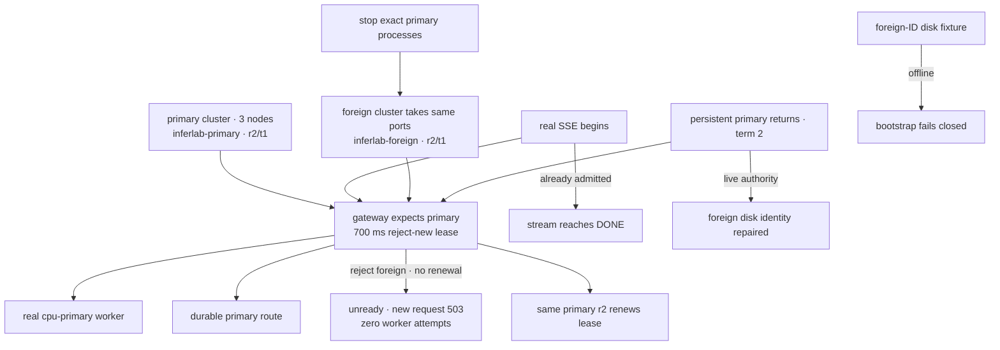

# v0.17 control-cluster identity evidence

This directory retains the checked evidence for RFC 0022 and Phase 22.

## Reproduce

From the repository root:

```bash
./scripts/proof-v0.17.sh
```

To retain output somewhere else:

```bash
INFERLAB_V17_OUTPUT_DIR=/absolute/output/path ./scripts/proof-v0.17.sh
```

The script builds the release binaries, owns exact child PIDs, creates a fresh
temporary state directory, runs two independent three-node Raft clusters plus
two real CPU workers, performs the fault sequence, checks the JSON evidence,
renders the SVG from those measurements, stops only its children, and removes
temporary state.

## Scenario



Primary and foreign deliberately have the same revision and initial term. Their
different cluster IDs and workers make the namespace boundary visible.

## Checked outcomes

`raw/control-cluster-identity-check.json` records all 18 assertions. The retained
run observed:

| Observation | Retained value |
|---|---:|
| Assertions | 18/18 passed |
| Expected cluster | `inferlab-primary` |
| Rejected cluster | `inferlab-foreign` |
| Both committed revisions | 2 |
| Both initial terms | 1 |
| Recovered primary term | 2 |
| Foreign live observations rejected by expiry capture | 28 |
| Crossing real SSE duration | 2,029.448 ms |
| Attempts caused by rejected request | 0 |

The exact mismatch count and timings depend on scheduling and are not service
levels. The checked invariants are that the count is positive, foreign state
cannot publish or renew, the rejected client request causes zero worker
attempts, and admitted work completes.

## Artifact map

| Files | What they prove |
|---|---|
| `config-primary.json`, `config-foreign.json` | Independent clusters both commit r2/t1 but identify different namespaces/workers |
| `gateway-primary-fresh.json` | Primary identity is installed and the lease is fresh |
| `stream-crossing-foreign-cluster.json` | Real primary SSE admitted before the swap completes after it |
| `gateway-foreign-rejected.json` | Expected route remains primary; foreign ID/counter/error are observable; lease expires |
| `readiness-foreign-rejected.json` | `reject-new` makes readiness return 503 |
| `request-foreign-rejected.json` | New request is rejected with attempts 0 |
| `worker-*-before-rejection.json`, `worker-*-after-rejection.json` | Neither real worker receives the rejected request |
| `gateway-primary-renewed.json`, `request-primary-renewed.json` | Persistent primary recovery renews unchanged revision and restores traffic |
| `foreign-snapshot-fixture.json` | Controlled disk fixture changes cluster ID while retaining valid structure |
| `foreign-disk-bootstrap-rejected.json` | Foreign-disk-only startup fails with expected/observed identity error |
| `snapshot-live-repaired.json`, `gateway-live-repair.json` | Expected live control atomically repairs foreign disk identity |
| `stream-final.json` | Final real speculative SSE succeeds under primary identity |
| `*-election.json`, `*-stop.json`, `*-outage.json` | Exact process and leadership transition bookkeeping |
| `control-cluster-identity-proof.svg` | Data-driven visual summary |

## Visual evidence


## Interpretation

The proof establishes accidental cross-cluster fencing through the real gateway,
Raft persistence, runtime lease, disk fallback, worker request path, and SSE
ownership boundary. Unit tests additionally verify foreign peer RPCs are
rejected before term mutation and durable Raft state cannot be relabelled.

It does not establish authentication. A sender that can claim
`inferlab-primary`, or environments that both retain `inferlab-default`, are not
distinguished. No TLS, signatures, key rotation, multi-host partition test,
production model, throughput claim, or CUDA result is included.
