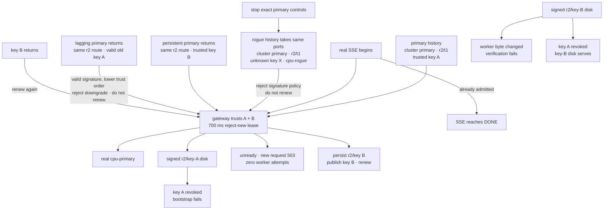

# v0.18 signed-control and key-rotation evidence

This directory retains the checked evidence for RFC 0023 and Phase 23.

## Reproduce

```bash
./scripts/proof-v0.18.sh
```

To retain the generated evidence elsewhere:

```bash
INFERLAB_V18_OUTPUT_DIR=/absolute/output/path ./scripts/proof-v0.18.sh
```

The harness builds the workspace, owns exact child PIDs, uses a fresh temporary
state directory, starts two independent three-node histories plus two real CPU
workers, performs old/rogue/new-key transitions, tests tamper and revocation
offline, renders the SVG from measured JSON, stops only its processes, and
removes temporary state.

The private seeds are published
[RFC 8032 test-vector material](https://www.rfc-editor.org/rfc/rfc8032.html#section-7.1)
used only for this deterministic local proof. They are not deployment keys.

## Scenario



The rogue deliberately copies the cluster ID, revision, and term. Only key
ownership distinguishes it from the intended authority.

## Checked outcomes

`raw/signed-control-check.json` records all 23 assertions.

| Observation | Retained value |
|---|---:|
| Assertions | 23/23 passed |
| Cluster ID | `inferlab-primary` |
| Initial trusted key | `primary-2026-a` |
| Rotated trusted key | `primary-2026-b` |
| Rejected live key | `rogue-2026-x` |
| Route revision before/after rotation | 2 → 2 |
| Initial/recovered Raft term | 1 → 2 |
| Unknown-key observations rejected by expiry capture | 25 |
| Valid old-key downgrade observations rejected | 24 |
| Crossing real SSE duration | 2,026.254 ms |
| Attempts caused by rejected request | 0 |

Poll counts and timings depend on scheduling. The checked invariants are that an
unknown key never publishes or renews, changed signed bytes fail, revocation
wins over prior trust, trusted-key order prevents rollback after rotation, and a
trusted new key can safely replace the envelope.

## Artifact map

| Files | What they prove |
|---|---|
| `config-primary-old-key.json` | Expected r2/t1 route carries an Ed25519 key-A envelope |
| `gateway-old-key-fresh.json`, `request-old-key.json` | Gateway requires signatures and captures/exposes verified key A |
| `snapshot-old-key.json` | Exact authenticated envelope survives atomic persistence |
| `config-rogue-key.json`, `rogue-election.json` | Independent history copies cluster/r2/t1 but uses unknown key X and another worker |
| `gateway-rogue-rejected.json` | Signature rejection increases while cluster mismatch stays zero and route remains key A |
| `readiness-rogue-rejected.json`, `request-rogue-rejected.json` | Unknown responses do not renew; new work receives 503 with attempts 0 |
| `worker-*-before-rejection.json`, `worker-*-after-rejection.json` | Neither real worker receives the rejected request |
| `stream-crossing-rogue-key.json` | Already-admitted key-A SSE completes across rejection/expiry |
| `rotated-primary-election.json`, `gateway-new-key-renewed.json` | Persistent primary returns in term 2; trusted key B rotates same route and renews |
| `snapshot-new-key.json`, `request-new-key.json` | Key-B envelope is durable and request-visible without revision change |
| `rollback-old-key-election.json`, `gateway-key-downgrade-rejected.json` | A valid but lower-preference key A cannot replace active key B or renew its lease |
| `restored-new-key-election.json`, `gateway-new-key-rerenewed.json` | Returning key B is accepted and renews the expired route again |
| `tampered-snapshot-fixture.json`, `tampered-disk-bootstrap-rejected.json` | One signed worker-field mutation fails strict verification |
| `revoked-old-key-bootstrap-rejected.json` | Cryptographically valid key-A disk is refused after explicit revocation |
| `gateway-new-key-disk.json`, `request-new-key-disk.json` | Key-B disk remains eligible while A is revoked |
| `stream-final.json` | Final real speculative SSE completes with key-B identity |
| `*-event.json`, `*-outage.json`, `*-stop.json` | Exact process fault scope |
| `snapshot-directory.json` | Atomic snapshot replacement leaves no temporary file |
| `signed-control-proof.svg` | Data-driven signing, timeline, and outcome chart |

## Visual evidence


## Interpretation

The proof establishes route-byte authenticity/integrity against unknown live
keys and disk mutation, plus explicit overlap/rotation/revocation behavior across
the real gateway, runtime lease, persistent fallback, request headers, workers,
and streaming boundary.

It does not establish confidentiality, administrative writer authorization,
Raft peer authentication, protected production secret storage, online fleet-wide
revocation, replay prevention, hostile multi-host behavior, throughput, or CUDA.
