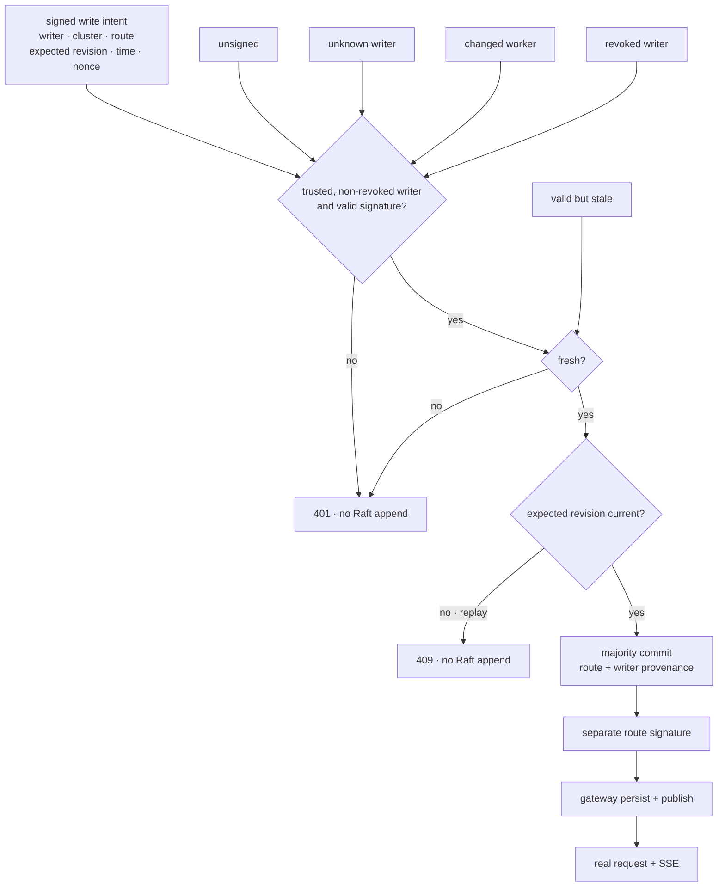

# v0.19 authorized control-writer evidence

This directory retains the checked evidence for RFC 0024 and Phase 24.

## Reproduce

```bash
./scripts/proof-v0.19.sh
```

To retain the generated evidence elsewhere:

```bash
INFERLAB_V19_OUTPUT_DIR=/absolute/output/path ./scripts/proof-v0.19.sh
```

The harness builds the workspace, owns exact child PIDs, starts a three-node
control cluster with required writer authorization, uses separate writer and
route-delivery keys, submits five rejected writes plus commit/replay/update
cases, starts the real gateway and online-attention CPU worker, renders measured
evidence, stops only its children, and removes temporary state.

The private seeds are published
[RFC 8032 test-vector material](https://www.rfc-editor.org/rfc/rfc8032.html#section-7.1)
used only for this deterministic local proof. They are not deployment keys.

## Scenario



## Checked outcomes

`raw/control-write-auth-check.json` records all 22 assertions.

| Observation | Retained value |
|---|---:|
| Assertions | 22/22 passed |
| Authorized writer | `deploy-bot` |
| Separate route key | `route-2026-b` |
| Authentication rejections | 4 |
| Freshness rejections | 1 |
| Revision conflicts | 1 |
| Authorized commits | 2 |
| Final revision | 3 |
| Final real SSE duration | 188.238 ms |

Timing depends on scheduling. The checked invariants are that failed gates
append nothing, the first current signed intent commits r2, exact replay cannot
advance it, the next r2-based intent commits r3, provenance reaches all three
nodes, and only the separately signed committed route reaches the gateway.

## Artifact map

| Files | What they prove |
|---|---|
| `initial-election.json`, `status-initial.json` | One leader; required trust/revocation/freshness policy is visible |
| `write-unsigned-rejected.json` | Legacy body receives 401 in required mode |
| `write-unknown-rejected.json` | Possessing an unprovisioned key grants nothing |
| `write-tampered-rejected.json` | Changing a signed worker invalidates intent |
| `write-stale-rejected.json` | A valid writer signature can still be too old |
| `write-revoked-rejected.json` | Explicit deny overrides mathematical validity |
| `status-after-rejections.json` | Five failures leave log/commit/route unchanged and split counters 4+1 |
| `write-valid-committed.json` | `deploy-bot` commits r2 with provenance and separate route signature |
| `write-replay-rejected.json` | Exact signed replay receives revision-conflict 409 |
| `gateway-revision-2.json`, `request-revision-2.json` | Authorized r2 reaches gateway and real worker |
| `write-update-committed.json` | New intent signs expected r2 and commits r3 |
| `final-cluster.json`, `status-final.json` | All nodes hold r3 provenance; leader counts two commits and one conflict |
| `gateway-revision-3.json`, `gateway-routing-snapshot.json` | Separate route key publishes and persists r3 |
| `stream-final.json` | Real speculative SSE reaches `[DONE]` under r3 |
| `process-stop.json`, `snapshot-directory.json` | Exact child scope and atomic snapshot cleanup |
| `control-write-auth-proof.svg` | Data-driven gate, sequence, and outcome chart |

## Visual evidence


## Interpretation

The proof establishes request-level administrative writer authentication,
coarse authorization, freshness, optimistic revision fencing, durable writer
provenance, and separation from route-delivery authentication.

It does not establish transport encryption, Raft peer identity, fine-grained
RBAC, durable idempotency for ambiguous timeouts, online revocation, protected
production keys, multi-person approval, hostile multi-host behavior,
throughput, or CUDA.
