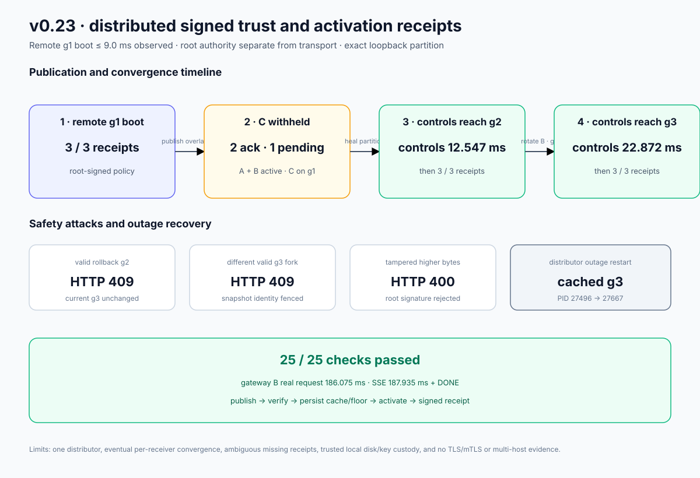

# v0.23 distributed signed service-trust results

The retained exact-process proof starts one trust distributor, a PID-owned
node-C relay, three persistent controls, one real CPU worker, and one gateway.
It separates root policy authority from transport, makes partial convergence
observable, and proves a receiver can restart from its accepted full snapshot
cache during distributor outage.

Run:

```bash
./scripts/proof-v0.23.sh
```

Retained outcome:

- 25/25 machine-readable assertions passed;
- all three controls remotely bootstrapped from root-signed generation 1 and
  emitted activation receipts;
- maximum observed g1 control convergence latency was 8.974 ms;
- after overlap g2 publication, A and B acknowledged while the exact node-C
  distributor relay was stopped; status showed two acknowledged receivers and
  C pending while C retained g1;
- after the relay restarted, all controls reached g2 in 12.547 ms observed
  control-probe time; all three g2 receipts were subsequently observed;
- the gateway rotated from A to B before g3 revoked A; all controls reached g3
  in 22.872 ms and all three g3 receipts were subsequently observed;
- a valid signed g2 rollback returned 409, a different valid g3 fork returned
  409, and a signature-tampered higher candidate returned 400 at distributor
  publication while every receiver retained g3;
- with the distributor stopped, follower node B restarted from its complete
  cached g3, recorded receipt retry failures, and rejoined route revision 2;
- old gateway credential A received 401 while B continued to read revision 2;
- the gateway-B real request completed in 186.075 ms; and
- the 187.935 ms real SSE reached `[DONE]` while the distributor remained down.



## Evidence map

- `raw/assertions.json` — all 25 checked claims and observed values;
- `raw/distributor-empty.json` and `raw/publish-g1.json` — empty/startup state
  and the first root-signed remote publication;
- `raw/initial-controls.json` and `raw/generation-1-receipts.json` — remote g1
  boot, election, and three activation receipts;
- `raw/generation-2-partial-controls.json`,
  `raw/generation-2-withheld-c.json`, and
  `raw/generation-2-partial-receipts.json` — A/B at g2 while the partitioned C
  remains at g1 and pending;
- `raw/generation-2-convergence.json` and
  `raw/generation-2-receipts.json` — healed g2 control observation and the
  subsequently observed complete receipt set;
- `raw/generation-3-convergence.json` and
  `raw/generation-3-receipts.json` — complete g3 control activation and the
  subsequently observed receipt set;
- `raw/generation-3-key-a-revoked.json` and
  `raw/generation-3-key-b-valid.json` — precise old/new gateway behavior;
- `raw/rollback-publication.json`, `raw/fork-publication.json`, and
  `raw/tamper-publication.json` — three rejected unsafe publications;
- `raw/cache-restart.json` and `raw/final-cluster.json` — cache-backed follower
  restart during distributor outage and Raft rejoin;
- `raw/request.json`, `raw/stream.json`, and `raw/final-gateway.json` — real
  gateway-B CPU JSON/SSE and final route evidence;
- `raw/evidence-sanitization.json` — deterministic report proving three
  proof-local path values were redacted before checking and rendering; and
- `raw/distributed-service-trust-proof.svg` — data-driven evidence chart.

Sanitization preserves every JSON object, key, schema, and proof-relevant value;
only disposable absolute path values become `<redacted-proof-path>`. The
sanitizer fails if any spelling of the proof root remains before assertions are
created.

## What this proves—and what it does not

The proof demonstrates one real distributor HTTP contract, independent
receiver verification, crash-safe full snapshot cache plus rollback floor,
post-activation service-signed receipts, a controlled receiver-specific
partition, safe A→B overlap/revocation ordering, and continued real inference
during distributor outage.

It is single-host loopback evidence. The distributor is one availability
point; receipts are signed attestations that a receiver reports activation,
rather than independent proof of internal side effects or a fleet-atomic
transaction; a missing receipt does not identify its cause; the distributor can
still withhold or replay bytes; local storage and development key custody are
trusted; issue time does not expire policy; and HTTP provides neither
encryption nor hostname authentication. No multi-host, multi-region, HSM,
TLS/mTLS, remote process attestation, or hostile-filesystem claim is made. Live
receiver status and owned-process continuity separately corroborate activation
in this exact non-compromised proof.

The status response retains full signed receipts so clients can independently
verify them against the current root-signed snapshot. Its acknowledged/pending
sets are convenience projections, not Byzantine-proof claims: a distributor
can still omit a valid receipt.

The three exact-process attack posts are rejected by the distributor before
delivery. Independent receiver rollback, fork, tamper, path-alias, and durable-
persistence failure behavior is covered by Rust tests; the retained process run
does not claim those rejected publication bytes reached a receiver.
