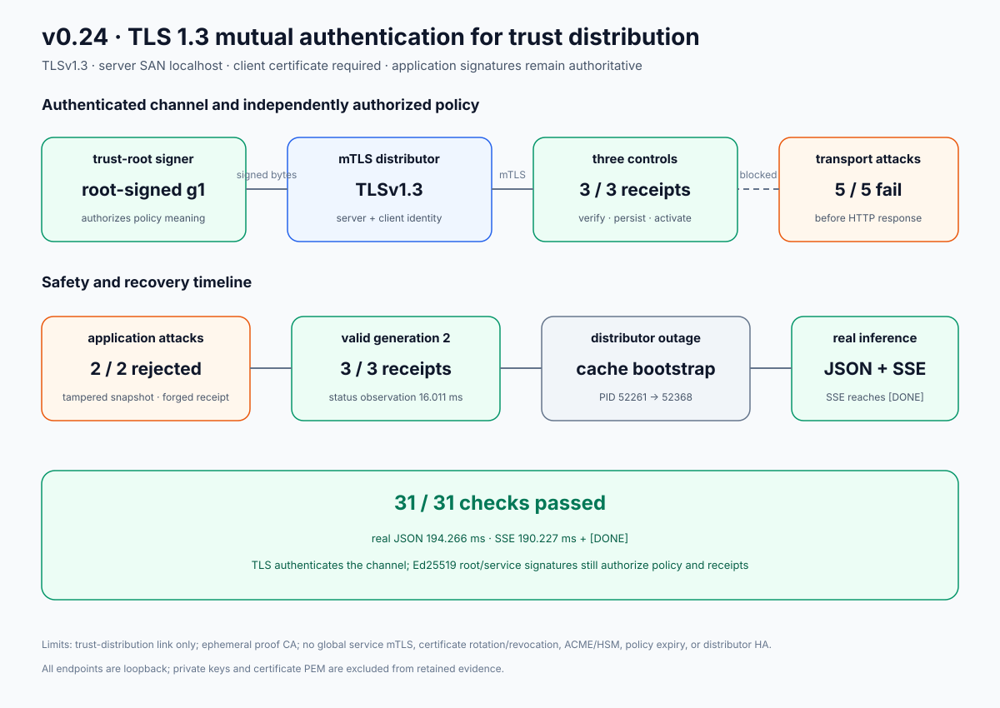

# v0.24 mutual-TLS trust-distribution results

The retained exact-process proof protects the control-to-trust-distributor hop
with TLS 1.3 mutual authentication while preserving independent Ed25519
authorization for trust snapshots and activation receipts. It uses only
loopback processes and an ephemeral private proof CA; no paid service, public
domain, or external certificate issuer is involved.

Run:

```bash
./scripts/proof-v0.24.sh
```

Retained outcome:

- 31/31 machine-readable assertions passed;
- the valid publisher handshake negotiated TLS 1.3 with
  `TLS_AES_256_GCM_SHA384`, authenticated the `localhost` SAN, and presented a
  client certificate;
- all three controls remotely bootstrapped root-signed generation 1 over mTLS,
  with a 24.230 ms post-start status-observation probe and three structurally
  signed receipt objects retained by the distributor;
- plaintext downgrade, no client certificate, a rogue-CA client certificate,
  the wrong server CA, and the wrong server hostname all failed before an HTTP
  response while the listener remained live;
- all three controls remained actively on g1 and every durable cache/floor hash
  remained byte-for-byte unchanged after the transport attacks;
- a CA-valid publisher's signature-tampered snapshot received structured
  `invalid_snapshot`, and its modified receipt received structured
  `invalid_receipt_signature`; generation and the exact g1 receipt set remained
  unchanged;
- valid root-signed generation 2 reached all three live controls in a 16.011 ms
  post-publication status-observation probe, and all three g2 receipts were
  subsequently observed;
- every receiver's cache and rollback-floor hash advanced from g1 to g2 without
  replacing a control process;
- after the exact distributor PID stopped and an mTLS-configured attempt using
  valid proof credentials observed connection refusal before TLS
  authentication, follower node B restarted under a new PID from its complete
  g2 cache and rejoined revision 2;
- the real CPU JSON request completed in 194.266 ms; and
- the 190.227 ms real SSE reached `[DONE]` while the distributor remained down.



## Evidence map

- `raw/tls-handshake.json` — negotiated TLS version/cipher, server identity,
  and client-certificate presence without certificate bytes;
- `raw/initial-controls.json` and `raw/generation-1-receipts.json` — remote g1
  activation, receiver mTLS diagnostics, distributor transport status, and
  three full receipt objects;
- `raw/plaintext-downgrade.json`, `raw/no-client-certificate.json`,
  `raw/rogue-client-ca.json`, `raw/wrong-server-ca.json`, and
  `raw/wrong-server-hostname.json` — five failures before HTTP;
- `raw/state-before-transport-attacks.json`,
  `raw/state-after-transport-attacks.json`,
  `raw/after-transport-controls.json`, and `raw/post-transport-status.json` —
  durable hashes plus live receiver/distributor state proving g1 stayed active;
- `raw/tampered-snapshot.json`, `raw/forged-receipt.json`, and
  `raw/post-application-attacks.json` — application-signature rejection over a
  valid mutually authenticated channel and unchanged authority state;
- `raw/publish-g2.json`, `raw/generation-2-convergence.json`,
  `raw/generation-2-receipts.json`, and
  `raw/state-after-generation-2.json` — valid g2 publication, live control
  observation, receipt observation, and durable advancement;
- `raw/online-process-continuity.json` — unchanged A/B/C PIDs through online g2;
- `raw/distributor-outage.json`, `raw/cache-restart-wait.json`, and
  `raw/cache-restart.json` — owned distributor stop, observed connection
  failure, and follower cache bootstrap under a new PID;
- `raw/request.json`, `raw/stream.json`, and `raw/final-gateway.json` — real CPU
  JSON/SSE plus final revision-2 gateway readiness;
- `raw/evidence-sanitization.json` — deterministic sensitive-path/PEM scan;
- `raw/private-material-scan.json` — complete retained-bundle scan against all
  seven known Ed25519 seed labels and all eight generated PKI key payloads;
- `raw/assertions.json` — all 31 checked claims and observations; and
- `raw/mtls-service-trust-proof.svg` — deterministic data-driven chart.

## Evidence hygiene

The proof sets `umask 077` before it generates its private CA, server,
publisher, three control, rogue-CA, and rogue-client credentials. Every PEM,
CSR, serial, and private-key file stays below one guarded `inferlab-v024.*`
temporary root. Cleanup signals and reaps only proof-owned PIDs, then removes
only that exact directory.

Retention happens only after sanitization, all assertions, SVG rendering, a
host-path/PEM leak scan, normalized private-material scanning, and an exact
34-file manifest succeed. A configured
output directory must begin empty, preventing stale files from appearing to be
part of a later run. The retained bundle contains 33 JSON files and one SVG;
it contains no certificate/private-key PEM or proof-host path.

## What this proves—and what it does not

This run demonstrates that the proof's conforming clients authenticate the
private server CA and `localhost` hostname, while the distributor requires a
client certificate under its private CA before routing. It demonstrates that
five invalid transport paths cannot mutate live or durable trust state, and
that channel admission does not replace root/service application signatures.
It also preserves v0.23 cache-backed outage recovery and real inference.

It does not demonstrate global service mTLS. Raft peer, gateway/control,
gateway/worker, client/gateway, metrics, and other links remain outside this
milestone. A CA-valid certificate is not mapped to an InferLab service ID or
endpoint role. Certificate hot reload, rotation/revocation, ACME, HSM-backed
custody, trust-policy expiry, distributor HA, multi-host partitions, and
hostile-network evidence remain explicit future work. The ephemeral proof CA
is a controlled, disposable learning fixture, not a production PKI. The proof
process, checks, manifest, and renderer are deterministic; OpenSSL-generated
key identities are intentionally random for each run.

The distributor status retains full signed receipt objects, but this Python
checker validates their structure and the distributor's observed acceptance;
it does not independently reimplement Ed25519 receipt verification. Rust unit
and integration tests cover signature verification, and the exact-process
forged-receipt request demonstrates structured signature rejection.
