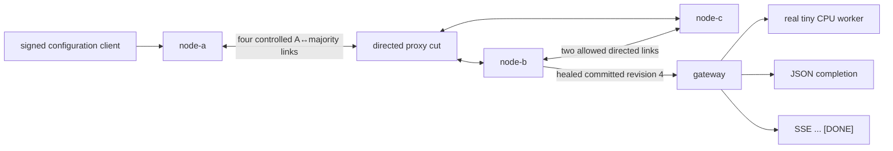

# v0.25 results: directed Raft partition and Figure-8 safety

## Conclusion

The retained single-host run passes **45/45 semantic assertions** over two
separate evidence layers:

1. three live `control-plane` OS processes communicate through six live
   directed `raft-link-proxy` OS processes; a four-link A-vs-{B,C} cut leaves
   the old leader at committed revision 2 while B+C elect in a higher term and
   commit revision 4; healing makes A step down, replaces its uncommitted
   conflicting suffix, and converges all three durable logs/commit indexes; and
2. a deterministic five-server replay exactly retains Raft Figure 8(a–e), uses
   production commit/vote-freshness predicates, rejects an old-term majority as
   a direct commit candidate, and commits a current-term entry plus its prefix.

After healing, the real gateway installs committed revision 4 and a real tiny
CPU worker completes both JSON and SSE inference; the stream ends in `[DONE]`.


## What ran



The live runtime remains three nodes. The five-server Figure-8 report is an
algorithmic replay, not another live cluster.

## Observed schedule

| Checkpoint | A | B | C | Durable/applied result |
|---|---|---|---|---|
| Full mesh | leader, term 1 | follower, term 1 | follower, term 1 | all commit/apply baseline revision 2 |
| Four-link cut | leader, term 1 | leader, term 2 | follower, term 2 | A stays at commit 2; B+C reach commit 4 |
| Healed | follower, term 2 | leader, term 2 | follower, term 2 | all commit/apply revision 4; logs identical |

The checker does not require literal terms 1 and 2. It derives the baseline
term and requires the majority/healed term to be greater, because timer
scheduling may skip a term without changing the safety property.

During the cut, A's durable index 3 contains the valid minority
least-in-flight proposal in the old term. B and C instead contain a higher-term
no-op at index 3 and the weighted configuration at index 4. A's API returns a
structured `503 unavailable`, which is treated as an ambiguous client result.
Non-commit is established by A's unchanged commit/applied state during the cut
and the absence of that command from the final converged log.

## Figure-8 result

The report retains the exact paper sequence:

| Stage | Leader | Important state |
|---|---|---|
| a | S1, term 2 | index 2/term 2 on S1 and S2 |
| b | S5, term 3 | conflicting index 2/term 3 on S5 |
| c | S1, term 4 | old index 2/term 2 now on S1, S2, S3 |
| d | S5 candidate, term 5 | S2/S3/S4/S5 can elect it; old entry remains only on S1 after overwrite |
| e | S1, term 4 | index 3/term 4 on S1/S2/S3 commits; index 2 commits indirectly; S5 has only two eligible voters |

At stage c, naive replica counting returns candidate index 2, while production
`highest_committable_index` returns no candidate because entry term 2 is not
the leader's current term 4. At stage e, it returns index 3.

All 11 named Figure-8 predicates are true, and the exact unit regression
`figure_eight_requires_a_current_term_entry_before_counting_replicas_is_safe`
passes.

## Measured observations

| Observation | Retained value | Interpretation |
|---|---:|---|
| Semantic checks | 45/45 | all checked live, algorithmic, product, process, and hygiene claims pass |
| Evidence bundle | 28 files | manifest plus 27 size/SHA-256-bound files |
| Baseline status match | 3.083 ms | poll duration after the baseline write, not election latency |
| Majority no-op status match | 2.657 ms | poll duration after the isolated proposal returned, not end-to-end partition election latency |
| Majority revision-4 status match | 2.537 ms | post-write B+C status observation |
| Healed three-node status match | 40.170 ms | post-heal role/config observation |
| Final durable-state match | 0.160 ms | post-status file observation |
| Real CPU JSON | 182.498 ms | one local request from revision 4 |
| Real CPU SSE | 182.886 ms | one local stream from revision 4 ending in `[DONE]` |

These are single-run measurements from the recorded local machine. They are
not throughput, election SLO, cross-host latency, packet-loss, or performance
comparison claims.

## Evidence map

| File | What it proves or records |
|---|---|
| [`baseline-cluster.json`](raw/baseline-cluster.json) | one baseline leader and revision 2 on all controls |
| [`baseline-state.json`](raw/baseline-state.json) | identical durable two-entry baseline logs |
| [`baseline-links.json`](raw/baseline-links.json) | exact six-link identities/directions/upstreams, allow mode, and no upstream failures |
| [`partition-transition.json`](raw/partition-transition.json) | inbound-first then outbound ordered four-link drop |
| [`isolated-write.json`](raw/isolated-write.json) | signed minority request and structured ambiguous `503 unavailable` |
| [`majority-election.json`](raw/majority-election.json) | B+C higher-term leader and committed current-term no-op at index 3 |
| [`majority-write.json`](raw/majority-write.json) | successful different weighted configuration at revision 4 |
| [`partition-cluster.json`](raw/partition-cluster.json) | old-term A leader at revision 2 while higher-term B+C reach revision 4 |
| [`partition-state.json`](raw/partition-state.json) | A's uncommitted conflicting suffix and B+C's committed suffix |
| [`partition-links.json`](raw/partition-links.json) | exact cut modes, observed drops, majority forwarding, and no upstream failures |
| [`healing-transition.json`](raw/healing-transition.json) | explicit outbound-first then inbound healing |
| [`healed-cluster.json`](raw/healed-cluster.json) | A follower plus all nodes at higher term/revision 4 |
| [`healed-state.json`](raw/healed-state.json) | identical final log arrays and commit indexes; per-node `voted_for` may differ legitimately |
| [`healed-links.json`](raw/healed-links.json) | all six links allowed, exact transition counters, no upstream failures |
| [`link-events.json`](raw/link-events.json) | identity-bound contiguous journals, ordered drop/heal transitions, and observed dropped RPCs |
| [`process-continuity.json`](raw/process-continuity.json) | proof-parent ownership, PID, start token, non-zombie state, and command identity for 11 processes |
| [`figure-eight.json`](raw/figure-eight.json) | exact five-server a–e report and production-helper results |
| [`figure-eight-test.json`](raw/figure-eight-test.json) | exact test command, exit status, stdout, and stderr |
| [`gateway-ready.json`](raw/gateway-ready.json) | gateway installed weighted revision 4 |
| [`request.json`](raw/request.json) | real CPU JSON inference from revision 4 |
| [`stream.json`](raw/stream.json) | real CPU SSE inference from revision 4 through `[DONE]` |
| [`sanitizer.json`](raw/sanitizer.json) | host/private-marker sanitization report |
| [`private-material-scan.json`](raw/private-material-scan.json) | normalized scan against six known Ed25519 proof-seed labels |
| [`assertions.json`](raw/assertions.json) | all 45 named checks and their observed details |
| [`manifest.json`](raw/manifest.json) | exact expected set plus size/SHA-256 for every non-manifest file |

The manifest is published last, after every other destination file is copied
and hash-verified. A partial retention therefore cannot contain a
complete-looking manifest.

## Reproduce for $0

Prerequisites are the normal local InferLab build requirements: Rust, a C++20
compiler, Python 3, and `curl`. No cloud service or paid dependency is used.

```bash
./scripts/proof-v0.25.sh
```

To keep a fresh evidence bundle, use an empty destination:

```bash
mkdir -p /tmp/inferlab-v025-evidence
INFERLAB_V25_OUTPUT_DIR=/tmp/inferlab-v025-evidence \
  ./scripts/proof-v0.25.sh
```

The script refuses a non-empty output directory so stale JSON/SVG cannot
survive. It refuses busy ports 9960–9964 and 9971–9976, creates one guarded
temporary root with `umask 077`, owns every child PID, revalidates current PPID
before TERM/KILL, and removes only that exact temporary root.

Every proxy receives a new event path under that temporary root. The proxy
rejects an existing journal path with `AlreadyExists`, preventing a restart
from appending a second sequence beginning at 1.

Before retention it:

1. sanitizes proof/workspace paths and rejects PEM/private markers;
2. scans normalized content against all known proof private seeds;
3. runs the checker and renderer;
4. creates the final retained private-material report;
5. reruns the checker and renderer so retained outputs consume that report;
6. runs a final discarded private scan over those final outputs;
7. rejects remaining host paths/private markers;
8. writes an exact manifest; and
9. copies and hash-verifies non-manifest files before publishing the manifest
   as the completion marker.

## Claim boundary

This evidence demonstrates one controlled single-host symmetric A-vs-{B,C}
cut made from four directed whole-Raft-HTTP-RPC drops. It is not Jepsen, formal
verification, packet-level chaos, arbitrary partitions, independent-host
failure, or a proof of every Raft execution.

The injector does not model silent loss, latency, reorder, duplication, TCP
half-open state, or kernel queues. Mode change does not cancel a request already
in flight. Management endpoints are unauthenticated and safe only in this
explicit-loopback proof boundary. The event journal is flushed for observation,
not `fsync` crash-durability, and transition reasons are retained.

The live runtime remains fixed at three nodes. The deterministic five-server
Figure-8 replay does not implement a five-node deployment, membership changes,
or timing faults. v0.25 also does not add linearizable follower reads,
Byzantine tolerance, global service mTLS, multi-host HA, or production network
remediation.
