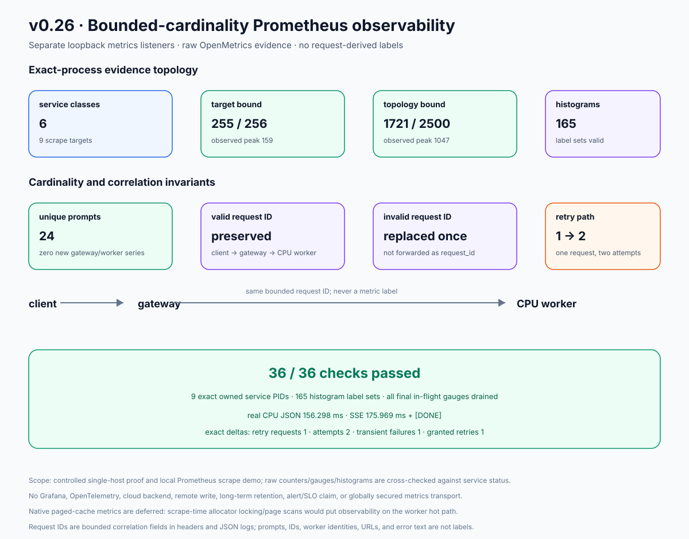

# v0.26 retained result: bounded-cardinality Prometheus observability

This bundle is the retained output of `./scripts/proof-v0.26.sh`. It exercises
all six service classes through nine real metrics targets, checks the raw
OpenMetrics contract, and then serves real JSON and SSE completions from the
CPU worker. The run is a controlled, zero-cost loopback proof, not a load test
or a production Prometheus deployment.



## Result

- **36/36 deterministic assertions passed.** The checker and renderer were
  replayed over the completed evidence and reproduced byte-for-byte.
- The design-time ceiling is **1,721 series** for the nine-target proof
  topology, below the 2,500 topology cap. Every target's design-time ceiling
  is at most 256: gateway 255, CPU worker 168, batch queue 202, control plane
  181, trust distributor 164, and Raft-link proxy 134.
- Observed topology series were **737 → 957 → 957 → 1,047** at baseline,
  before unique prompts, after 24 unique prompts, and final scrape. The
  highest observed target count was **159**. Prompt diversity changed counter
  values but created **zero new series**.
- All **165 observed histogram label sets** have exact bucket/sum/count
  component parity and satisfy cumulative-bucket, `+Inf == _count`, and finite
  non-negative `_sum` algebra. Each checkpoint contains all **14 required
  `UNIT` records** across the nine targets.
- The retry fixture produced exactly one logical request, two attempts, one
  transient failure, one granted retry, and one successful completion
  histogram observation. The same validated request ID reached both attempts.
- Batch evidence records exactly two claims, one acknowledgment, one explicit
  failure, and one dead-letter transition. Trust evidence records each of the
  seven selected outcomes once. Link evidence records one forwarded, one
  dropped, one upstream-failure RPC, and two mode changes.
- A valid request ID was preserved client → gateway → CPU worker. An invalid
  client value was absent from the response, every metric document, and every
  retained canonical CPU worker `request_id` field; it was replaced by one
  generated correlation ID. The bundle does not claim a scan of every field in
  the unretained raw process log. Prompts, request IDs, worker identity, job
  IDs, and other proof canaries are absent from metric text.
- One real CPU JSON response completed in **156.298 ms**. One real CPU SSE
  produced **10 events**, reached `[DONE]`, and completed in **175.969 ms**.
  These are single-run observations, not throughput or latency guarantees.
- All nine service processes retained their original PID/start/command
  identity and remained proof-owned and non-zombie through the final capture.
- The sanitizer made three host-path replacements. The final scan found no
  host path, PEM/private-key marker, public demo API key, or any of seven known
  Ed25519 proof seeds.
- The completion manifest lists exactly **62 files**, with hashes for the 61
  non-manifest files. `manifest.json` was published last.

## Evidence map

| Question | Retained evidence |
|---|---|
| Did the full checker pass? | [`assertions.json`](raw/assertions.json) |
| What exact routes, labels, buckets, families, and ceilings were checked? | [`contract.json`](raw/contract.json) |
| What was the observed and theoretical cardinality? | [`cardinality.json`](raw/cardinality.json) and the four `*-scrapes.json` files |
| Are histogram buckets internally consistent? | [`histograms.json`](raw/histograms.json) |
| Did failure counters move by exact deltas? | [`deltas.json`](raw/deltas.json), [`batch-scenario.json`](raw/batch-scenario.json), [`trust-scenario.json`](raw/trust-scenario.json), and [`link-scenario.json`](raw/link-scenario.json) |
| Did request IDs propagate, get replaced, and remain retry-stable? | [`request-id-valid.json`](raw/request-id-valid.json), [`request-id-invalid.json`](raw/request-id-invalid.json), [`request-id-retry.json`](raw/request-id-retry.json), [`retry-events.json`](raw/retry-events.json), and [`worker-request-id-events.json`](raw/worker-request-id-events.json) |
| Did unique prompts avoid creating new series? | [`unique-prompts.json`](raw/unique-prompts.json) |
| Did real streaming reach `[DONE]`? | [`stream.json`](raw/stream.json) |
| Did metrics agree with service status? | [`final-statuses.json`](raw/final-statuses.json) and `final-*.prom` |
| Did every exact service process survive unchanged? | [`process-continuity.json`](raw/process-continuity.json) |
| Is retained evidence sanitized and private-material-free? | [`sanitizer.json`](raw/sanitizer.json) and [`private-material-scan.json`](raw/private-material-scan.json) |
| Is the file set complete? | [`manifest.json`](raw/manifest.json) |

The 36 raw `.prom` files retain four independent OpenMetrics scrapes for each
of the nine targets. The metrics listeners themselves are intentionally not
instrumented.

## Reproduce

From the repository root:

```bash
./scripts/proof-v0.26.sh
```

To publish to a separate empty directory:

```bash
INFERLAB_V26_OUTPUT_DIR=/absolute/path/to/empty-output \
  ./scripts/proof-v0.26.sh
```

The script refuses occupied proof ports, owns one temporary root, tracks exact
child PID/start identity, sanitizes before retention, validates the expected
file set and hashes, copies all non-manifest files first, verifies them in the
destination, and publishes `manifest.json` last as the completion marker.

The completed retained bundle can be checked and rendered again without
starting services:

```bash
python3 benchmarks/check_observability.py \
  --evidence-dir docs/results/v0.26/raw \
  --output /tmp/inferlab-v026-assertions.json \
  --contract-output /tmp/inferlab-v026-contract.json \
  --cardinality-output /tmp/inferlab-v026-cardinality.json \
  --histogram-output /tmp/inferlab-v026-histograms.json \
  --delta-output /tmp/inferlab-v026-deltas.json
python3 benchmarks/render_observability_svg.py \
  --evidence-dir docs/results/v0.26/raw \
  --output /tmp/inferlab-v026-proof.svg
cmp /tmp/inferlab-v026-assertions.json docs/results/v0.26/raw/assertions.json
cmp /tmp/inferlab-v026-contract.json docs/results/v0.26/raw/contract.json
cmp /tmp/inferlab-v026-cardinality.json docs/results/v0.26/raw/cardinality.json
cmp /tmp/inferlab-v026-histograms.json docs/results/v0.26/raw/histograms.json
cmp /tmp/inferlab-v026-deltas.json docs/results/v0.26/raw/deltas.json
cmp /tmp/inferlab-v026-proof.svg docs/results/v0.26/raw/observability-proof.svg
```

## Boundaries

- This is nine exact service processes on one host, four scrapes per target,
  and one controlled request/failure schedule. It is not a soak test,
  benchmark, hostile-network test, or proof of arbitrary interleavings.
- The checked-in Compose demo adds one pinned Prometheus collector with a
  24-hour, 128 MiB ephemeral `tmpfs`. It is not HA, persistent monitoring, a
  Grafana deployment, or a cloud service.
- Metrics transport is loopback/private-network HTTP. Metrics do not provide
  authentication, authorization, encryption, or request tracing.
- Request IDs are bounded correlation identifiers, not authority or global
  uniqueness.
- Worker paged-cache/prefix-cache families remain deferred because collecting
  the current native stats would lock and scan allocator pages at scrape time.
- Queue gauges mirror durable transitions; a scrape does not advance lease
  expiry or mutate queue state.
- No alert rules, recording rules, dashboards, SLOs, OpenTelemetry traces,
  exemplars, or remote-write backend are claimed.
