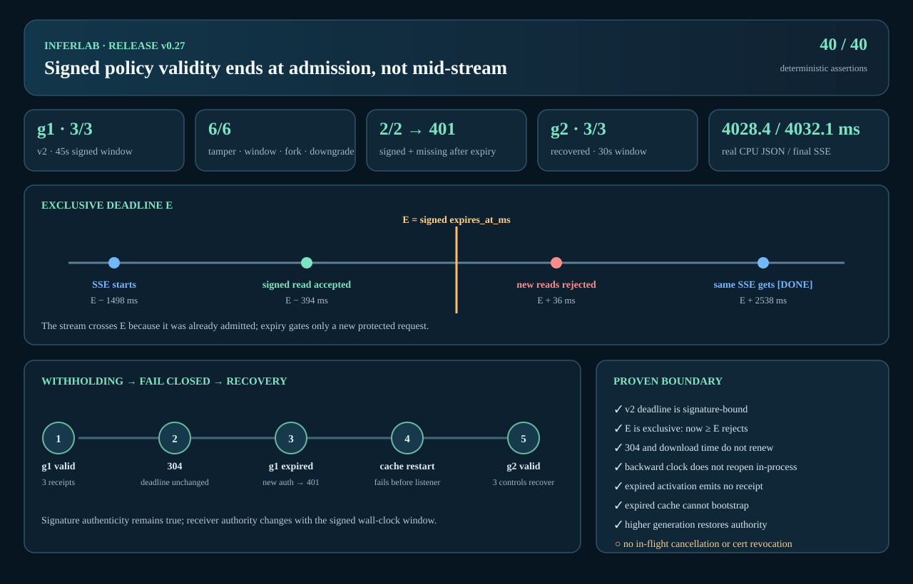

# v0.27 retained result: signed service-trust validity and expiry

This bundle is the retained output of `./scripts/proof-v0.27.sh`. It exercises
three real control processes receiving policy v2 over a loopback TLS 1.3 mTLS
distributor, a real gateway and CPU worker, controlled wall-clock expiry, and
seven exact production regressions. It is a zero-cost single-host proof of one
bounded schedule, not a hostile-clock, multi-host, or formal-verification
claim.



## Result

- **40/40 deterministic assertions passed.** Checker JSON and the generated
  SVG reproduce byte-for-byte both before and after the completion manifest is
  present.
- All three controls activated root-signed policy-v2 generation 1 with one
  exact 45-second signed window. The distributor retained three receiver-
  signed activation receipts, and each receipt's `applied_at_ms` equals that
  receiver's status `trust_policy_loaded_at_ms` and precedes the signed expiry.
- Six invalid/downgrade paths failed closed. The three live distributor attacks
  (changed signed expiry, malformed window, and same-generation deadline fork)
  left every g1 cache and rollback floor byte-for-byte unchanged. Future issue,
  excessive lifetime, and default-disallowed v1 failed in isolated receiver
  startup before listener or rollback-floor creation.
- A direct `200` → conditional `304` exchange and all three receiver statuses
  retained the exact g1 deadline. Post-expiry statuses still reported the last
  fetch as `not-modified`; neither polling nor download time renewed trust.
- The protected signed read began **394 ms before** the exclusive deadline and
  completed 382 ms before it. The next signed read began **36 ms after** the
  deadline and the missing-authentication read began 46 ms after it; both
  returned the exact redacted `401 unauthorized` expired-policy body. The
  observed leader status counted three expiry rejections.
- One real CPU SSE began **1,498 ms before** expiry and deliberately completed
  **2,538 ms after** it. It retained revision 2, used one attempt, emitted 10
  events/7 nonempty content pieces, and reached `[DONE]`. This demonstrates the
  admitted-work boundary; it does not promise instant data-plane cancellation.
- With generation 2 withheld, the distributor and control C were stopped. An
  mTLS-configured attempt observed connection refusal, and restarting C from
  only expired g1 cache/floor failed before its listener ever opened.
- A fresh root-signed 30-second generation 2 restored all three controls and
  three receipts while advancing each durable cache and floor. Final real CPU
  JSON completed in **4,028.431 ms**, and final SSE completed in **4,032.073
  ms** with seven content pieces and `[DONE]`. These intentionally slow
  single-run observations use a 500 ms worker tick to make the admitted-stream
  boundary visible; they are not latency or throughput targets.
- Seven hard-coded `--lib --exact` production regressions each ran exactly one
  named test. They cover the exclusive boundary/backward-clock latch,
  post-persist expiry without activation or receipt, unchanged future-issued
  local retry, same-ETag 304 recovery, unchanged local polling, the remote
  post-persist race, and same-generation 200 pending-receipt preservation.
- Four long-lived processes retained exact PID/start/command identity. Control
  C and the distributor were the two deliberate replacements; all six final
  participants were proof-owned and non-zombie at the retained continuity
  capture. The EXIT cleanup revalidates ownership before signaling, but its
  post-termination state is not retained as a separate evidence artifact.
- The sanitizer made two host-path replacements. The offline checker directly
  found no retained host path, PEM/private marker, or padded/unpadded encoding
  of any of the seven configured Ed25519 seed labels/values (five unique
  encodings). The proof-run inventory scan, which still had access to the
  ephemeral keys, found no disposable PKI key payload; adversarial replay
  mutations of hashes, timing, streams, process identity, diagnostics, and
  manifests were rejected.
- The completion manifest contains exactly **38 files**, with size/SHA-256 for
  all 37 non-manifest files. Non-manifest files are copied and verified before
  `manifest.json` is published last.

## Evidence map

| Question | Retained evidence |
|---|---|
| Did the complete semantic checker pass? | [`assertions.json`](raw/assertions.json) |
| Did g1 activate on all controls with exact status fields? | [`generation-1-controls.json`](raw/generation-1-controls.json) |
| Are all three g1 activation receipts retained and timestamp-bound? | [`generation-1-receipts.json`](raw/generation-1-receipts.json) |
| Do the caches and rollback floors bind the exact signed deadline? | [`durable-generation-1.json`](raw/durable-generation-1.json), [`durable-after-candidate-attacks.json`](raw/durable-after-candidate-attacks.json), and [`durable-expired-generation-1.json`](raw/durable-expired-generation-1.json) |
| Were tamper, malformed-window, and same-generation-fork candidates rejected precisely? | [`expiry-tamper.json`](raw/expiry-tamper.json), [`malformed-window.json`](raw/malformed-window.json), and [`same-generation-deadline-fork.json`](raw/same-generation-deadline-fork.json) |
| Did future, excessive-lifetime, and v1 inputs fail before listening? | [`future-issued-startup.json`](raw/future-issued-startup.json), [`excessive-lifetime-startup.json`](raw/excessive-lifetime-startup.json), and [`legacy-v1-startup.json`](raw/legacy-v1-startup.json) |
| Did `304 Not Modified` leave the deadline unchanged? | [`not-modified-does-not-renew.json`](raw/not-modified-does-not-renew.json), [`pre-expiry-controls.json`](raw/pre-expiry-controls.json), and [`expired-controls.json`](raw/expired-controls.json) |
| What proves the exclusive request edge and admitted SSE behavior? | [`request-time-cutoff-and-admitted-stream.json`](raw/request-time-cutoff-and-admitted-stream.json) |
| Was the distributor actually unavailable? | [`distributor-outage.json`](raw/distributor-outage.json) |
| Did expired-cache restart fail without transient listening? | [`expired-cache-restart.json`](raw/expired-cache-restart.json) |
| Did valid higher generation 2 recover every receiver and durable floor? | [`publish-g2.json`](raw/publish-g2.json), [`generation-2-controls.json`](raw/generation-2-controls.json), [`generation-2-receipts.json`](raw/generation-2-receipts.json), and [`durable-generation-2.json`](raw/durable-generation-2.json) |
| Which exact production regressions ran non-vacuously? | [`production-validity-tests.json`](raw/production-validity-tests.json) |
| Did real inference still work after recovery? | [`final-request.json`](raw/final-request.json) and [`final-stream.json`](raw/final-stream.json) |
| Which exact processes survived or were deliberately replaced? | [`process-continuity.json`](raw/process-continuity.json) |
| Is retained output sanitized and private-material-free? | [`sanitizer.json`](raw/sanitizer.json) and [`private-material-scan.json`](raw/private-material-scan.json) |
| Is the exact file set complete? | [`manifest.json`](raw/manifest.json) |

## Reproduce for $0

Prerequisites are the normal local InferLab build requirements plus OpenSSL,
`curl`, and Python linked to a TLS 1.3-capable SSL library:

```bash
./scripts/proof-v0.27.sh
```

To retain a new bundle, point the proof at an empty directory:

```bash
INFERLAB_V27_OUTPUT_DIR=/absolute/path/to/empty-output \
  ./scripts/proof-v0.27.sh
```

The proof refuses occupied ports `10080`–`10086`, creates one guarded
`umask 077` temporary root, disables ambient proxies, uses only a disposable
private CA for TLS 1.3, revalidates child ownership before signaling, and
retains no private key. Output publication refuses a nonempty destination.

The completed bundle can be checked and rendered without starting services:

```bash
python3 benchmarks/check_trust_expiry.py \
  --evidence-dir docs/results/v0.27/raw \
  --require-manifest \
  --output /tmp/inferlab-v027-assertions.json
python3 benchmarks/render_trust_expiry_svg.py \
  --evidence-dir docs/results/v0.27/raw \
  --output /tmp/inferlab-v027-proof.svg
cmp /tmp/inferlab-v027-assertions.json \
  docs/results/v0.27/raw/assertions.json
cmp /tmp/inferlab-v027-proof.svg \
  docs/results/v0.27/raw/trust-expiry-proof.svg
```

## Claim boundary

- Expiry bounds **new service-authenticated control requests**. It does not
  cancel already-admitted inference, revoke a routing lease, kill a process,
  or guarantee zero new public inference at the same instant.
- The process-local maximum-observed clock prevents in-process resurrection
  after a backward observation. It is not a persisted secure clock; restart
  depends on sufficiently correct host time and revalidates cached bytes.
- Receiver expiry is not fleet-atomic. Bounded clock skew can create a bounded
  mixed-validity edge across controls.
- A distributor proves snapshot structure/signature and reports signed schema
  and expiry. It cannot declare a receiver's current validity or fleet
  convergence.
- The mTLS boundary is the control↔trust-distributor channel only. Global
  service mTLS, certificate rotation/revocation/ACME/HSM, trust-distributor HA,
  and automated renewal remain outside v0.27.
- This is one controlled loopback schedule with disposable keys and clocks. It
  is not multi-host withholding evidence, hostile-clock testing, a long
  outage/soak test, Byzantine tolerance, or formal verification.
