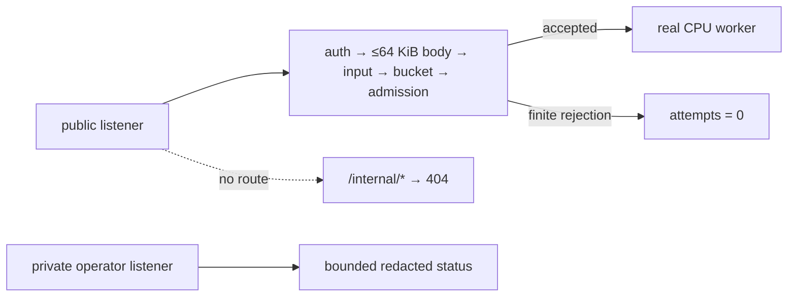

# v0.28 retained result: public edge isolation and bounded abuse budgets

This bundle is the retained output of `./scripts/proof-v0.28.sh`. It starts one
real gateway and one real CPU worker on loopback, uses separate public,
operator, and private metrics listeners, and drives the hosted completion gate
with two public credentials plus one operator credential. It is a zero-cost,
single-host proof of one exact schedule—not evidence of internet-scale abuse
resistance, HTTPS, a WAF, distributed rate limiting, or a billing system.


## Result

- **29/29 deterministic assertions passed.** Checker JSON and the generated
  SVG replay byte-for-byte before and after the completion manifest exists.
  The manifest is written last and records exactly **27 files / 26 hashes**.
- Hosted startup rejects missing public credentials, colliding listener binds,
  and public/operator credential overlap before either listener is observed
  usable. The public listener returns the same empty `404` surface for
  `/internal/workers` under missing, public, and operator credentials. The
  operator listener returns `401` for missing/public credentials and `200`
  only for its operator credential.
- Missing, oversized-without-auth, wrong, wrong-scheme, and literal duplicate
  Authorization inputs share one redacted `401` completion-gate response with
  `x-inferlab-attempts: 0`. A decoded body of exactly **65,536 bytes** succeeds;
  fixed-length and chunked **65,537-byte** bodies both receive the exact
  `413 body_too_large` response. The finite message, prompt, and `max_tokens`
  cases return their exact `400`/`413` envelopes without a worker attempt.
- With a two-request burst at 60 requests/minute, public credential A succeeds
  twice, receives `429` plus `Retry-After: 1`, and succeeds after an observed
  **1,317.514 ms** refill interval. Credential B succeeds while A is empty.
  An admission-full request consumes its token; after the live stream releases,
  one request succeeds and the immediate next request remains rate-limited.
- Real CPU JSON completes in **824.449 ms**. Real CPU SSE completes in
  **825.350 ms**, emits seven nonempty content events across a measured
  **616.046 ms** span, reaches one terminal `[DONE]`, and is drained through
  EOF. A separate SSE is deliberately disconnected after its first content
  event; its observed prefix is fully leak-scanned, the unobserved remainder is
  explicitly not called complete, and gateway/worker ownership returns to
  zero without restarting either process.
- Final gateway attempts equal final worker accepts exactly (**9 = 9**).
  Completion accounting is eight successful drained bodies, one intentional
  cancellation, zero errors, and zero deadlines. The detailed finite rejection
  counters sum to **18**, exactly matching the hosted-only unlabeled
  `inferlab_gateway_public_edge_rejections_total` scalar.
- Five hard-coded production regressions each run exactly one named test and
  pass. They cover explicit mode/bounds, deterministic token arithmetic and
  credential isolation, input-policy reasons, deep worker-admission wrapping,
  and the exact hosted 256-series design ceiling while local mode remains at
  255.
- The exact gateway and CPU-worker PID, parent, start token, command, liveness,
  and non-zombie identity remain stable through the final live capture. That
  retained continuity record is intentionally pre-cleanup; the script owns,
  terminates, and reaps its children but does not claim a retained post-cleanup
  audit.
- The retained sanitizer and independent checker scan find no credential,
  credential hash/position, prompt, request-ID marker, private-material marker,
  proof/project host path, or forbidden identity field. Separate discarded-log
  evidence covers all three startup logs and both runtime logs before deletion.

## Evidence map

| Question | Retained evidence |
|---|---|
| Did every falsifiable predicate pass? | `raw/assertions.json` |
| Did invalid hosted configuration fail before serving? | `raw/startup-contract.json` |
| Are public/operator routes and credentials isolated? | `raw/route-isolation.json`, `raw/authentication-rejections.json` |
| Are body/message/prompt/token bounds exact? | `raw/request-boundary.json`, `raw/input-rejections.json` |
| Are buckets isolated, refilled, charged, and not refunded? | `raw/rate-limit.json`, `raw/sse-disconnect.json` |
| Did real CPU JSON/SSE complete, and did disconnect release ownership? | `raw/json-completion.json`, `raw/sse-completion.json`, `raw/sse-disconnect-*.json` |
| Do private status and OpenMetrics reconcile? | `raw/operator-status-final.json`, `raw/final-gateway.prom`, `raw/final-worker.prom` |
| Did exact production regressions run once? | `raw/production-tests.json` |
| Were the same exact child processes alive through capture? | `raw/process-continuity.json` |
| Were retained and discarded surfaces scanned? | `raw/sanitizer.json`, `raw/private-material-scan.json`, `raw/discarded-log-scan.json` |
| Is the final inventory hash-bound? | `raw/manifest.json` |

## Claim boundary



The edge proof covers only the enumerated authentication, body, edge-owned
input, rate, and admission reasons. Other worker-schema fields remain
downstream and may start an attempt before the worker rejects them. The body is
bounded individually, but authenticated slow uploads, aggregate concurrent
pre-gate buffering/parsing, and malformed-traffic request rates are not bounded
or charged by this token bucket. Provider-managed HTTPS, network controls,
DDoS/WAF protection, secret storage, and cost controls remain deployment work.

## Reproduce the live proof for $0

Prerequisites are the normal InferLab build toolchain (stable Rust plus a C++20
compiler), Python 3, `curl`, and Perl with its core `Time::HiRes` module. The
proof uses only loopback ports `11080`–`11084` and startup-failure ports
`11180`–`11183`; all must be free.

Run without retention:

```bash
./scripts/proof-v0.28.sh
```

To publish a fresh bundle, point the script at an existing or creatable empty
directory:

```bash
INFERLAB_V28_OUTPUT_DIR=/absolute/empty/path \
  ./scripts/proof-v0.28.sh
```

The script refuses a nonempty destination, tracks only its exact child PIDs,
and retains output only after checker, renderer, sanitizer, private scan,
byte-replay, and manifest-last gates succeed. This `$0` statement covers local
compute and loopback evidence only. InferLab does not provide a free public
host or free-tier guarantee. If managed HTTPS, network controls, secret
storage, provider abuse/cost controls, and an emergency-disable path cannot be
met at zero cost, publish the repository, retained evidence, and a recorded
local live demo—not an unsafe public endpoint.

## Reproduce the retained derivations

From the repository root:

```bash
python3 benchmarks/check_public_edge.py \
  --evidence-dir docs/results/v0.28/raw \
  --require-manifest \
  --output /tmp/inferlab-v028-assertions.json
cmp docs/results/v0.28/raw/assertions.json \
  /tmp/inferlab-v028-assertions.json

python3 benchmarks/render_public_edge_svg.py \
  --evidence-dir docs/results/v0.28/raw \
  --output /tmp/inferlab-v028-proof.svg
cmp docs/results/v0.28/raw/public-edge-proof.svg \
  /tmp/inferlab-v028-proof.svg
```

## Read next

- [RFC 0033](../../rfcs/0033-public-edge-isolation-bounded-abuse-budgets.md)
  defines the normative contract and rejected alternatives.
- [Phase 33](../../learning/phase-33-public-edge-isolation-bounded-abuse-budgets.md)
  explains the topology, request journey, token bucket, SSE permit lifecycle,
  failure matrix, and glossary in learning order.
- [Interview guide](../../interview-demo.md) turns this exact evidence into an
  honest live recording sequence.
