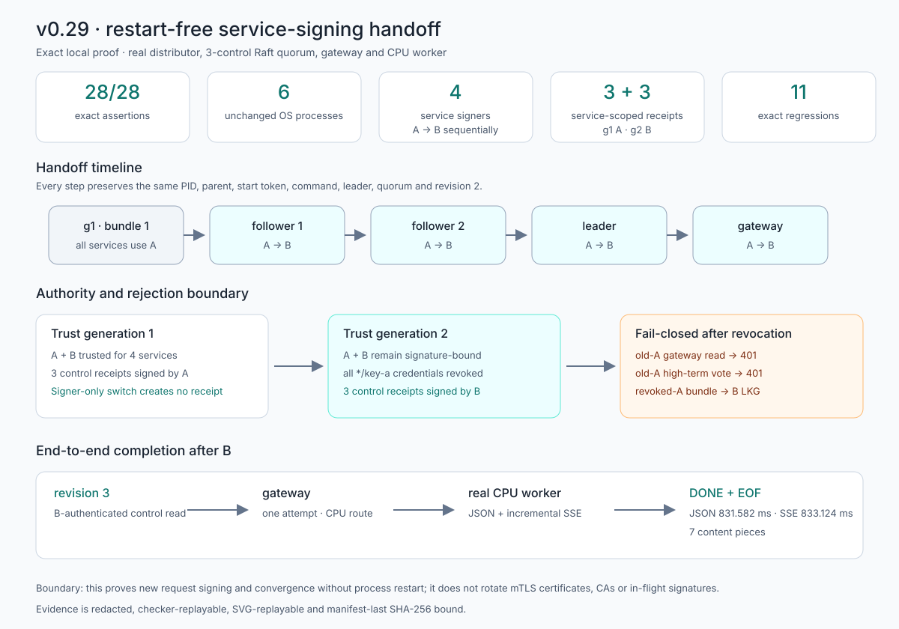
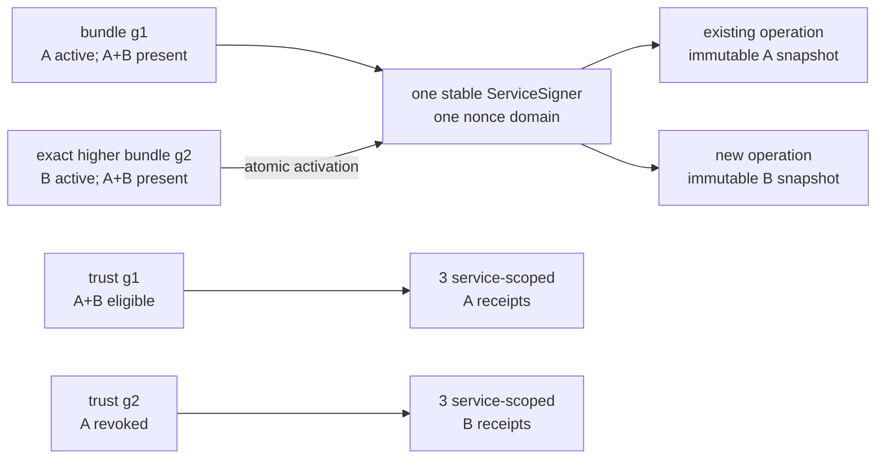

# v0.29 retained result: restart-free service-signing handoff

This bundle is the retained output of `./scripts/proof-v0.29.sh`. It starts a
real trust distributor, three Raft controls, one gateway, and one CPU worker on
loopback. The four signing services begin with bundle generation 1 and
`key-a`, then switch sequentially to generation 2 and `key-b` without changing
their process identities. This is a zero-cost, single-host proof of one exact
schedule—not evidence of fleet-atomic rotation, durable rollback protection,
or managed secret storage.



## Result

- **28/28 deterministic assertions passed.** Checker JSON and the generated
  SVG replay byte-for-byte. The manifest is written last and records exactly
  **28 total files / 27 hashed non-manifest files**.
- Nine invalid startup sources—missing, malformed, oversized, mode `0644`,
  non-regular, symlink, wrong cluster, wrong service, and unknown active
  credential—exit nonzero with their exact finite error kind. No listener was
  observed open and no state file was created in any startup case.
- One running follower then receives eleven invalid live observations in exact
  order: the same nine source failures, followed by stale-generation and
  same-generation-fork candidates. Every case keeps its phase's LKG signer—A
  for the first nine and B for stale/fork—plus the same process identity,
  increments `rejected_reloads` exactly once (**0 → 11**), deduplicates the
  unchanged failure, and clears the bounded last error after an atomic valid
  recovery.
- Trust generation 1 makes A and B eligible for all four signing services.
  The distributor converges in `service-id` mode with exactly three control
  receipts signed by A. Controls `control-b`, `control-c`, and leader
  `control-a`, then `gateway-primary`, activate B in that order while revision
  2, one leader term, quorum state, and authenticated traffic remain healthy.
  The generation-1 A receipts remain byte-identical: changing the private
  signer does not fabricate a trust receipt.
- Trust generation 2 revokes every `*/key-a` credential. It converges again in
  the same three stable service slots, now with exactly three receipts signed
  by B. An old-A gateway read and an old-A high-term peer vote both return
  `401` before control state changes; a valid B read returns `200`. A safe
  retained projection binds the rejected higher bundle to generation 3,
  active `key-a`, and the exact service/cluster, while B remains LKG.
- Signed routing writes commit revision 2 (`round-robin`) and revision 3
  (`least-in-flight`). After B and revision 3, real CPU JSON completes through
  one gateway attempt in **831.582 ms**. Real CPU SSE completes in
  **833.124 ms**, emits seven nonempty content pieces across a measured
  **721.919 ms** span, reaches one terminal `[DONE]`, and is drained through
  EOF.
- Eleven hard-coded production regressions each run exactly one named test.
  They cover same-millisecond concurrent nonce uniqueness, LKG rollback/fork/
  policy rejection, file permissions, cluster-bound receipts, current-signer
  Raft traffic, no false handoff receipt, exact policy-key eligibility,
  watcher supervision, in-flight snapshot stability, transient retry plus
  deterministic deduplication, and service-scoped distributor convergence.
- The exact PID, proof-shell parent, start token, command, liveness, and
  non-zombie identity of all six children remain unchanged from A through B,
  trust generation 2, and revision 3. The retained continuity record is
  intentionally pre-cleanup; the script owns, terminates, and reaps only its
  tracked children after the evidence is complete.
- Discarded-log, sanitizer, private-material, and independent checker scans
  cover their exact finite inventories. They find no deterministic private
  seed representation, fixed proof prompt or nonce, sensitive JSON field,
  bundle/PKI/private source path, project path, unexpected host path, or
  private-material marker in retained evidence.

## Evidence map

| Question | Retained evidence |
|---|---|
| Did every falsifiable predicate pass? | `raw/assertions.json` |
| What exact topology, ports, services, credentials, and generations were used? | `raw/proof-contract.json` |
| Are both trust policies exact and root-signature verified? | `raw/trust-generations.json`, `raw/publish-g1.json`, `raw/publish-g2.json` |
| Do invalid initial bundles fail without an observed listener or state file? | `raw/startup-rejections.json` |
| Do live invalid, stale, and forked sources retain and recover A LKG exactly once each? | `raw/live-source-rejections.json` |
| Did generation 1 start on A and converge by service ID? | `raw/generation-1-controls.json`, `raw/generation-1-receipts.json`, `raw/gateway-r2.json` |
| Did follower → follower → leader → gateway switch without restart or lost traffic? | `raw/handoff-sequence.json`, `raw/generation-1-after-handoff.json` |
| Did generation 2 preserve quorum and converge with three B receipts? | `raw/generation-2-controls.json`, `raw/generation-2-receipts.json` |
| Are old A and revoked-A generation 3 rejected before mutation while B still works? | `raw/revoked-a-attacks.json` |
| Did exact signed writes commit revisions 2 and 3? | `raw/r2-write.json`, `raw/r3-write.json` |
| Did B-authenticated revision 3 reach the full cluster and gateway? | `raw/final-cluster.json`, `raw/final-gateway.json` |
| Did real CPU JSON and incremental SSE complete? | `raw/final-json.json`, `raw/final-sse.json` |
| Did every named production regression run once? | `raw/production-tests.json` |
| Were the same six exact children alive through final capture? | `raw/process-continuity.json` |
| Were discarded and retained surfaces scanned? | `raw/discarded-log-scan.json`, `raw/sanitizer.json`, `raw/private-material-scan.json` |
| Is the exact final inventory hash- and size-bound? | `raw/manifest.json` |

## Claim boundary



The proof establishes restart-free activation only inside the lifetime of
these six local processes. Bundle generation and nonce state are not durable
across restart. The four services switch sequentially, not fleet-atomically;
an already-started operation may finish with its captured A snapshot. The
gateway's remote policy readiness remains an operator precondition rather than
an atomic fleet inspection.

The bundle is a local mode-`0600` file containing private seeds. This release
does not provide encryption at rest, immediate memory erasure, a KMS/HSM/TPM,
managed secret delivery, trust-distributor HA, mTLS leaf renewal, CA migration,
or emergency cancellation of authenticated in-flight work. The retained
timings describe one loopback run and are not latency SLOs or load results.

## Reproduce the live proof for $0

Prerequisites are the normal InferLab build toolchain (stable Rust plus a C++20
compiler), Python 3 with TLS 1.3 support, `curl`, and OpenSSL. The proof uses
loopback ports `12080`–`12085` and startup-failure ports `12180`–`12188`; all
must be free.

Run without retention:

```bash
./scripts/proof-v0.29.sh
```

To publish a fresh bundle, point the script at an existing or creatable empty
directory:

```bash
INFERLAB_V29_OUTPUT_DIR=/absolute/empty/path \
  ./scripts/proof-v0.29.sh
```

The script refuses a nonempty destination, uses an isolated temporary tree,
tracks only its exact child PIDs, and copies evidence only after checker,
renderer, sanitizer, private scan, byte-replay, and manifest-last gates pass.
This `$0` statement covers local compute and loopback evidence only; it does
not promise a free public host or production secret-management service.

## Reproduce the retained derivations

From the repository root:

```bash
python3 benchmarks/check_signer_handoff.py \
  --evidence-dir docs/results/v0.29/raw \
  --require-manifest \
  --output /tmp/inferlab-v029-assertions.json
cmp docs/results/v0.29/raw/assertions.json \
  /tmp/inferlab-v029-assertions.json

python3 benchmarks/render_signer_handoff_svg.py \
  --evidence-dir docs/results/v0.29/raw \
  --output /tmp/inferlab-v029-proof.svg
cmp docs/results/v0.29/raw/signer-handoff-proof.svg \
  /tmp/inferlab-v029-proof.svg
```

## Read next

- [RFC 0034](../../rfcs/0034-restart-free-service-signing-handoff.md) defines
  the normative bundle, snapshot, LKG, eligibility, and compatibility contract.
- [Phase 34](../../learning/phase-34-restart-free-service-signing-handoff.md)
  explains the same handoff in learning order with diagrams and a glossary.
- [Interview guide](../../interview-demo.md) turns the retained proof into an
  honest recording sequence without implying fleet-atomic production rotation.
