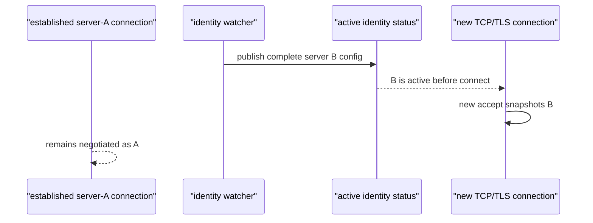

# v0.30 restart-free TLS identity handoff evidence

This directory retains the manifest-last local proof for restart-free,
same-CA X.509 leaf renewal on the service-trust distribution hop.

The proof starts one watched TLS server identity and three watched TLS client
identities at generation 1/A. It rejects bounded startup and live candidates,
retains each last-known-good runtime object, then activates server and client
generation 2/B without replacing the distributor, controls, gateway, or CPU
worker. Root-signed policy and service-signed receipt verification remain the
application authority throughout.

The server boundary is intentionally precise. The proof waits until status
reports server B active, then opens a wholly new TCP/TLS connection and observes
B's public leaf fingerprint. A connection established under A before activation
remains usable under A after the release barrier. This is not a TLS
renegotiation claim.

Publisher A and publisher B are separate fresh proof clients used to publish
policy generations 1 and 2. They are not long-lived runtime processes, and the
proof makes no publisher PID-continuity claim.

The canonical bundle is in [`raw`](raw). Its manifest authenticates every
non-manifest file by byte length and SHA-256. `assertions.json` is the
dependency-free offline result, and `tls-identity-handoff-proof.svg` is a
deterministic visualization derived from the same checked evidence.

The proof establishes this exact local topology. It does not establish CA
migration, certificate revocation, automated issuance, immediate key erasure,
fleet-atomic renewal, multi-host behavior, or distributor HA.


## Result

- **23/23 deterministic assertions passed.** The checker JSON and SVG replay
  byte-for-byte. The manifest is written last and records **24 total files / 23
  hashed non-manifest files**.
- Fifteen invalid initial server bundles exit nonzero before a listener is
  observed: missing, malformed, oversized, mode `0644`, symlink, wrong cluster,
  identity, purpose or configured server name, mismatched key, expired,
  not-yet-valid, wrong EKU, wrong SAN, and wrong CA.
- Nineteen live server observations and twelve live `control-a` client
  observations exercise the same source, binding, key, time, purpose, CA,
  rollback, fork, and issuer-CA-pin boundaries. Every rejection increments its
  bounded counter once, leaves the active leaf fingerprint and runtime
  generation unchanged, keeps LKG traffic usable, and clears the finite error
  after atomic recovery. Server rejections reach **16** before B activation and
  **19** after the post-B rollback/fork/CA-change cases; `control-a` reaches
  **12** before its B activation.
- The distributor begins on server A. A barrier holds one established A
  connection open. After status identifies active B, a wholly new TCP/TLS
  connection presents B while two requests on the held connection both return
  `200` under A. This proves the accepted-connection boundary without claiming
  TLS renegotiation.
- Controls rotate in order `control-b → control-c → control-a`. Each keeps its
  exact PID/parent/start/executable identity and publishes a complete
  generation-2 HTTP client with a fresh pool. Subsequent fetch and receipt
  observations bind to TLS bundle generation 2.
- Root-signed policy generations 1 and 2 each converge with three
  independently Ed25519-verified control receipts. Publisher A and B are
  distinct fresh proof client processes. Neither appears in the six-process
  continuity set.
- Real CPU JSON completes after renewal in **819.971 ms**. Incremental SSE
  completes in **825.317 ms**, emits seven content pieces across ten events,
  reaches `[DONE]`, and is drained through EOF. These loopback observations are
  not latency SLOs.
- Twelve exact production regressions run once each. They cover strict bundle
  bounds and redaction, key/CA/purpose/name rejection, required EKU and time,
  permissions/symlinks, rollback/fork/CA/runtime failure, concurrent snapshots,
  watcher deduplication and time-dependent retry, strict distributor config,
  distributor and control watcher supervision, fresh client-pool replacement,
  and malformed TLS path rejection.
- The exact PID, proof-shell parent, start token, executable, liveness, and
  non-zombie state of the distributor, three controls, gateway, and CPU worker
  remain unchanged through final capture. Discarded-log, sanitizer, and
  private-material scans retain no deterministic Ed25519 seed representation,
  private PEM marker, fixed private prompt, host path, or sensitive JSON field.

## Evidence map

| Question | Retained evidence |
|---|---|
| Did every offline predicate pass? | `raw/assertions.json` |
| What topology, identity generations, barriers, and publisher boundary were used? | `raw/proof-contract.json` |
| Which public A/B leaf fingerprints identify every endpoint? | `raw/certificate-identities.json` |
| Did invalid initial bundles fail before bind? | `raw/startup-rejections.json` |
| Did every live rejection retain and recover the LKG identity? | `raw/live-rejections.json` |
| Did server status activate B before a new B connection while held A stayed A? | `raw/server-handoff.json` |
| Did all three clients rotate sequentially without process replacement? | `raw/control-handoff.json`, `raw/process-continuity.json` |
| Are both policies and all six receipts cryptographically verified? | `raw/trust-generations.json`, `raw/generation-1-receipts.json`, `raw/generation-2-receipts.json` |
| Are publisher A/B represented only as fresh proof clients? | `raw/publish-g1-publisher-a.json`, `raw/publish-g2-publisher-b.json` |
| Did the Raft cluster and TLS generations converge? | `raw/generation-1-controls.json`, `raw/generation-2-controls.json`, `raw/final-cluster.json` |
| Did real CPU JSON and incremental SSE complete? | `raw/final-json.json`, `raw/final-sse.json` |
| Did every named production regression run exactly once? | `raw/production-tests.json` |
| Were discarded and retained surfaces scanned? | `raw/discarded-log-scan.json`, `raw/sanitizer.json`, `raw/private-material-scan.json` |
| Is the exact final inventory byte- and SHA-bound? | `raw/manifest.json` |

## Claim boundary



The issuer CA embedded in generation 1 remains process-pinned; the separately
configured peer-verification CAs also remain unchanged. TLS proves the channel
peer and protects transport. Root-signed policy and service-signed receipt
bytes remain the application authority.

The TLS generation floor and issuer pin are process-local and reset at restart.
A preaccepted handshake future or established connection may retain A, and an
already-started control operation may finish through its captured A client.
The handoff is sequential rather than fleet-atomic. Private keys remain in
mode-`0600` proof bundles and process memory; immediate erasure is not claimed.

## Reproduce the live proof

Prerequisites are the normal InferLab build toolchain, Python 3 with TLS 1.3
support, `curl`, and OpenSSL. The proof uses loopback ports `12380`–`12385` and
startup-failure ports `12400`–`12414`; all must be free. Every OpenSSL CA serial
is an explicit proof-owned file below the guarded temporary PKI directory.

Run without retention:

```bash
./scripts/proof-v0.30.sh
```

To publish a fresh manifest-last bundle, point the script at an empty directory:

```bash
output="$(mktemp -d)"
INFERLAB_V30_OUTPUT_DIR="$output" ./scripts/proof-v0.30.sh
```

The script refuses a nonempty destination and copies evidence only after its
sanitizer, private scan, checker, renderer, byte-replay, and manifest-last gates
pass.

## Reproduce the retained derivations

From the repository root:

```bash
python3 benchmarks/check_tls_identity_handoff.py \
  --evidence-dir docs/results/v0.30/raw \
  --require-manifest \
  --output /tmp/inferlab-v030-assertions.json
cmp docs/results/v0.30/raw/assertions.json \
  /tmp/inferlab-v030-assertions.json

python3 benchmarks/render_tls_identity_handoff_svg.py \
  --evidence-dir docs/results/v0.30/raw \
  --output /tmp/inferlab-v030-proof.svg
cmp docs/results/v0.30/raw/tls-identity-handoff-proof.svg \
  /tmp/inferlab-v030-proof.svg
```

## Read next

- [RFC 0035](../../rfcs/0035-restart-free-same-ca-mtls-leaf-renewal.md)
  defines the normative watched-bundle, validation, activation, and status
  contract.
- [Phase 35](../../learning/phase-35-restart-free-same-ca-mtls-leaf-renewal.md)
  explains the same lifecycle in learning order.
- [Interview guide](../../interview-demo.md) turns the retained proof into a
  recording sequence without implying CA rotation or instantaneous global
  replacement.
