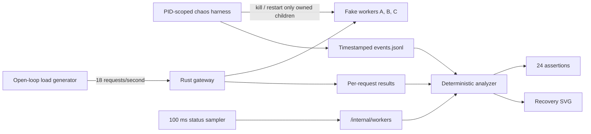
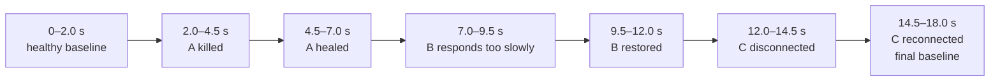

# RFC 0009: Scripted resilience chaos harness

**Status:** Implemented | **Milestone:** v0.0.9

## Context

InferLab already has deterministic proofs for streaming, routing, backpressure,
deadlines, retries, and circuit breakers. Each proof isolates one behavior and
usually divides the experiment into manually separated phases.

Isolation makes a claim easy to attribute, but it does not answer the integrated
question:

> While requests continue arriving, does the gateway detect a worker incident,
> preserve useful completions, bound extra work, and restore ordinary traffic
> after the worker heals?

A final healthy response is not enough evidence. It hides how many requests
failed, how long the system took to isolate the worker, whether retries amplified
the incident, whether latency approached the deadline, and whether recovery
caused another traffic wave.

## Decision

Add one reproducible chaos harness with four cooperating parts:

1. `scripts/proof-v0.0.9.sh` builds the services, owns their PIDs, injects a
   fixed fault timeline, runs the analysis pipeline, and cleans up.
2. `benchmarks/chaos_probe.py` offers requests at a fixed open-loop rate while a
   separate sampler polls `/internal/workers`.
3. `benchmarks/analyze_chaos.py` aligns request, state, and event clocks and
   derives phases, detection, failover, recovery, MTTR, latency, goodput, and
   retry amplification.
4. `benchmarks/check_chaos.py` turns those claims into machine-readable
   assertions, while `render_chaos_svg.py` deterministically renders the same
   analysis as a recovery chart.

The harness changes no gateway resilience behavior. It tests the composition
already implemented by RFCs 0001–0008.



## Steady-state hypothesis

Before injecting a fault, define the behavior that should remain acceptably
stable:

- open-loop dispatch remains close to schedule;
- healthy requests complete successfully;
- ordinary p95 latency remains far below the 700 ms deadline;
- all three worker circuits are closed;
- retry amplification is 1.0×; and
- admission, execution, and memory remain bounded.

During one-worker incidents, the hypothesis permits short latency and retry
changes but requires:

- useful completions continue on the other workers;
- the affected circuit opens within 1.5 seconds;
- a healthy-worker response completes within 500 ms of the event;
- cumulative retries remain inside the 10% budget;
- request latency remains below the deadline plus measurement tolerance; and
- no capacity counter exceeds its configured limit.

After healing, the affected worker must close its circuit and rejoin traffic
within 1.8 seconds. The final phase must restore 100% success and traffic on all
three workers.

## Experiment timeline

Faults are sequential so the blast radius is always one worker.



The load generator schedules 324 requests independently of completion:

```text
18 seconds × 18 requests/second = 324 original requests
```

Round-robin routing makes each fault observable while preserving two healthy
alternatives. Normal workers delay 12 ms. Slow worker B delays response headers
by 350 ms, beyond the gateway's 150 ms attempt timeout. The request deadline is
700 ms. The circuit uses a four-outcome window, a four-request minimum, a 50%
threshold, and a 700 ms cooldown.

## Why open-loop traffic?

A closed-loop client waits for one request to finish before issuing replacement
work. When the server becomes slow, the client also becomes slow and quietly
reduces offered load. The experiment would then hide the incident by helping the
server.

An open-loop client schedules arrivals against a clock:

```text
scheduled request n = experiment start + n / offered rate
```

Requests may overlap. `dispatch_lag_ms` records whether the load generator fell
behind its own schedule. The retained p99 dispatch lag was 8.584 ms against a
55.556 ms arrival interval.

## Event, request, and status records

Every fault event includes:

```text
elapsed_ms, event, worker, action, mode, target_pid, scope, bind
```

Every request includes:

```text
scheduled_ms, started_ms, completed_ms, dispatch_lag_ms,
status, worker, attempts, latency_ms, error_type
```

Every 100 ms gateway sample includes:

```text
admission counters, resilience counters, per-worker in-flight/executing counts,
per-worker circuit state and counters, gateway RSS
```

The clocks are aligned by elapsed time rather than by request ordering. A request
scheduled before an event remains part of the earlier phase even if it completes
after the event.

## Metric definitions

```mermaid
sequenceDiagram
    participant H as Harness
    participant G as Gateway
    participant W as Affected worker
    participant B as Healthy worker
    H-xW: fault at t_fault
    G->>B: route or retry
    B-->>G: first healthy completion
    Note over G,B: failover = healthy completion - t_fault
    Note over G: detection = first open snapshot - t_fault
    H->>W: heal at t_heal
    G->>W: one half-open probe
    W-->>G: success; circuit closes
    Note over G,W: recovery = closed snapshot - t_heal
    Note over H,W: MTTR = closed snapshot - t_fault
```

- **Goodput:** successful client completions under the configured deadline.
- **Error rate:** non-200 client outcomes divided by original requests.
- **Retry amplification:** upstream attempts divided by original requests.
- **Detection time:** first sampled open/half-open circuit state minus the fault
  event.
- **Failover time:** first successful completion on another worker minus the
  fault event.
- **Recovery time:** first closed state with a new recovery counter minus the
  heal event.
- **MTTR:** fault event to restored closed state. In this scripted experiment it
  includes the deliberate 2.5-second fault duration.

## Safety boundary

Chaos is useful only if the target boundary is stricter than the injected fault.

1. Every listener binds to `127.0.0.1`.
2. The harness refuses to start if one of its exact ports has an active
   listener.
3. Every spawned process PID is registered immediately.
4. Before signaling a PID, the harness checks that its parent is the current
   harness shell.
5. A stopped PID is removed from the live set so cleanup cannot signal a reused
   PID.
6. Fault events retain the exact target PID and
   `scope=owned-child-process`.
7. Cleanup signals only still-live registered children.
8. No `pkill`, `killall`, process-name match, firewall rule, privileged command,
   or external host is used.

The PID value `0` is used only as an inert Bash-array sentinel and as the event
value for harness lifecycle events. It is rejected by `is_owned_child` and is
never passed to `kill`.

## Invariants

1. Offered request timing does not wait for earlier completions.
2. Faults target only explicitly started loopback InferLab child processes.
3. At most one worker is intentionally impaired at a time.
4. A fault is observable through client errors or extra upstream attempts even
   when retries mask it from clients.
5. Healthy workers continue producing goodput during each incident.
6. Every affected circuit opens and later recovers through half-open probes.
7. All workers are closed and receive traffic in the final phase.
8. `upstream attempts = original requests + committed retries`.
9. Committed retries never exceed the configured cumulative budget.
10. Queue, execution, and outstanding counts never exceed configured capacity.
11. Client-observed latency remains bounded by the request deadline plus a small
    scheduling/measurement tolerance.
12. Gateway status sampling continues without errors through all incidents.
13. Raw request, event, and status data deterministically regenerate the
    analysis and SVG.
14. Cleanup never signals a PID that is not a live harness child.

## Alternatives considered

### Manual `kill` commands

Rejected as release evidence. Human timing is not reproducible, the target PID
is easy to confuse, and there is no machine-readable event clock.

### Closed-loop load generation

Rejected because service slowdown reduces offered load and makes the incident
look easier than it is.

### Random fault timing

Deferred. Random schedules explore more interleavings but require seeds,
multiple runs, and statistical acceptance. A deterministic first harness makes
the causal timeline falsifiable.

### Network firewall or proxy faults

Deferred. They can model packet loss and partitions more accurately, but add
privilege, platform dependence, and a wider safety boundary. Stopping a
harness-owned loopback worker gives deterministic connection refusal without
changing host networking.

### Process-name-based killing

Rejected categorically. Another InferLab development process could share the
same executable name. Exact child PID ownership is the safety contract.

### End-state-only assertions

Rejected. “Healthy at the end” cannot reveal a ten-second outage, retry storm,
or temporary capacity violation. Recovery is a curve.

### Add a new production health checker

Rejected for this milestone. The purpose is to test the existing request-path
signals and half-open probes, not introduce a second health mechanism.

## Retained result


| Claim | Retained evidence |
|---|---:|
| Original requests | 324 |
| Successful requests | 324 |
| Upstream attempts | 336 |
| Committed retries | 12 |
| Retry amplification | 1.037× |
| A detection / failover / recovery | 256.243 / 27.720 / 152.566 ms |
| B detection / failover / recovery | 559.934 / 33.163 / 747.968 ms |
| C detection / failover / recovery | 253.777 / 21.672 / 152.814 ms |
| Mean MTTR, including scripted fault duration | 2,859.911 ms |
| Maximum client latency / deadline | 178.261 / 700 ms |
| Peak queue / configured | 0 / 6 |
| Peak execution / configured | 2 / 6 |
| Gateway RSS increase | 1,056 KiB |
| Machine-readable assertions | 24 of 24 passed |

Each worker opened three times because two half-open probes ran while the
scripted fault was still present and failed, then the third probe succeeded
after healing. That is expected cautious recovery, not circuit flapping caused
by healthy traffic.

All three client incident phases achieved 100% success. The failures remained
visible in circuit states, per-worker routing, latency, and the accounting
identity:

```text
336 upstream attempts = 324 original requests + 12 committed retries
```

The slow-worker phase is the clearest reason success rate alone is insufficient:
it completed every request, but p95 latency rose from 19.414 ms in the baseline
to 175.083 ms.

## Limitations

- All processes run on one Apple arm64 host over loopback; there is no real
  network delay, packet loss, or multi-host clock behavior.
- Workers simulate inference and use non-streaming responses in this experiment.
  Streaming ownership and no-retry-after-streaming remain covered by earlier
  integration proofs.
- Faults are deterministic, sequential, and affect one worker at a time. The
  harness does not yet study overlapping faults or all-worker loss.
- “Disconnect” is deterministic connection refusal from a stopped process, not
  a partition that drops only selected packets.
- Slow mode is installed by restarting a worker with a larger response delay;
  the restart itself creates a short unavailability interval.
- The run lasts 18 seconds and contains 324 requests. It proves this configured
  scenario, not long-term availability.
- Circuit state is sampled every 100 ms, so detection and recovery measurements
  have approximately that observational resolution.
- The retry budget had enough cumulative credit to grant all 12 required
  retries. Budget denial under low request counts remains proved by v0.0.7 and
  v0.0.8.
- Gateway resilience state remains process-local and topology remains static.
- Corrupt response bodies, mid-stream body failures, CPU pressure, and memory
  exhaustion are not injected.

## Reproduce

```bash
./scripts/proof-v0.0.9.sh
```

To replace the retained evidence:

```bash
INFERLAB_RESULTS_DIR=docs/results/v0.0.9/raw \
  ./scripts/proof-v0.0.9.sh
```

