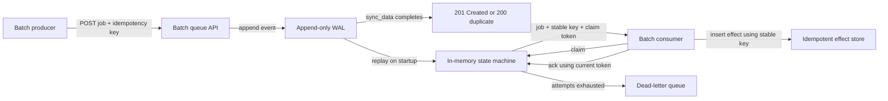
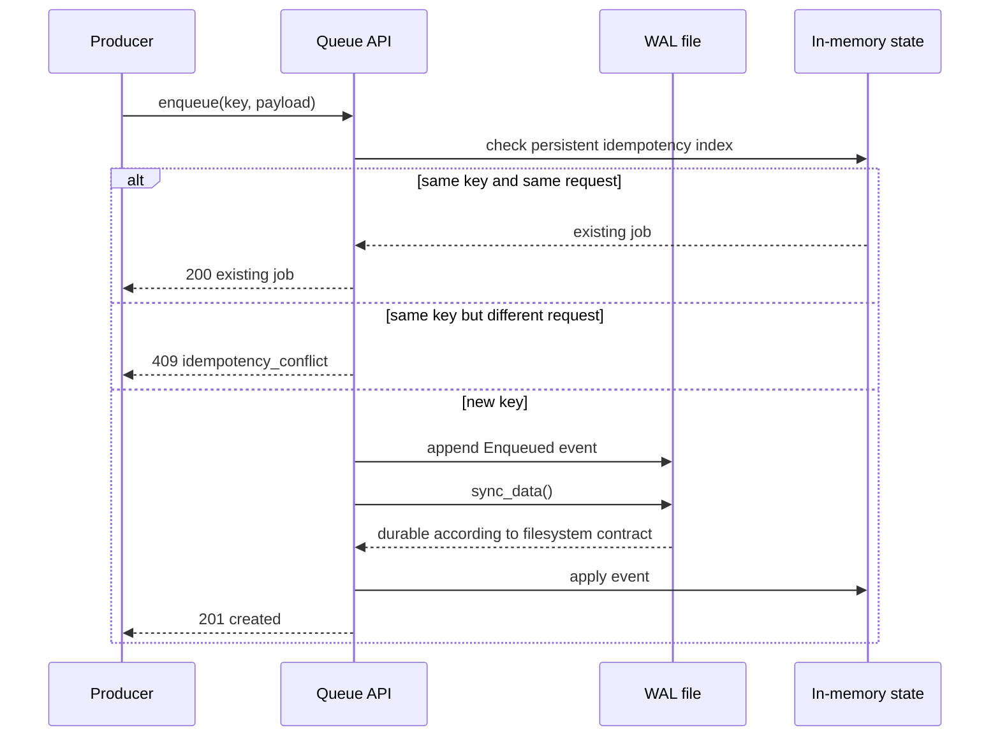
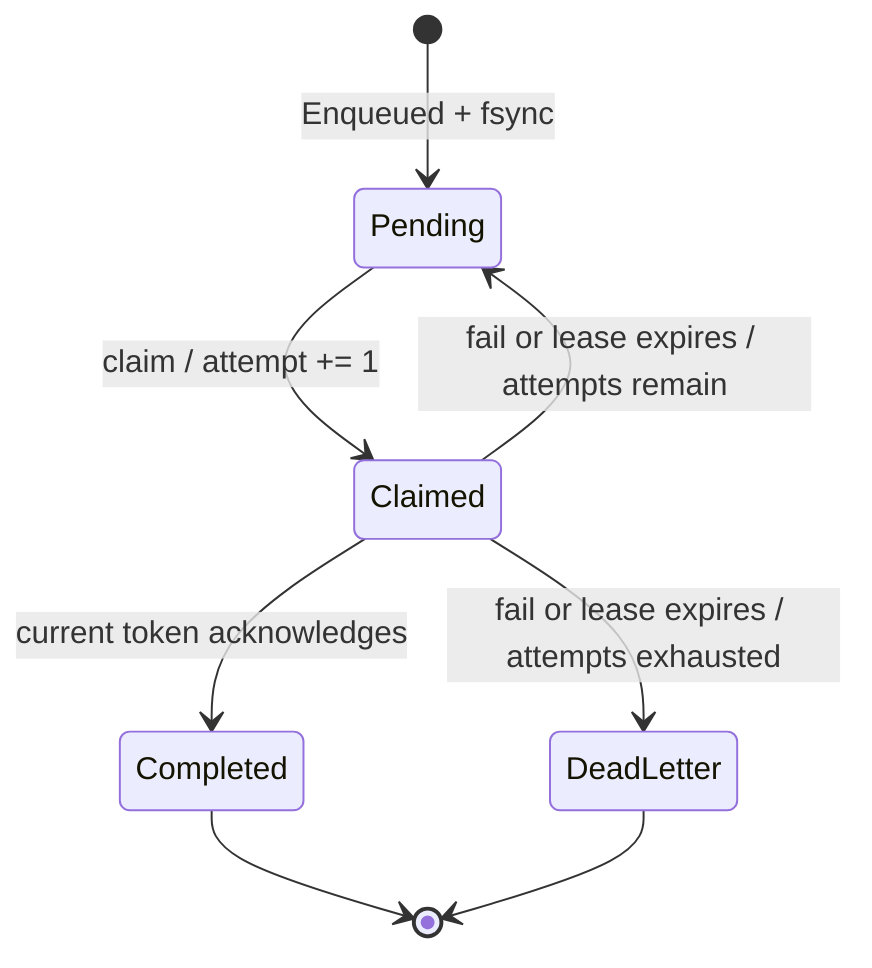

# RFC 0010: Durable batch queue

**Status:** Implemented | **Milestone:** v0.5

## What “RFC” means here

RFC expands to **Request for Comments**. On the public internet, RFCs often
standardize protocols. In InferLab, an RFC is a durable engineering decision
record: it states the problem, chosen contract, invariants, alternatives, proof,
and limitations before later code makes the reason hard to recover.

“Request” in this name does not mean an HTTP request. It means “please review
this proposed design.” This RFC now has status **Implemented**, so it describes
the accepted v0.5 design.

## Context

The interactive gateway can return an error and rely on a present client to
decide whether to retry. Batch inference has a different owner and lifetime. A
job such as “summarize 10,000 documents” may wait unattended for hours. If the
queue or consumer loses job 7,431, no client is still connected to notice.

An in-memory queue therefore cannot satisfy the batch contract:

```text
accept job → process dies → accepted job no longer exists
```

A second failure is subtler:

```text
consumer performs effect → consumer dies before acknowledgement
```

Redelivery is required because the queue cannot distinguish that sequence from
“consumer died before doing anything.” Duplicate execution is therefore a
normal outcome, not an edge case.

## Decision

Add a separate Rust `batch-queue` service with:

- an append-only JSON-lines write-ahead log (WAL);
- synchronous `fsync` via Rust `File::sync_data` before a successful mutation
  response;
- unique persistent idempotency keys;
- explicit claim and acknowledgement;
- visibility leases and automatic redelivery;
- monotonically increasing claim tokens that fence stale consumers;
- bounded attempts; and
- a terminal dead-letter queue (DLQ).

The delivery contract is **at least once with idempotent effects**, not exactly
once.



The service is independent of the interactive gateway. Durable batch work must
not delay token streaming or share its admission queue.

## API contract

| Method and path | Meaning | Success |
|---|---|---|
| `POST /v1/batch/jobs` | Durably enqueue or deduplicate one job | `201` new, `200` existing |
| `POST /v1/batch/claim` | Claim the oldest pending job for a visibility period | `200` job, `204` empty |
| `POST /v1/batch/jobs/{id}/ack` | Complete the current claim | `200` completed job |
| `POST /v1/batch/jobs/{id}/fail` | Release or dead-letter the current claim | `200` job |
| `GET /v1/batch/jobs/{id}` | Read one job; expired claims are first resolved | `200` job |
| `GET /v1/batch/dead-letter` | List terminal dead-letter jobs | `200` array |
| `GET /internal/status` | Inspect WAL and lifecycle counters | `200` snapshot |
| `GET /healthz` | Process liveness | `200 ok` |

Claim responses contain the stable job ID, original idempotency key, payload,
attempt number, maximum attempts, consumer ID, unique claim token, and lease
deadline.

Errors are structured JSON. Invalid input is `400`, an idempotency conflict or
stale claim is `409`, an unknown job is `404`, and a storage failure is `500`.

## Request and persistence order



The ordering is deliberate: **WAL append → sync → memory mutation → response**.
If syncing fails, the API never confirms the transition.

Blocking filesystem work runs inside Tokio's blocking pool, so one `fsync` does
not block the async HTTP executor. A mutex still serializes queue transitions;
this is a correctness-first single-writer design.

After any WAL write or sync error, the opened WAL is poisoned and all later
mutations fail until the service is restarted and replay succeeds. Continuing
with memory state after an ambiguous disk write could create a history that
changes after restart.

## State machine



Each claim receives a fresh token. A late worker cannot acknowledge a newer
lease because acknowledgement must match both consumer ID and active token.

```mermaid
sequenceDiagram
    participant A as Consumer A
    participant Q1 as Queue process 1
    participant D as WAL on disk
    participant Q2 as Queue process 2
    participant B as Consumer B
    A->>Q1: claim job, token-1
    Q1->>D: fsync Claimed(token-1)
    A->>A: apply effect with stable idempotency key
    Note over A,Q1: A disappears before ack; Q1 is killed
    Q2->>D: replay enqueue + claim
    Note over Q2: token-1 lease expires
    Q2->>D: fsync Released(timeout)
    B->>Q2: claim same job, token-2
    B->>B: duplicate effect is suppressed by key
    A--xQ2: late ack(token-1) → 409 stale_claim
    B->>Q2: ack(token-2)
    Q2->>D: fsync Acknowledged(token-2)
```

## WAL format and recovery

One complete JSON object plus newline represents one transition:

```json
{"type":"claimed","job_id":"batch-00000001","consumer_id":"worker-b","claim_token":"claim-000000000002","visibility_deadline_ms":12345,"attempt":2,"at_ms":7345}
```

Startup replays events in order and reconstructs:

- jobs and their current states;
- the idempotency-key index;
- next job and claim-token sequences; and
- claim, acknowledgement, redelivery, failure, and DLQ counters.

A final record without a newline is treated as a torn tail from an interrupted
append and is truncated. A malformed **complete** record aborts startup. Silently
skipping corruption in the middle would invent a state history that never
existed.

Visibility expiration is resolved lazily whenever a claim, read, DLQ list, or
status request touches the store. The expiration itself is another synced WAL
event before the job becomes pending or dead-lettered.

## Crash consistency

| Crash point | Observable result |
|---|---|
| Before WAL append | No transition and no success response |
| During append, before sync | Caller has no success; an incomplete final line is discarded |
| After sync, before response | Transition survives; retrying the idempotency key returns the same job |
| After claim, before effect | Lease expires and job is redelivered |
| After effect, before ack | Job is redelivered; the effect store must reject the same idempotency key |
| After ack sync | Job replays as completed |

This is why exactly-once execution is not claimed. The queue cannot atomically
commit its WAL and an arbitrary external side effect.

## Invariants

1. A mutation is never acknowledged before its WAL record is synced.
2. A complete WAL record is either valid and applied in order or startup fails.
3. Only an incomplete final record may be discarded.
4. One idempotency key names one immutable payload and `max_attempts`.
5. Repeating the same enqueue returns the same job without another WAL event.
6. A job has at most one active claim.
7. Every claim increments the attempt count and receives a new token.
8. Only the consumer holding the current token can acknowledge or fail a job.
9. An expired claim is durably released or dead-lettered before another claim.
10. A completed or dead-lettered job is terminal.
11. Attempts never exceed `max_attempts`.
12. Batch durability is isolated from interactive streaming.
13. A WAL write/sync failure makes the current store fail closed.

## Alternatives considered

### In-memory channel

Rejected because accepted jobs disappear with the process. It remains suitable
for ephemeral coordination where the caller is still present.

### SQLite, PostgreSQL, or an existing broker

Deferred, not judged inferior. They provide stronger concurrency, indexing,
locking, compaction, and operational tooling. A small WAL was chosen because
v0.5 is specifically a learning milestone: append ordering, replay, torn writes,
leases, and fencing remain visible in code and evidence.

### Snapshot rewrite after every change

Rejected. Rewriting all state enlarges the crash window and write cost. An
append-only history makes the commit point and recovery sequence explicit.

### Exactly-once execution

Rejected as an impossible general promise across the queue and arbitrary
external effects without a shared transaction. Stable idempotency keys let the
effect destination enforce one result while delivery remains at least once.

### Mark complete when delivered

Rejected because delivery is not processing. A consumer can crash immediately
after receiving the payload.

### Reuse the interactive gateway queue

Rejected. Interactive work has a connected client, a short deadline, and
streaming ownership. Batch work is unattended and durable. Combining them would
let disk latency and long-lived batch jobs interfere with token traffic.

### Background expiration scanner

Deferred. Lazy expiration is deterministic and avoids another concurrent
actor. It means expired jobs are not moved until some API operation touches the
store.

### Lease renewal

Deferred. Consumers must currently choose a visibility timeout longer than
their expected processing time. A heartbeat/extend API is needed for
unpredictably long jobs.

## Proof

The proof starts one queue process, enqueues two jobs, claims the first, writes
one effect into a SQLite table with a unique idempotency key, and deliberately
omits acknowledgement. It then kills only its exact child process, starts a
fresh queue over the same WAL, waits for lease expiry, and verifies:

- duplicate enqueue before and after restart returns the same job;
- a different payload under the same key returns `409`;
- the claimed job reappears as attempt 2 with a new token;
- inserting the effect again creates no second row;
- token 1 cannot acknowledge token 2's lease;
- the new owner can complete the job;
- the untouched pending job also survived;
- a two-attempt poison job enters the DLQ; and
- the 13-record WAL exactly matches final counters.


| Retained observation | Result |
|---|---:|
| Jobs | 3 |
| WAL transitions | 13 |
| Claims | 5 |
| Redeliveries | 2 |
| Acknowledgements | 2 |
| Final completed / DLQ | 2 / 1 |
| Duplicate external effects | 0 |
| Machine-readable assertions | 15 of 15 passed |

## Limitations

- One process owns one WAL; there is no inter-process file lock or replicated
  queue leader.
- All mutations serialize behind one mutex and one `fsync`; throughput is not
  benchmarked.
- There is no WAL compaction, snapshot, retention, pagination, priority,
  scheduling, cancellation, authentication, or tenant isolation.
- WAL event encoding has no migration/version mechanism yet.
- DLQ entries cannot yet be requeued through the API.
- Expiration is lazy and wall-clock based; backward clock jumps are not modeled.
- There is no lease renewal.
- `sync_data` relies on the host filesystem and storage stack honoring its
  durability contract. Power-loss behavior is not tested.
- Disk-full, permission loss, partial sync failure, and corruption of a
  complete record are not recovery-tested. Complete-record corruption fails
  closed at startup.
- The SQLite effect ledger belongs to the proof consumer, not the queue. Real
  consumers must enforce the same uniqueness rule in their own effect store.
- The retained proof is single-host and sequential; it does not establish
  production throughput or distributed availability.

## Reproduce

```bash
./scripts/proof-v0.5.sh
```

To replace the retained evidence:

```bash
INFERLAB_RESULTS_DIR=docs/results/v0.5/raw \
  ./scripts/proof-v0.5.sh
```
