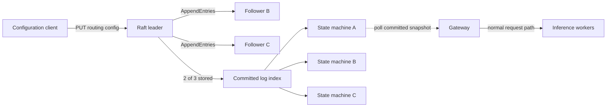
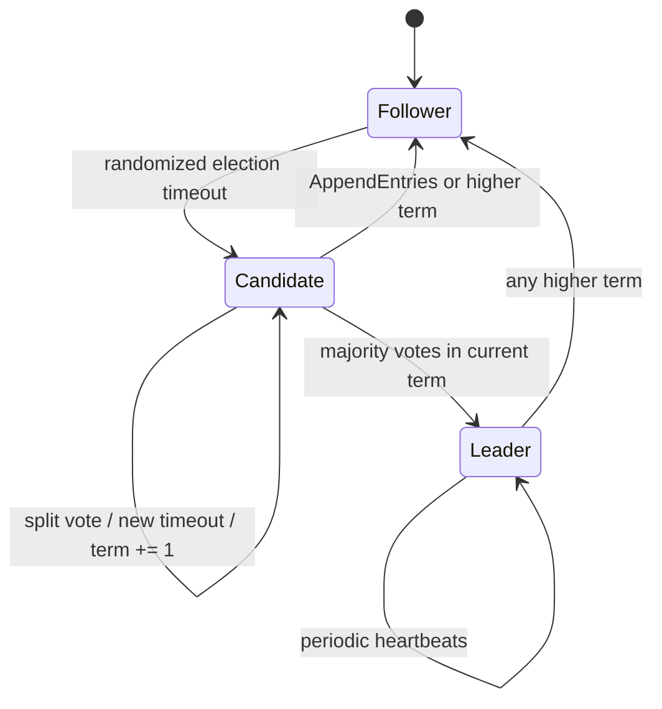
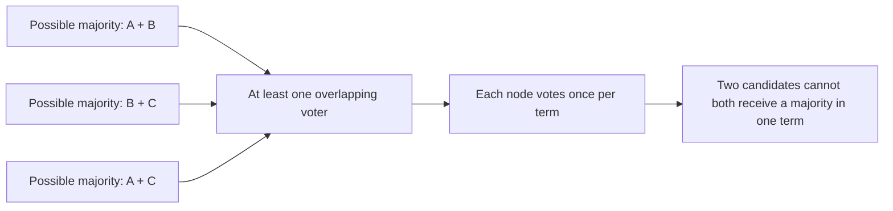
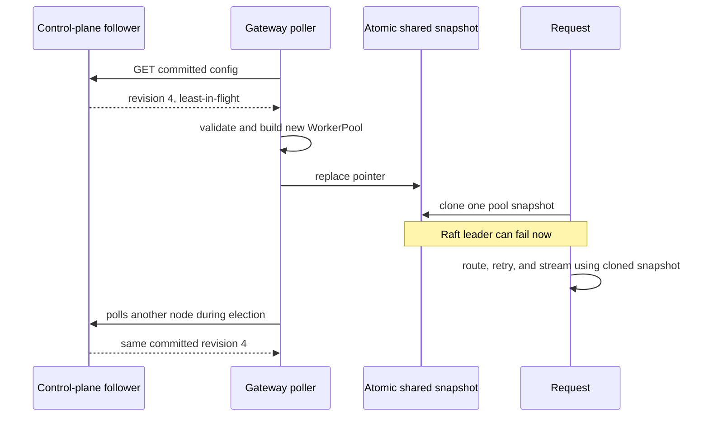
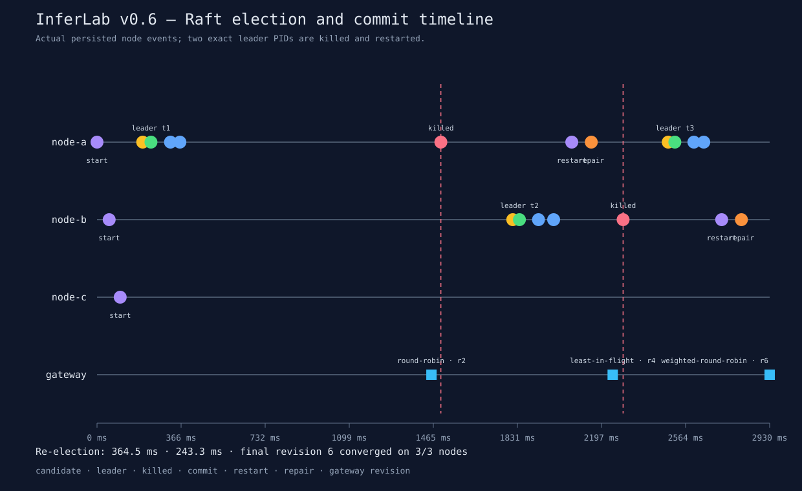

# RFC 0011: Three-node Raft control plane

**Status:** Implemented | **Milestone:** v0.6

## What this RFC decides

RFC means **Request for Comments**: a reviewable engineering decision record.
This RFC decides how InferLab's gateways obtain one authoritative routing
configuration without asking a central process on every inference request.

Raft is not an acronym. It is the name of a consensus algorithm designed to be
understandable by decomposing agreement into leader election, log replication,
and deterministic state-machine application.

## Context

One gateway can read one configuration file. Several gateways create a harder
question:

> If two operators or processes change worker membership and routing policy at
> the same time, which history is authoritative after one configurator dies?

A static primary avoids simultaneous writers until that primary fails. A shared
database moves the agreement problem into the database. Gossip converges
eventually but does not define one committed order.

InferLab needs one durable order of low-frequency configuration changes while
interactive requests continue using the most recent committed snapshot.

## Decision

Add three real Rust `control-plane` processes implementing the Raft core:

1. followers use randomized election deadlines;
2. candidates increment the term, vote for themselves, and send
   `RequestVote`;
3. a majority elects one leader for that term;
4. the leader appends commands and sends `AppendEntries`;
5. followers require matching `prev_log_index` and `prev_log_term`, then repair
   conflicting uncommitted suffixes;
6. the leader commits a current-term entry only after a majority stores it;
7. every node applies committed entries in index order to the same routing
   configuration state machine; and
8. gateways poll any node for committed snapshots, apply only increasing
   revisions, and hold one immutable snapshot for each request.



Raft is never consulted inside `/v1/chat/completions`. The control plane updates
a shared pointer between requests; an already-started request keeps its original
worker-pool snapshot through retries and streaming.

## Configuration state

The replicated command is deliberately narrow:

```json
{
  "routing_policy": "weighted-round-robin",
  "workers": [
    {"id": "worker-a", "base_url": "http://127.0.0.1:9821", "weight": 3},
    {"id": "worker-b", "base_url": "http://127.0.0.1:9822", "weight": 1},
    {"id": "worker-c", "base_url": "http://127.0.0.1:9823", "weight": 1}
  ]
}
```

Worker IDs are unique, weights are positive, URLs are HTTP(S), and the routing
policy must name an implemented gateway policy.

Each committed snapshot exposes:

- `revision`: the Raft log index of the configuration command;
- `term`: the leadership term that created it; and
- the complete routing configuration.

## Roles and terms



A **term** is a monotonically increasing logical epoch. Every RPC carries it.
Seeing a higher term makes a node persist the term, clear its old vote, and
become a follower before responding.

Each node persists `current_term` and `voted_for` before granting a vote.
Therefore it cannot vote for two candidates in one term after a restart.

## Why a majority prevents two leaders

In a three-node cluster every majority contains two nodes:



Two sets of size two drawn from three nodes must overlap. Since the overlapping
node persists one vote per term, both candidates cannot win that term.

This is election safety, not availability. If fewer than two nodes are reachable,
the cluster correctly stops committing writes.

## Election flow

```mermaid
sequenceDiagram
    participant A as Node A
    participant B as Node B
    participant C as Node C
    Note over A: randomized timeout expires
    A->>A: term += 1; vote for A; persist
    A->>B: RequestVote(term, last index, last term)
    A->>C: RequestVote(term, last index, last term)
    B->>B: candidate log is at least as current; persist vote
    B-->>A: vote granted
    C-->>A: vote granted
    A->>A: majority reached; become leader
    A->>A: append no-op entry in new term
    A->>B: AppendEntries heartbeat + no-op
    A->>C: AppendEntries heartbeat + no-op
```

The log-freshness rule compares last term first, then last index. A node refuses
to elect a candidate that is missing entries the voter already has. This is the
bridge between election and log safety.

The no-op entry is important. Once a new leader commits an entry from its own
term, earlier entries replicated on a majority become committed indirectly.

## Log replication and repair

```mermaid
sequenceDiagram
    participant Client
    participant L as Leader
    participant F as Follower
    Client->>L: PUT routing configuration
    L->>L: append entry; persist
    L->>F: AppendEntries(prev index, prev term, entries, leader commit)
    alt follower prefix matches
        F->>F: truncate conflicting uncommitted suffix
        F->>F: append entries; persist
        F-->>L: success + match index
    else prefix does not match
        F-->>L: reject
        L->>L: decrement next index
    end
    Note over L: current-term entry stored on 2 of 3
    L->>L: advance commit index; apply; persist
    L-->>Client: committed configuration
    L->>F: next heartbeat carries leader commit
    F->>F: apply through committed index
```

`append`, `commit`, and `apply` are different:

- **appended** means an entry exists in one node's log;
- **replicated** means other nodes stored it;
- **committed** means a majority plus the current-term rule makes it durable
  across future leaders; and
- **applied** means the deterministic state machine has changed visible
  configuration.

An API success is returned only after commit and application on the leader.
Followers learn the commit index on subsequent `AppendEntries`.

## Current-term commit rule

A leader does not declare an older-term entry committed merely by counting
copies. It advances `commit_index` directly only to an entry from its own term.
Committing that later entry also commits every earlier log position.

This prevents the classic Raft Figure-8 failure where an old entry exists on a
majority but can still be overwritten by a future leader. A focused unit test
verifies that an old-term majority alone returns no commit candidate.

## Persistence

Every node keeps:

```text
current term
voted-for node
ordered log entries
commit index
```

The small v0.6 store writes complete JSON state to a temporary file, calls
`sync_all`, atomically renames it over `state.json`, and syncs the parent
directory. A storage failure poisons the in-memory node: it stops voting,
replicating, and accepting configuration writes until restart and successful
replay.

Committed commands replay deterministically on startup. Volatile role,
leader ID, deadlines, replication indexes, and counters are rebuilt.

Each node also appends a synced diagnostic `events.jsonl` with starts,
campaigns, votes, leadership, commits, step-downs, and log repairs. This trace is
evidence, not consensus state.

## HTTP API

| Method and path | Purpose |
|---|---|
| `POST /raft/request-vote` | Internal RequestVote RPC |
| `POST /raft/append-entries` | Internal heartbeat and replication RPC |
| `GET /v1/control/status` | Role, term, leader, log, commit, state, counters |
| `GET /v1/control/config` | Last locally applied committed configuration |
| `PUT /v1/control/config` | Leader-only configuration proposal |
| `GET /healthz` | Process and storage health |

A follower rejects a write with `409 not_leader` and its last known leader ID.
A write that cannot reach a majority returns `503`; because failure can happen
after replication, the client must treat timeout as ambiguous and read the
committed revision before retrying.

## Gateway integration



Gateways accept only a higher revision. A stale follower cannot roll
configuration backward. Polling tries each configured node, so losing one
control-plane process does not remove the last committed snapshot.

## Invariants

1. A node persists a higher term before responding in it.
2. A node grants at most one candidate vote per term.
3. A candidate with an older log cannot receive a vote from a newer voter.
4. At most one leader can win a given term.
5. Every appended entry has a contiguous index and positive term.
6. Followers accept an entry only after `prev_log_index` and
   `prev_log_term` match.
7. A committed log prefix is never overwritten.
8. Conflict repair changes only an uncommitted suffix.
9. A leader counts itself plus successful follower `match_index` values.
10. Direct commit advancement targets only a current-term entry.
11. State-machine application is ordered and deterministic.
12. A successful configuration write has been committed by a majority.
13. Storage ambiguity makes a node fail closed.
14. Gateways apply revisions monotonically.
15. One request uses one immutable routing snapshot.
16. Raft RPCs never enter the inference request path.
17. Losing one of three nodes preserves write availability; losing two does
    not.

## Alternatives considered

### One static configuration leader

Rejected because the leader becomes a manual failover decision. Raft turns
replacement into a term- and majority-governed protocol.

### Shared file or last-write-wins timestamp

Rejected because concurrent writers, partial visibility, and clock disagreement
do not produce one durable order.

### Gossip

Rejected for authoritative configuration. Gossip is useful for dissemination
and eventually consistent observations, but temporary disagreement is part of
its contract.

### SQLite or PostgreSQL

Reasonable in a production product, but it delegates leader election and
replication to another system. v0.6 implements the mechanism because election,
majority overlap, prefix matching, and commit/application boundaries are the
learning objective.

### etcd, Consul, or ZooKeeper

Deferred. They are mature choices for real deployments. Using one now would
hide precisely the state transitions this milestone intends to expose.

### Raft lookup on every inference request

Rejected categorically. Consensus is a control-plane cost. Gateways serve from
a committed local snapshot so elections do not add request latency or stop
streams.

### Fixed identical election timeout

Rejected because nodes can repeatedly become candidates together and split the
vote. Randomized deadlines break symmetry. The proof uses separate bounded
ranges to keep the demonstration reproducible while each reset remains
jittered.

## Proof

The retained harness starts three loopback control-plane processes, three fake
workers, and a gateway. It then:

1. observes node A win term 1;
2. commits round-robin configuration at revision 2;
3. kills the exact leader child PID;
4. proves six gateway requests complete from revision 2 during the election;
5. observes node B win term 2 after 364.540 ms;
6. commits least-in-flight at revision 4 with only two nodes;
7. restarts A from its old disk state and verifies catch-up;
8. proves the gateway applies revision 4;
9. kills leader B;
10. proves six more gateway requests complete from revision 4;
11. observes A win term 3 after 243.314 ms;
12. commits 3:1:1 weighted round-robin at revision 6 with two nodes;
13. restarts B and verifies all three persistent logs are identical; and
14. sends ten gateway requests and observes the exact 6:2:2 distribution.



| Retained observation | Result |
|---|---:|
| Leadership terms | 3 |
| Leaders | A term 1, B term 2, A term 3 |
| Re-election latencies | 364.540 ms, 243.314 ms |
| Configuration revisions | 2, 4, 6 |
| Final identical logs | 3 of 3 nodes, 6 entries |
| Gateway election traffic | 12 of 12 succeeded |
| Final weighted routing | A=6, B=2, C=2 |
| Machine-readable assertions | 17 of 17 passed |

## Limitations

- This is the Raft safety core, not a production-complete implementation.
- Cluster membership is fixed at three nodes; there is no joint consensus.
- There is no pre-vote, check-quorum, leadership transfer, lease read,
  linearizable `ReadIndex`, or follower forwarding.
- Follower configuration reads may be briefly stale. Gateway revision checks
  prevent rollback but do not make reads linearizable.
- Log repair decrements `next_index` one position at a time instead of returning
  optimized conflict term/index hints.
- There is no snapshot, log compaction, `InstallSnapshot`, or state migration.
- Whole JSON state is rewritten on each persistence boundary; throughput and
  large logs are not goals.
- Client proposals are serialized and not batched or pipelined.
- The gateway rebuilds routing and circuit state on configuration change.
  Requests already in flight safely retain the old pool, but per-worker
  telemetry spans two temporary generations.
- One gateway proves snapshot continuity and refresh; a multi-gateway rollout
  experiment remains future work.
- Selected batch metadata is not yet replicated.
- There is no authentication, authorization, TLS, request deduplication, or
  operator audit identity.
- The proof kills processes, not hosts, disks, or network partitions. It does
  not test asymmetric partitions or delayed/reordered packets.
- Persisting `commit_index` is a deliberate small-system recovery convenience;
  a fuller Raft implementation would persist state-machine/snapshot progress
  separately.

## Reproduce

```bash
./scripts/proof-v0.6.sh
```

To replace the retained evidence:

```bash
INFERLAB_RESULTS_DIR=docs/results/v0.6/raw \
  ./scripts/proof-v0.6.sh
```
