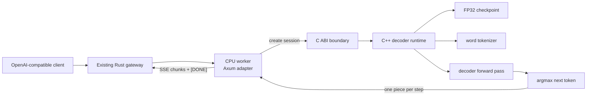
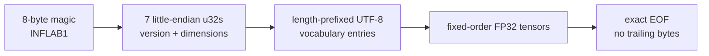
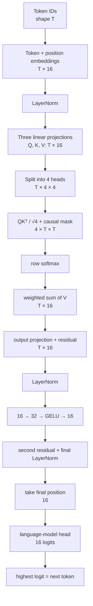
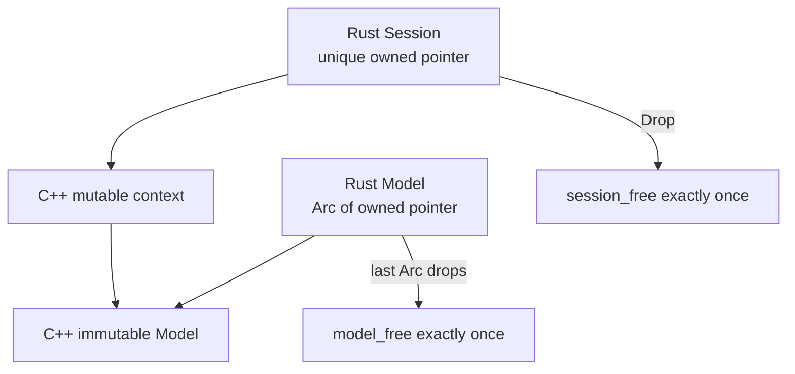
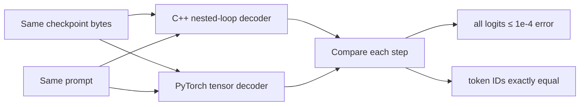

# RFC 0012: Tiny C++ CPU decoder

**Status:** Implemented | **Milestone:** v0.7

## What this RFC decides

RFC means **Request for Comments**: a reviewable engineering decision record.
This RFC selects the first real InferLab model, checkpoint format, tokenizer,
CPU transformer, Rust/C++ boundary, correctness oracle, and streaming behavior.

The decision is deliberately smaller than “serve GPT-2.” v0.7 must make every
inference stage inspectable and independently checkable before v0.8 adds KV
cache and continuous batching.

## Context

The gateway, resilience layer, queue, and control plane previously routed only
deterministic fake-worker text. Replacing the fake worker creates several new
uncertainties at once:

- Are checkpoint bytes interpreted with the right shapes and order?
- Does tokenization produce the same IDs as the reference?
- Are layer normalization, causal attention, GELU, and linear projections
  numerically correct?
- Does greedy decoding choose the same token after small floating-point
  differences?
- Can the existing gateway stream real model tokens without a new protocol?

Starting with a public model would add a large vocabulary, BPE edge cases,
third-party checkpoint conversion, multiple layers, and a large reference
surface before the basic math is trusted.

## Decision

Implement one educational pre-layer-normalized decoder with:

| Property | v0.7 value |
|---|---:|
| Layers | 1 |
| Vocabulary | 16 word tokens |
| Context length | 32 tokens |
| Model dimension | 16 |
| Attention heads | 4 |
| Dimension per head | 4 |
| Feed-forward dimension | 32 |
| Parameters | 3,232 FP32 values |
| Checkpoint size | 13,111 bytes |
| Decoding | Greedy only |

The C++ runtime owns checkpoint loading, tokenization, tensor operations,
transformer forward passes, and autoregressive session state. A small safe Rust
adapter owns Axum HTTP, OpenAI-shaped JSON, SSE framing, and process
configuration. Cargo compiles the C++ translation unit directly with the system
C++20 compiler, so v0.7 needs no CMake or vendored HTTP stack.



The gateway code and worker URL contract do not change. A fake worker and the
real CPU worker both implement `POST /v1/chat/completions` and `GET /health`.

## Checkpoint format

`models/tiny-inferlab-v1.bin` is explicitly committed as the v0.7 educational
fixture. It is not an external downloaded model. Its generator and SHA-256
metadata are committed beside it, and the proof regenerates it byte-for-byte.



The fixed tensor order is:

```text
token embeddings → position embeddings
layer norm 1 → Q, K, V, attention output
layer norm 2 → feed-forward in/out
final layer norm → language-model head
```

The loader rejects a wrong magic, version, layer count, invalid dimension,
duplicate/empty vocabulary token, truncated tensor, non-finite weight, or
trailing byte. Fixed ordering keeps the loader small; version 1 is not intended
as a general model interchange format.

`oracle/generate_tiny_model.py` constructs deterministic weights. Every
transformer tensor is active. Strong columns in the final language-model head
make the untrained educational model emit a readable transition:

```text
InferLab → turns → prompts → into → real → tokens → . → <eos>
```

This is a correctness fixture, not a trained language model or an intelligence
claim.

## Tokenizer decision

The checkpoint stores a narrow word vocabulary and four special tokens:

| ID | Token | Meaning |
|---:|---|---|
| 0 | `<pad>` | Reserved padding token |
| 1 | `<bos>` | Beginning of sequence |
| 2 | `<eos>` | End of sequence |
| 3 | `<unk>` | Any word outside the 16-token vocabulary |

The tokenizer lowercases ASCII alphanumeric words, preserves an apostrophe
inside a word, recognizes a period, and maps everything unknown to `<unk>`.
Long prompts retain `<bos>` plus the newest 31 tokens.

This is enough to test tokenizer parity, special-token termination, prompt
truncation, and detokenization ownership. It is not intended to compete with
BPE, unigram, or production Unicode tokenizers.

## Forward-pass data flow

For `T` input tokens and model dimension `D=16`:



All matrix products are direct nested FP32 loops. Layer normalization uses
population variance and epsilon `1e-5`. GELU uses the tanh approximation.
Attention subtracts each score row's maximum before exponentiation for stable
softmax.

## Causal attention

At position `i`, a token may attend only to positions `0..i`:

| Query position | Key 0 | Key 1 | Key 2 | Key 3 |
|---:|:---:|:---:|:---:|:---:|
| 0 | ✓ | — | — | — |
| 1 | ✓ | ✓ | — | — |
| 2 | ✓ | ✓ | ✓ | — |
| 3 | ✓ | ✓ | ✓ | ✓ |

The mask prevents a training-time position from reading a future answer token.
Although generation supplies only the known prefix, implementing the causal
rule now keeps the forward pass equivalent to the oracle and ready for future
batched prompt evaluation.

## Autoregressive generation

```mermaid
sequenceDiagram
    participant R as Rust HTTP adapter
    participant S as C++ session
    participant M as Immutable model
    R->>S: create(prompt, max_tokens=8)
    S->>S: tokenize + prepend BOS
    loop until EOS or length limit
        R->>S: next_token()
        S->>M: forward(complete current prefix)
        M-->>S: 16 logits
        S->>S: argmax; append selected token
        S-->>R: token ID, text piece, logits, duration
        R-->>R: create one SSE content event
    end
    R-->>R: finish_reason then data: [DONE]
```

One call to `next_token()` performs one complete forward pass. The session owns its
mutable context; the loaded model is immutable and may be shared across
sessions. `<eos>` is recorded in correctness traces but never rendered as user
text.

No KV cache exists yet. Recomputing the complete prefix is intentionally the
baseline that v0.8 must improve without changing tokens.

## Rust/C++ boundary

The C ABI exposes opaque model and session pointers plus fixed caller-owned
buffers. C++ exceptions never cross the boundary; each exported function
catches failures and writes a bounded NUL-terminated error.



Rust marks the immutable model `Send + Sync` and the uniquely owned session
`Send`. Those are the two unsafe claims. The rest of the service uses ordinary
safe Rust.

## HTTP behavior

The real worker supports:

| Method and path | Behavior |
|---|---|
| `GET /health` | Worker ID, request count, model path, and dimensions |
| `POST /v1/chat/completions` with `stream=false` | OpenAI-shaped final JSON |
| `POST /v1/chat/completions` with `stream=true` | Role, one content event per generated token, finish event, `[DONE]` |

The only model name is `inferlab-tiny`. v0.7 accepts omitted temperature or
`temperature: 0`; any other value returns `400 unsupported_sampling` before
streaming begins. `max_tokens` must be between 1 and the 32-token context
length.

## Correctness oracle

`oracle/torch_reference.py` independently parses the same binary file and
implements the forward pass with PyTorch operations. It does not call the C++
runtime or consume C++ golden logits.

For every generation step, the proof compares:

- prompt token IDs;
- all 16 logits;
- greedy token ID;
- decoded piece;
- final text; and
- finish reason.

The logit tolerance is maximum absolute error `≤ 1e-4`. Token IDs and text must
match exactly. A small logit error is acceptable because C++ loops and PyTorch
kernels can accumulate FP32 sums in different orders; selecting a different
argmax is never acceptable.



## Invariants

1. The loader consumes exactly one valid version-1 checkpoint.
2. Dimensions are positive, one layer is present, and `dimension % heads = 0`.
3. Vocabulary strings are non-empty and unique after ASCII lowercasing.
4. Every loaded FP32 value is finite.
5. Token IDs remain inside the vocabulary.
6. Every sequence begins with `<bos>`.
7. Context never exceeds 32 tokens.
8. Every attention query reads only its current or earlier key positions.
9. Stable softmax subtracts the row maximum before exponentiation.
10. Residual operands have identical shapes.
11. One `next_token()` call selects at most one token.
12. Greedy selection uses the maximum logit with deterministic first-index
    tie-breaking.
13. `<eos>` stops generation and is not exposed as content.
14. A length limit stops generation with `finish_reason="length"`.
15. Each visible generated token becomes exactly one SSE content event.
16. `[DONE]` appears only after the finish event.
17. C++ exceptions never cross the C ABI.
18. Model ownership is shared and immutable; session ownership is unique.
19. The gateway sees the same worker protocol as it saw for fake workers.
20. C++ and PyTorch greedy token IDs must match exactly for accepted fixtures.

## Alternatives considered

### Start with GPT-2 and its BPE tokenizer

Deferred. It is a recognizable model, but it couples basic tensor debugging to
50,000-token logits, BPE merges, checkpoint conversion, many layers, and much
larger evidence. The tiny format establishes the oracle discipline first.

### Use LibTorch inside C++

Rejected for the reference runtime. LibTorch would make serving easier but hide
the matmul, layer normalization, attention, softmax, and GELU loops this
milestone exists to expose. PyTorch remains the independent oracle.

### Export ONNX and use an inference engine

Rejected for the same reason. It would validate engine integration rather than
the project's implementation of decoder mechanics.

### Implement the HTTP server in C++

Rejected. HTTP parsing, chunking, JSON, and socket lifecycle are not v0.7
learning goals. The Rust adapter reuses the proven Axum contract while C++ owns
all model behavior.

### Run a C++ command as a subprocess per token

Rejected because process startup, serialization, cancellation, and model reload
would dominate this tiny model and obscure session ownership.

### Compare only final generated text

Rejected. Matching text can hide large incorrect logits when argmax happens to
stay the same. Full-vector comparison localizes the first divergent step.

### Use handwritten expected logits

Rejected as the only oracle. A copied expected vector can reproduce the same
implementation mistake. PyTorch expresses the calculation independently.

### Train the tiny model

Deferred. Training introduces optimizer, dataset, convergence, and checkpoint
questions outside inference scope. Deterministic transition-shaped output makes
protocol demonstrations readable without claiming language ability.

### Add KV cache immediately

Rejected for v0.7. A cache changes tensor shapes and state ownership. First
prove the recomputing reference; v0.8 must preserve its exact tokens while
changing the work performed per step.

## Retained proof

The proof:

1. builds the Rust workspace and C++ runtime;
2. regenerates the committed checkpoint and requires byte identity;
3. runs three prompts through C++ and PyTorch for 31 warm repetitions;
4. compares all logits and greedy tokens for eight steps per prompt;
5. starts the real CPU worker behind the unchanged Rust gateway;
6. injects 12 ms token pacing so incremental delivery is observable;
7. timestamps seven content events, the finish event, and `[DONE]`;
8. checks the equivalent non-streaming response; and
9. renders the retained result chart from raw JSON.


| Retained observation | Result |
|---|---:|
| Checkpoint SHA-256 | `654bf3f75f3f8bcdd4d2f26c62867408903184e30d492ddb863a2e388224e22c` |
| Prompts compared | 3 |
| Logit values compared | 384 |
| Greedy token mismatches | 0 |
| Maximum absolute logit error | `4.1975708e-06` |
| Acceptance limit | `1e-4` |
| Average C++ median generation | 50.222 µs |
| Average PyTorch median generation | 438.208 µs |
| Gateway TTFT with pacing | 18.912 ms |
| Seven-token stream span | 83.462 ms |
| Machine-readable assertions | 18 / 18 passed |

The latency comparison is descriptive only. A 3,232-parameter micro-model
mostly measures framework and call overhead; it does not establish that this
runtime is faster than PyTorch for useful models.

## Limitations

- The weights encode readable deterministic transitions; they are not trained.
- The 16-token ASCII-oriented word tokenizer maps most language to `<unk>`.
- There is one layer, 16 dimensions, four heads, and a 32-token context.
- Only FP32 and greedy decoding are implemented.
- There is no KV cache, batching, SIMD, threading, BLAS, memory mapping, or
  quantization.
- Every token recomputes the complete visible prefix.
- C++ inference currently runs synchronously when the Rust stream is polled.
  That is safe only because the educational model is tiny; real compute must
  use a dedicated scheduler/thread pool.
- The fixed-order binary checkpoint lacks per-tensor names, independent dtypes,
  alignment, compression, sharding, and forward compatibility beyond its
  version field.
- Prompt truncation is simplistic and preserves only `<bos>` plus the newest
  tokens.
- PyTorch parity covers three deterministic prompts, not randomized shapes,
  long contexts, Unicode, or a broad corpus.
- The proof runs on one Apple ARM64 host and loopback networking.
- Pacing is deliberately injected to make SSE increments observable; it is not
  model latency.
- There is no cancellation signal propagated into an in-progress C++ forward
  pass.
- There is no model hot reload, multiple-model registry, authentication, or
  resource accounting.

## Reproduce

Install PyTorch 2.2.2 or a compatible CPU build in an isolated Python
environment, then:

```bash
INFERLAB_ORACLE_PYTHON=.tools/v0.7-python/bin/python \
  ./scripts/proof-v0.7.sh
```

To replace retained evidence:

```bash
INFERLAB_ORACLE_PYTHON=.tools/v0.7-python/bin/python \
INFERLAB_V07_OUTPUT_DIR=docs/results/v0.7/raw \
  ./scripts/proof-v0.7.sh
```
