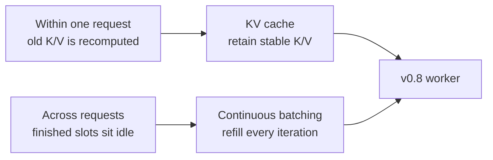
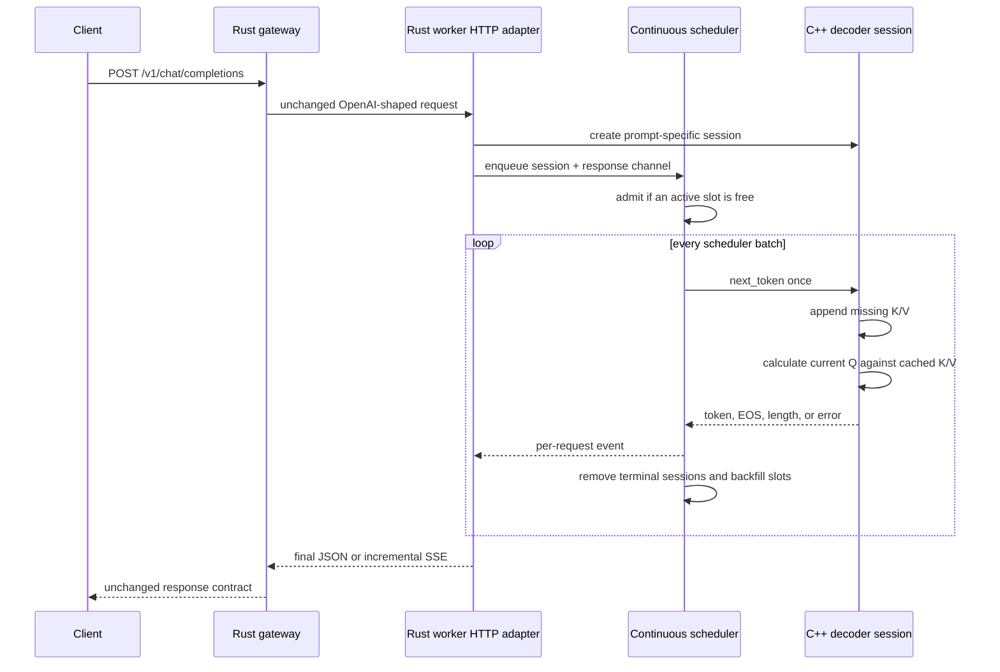
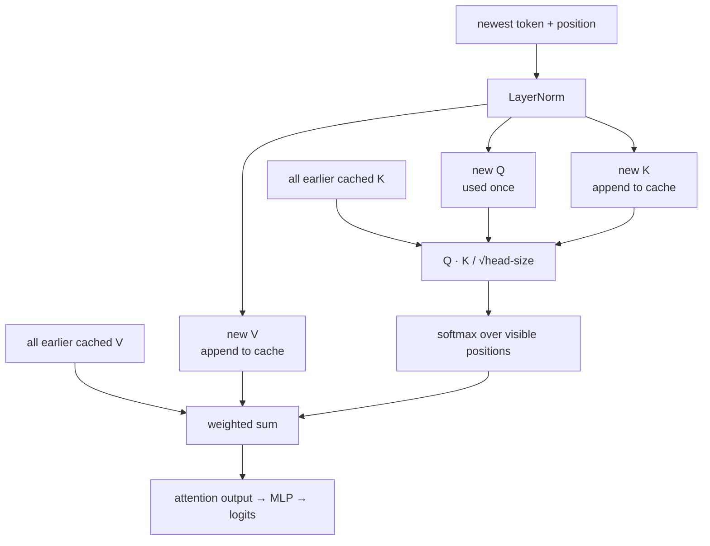
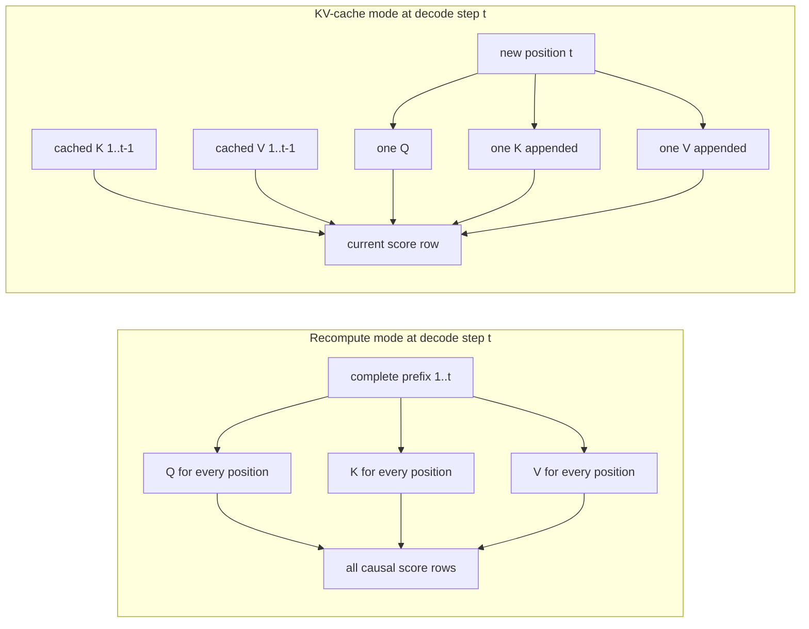
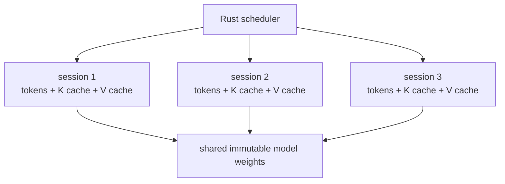
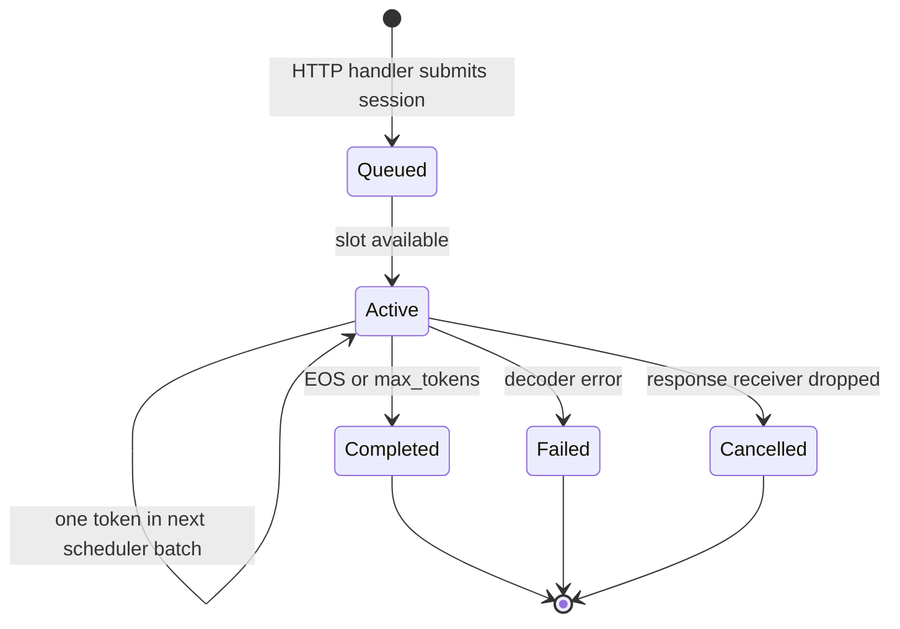
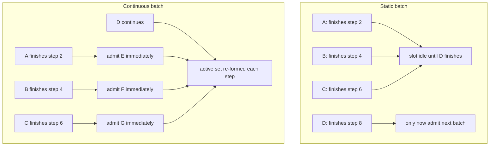

# RFC 0013: KV cache and continuous batching

**Status:** Implemented | **Milestone:** v0.8

## What “RFC” means

RFC is short for **Request for Comments**. In this repository an RFC is a
reviewable engineering decision record: it states the problem, the chosen
design, rejected alternatives, measurable evidence, and known limitations.
“Request” does not mean the feature is hypothetical forever. The status above
says this decision has now been implemented.

This RFC decides two related but separate changes:

1. the C++ decoder retains each token's attention keys and values instead of
   projecting the complete prefix again; and
2. one Rust worker scheduler advances several independent sessions one token
   per iteration, removes finished sessions, and immediately fills empty slots.

The first change reduces redundant work inside one request. The second keeps
serving slots useful across several requests. Their correctness and performance
claims are deliberately proved separately.

## Context

v0.7 established an exact reference path. To generate every new token it ran a
complete transformer forward pass over the current prefix:

```text
step 1: project tokens 1..4
step 2: project tokens 1..5
step 3: project tokens 1..6
...
step 8: project tokens 1..11
```

Earlier token representations do not change, so repeating their key and value
projections is waste. Independently, handling one sequence at a time leaves
capacity unused whenever several requests could make progress together. A
fixed batch is not enough: short members finish while the longest member keeps
their places occupied.



## Goals

- Preserve v0.7 prompt IDs, every logit, greedy token, text piece, and finish
  reason.
- Make recomputation and KV-cache modes selectable against the same checkpoint.
- Expose deterministic counters for projected tokens, attention scores, cache
  bytes, and cache rebuilds.
- Bound the worker's active set and waiting queue.
- Advance each active request at most once per scheduler batch.
- Remove terminal or cancelled requests and admit waiting work immediately.
- Compare one-slot and four-slot HTTP behavior at concurrency 1, 2, 4, and 8.
- Keep the OpenAI-shaped gateway and SSE contract unchanged.

## Non-goals

- Paged allocation, block tables, prefix sharing, reference counts, eviction,
  and copy-on-write belong to v0.9.
- The active sessions do not form one vectorized tensor or batched matrix
  multiplication. The scheduler calls the C++ session API once per active
  sequence.
- This is not a GPU, production-model, or useful-model performance claim.
- Priority, preemption, fairness classes, distributed scheduling, and admission
  by predicted token cost are not implemented.
- Sampling remains deferred to v0.10.

## End-to-end decision



The loaded `Model` remains immutable and shared. Every request owns one mutable
`Session`, including its token context and cache vectors. The scheduler owns
active sessions while they run; the HTTP handler owns only a receiving channel.

## KV-cache decision

### What is cached

Attention creates three projections:

```text
Q = normalized_hidden × Wq
K = normalized_hidden × Wk
V = normalized_hidden × Wv
```

The current token needs a new query because it asks a new question. Keys and
values for earlier tokens are stable, so the session stores them. It does not
cache attention probabilities: those depend on the current query and must be
recalculated.



### Recompute versus cache



The v0.7 `Model::forward` function remains in the code as the selectable
`recompute` oracle. The new `forward_cached` path calculates only the final
position's query, attention result, residuals, MLP, final normalization, and
logits. `append_key_value` projects any context positions not already cached.

### Cache layout and ownership

Each session owns two contiguous FP32 vectors:

```text
key_cache   [position 0: D floats][position 1: D floats]...
value_cache [position 0: D floats][position 1: D floats]...
```

For `T` positions, model dimension `D`, and four bytes per FP32 value:

```text
cache bytes = 2 × T × D × 4
```

The retained request has `T=11` cached positions and `D=16`, so its peak is
`2 × 11 × 16 × 4 = 1,408` bytes. Real multi-layer models multiply this by the
layer count and usually by many more dimensions and sequences.



No cache pointer is shared between sessions. Dropping a Rust session frees its
C++ context and both cache vectors exactly once.

### Context sliding

Position embeddings depend on token position. If a full context drops its
oldest token, every remaining token moves to a new position. v0.8 takes the
simple correct action: clear both cache vectors, increment `cache_rebuilds`, and
recreate entries on the next step. Incremental shifting or position-independent
reuse is deferred.

### Work counters

The C++ session reports:

| Counter | Meaning |
|---|---|
| `query_tokens` | Token positions for which Q was projected |
| `kv_tokens` | Token positions for which both K and V were projected |
| `attention_score_elements` | Scalar query-key scores evaluated across all heads |
| `cache_bytes` | Current K plus V allocation used by logical entries |
| `peak_cache_bytes` | Largest logical cache size during the session |
| `cache_rebuilds` | Full invalidations caused by context sliding |

These are deterministic algorithmic counters, not estimates from wall time.
For prefix lengths 4 through 11 and four heads:

| Work | Recompute | KV cache | Reduction |
|---|---:|---:|---:|
| Query token projections | 60 | 8 | 86.7% |
| K/V token projections | 60 | 11 | 81.7% |
| Attention score elements | 1,104 | 240 | 78.3% |
| Peak KV bytes | 0 | 1,408 | deliberate memory cost |

The cache trades memory for less repeated computation. It does not make
attention constant-time: the newest query must still compare with every visible
key, so decode attention work grows linearly with context length.

## Continuous-batching decision

### Scheduler state machine



The worker starts one scheduler task with:

- a bounded multi-producer/single-consumer submission channel;
- an active vector capped by `max_batch_size`;
- one response channel per request; and
- a bounded 1,024-event diagnostic trace.

For each scheduler batch it applies the optional batch delay once, calls
`next_token` once for every active session, delivers events, removes terminal
sessions, and fills all freed slots from the waiting queue.

### Static versus continuous batches



“Batch” here means a scheduling group, not a single fused tensor operation.
That distinction prevents the retained throughput experiment from claiming a
kernel speedup that the implementation does not contain.

### Backpressure, cancellation, and errors

- Submission uses `try_send`; a full bounded queue returns HTTP 429 instead of
  allocating without limit.
- A closed scheduler returns HTTP 503.
- Dropping a streaming response closes its receiver. The scheduler observes
  that at the next event boundary, records cancellation, and frees the slot.
- C++ failures become a per-request scheduler error; other active sessions
  continue.
- Cancellation cannot interrupt the middle of a synchronous C++ token step.

### Observability

`GET /health` and `GET /internal/scheduler` expose:

- configured batch and queue capacity;
- queued, active, and maximum-active counts;
- admitted, completed, cancelled, and failed totals;
- scheduler batches and token steps;
- used versus available slot-iterations and utilization; and
- a bounded event trace with batch, request ID, event, token index, active
  count, queue depth, and monotonic timestamp.

Generation responses also include `inferlab.generation` with the decoder mode
and KV work counters. These fields are experimental InferLab metadata outside
the OpenAI compatibility fields.

## Configuration

| Environment variable | Default | Meaning |
|---|---:|---|
| `INFERLAB_CPU_DECODER_MODE` | `kv-cache` | `recompute` or `kv-cache` |
| `INFERLAB_CPU_MAX_BATCH_SIZE` | `4` | Maximum active sessions |
| `INFERLAB_CPU_SCHEDULER_QUEUE_CAPACITY` | `64` | Waiting submissions |
| `INFERLAB_CPU_BATCH_TICK_MS` | `0` | Optional delay once per scheduler batch |

`INFERLAB_CPU_TOKEN_DELAY_MS` remains a compatibility fallback for the renamed
batch-delay variable.

## Invariants

1. Recompute and KV modes use the same immutable weights and tokenizer.
2. A cache contains exactly one K row and one V row per represented position.
3. Cache rows use the same position IDs as the current context.
4. A cached decode step projects exactly one current query.
5. The current query attends to every and only visible cached key.
6. Stable softmax and all post-attention operations match recompute mode.
7. Context sliding invalidates position-dependent cache rows before reuse.
8. One session and its caches have one mutable owner.
9. Active sessions never exceed `max_batch_size`.
10. Waiting submissions never exceed the bounded channel capacity.
11. Every active session advances at most once in a scheduler batch.
12. A terminal session is removed before the next batch.
13. Freed slots are filled from queued work before another batch begins.
14. A failed or cancelled request does not terminate unrelated sessions.
15. The scheduler trace remains bounded.
16. HTTP and SSE compatibility fields remain unchanged.

## Alternatives considered

### Delete the recomputing forward pass

Rejected. Keeping it selectable gives the optimization a close, deterministic
oracle and makes every work-counter difference inspectable.

### Cache complete hidden states instead of K and V

Rejected. Attention consumes projected keys and values. Caching only hidden
states still repeats K/V projection; caching all hidden intermediates uses more
memory without removing the essential current-query lookup.

### Cache attention scores or softmax probabilities

Rejected. They depend on the current query, which changes each decode step.

### Allocate maximum context-sized cache buffers up front

Rejected for this milestone. Growing contiguous vectors show actual use and
avoid reserving unused logical capacity. Their fragmentation and movement costs
motivate v0.9's page allocator.

### Implement paged KV memory at the same time

Deferred. First prove the semantic cache and scheduler. Adding block tables,
reference counts, sharing, eviction, and copy-on-write simultaneously would
make a parity failure harder to localize.

### Use fixed static batches

Rejected. Mixed generation lengths leave finished members occupying slots
until the longest member ends—the exact utilization problem being studied.

### Spawn an independent async generation loop per HTTP request

Rejected. Independent loops provide concurrency but no central admission bound,
no explicit active-slot capacity, no per-iteration batch view, and no place to
backfill or later form a vectorized batch.

### Put the scheduler in C++

Deferred. Rust already owns async HTTP cancellation and bounded channels; C++
owns numeric session state. The narrow `next_token` boundary makes scheduling
behavior testable now. A future tensor batch API may move more of the iteration
into C++ without changing request lifecycle ownership.

### Claim throughput from algorithmic counters alone

Rejected. Counters prove less decoder work, not end-to-end capacity. v0.8 also
runs real HTTP load and retains latency and throughput at four concurrency
levels.

## Retained proof


The proof runs three prompts through recompute mode, KV-cache mode, and the
independent PyTorch oracle. It then starts two otherwise identical workers: a
one-slot baseline and a four-slot continuous scheduler. Each has an injected
3 ms delay once per scheduler batch, and both receive 24 mixed-length HTTP
requests at concurrency 1, 2, 4, and 8. A separate eight-request burst retains
the exact backfill trace. Finally, the four-slot worker streams through the
existing gateway.

| Retained observation | Result |
|---|---:|
| Recompute/cache maximum logit error | `0` |
| Cache/PyTorch maximum logit error | `4.1975708e-06` |
| Greedy token mismatches | 0 |
| Query projection reduction | 86.7% |
| K/V projection reduction | 81.7% |
| Attention-score reduction | 78.3% |
| Concurrency-8 one-slot throughput | 37.843 requests/s |
| Concurrency-8 four-slot throughput | 135.318 requests/s |
| Concurrency-8 throughput ratio | 3.576× |
| Concurrency-8 one-slot p95 | 212.439 ms |
| Concurrency-8 four-slot p95 | 69.003 ms |
| Machine-readable assertions | 16 / 16 passed |

The 3 ms delay is controlled scheduler instrumentation. Paying it once per
scheduler batch models a shared iteration cost and makes slot sharing visible.
The result proves scheduler behavior under that declared workload; it does not
claim that sequential per-session C++ loops are a vectorized production kernel.

## Limitations

- The model is still one layer, dimension 16, vocabulary 16, and context 32.
- Because this fixture has one decoder layer, its K/V rows derive directly from
  normalized embeddings. A multi-layer model needs a separate cache per layer
  produced after all preceding layers.
- Cache vectors are contiguous per session; growth can reallocate and copying
  prevents page sharing.
- Context sliding rebuilds the complete cache.
- There is no page allocator, fragmentation metric, prefix cache, eviction,
  reference count, copy-on-write, or cross-request cache ownership.
- The scheduler groups sessions but does not construct padded/ragged tensors or
  call a vectorized batched C++ kernel.
- C++ token calculation runs synchronously inside the scheduler's Tokio task.
  This is acceptable only for the micro-model and can block that executor
  thread during a token step.
- `swap_remove` makes active-vector order unstable; every active session still
  receives one step per batch, but there is no priority or age guarantee.
- Queue admission is request-count based, not token-cost or memory based.
- Cancellation is recognized only between token steps.
- The diagnostic trace is bounded and not a durable audit log.
- Load runs use loopback, one Apple ARM64 host, one process per worker, and
  injected batch pacing.
- The workload has deterministic lengths 2/4/6/8 and does not represent a real
  production length distribution.
- No claim is made about GPU occupancy, useful-model tokens per second, energy,
  multi-host scaling, or quality.

## Reproduce

```bash
INFERLAB_ORACLE_PYTHON=.tools/v0.7-python/bin/python \
  ./scripts/proof-v0.8.sh
```

To replace retained evidence:

```bash
INFERLAB_ORACLE_PYTHON=.tools/v0.7-python/bin/python \
INFERLAB_V08_OUTPUT_DIR=docs/results/v0.8/raw \
  ./scripts/proof-v0.8.sh
```
