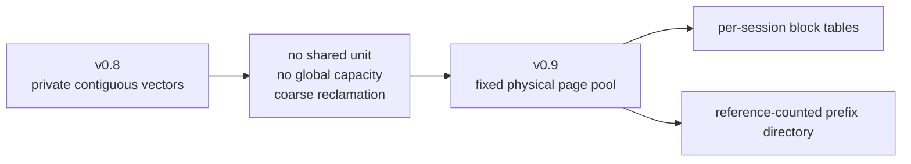
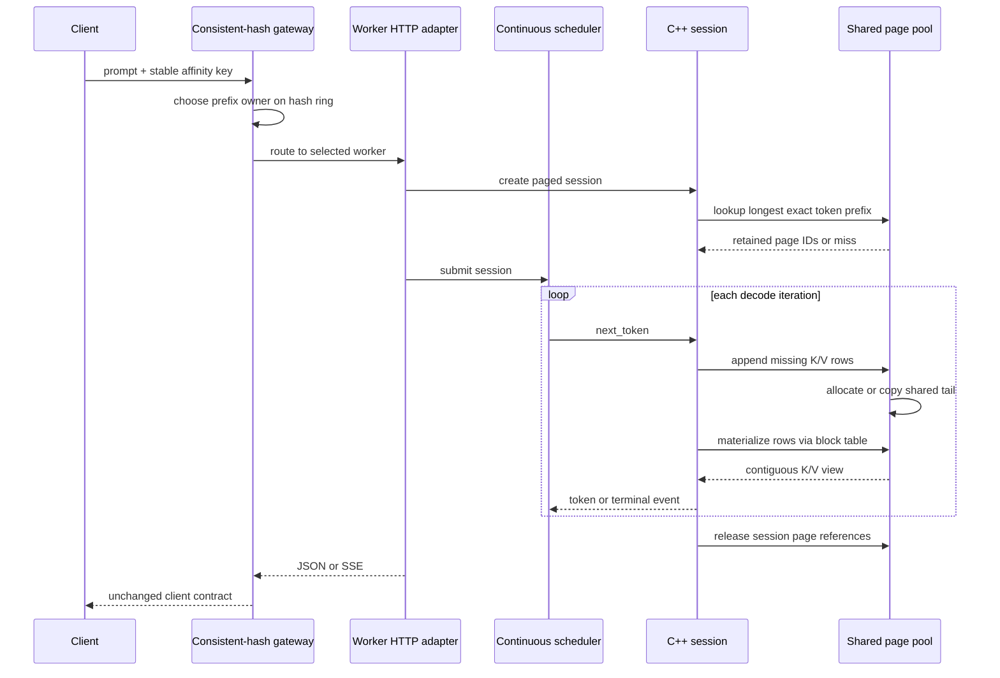
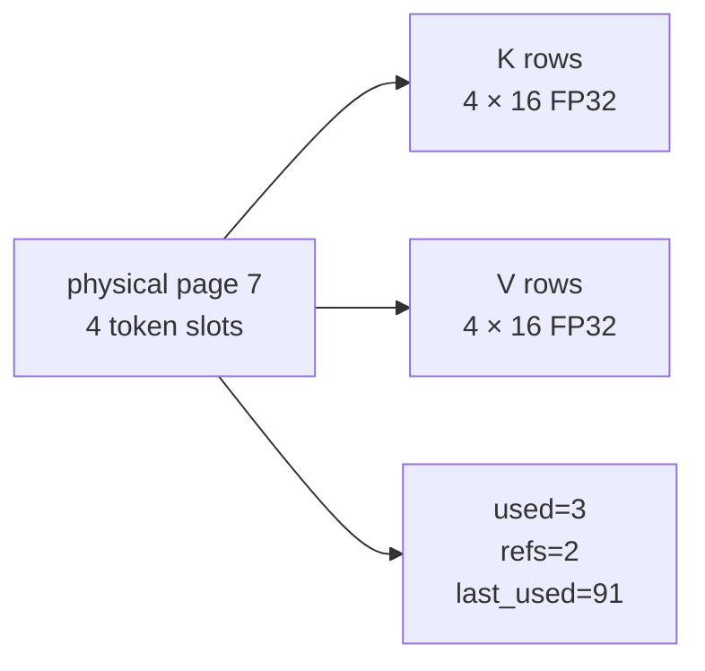
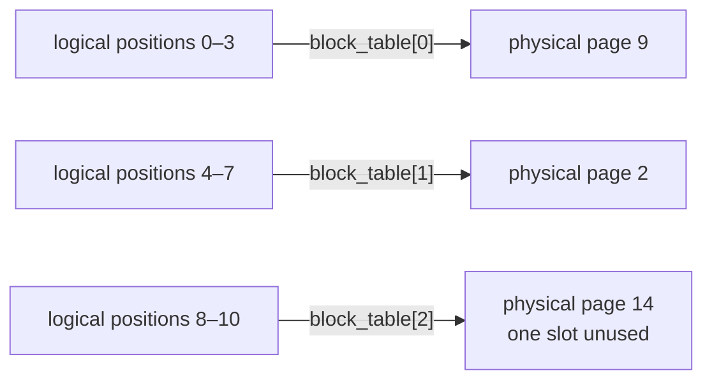
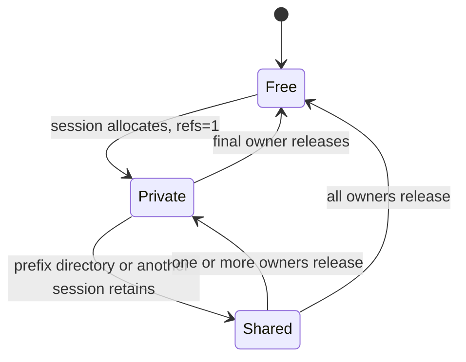
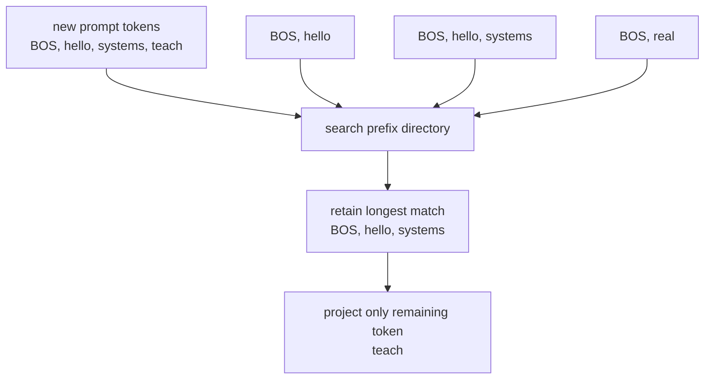
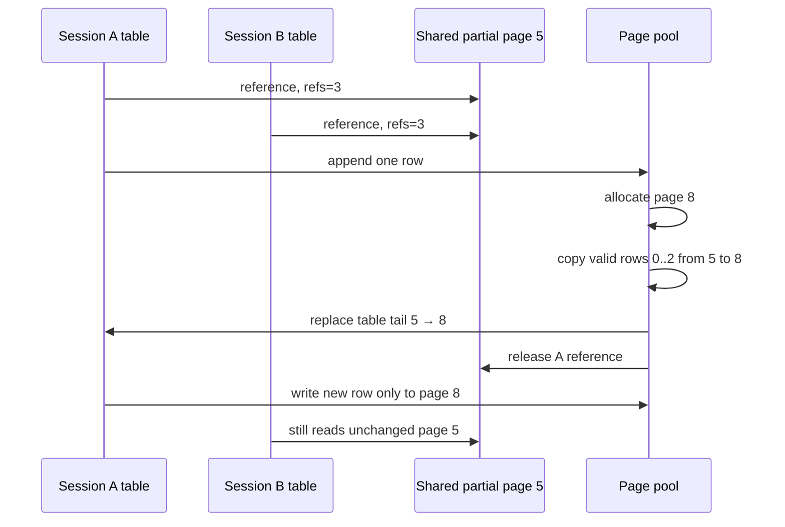
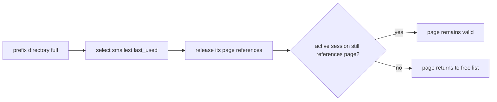
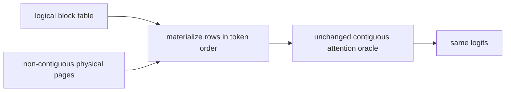
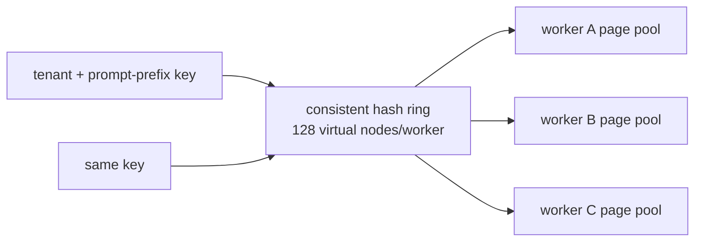

# RFC 0014: Paged KV cache and prefix ownership

**Status:** Implemented | **Milestone:** v0.9

## What this RFC decides

RFC means **Request for Comments**: a reviewable engineering decision record.
RFC 0013 established which key/value rows are correct. This RFC changes where
those rows live and who may own them without changing any decoder result.

v0.9 decides to:

1. divide the worker's KV capacity into fixed-size physical pages;
2. give every session a logical-to-physical block table;
3. retain page ownership with reference counts;
4. keep prompt-prefix entries in an LRU directory;
5. reuse the longest exact token prefix found on the selected worker;
6. copy a shared partial page before a session appends to it;
7. evict inactive prefix ownership before rejecting an allocation; and
8. use the gateway's existing consistent-hash affinity to keep repeat prefixes
   on the worker that owns their pages.

The contiguous v0.8 cache remains selectable as the layout oracle.

## Context

The v0.8 session owns two growable arrays:

```text
session K: [token 0][token 1][token 2]...
session V: [token 0][token 1][token 2]...
```

That layout proves caching semantics, but it gives the server no reusable unit
smaller than a complete session allocation. It cannot express these operations
safely:

- give two requests the same stored prompt rows;
- free one region while retaining unrelated rows;
- cap total dynamic memory with a fixed pool;
- reclaim inactive cached prefixes under pressure; or
- fork a partially filled shared block without corrupting another request.

Reserving the maximum 32-token context for every short request wastes capacity.
Growing every session independently avoids that reservation but still provides
no global bound, sharing, or stable physical ownership.



## Goals

- Preserve all contiguous-cache logits and greedy tokens exactly.
- Allocate only enough pages for the current sequence length.
- Bound physical KV capacity independently of request count.
- Reclaim every page when its final owner releases it.
- Share cached prompt rows across sessions without copying.
- Make mutations private through copy-on-write.
- Evict least-recently-used prefix entries without invalidating active sessions.
- Reuse the longest cached token prefix, not only an exact full-prompt match.
- Expose capacity, utilization, fragmentation, references, sharing savings,
  prefix hits, copy-on-write, evictions, and allocation failures.
- Demonstrate stable consistent-hash ownership and bounded topology remapping.

## Non-goals

- The attention loop is not page-aware. v0.9 materializes logical rows into
  temporary contiguous vectors before calling the unchanged correctness kernel.
- Pages do not span model layers because the educational checkpoint has one
  layer. A production decoder needs a page layout for every layer's K and V.
- No GPU block manager, device memory, DMA, kernel fusion, or PagedAttention
  kernel is implemented.
- No cross-worker page transfer or distributed cache coherence exists.
- Prefix entries are process-local and disappear when the worker restarts.
- Admission still counts requests rather than predicting their page demand.

## End-to-end decision



The gateway owns placement between workers. The C++ pool owns physical pages
inside one worker. A session owns a block table, not the page storage itself.

## Page geometry

The default educational configuration is:

| Property | Default |
|---|---:|
| Tokens per page | 4 |
| Physical page count | 64 |
| Prefix directory capacity | 32 entries |
| Model dimension | 16 |
| Bytes per K/V token row | `2 × 16 × 4 = 128` |
| Bytes per physical page | `4 × 128 = 512` |
| Total pool capacity | `64 × 512 = 32,768` bytes |

Each physical page contains separate fixed-size K and V arrays, current valid
slot count, reference count, and a monotonic last-use clock.



Page size is configurable from 1 through the model context length. Smaller
pages reduce unused tail slots but create longer block tables and more allocator
metadata. Larger pages reduce table entries but increase internal
fragmentation.

## Logical block tables

A sequence's logical token position is translated in two steps:

```text
logical block = token_position / page_tokens
slot          = token_position % page_tokens
physical page = block_table[logical block]
```

Example with four tokens per page:



The physical page IDs need not be adjacent. Freeing another sequence does not
create a hole inside this sequence's logical address space; its table continues
to name the same pages.

The retained eleven-token generation uses three pages. Its logical data is
1,408 bytes. Three physical pages reserve 1,536 bytes, so one unused token slot
contributes 128 bytes of internal fragmentation.

## Allocation and reclamation

The pool begins with every page ID on a free list. Allocating a page:

1. evicts LRU prefix entries while the free list is empty;
2. fails with `paged KV cache capacity exhausted` if no inactive ownership can
   release a page;
3. removes one ID from the free list;
4. resets its used slot count; and
5. creates one reference for the requesting session.

Releasing decrements the reference count. A page returns to the free list only
when the count reaches zero.



The allocator never silently exceeds configured capacity. Capacity exhaustion
is a request-local inference error; unrelated active sessions remain intact.

## Reference ownership

Every reference has a named owner:

| Owner | Why it retains a page |
|---|---|
| Session block table | The active request must read or append its logical KV rows |
| Prefix directory entry | Future requests may reuse the retained prompt rows |

The free list is not a reference owner. A page on the free list has reference
count zero and no valid rows.

The same page can appear in several prefix entries when a longer prefix extends
a shorter one. It can also appear in several live session block tables. The
pool counts each ownership edge; eviction removes only the directory edge.

## Prefix publication and lookup

When a paged session finishes constructing its initial prompt rows, it publishes
the prompt token vector and the required page IDs. Prefix keys are complete
token vectors, not an unchecked hash, so hash collision cannot cause numeric
state from a different prompt to be reused.

On session creation the pool scans the bounded directory for the longest entry
that is an exact prefix of the new prompt:



A hit increments every selected page's reference count before the session can
use it. The session reports `prefix_tokens_reused`; only missing prompt or
generated positions increment its `kv_tokens` work counter.

## Copy-on-write

Sharing is safe while every owner only reads. A partial final page becomes
dangerous when a session appends into its unused slot: another session or the
prefix directory would observe the mutation.



If allocation pressure evicts the final directory owner and the requesting
session becomes the page's only reference, copying is unnecessary; the session
may safely append in place. Otherwise the pool copies exactly the valid tail
rows, swaps one block-table entry, releases the old reference, and records a
copy-on-write event.

## LRU prefix eviction

The prefix directory has its own entry limit. Lookups and publications advance
a monotonic clock. Publishing at the limit or allocating without a free page
removes the least-recently-used entry and releases all references it owned.



Eviction removes future reuse, not live correctness. Re-requesting an evicted
prefix is a cache miss and recomputes its rows.

## Attention boundary

The memory manager is deliberately implemented before a page-aware kernel. For
each v0.9 decode step:

1. the block table is validated;
2. valid page rows are copied in logical order into temporary contiguous K and
   V vectors; and
3. the unchanged v0.8 `forward_cached` attention path consumes them.



This extra copy is not a speed optimization. It isolates memory-manager
correctness from a future page-aware attention kernel. Timing is retained only
as a descriptive observation; layout parity and allocator invariants are the
v0.9 acceptance evidence.

## Gateway prefix ownership

The gateway already supports consistent-hash routing. Its affinity key is:

- `x-inferlab-cache-key` when explicitly supplied; otherwise
- canonical JSON containing model and messages, excluding delivery/sampling
  fields that do not change the prompt prefix.



Stable routing does not itself validate cache contents. The worker independently
matches exact prompt token vectors. The routing key is placement policy; the
token vector is the correctness identity.

When a worker is added, only keys whose clockwise owner changes should move.
Existing workers must not exchange keys with each other. Moved prefixes are
cold on the new owner until repopulated; unchanged keys preserve affinity.

## Configuration

| Environment variable | Default | Meaning |
|---|---:|---|
| `INFERLAB_CPU_DECODER_MODE` | `paged-kv-cache` | `recompute`, `kv-cache`, or `paged-kv-cache` |
| `INFERLAB_CPU_KV_PAGE_TOKENS` | 4 | Token rows per physical page |
| `INFERLAB_CPU_KV_PAGE_COUNT` | 64 | Fixed physical page capacity |
| `INFERLAB_CPU_PREFIX_CACHE_CAPACITY` | 32 | Maximum retained token-prefix entries; zero disables publication |
| `INFERLAB_CPU_MAX_BATCH_SIZE` | 4 | Maximum active sessions |
| `INFERLAB_CPU_SCHEDULER_QUEUE_CAPACITY` | 64 | Waiting request bound |

Paged configuration is applied before the Rust model handle is cloned into
worker state or sessions. Reconfiguration after sharing is rejected by the Rust
ownership wrapper.

## Metrics

`GET /internal/cache` and worker health expose:

| Metric group | Fields |
|---|---|
| Geometry | page tokens/count/bytes, pool capacity, prefix capacity |
| Allocation | allocated/free pages, allocated and used token slots |
| Fragmentation | internal fragmentation bytes, page fill percent, capacity utilization |
| Ownership | live references, shared pages, maximum reference count |
| Sharing | logical referenced bytes, physical used bytes, bytes saved by sharing |
| Prefix | entries, hits, misses, reused tokens, hit rate |
| Mutation/reclaim | copy-on-write copies, evictions, allocation failures |

Each generation also reports its logical cache bytes, reserved page bytes,
page count, shared pages, tail fragmentation, prefix hit, reused tokens, and
copy-on-write count.

## Invariants

1. A free page has zero references and no valid rows.
2. An allocated page has at least one reference.
3. Reference counts never underflow.
4. An active block-table page ID names an allocated page.
5. Block-table length equals `ceil(cached_tokens / page_tokens)`.
6. Every logical token position maps to a valid used physical slot.
7. A session owns one reference for every page ID in its table.
8. A prefix entry owns one reference for every page ID it retains.
9. A page returns to the free list exactly when its final reference releases.
10. Allocated pages never exceed configured page count.
11. A shared partial page is never mutated in place.
12. Copy-on-write preserves all previously valid rows exactly.
13. Eviction removes directory ownership without invalidating session ownership.
14. Prefix reuse requires exact token-vector prefix equality.
15. A hit retains page references before returning them to the new session.
16. Context-position changes invalidate and release the old block table.
17. Materialized K/V rows follow logical token order regardless of page IDs.
18. Paged and contiguous logits and greedy token IDs remain identical.
19. Stable affinity keys select one worker within an unchanged topology.
20. Adding a worker moves keys only to that worker.

## Alternatives considered

### Reserve maximum context memory per sequence

Rejected. It makes capacity predictable but wastes most memory for short
requests. The retained 64-token pool fits only two 32-token reservations but
fits eight actual eight-token sessions.

### Keep growable private vectors and add only a global byte counter

Rejected. A counter can bound aggregate growth but cannot share prefixes,
reclaim fixed units, or express copy-on-write ownership.

### Use variable-size free-list allocations

Rejected. Variable blocks reduce some internal fragmentation but create
external fragmentation and coalescing questions. Fixed pages make allocation,
translation, and reclamation explicit.

### Share only complete pages

Rejected as the only policy. It avoids copy-on-write but loses reuse for common
short or non-page-aligned prompts. Sharing partial prompt tails creates the
mutation problem this milestone is intended to solve correctly.

### Copy every shared prefix into each new session

Rejected. It preserves isolation but removes the memory benefit and turns every
hit into a memory copy proportional to prefix length.

### Key the prefix directory by hash alone

Rejected. A collision could reuse numerically unrelated K/V rows. Complete
token vectors are small in this educational model and provide exact identity.

### Evict active pages

Rejected. Removing a live session reference would create a dangling block-table
entry. Only prefix-directory ownership is evictable.

### Implement the page-aware attention kernel simultaneously

Deferred. Keeping the v0.8 attention loop unchanged makes any logit difference
a memory-ordering bug rather than an ambiguous kernel-plus-allocator failure.

### Centralize prefix pages across workers

Rejected. Remote cache coherence and data transfer would enter the token path.
Consistent hashing gives each prefix a stable local owner with bounded remapping.

## Retained proof


The proof:

1. compares contiguous, paged, and independent PyTorch logits for three prompts;
2. fills a 16-page pool with eight live eight-token sessions;
3. proves a ninth session fails at the bound and all pages return after drop;
4. runs one constant-64-token-capacity workload with page sizes 1, 2, 4, and 8;
5. retains one three-token prompt page, attaches two warm sessions, then forks
   both through copy-on-write;
6. reuses that three-token prefix inside a longer prompt;
7. forces LRU eviction with two pages and three distinct prompts;
8. sends six cold/warm prompt pairs through a two-worker consistent-hash gateway;
9. maps 256 keys twice on two workers and once after adding worker C; and
10. streams a paged-cache generation through the unchanged gateway contract.

| Retained observation | Result |
|---|---:|
| Paged/contiguous maximum logit error | `0` |
| Paged/PyTorch maximum logit error | `4.1975708e-06` |
| Short-session capacity | 8 paged vs 2 max reservations, 4× |
| Page-size fragmentation | 0%, 9.1%, 23.1%, 37.5% for 1/2/4/8 tokens |
| Shared physical prefix | 384 bytes serving 1,152 logical referenced bytes |
| Bytes avoided while shared | 768 |
| Verified warm forks | 2, each with one copy-on-write |
| Longest-prefix reuse | 3 tokens reused, 1 projected |
| Gateway warm prefix hits | 6 / 6 |
| Six-pair K/V projections | 24 cold → 6 warm |
| Stable topology keys | 256 / 256 |
| Keys remapped after adding C | 107 / 256, 41.8% |
| Invalid A↔B remaps | 0 |
| Machine-readable assertions | 22 / 22 passed |

The 41.8% remap share is the deterministic observation for these worker IDs,
128 virtual nodes each, and 256 keys. The valid structural claim is that every
moved key went only to the added worker; no A-owned key moved to B or vice versa.

## Limitations

- The checkpoint still has one layer, dimension 16, context 32, and FP32 rows.
- The page pool stores CPU heap vectors, not aligned or pinned device buffers.
- Attention materializes pages into contiguous temporary vectors every step.
- Prefix lookup linearly scans a bounded `std::map`; there is no trie or rolling
  prefix hash.
- Prefix entries retain whole block-table prefixes and can create multiple
  ownership references to the same early page.
- LRU uses a logical access clock, not wall time, frequency, cost, or size.
- Eviction is synchronous on the decoding path.
- The allocator mutex serializes page operations within one model.
- There is no background reclamation, waterline, reservation, or preemption.
- A request can be admitted by the Rust scheduler and later fail for page
  capacity; admission does not reserve worst-case future pages.
- Prefix identity is based on the tiny tokenizer's token IDs and current
  position embeddings; model/version changes require a separate pool.
- Worker restart discards all prefix pages and statistics.
- Consistent-hash ownership is process-local configuration, not replicated
  cache metadata or cross-worker coherence.
- The capacity comparison uses a declared max-context-reservation baseline; the
  v0.8 growable vector did not itself reserve 32 tokens up front.
- The proof is loopback on one Apple ARM64 host and does not establish useful
  model, GPU, or multi-host performance.

## Reproduce

```bash
INFERLAB_ORACLE_PYTHON=.tools/v0.7-python/bin/python \
  ./scripts/proof-v0.9.sh
```

To replace retained evidence:

```bash
INFERLAB_ORACLE_PYTHON=.tools/v0.7-python/bin/python \
INFERLAB_V09_OUTPUT_DIR=docs/results/v0.9/raw \
  ./scripts/proof-v0.9.sh
```
