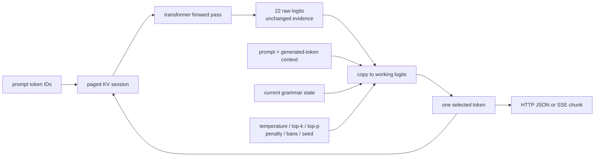
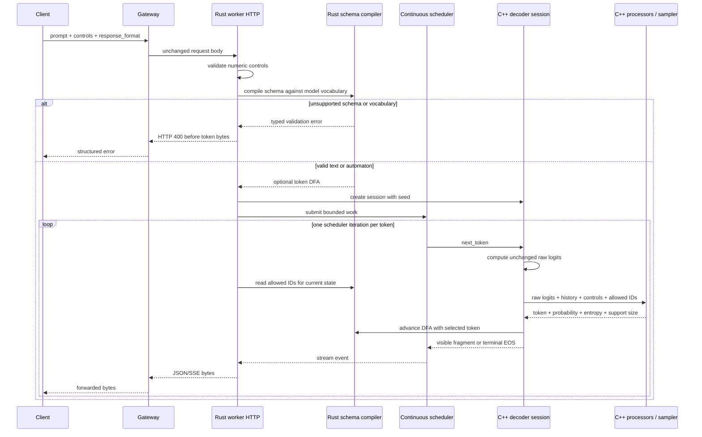
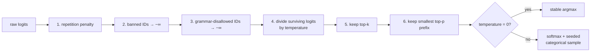
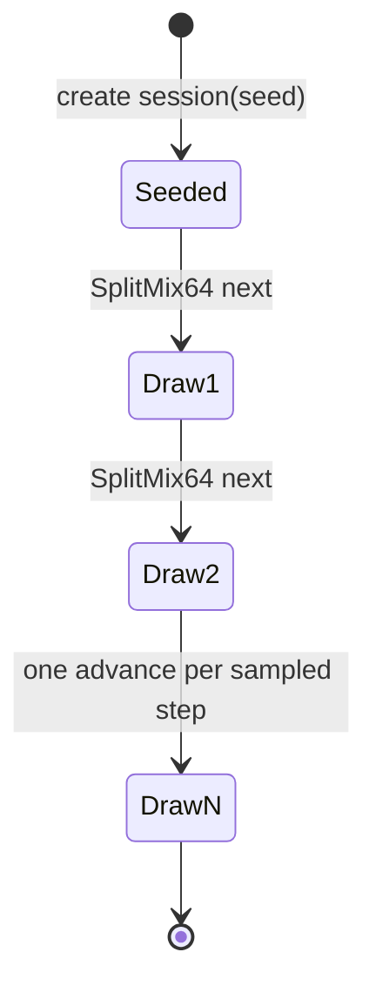
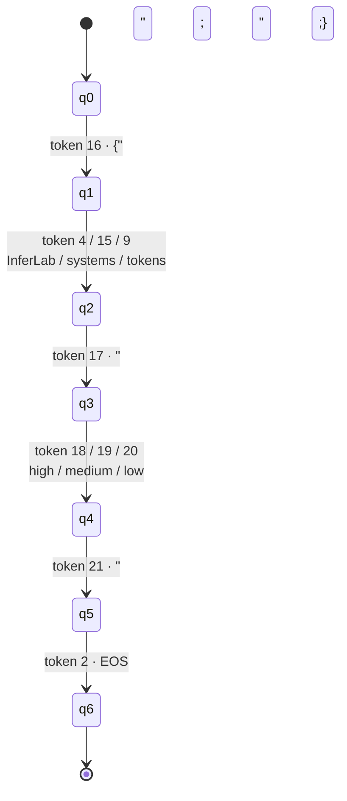
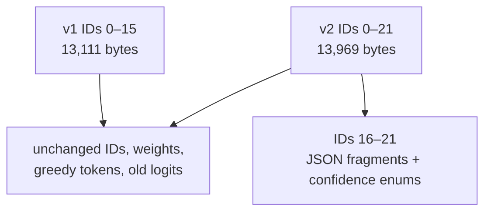

# RFC 0015: Sampling and structured decoding

**Status:** Implemented | **Milestone:** v0.10

## What “RFC” means

RFC is short for **Request for Comments**. In InferLab it is a reviewable
engineering decision record: it states the problem, the chosen design, its
invariants, rejected alternatives, proof, and limitations. It is not merely a
description of the final code. The companion learning document explains the
same topic from the learner's point of view; this RFC records the contract an
implementer or reviewer can challenge.

## What this RFC decides

v0.10 adds probabilistic token choice after the model produces logits and adds
a deliberately narrow JSON-schema compiler that constrains every choice. It
decides to:

1. keep model forward-pass logits unchanged and process a separate working
   vector;
2. run repetition penalty, token bans, grammar masking, temperature, top-k,
   top-p, and final selection in one fixed order;
3. implement those processors and seeded sampling once in C++ behind the C ABI;
4. compile the supported JSON schema in Rust into a deterministic token
   automaton and pass its allowed token IDs to C++ on every step;
5. use SplitMix64 session state so the same model, prompt, configuration, and
   seed replay the same sequence;
6. preserve the v1 checkpoint byte-for-byte and introduce an append-only v2
   teaching vocabulary with six JSON fragment tokens;
7. return raw logits plus candidate count, selected probability, entropy,
   grammar state, and allowed IDs in traces; and
8. reject invalid controls, unsupported schema shapes, incomplete grammars, or
   an empty candidate set instead of silently falling back.

The default remains deterministic greedy text generation: temperature `0`,
top-k disabled, top-p `1`, repetition penalty `1`, no bans, and no grammar.

## Context: where token choice begins

RFC 0014 ended with a vector of next-token logits. A logit is an unnormalized
score; it is not yet a probability or a token. v0.9 always chose the largest
score. That made the decoder deterministic but could not express controlled
variation or make a syntactic guarantee.



This separation is important. PyTorch parity checks the raw model calculation;
processor tests check the selection policy. If processors overwrote the raw
trace, a sampling bug could be mistaken for a transformer bug.

## Goals

- Preserve every v1 greedy token and old-vocabulary logit exactly.
- Make each processor independently visible through golden cases.
- Make sampling deterministic for a declared seed.
- Match categorical softmax probabilities statistically.
- Guarantee that every structured token is legal in the current grammar state.
- Reject unsupported schemas before streaming starts.
- Keep the existing gateway, scheduler, KV ownership, and SSE contracts.
- Demonstrate parser and schema validity over 10,000 real generations.

## Non-goals

- A general JSON Schema implementation.
- Arbitrary regex, context-free grammar, whitespace, arrays, numbers, optional
  properties, nested objects, or multi-token enum strings.
- Semantic truth, factuality, balanced enum frequencies, or calibrated
  confidence.
- Cryptographic randomness or nondeterminism across seeds.
- Beam search, contrastive search, typical sampling, frequency/presence
  penalties, logit bias maps, or per-token stop strings.
- Compatibility with an external production tokenizer or public model.
- A sampling speedup or useful-model quality claim.

## End-to-end request flow



Schema compilation belongs in Rust because it validates the HTTP-facing data
shape and owns a small, inspectable automaton. Numeric token selection remains
in C++ beside model execution, so the CLI, HTTP worker, unit tests, and probe
all exercise the same implementation.

## The fixed processor pipeline

Order is part of the public behavior. Given raw logits `z`, history `h`, bans
`b`, allowed grammar set `a`, and controls, v0.10 applies:



Masking before truncation means top-k and top-p count only legal candidates.
Reversing that order could let illegal high-logit tokens consume the entire
truncation budget and leave no legal output.

### Repetition penalty

Each distinct token already present in the current session context—including
the prompt and previously generated tokens—is adjusted once:

```text
if logit > 0: adjusted = logit / penalty
else:         adjusted = logit * penalty
```

The sign-sensitive rule moves both positive and negative scores downward when
the penalty is greater than one. Counting each occurrence again would make the
same configured penalty depend exponentially on repeat count, which is not the
v0.10 contract.

### Token bans and grammar masks

A ban is an explicit deny-list. A grammar state is an explicit allow-list.
Both turn excluded working logits into negative infinity. If their intersection
leaves no finite value, generation returns an error. It never ignores a ban or
escapes the grammar to make progress.

### Temperature

For positive temperature `T`, the surviving distribution is:

```text
p(i) = exp((z(i) / T) - max(z / T)) / Σ exp((z(j) / T) - max(z / T))
```

Subtracting the maximum is a numeric-stability transform and does not change
the probabilities. Lower positive temperatures sharpen the distribution;
higher temperatures flatten it. Temperature `0` is a separate greedy mode and
does not divide by zero.

### Top-k and top-p

Top-k retains at most the `k` largest surviving logits. `k=0` disables it.
Top-p sorts the post-temperature candidates by probability and retains the
smallest prefix whose cumulative mass reaches `p`. `p=1` disables it. Ties use
ascending token ID so greedy output and seeded replay are stable.

The two controls compose: top-p sees only the set left by top-k. They are not
equivalent. Top-k fixes a count; top-p adapts the count to the distribution's
concentration.

## Deterministic sampling

Each session stores one 64-bit SplitMix64 state initialized from `seed`.
Every sampled step advances it once and maps the value to a uniform variate.
The sampler walks the cumulative categorical probabilities in stable token-ID
order.



The replay promise is scoped: same checkpoint bytes, prompt token IDs,
processor configuration, grammar, seed, and implementation produce the same
sequence. It is not a promise that another library's PRNG or sorting convention
will produce the same sequence.

## Supported JSON schema

The compiler accepts one exact object shape:

```json
{
  "type": "json_schema",
  "json_schema": {
    "name": "inference_summary",
    "strict": true,
    "schema": {
      "type": "object",
      "properties": {
        "answer": {
          "type": "string",
          "enum": ["InferLab", "systems", "tokens"]
        },
        "confidence": {
          "type": "string",
          "enum": ["high", "medium", "low"]
        }
      },
      "required": ["answer", "confidence"],
      "additionalProperties": false
    }
  }
}
```

Property names and order are fixed. Both properties are required. Each enum
value must be exactly one vocabulary token. This narrow contract makes every
transition explicit and falsifiable before a general grammar engine is built.

## JSON token automaton

The schema compiles to a deterministic finite automaton (DFA). A DFA has one
current state and at most one next state for a given token. Seven states encode
the only legal token sequence:



| State | Meaning | Allowed token count |
|---|---|---:|
| q0 | Before object | 1 |
| q1 | Choose `answer` enum | 3 |
| q2 | Between fields | 1 |
| q3 | Choose `confidence` enum | 3 |
| q4 | Close object | 1 |
| q5 | Finish | 1 (`EOS`) |
| q6 | Accepting | 0 |

Exactly six generated tokens are required. A request with `max_tokens < 6` is
rejected before scheduling. EOS is grammar-controlled, so a syntactically
complete object cannot be followed by extra text.

## Why append six vocabulary tokens

The original v1 vocabulary has 16 tokens and cannot express quotes, braces, or
the complete field separators. v0.10 preserves that checkpoint exactly and
builds a v2 checkpoint by appending six tokens. Existing token IDs and all
first-16 embedding/head rows retain their values.



The binary format version remains `1`; “v2” names the teaching checkpoint's
append-only vocabulary revision, not a new serialization format.

## Invariants

1. Raw forward-pass logits are never changed by selection processors.
2. Default text configuration preserves historical greedy behavior.
3. Every sampled token belongs to the final finite candidate support.
4. Banned tokens and grammar-disallowed tokens are never selected.
5. Candidate-set exhaustion is an error, not a fallback.
6. A structured session advances the DFA only with its selected token.
7. A structured response can terminate successfully only after grammar EOS.
8. Same-seed replay consumes PRNG draws in the same step order.
9. v1 checkpoint generation remains byte-identical.
10. v2 changes no old token logit on the retained greedy trace.

## Alternatives considered

### Implement processors in Rust

Rejected for v0.10 because it would split numeric selection from the C++
runtime and risk CLI/HTTP drift. Rust still owns request validation and grammar
compilation; C++ owns the one selection pipeline.

### Generate text and retry until `json.loads` succeeds

Rejected because it offers no upper bound, changes load and latency, can repeat
the same invalid output under a fixed seed, and cannot guarantee correctness.

### Validate only after generation

Rejected because validation detects an invalid answer but cannot prevent it or
undo already streamed bytes.

### Put the entire JSON document in one token

Rejected because it would prove only a lookup table. Separate enum states make
grammar masks, sampling branches, streaming fragments, and EOS observable.

### Build a general regex/JSON compiler immediately

Deferred. Tokenizer boundary handling, UTF-8 prefixes, whitespace, recursion,
numeric syntax, and automaton state explosion are separate uncertainties. The
narrow compiler establishes the end-to-end ownership boundary first.

### Replace v1 in place

Rejected because it would invalidate every retained checkpoint hash and blur
whether historical parity changes came from runtime logic or model bytes.

## Observability

Each step trace adds:

- final candidate count;
- selected probability and entropy;
- grammar state and allowed token IDs; and
- unchanged full raw logits.

Each generation reports decoding kind, schema name, controls, seed, sampled
and greedy step counts, grammar-constrained step count, total candidates,
total masked tokens, and mean entropy. These metrics explain *how* a token was
chosen without putting prompt- or token-valued labels into process metrics.

## Evidence

The release proof passes 27/27 machine-readable assertions:

- six golden processor scenarios use the production C++ selector;
- three 10,000-draw distributions at temperatures 0.5, 1.0, and 2.0 remain
  within 0.581 percentage points of exact softmax probabilities;
- every distribution and four structured seeds replay exactly;
- 10,000/10,000 v2 structured generations parse, satisfy the exact schema,
  and finish through EOS;
- seven distinct valid objects appear and all confidence enums are reached;
- v1 and v2 greedy text, token IDs, finish reason, and old logits match exactly;
- v2 remains within `4.1975708e-06` of PyTorch; and
- real gateway non-streaming and SSE paths return valid JSON, expose six
  constrained steps, replay a seed, and reject an unsupported schema or token
  bans that exhaust a grammar state with 400 before streaming.


## What the proof does not establish

The answer histogram is intentionally revealing: `InferLab` appears 9,991
times, `systems` six times, and `tokens` three times. The grammar makes all
three legal; it does not make the untrained checkpoint assign them useful or
balanced probabilities. Confidence values are much closer to balanced only
because their new head logits tie in this teaching checkpoint.

Thus 10,000/10,000 validity proves syntax and enum membership—not factuality,
calibration, fairness, diversity, or model quality.

## Code map

| Responsibility | Location |
|---|---|
| Request types, schema validation, DFA | `worker/src/decoding.rs` |
| Rust session integration and metrics | `worker/src/lib.rs` |
| Numeric processors, SplitMix64, selection | `worker/cpp/inferlab_runtime.cpp` |
| Stable C ABI | `worker/cpp/inferlab_runtime.h` |
| CLI controls | `worker/src/bin/inferlab-cpu-cli.rs` |
| Production selector and 10k probe | `worker/src/bin/inferlab-decoding-probe.rs` |
| v2 checkpoint generator | `oracle/generate_tiny_model_v2.py` |
| Gateway structured probe | `benchmarks/structured_decoding_probe.py` |
| Release checker and chart | `benchmarks/check_structured_decoding.py`, `benchmarks/render_structured_decoding_svg.py` |
| One-command proof | `scripts/proof-v0.10.sh` |

## Consequence for v0.11

Sampling makes token choice probabilistic, while v0.9 makes diverging sequence
state safe. The next milestone can now change model representation (INT8/INT4)
and execution strategy (speculation) against both a raw-logit oracle and a
declared target distribution. Those optimizations must preserve the sampling
contract rather than merely matching one greedy trace.
