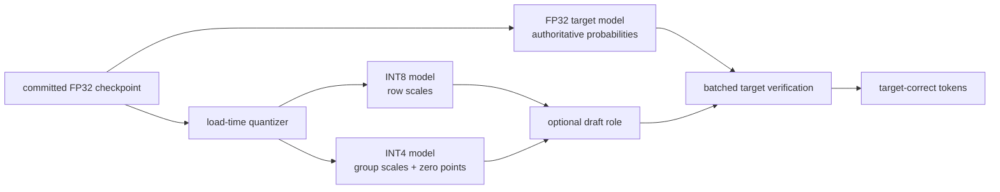
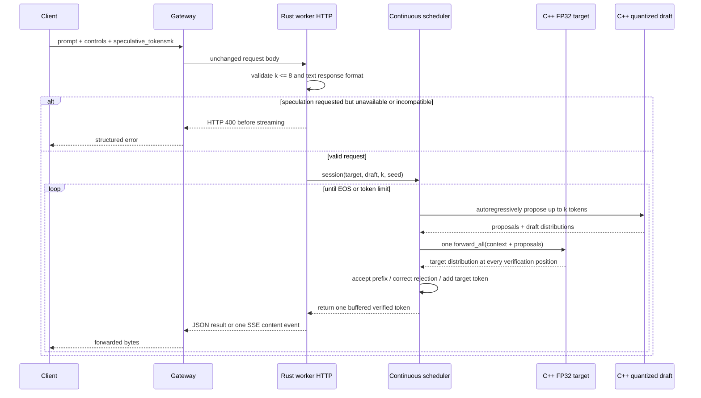
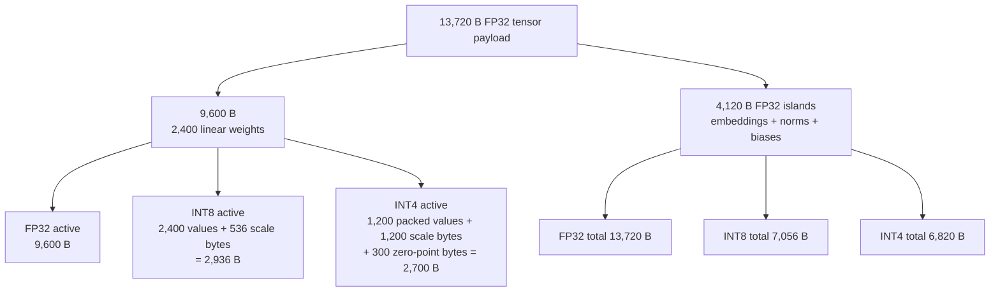
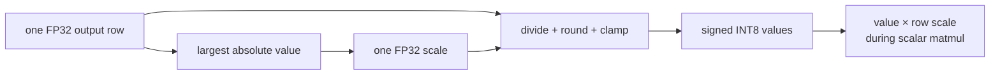
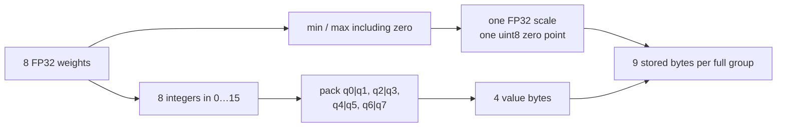
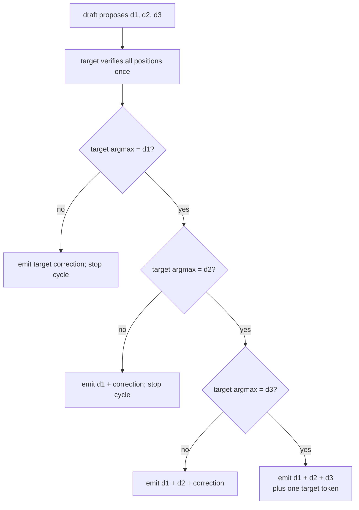
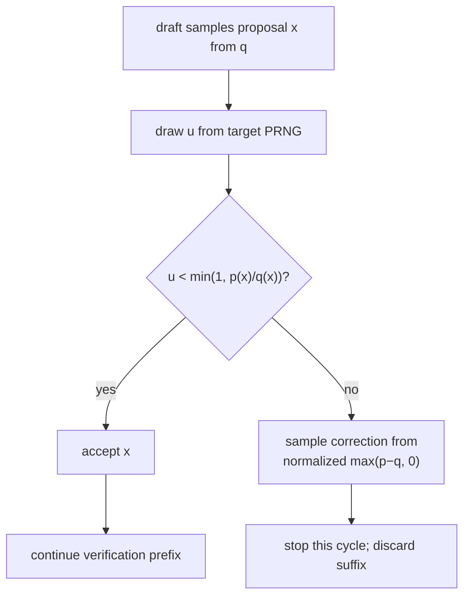
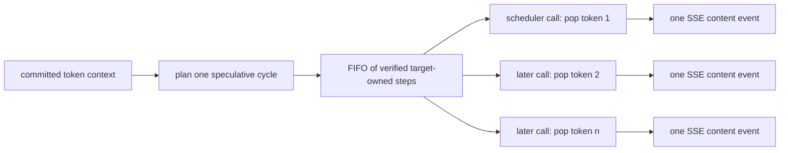

# RFC 0016: Quantization and speculative decoding

**Status:** Implemented | **Milestone:** v0.11

## What “RFC” means

RFC is short for **Request for Comments**. In InferLab, an RFC is a reviewable
engineering decision record. It states the problem, selected design,
invariants, alternatives, proof, and known limits. “Request for comments” does
not mean the implementation is unfinished; it means another engineer should be
able to challenge a concrete decision before or after implementation.

The companion learning document answers a different question: how should a
learner imagine the mechanism, understand every term, trace one request, and
run a useful experiment without reading the whole codebase?

## What this RFC decides

v0.11 adds two independent optimizations behind the existing worker contract:

1. load the committed FP32 checkpoint, then convert only seven linear-weight
   matrices to symmetric per-output-row INT8 or asymmetric group-of-eight INT4;
2. retain embeddings, normalization parameters, biases, activations, KV state,
   scales, and accumulation in FP32;
3. keep only the selected active weight representation in memory;
4. expose exact payload, metadata, compression, and active dtype in model
   health and probe output;
5. use an FP32 target model and an optional quantized draft model for
   speculative decoding;
6. let the draft propose up to `k` tokens and let one target `forward_all` call
   verify the batch;
7. require exact target argmax agreement in greedy mode;
8. use acceptance-rejection correction in sampled mode so proposal quality
   changes work, not the target output distribution;
9. buffer a verified cycle internally but preserve one token per scheduler step
   and one visible SSE content event per token;
10. report proposal, acceptance, rejection, correction, discard, extra-target,
    cycle, and target/draft-forward-call metrics; and
11. reject speculative structured decoding in v0.11 before streaming.

The ordinary default remains an FP32 target without speculation. The worker
preloads an INT8 draft by default so a request can opt in with
`speculative_tokens`; `off` disables draft loading.

## The two problems are related but not identical

Quantization asks: **can each weight use fewer bits while the numerical error
stays acceptable?** Speculative decoding asks: **can a cheap predictor propose
several future tokens while the target retains final authority?**



A quantized target is allowed as a separate operating mode, in which its
quantized logits define the model being served. The speculative HTTP path uses
an FP32 target in the retained proof; its quantized draft may propose tokens but
does not redefine the target distribution.

## Goals

- Make the active model representation and byte accounting exact.
- Preserve all retained greedy tokens under both quantized modes.
- Bound quantized logit error against the existing FP32 implementation.
- Preserve the FP32 path's independent PyTorch tolerance.
- Reduce target forward calls when proposals are accepted.
- Preserve greedy target output exactly.
- Preserve sampled target probabilities statistically, including when draft
  quality is deliberately poor and rejections occur.
- Preserve deterministic replay for a declared seed and implementation.
- Exercise CLI, direct worker HTTP, gateway JSON, and gateway SSE paths.
- Retain a negative performance result rather than convert a call-count win
  into an unsupported latency claim.

## Non-goals

- A production quantization format such as GGUF, GPTQ, AWQ, or SmoothQuant.
- Calibration-data-aware quantization, activation quantization, mixed-precision
  search, quantization-aware training, or vectorized integer kernels.
- Bit-identical logits between FP32, INT8, and INT4.
- Corpus perplexity, downstream task quality, factuality, or useful-model
  quality from the tiny synthetic checkpoint.
- A genuinely smaller draft architecture or separately trained draft model.
- A paged-KV-aware multi-token verification kernel.
- A wall-time speedup on the current scalar teaching runtime.
- Speculation with the v0.10 JSON token grammar.
- Cross-engine seed compatibility.

## End-to-end request path



The cycle may compute several tokens inside one scheduler call, but the session
returns only one token per call. The remaining verified tokens wait in a FIFO
buffer. That preserves the HTTP/SSE shape and the scheduler's existing visible
step contract; it does not make the internal compute burst disappear.

## Quantized ownership boundary

The on-disk checkpoint remains FP32 and byte-identical. Quantization happens
after parsing at model load. Seven matrices use `LinearWeight`: query, key,
value, attention output, feed-forward input, feed-forward output, and language
model head.



“INT4 model” therefore means INT4 **linear weights with FP32 islands**, not
four bits for every byte in the process. The metrics count tensor payload, not
allocator capacity, `std::vector` bookkeeping, vocabulary strings, draft
duplication, KV pages, or process RSS.

## Symmetric per-row INT8

For one output row `r`, let `m` be its largest absolute FP32 value:

```text
scale[r] = max(abs(weight[r, :])) / 127       (or 1 for an all-zero row)
q[r, c]  = clamp(round(weight[r, c] / scale[r]), -127, 127)
weight'  = q[r, c] * scale[r]
```



Symmetric means zero is represented by integer zero and there is no stored
zero point. Per-row scaling gives every output channel its own dynamic range.
One scale for an entire matrix would use less metadata but let one outlier
reduce resolution for every row.

## Asymmetric groupwise INT4

Each output row is divided into consecutive groups of eight columns. The
observed range includes zero, then maps to unsigned integers 0 through 15:

```text
scale[g] = (max[g] - min[g]) / 15             (or 1 for zero range)
zero[g]  = clamp(round(-min[g] / scale[g]), 0, 15)
q[i]     = clamp(round(weight[i] / scale[g]) + zero[g], 0, 15)
weight'  = (q[i] - zero[g]) * scale[g]
```

Two four-bit values share one byte: the even linear index uses the low nibble
and the odd index uses the high nibble.



Groupwise metadata explains why 2,400 four-bit values do not occupy only 1,200
bytes overall: the 300 scales and 300 zero points add 1,500 bytes. Finer groups
usually reduce range error but increase metadata. Eight is an intentionally
small teaching choice, not a production recommendation.

## Numerical correctness contract

The probe evaluates three prompts and 24 greedy steps. For every quantized
step it compares the complete logit vector with FP32, checks the selected token,
and calculates a **greedy-path perplexity** from the probability assigned to
the FP32 greedy token at each visited state.

Greedy-path perplexity is a controlled local sensitivity metric, not corpus
perplexity. The checkpoint has no evaluation corpus, so v0.11 makes no language
quality claim.

| Mode | Maximum absolute logit error | Greedy mismatches | Greedy-path perplexity |
|---|---:|---:|---:|
| FP32 | 0 | 0 / 24 | 1.001519718 |
| INT8 | 0.000182867 | 0 / 24 | 1.001519785 |
| INT4 | 0.003354073 | 0 / 24 | 1.001519129 |

The FP32 target separately remains within `4.1975708e-06` of PyTorch. That
prevents the quantized modes from being compared only with a drifting native
reference.

## Greedy speculative decoding

Let the draft propose `d1 … dk`. One target call produces the target argmax at
each corresponding position.



The longest matching prefix is accepted. The first mismatch is replaced with
the target's token and later proposals are discarded. If all proposals match,
the same target batch contains the distribution for one bonus target token.

For the retained eight-token completion, windows one, two, and three reduce
target calls from eight to four, three, and two. Both INT8 and INT4 drafts
match the target output and accept every proposal on this tiny checkpoint.

## Sampled speculative decoding

Exact token equality is wrong for sampling because both target and draft are
distributions. For a proposed token `x`, with target probability `p(x)` and
draft probability `q(x)`, v0.11 accepts it with:

```text
acceptance(x) = min(1, p(x) / q(x))
```

If rejected, the correction is sampled from the normalized positive residual:

```text
r(i) ∝ max(p(i) - q(i), 0)
```

If all proposals are accepted, the cycle samples one extra token from the
target distribution after the last proposal.



The target PRNG decides acceptance and target/correction samples. The draft has
a separate state initialized as `seed XOR 0xD1B54A32D192ED03`; otherwise draft
draws would consume target random numbers and make correctness harder to reason
about. Replay is scoped to this checkpoint, controls, seed, and implementation.

## Why synthetic draft quality is part of the proof

The real quantized drafts are extremely close to the target on this checkpoint:
all 20,000 retained first proposals are accepted. That verifies the integrated
path but never exercises rejection correction. A pure one-step C-ABI probe
therefore uses target logits `[0, 1, 2]` with three declared draft distributions:

| Draft | Draft logits | Acceptance | Rejections | Max target-probability error |
|---|---|---:|---:|---:|
| Identical | `[0, 1, 2]` | 100.00% | 0 | 0.616 pp |
| Softened | `[0, 0.5, 1]` | 83.87% | 1,613 | 0.846 pp |
| Reversed | `[2, 1, 0]` | 42.05% | 5,795 | 0.543 pp |

All rows use 10,000 seeded trials and stay within the declared one-percentage-
point statistical bound. Acceptance falls as the proposal worsens, while the
corrected output stays near the same target distribution. This separates the
algorithm's correctness claim from the accidental quality of one draft model.

## Session state and streaming



The cycle appends its verified tokens to session context before they are
individually drained. Cancellation drops the session and its buffer. A buffered
EOS still terminates through the existing finish path. At the token/context
boundary, the implementation falls back to one ordinary target step when it
cannot fit at least one proposal plus one target result.

## Invariants

1. The committed checkpoint bytes never change during load-time quantization.
2. Exactly one active representation owns each linear weight value.
3. Quantization never changes embeddings, norms, biases, activations, KV state,
   or accumulator type from FP32.
4. INT8 uses one scale per output row and stores no zero point.
5. INT4 groups never cross output-row boundaries and use group size eight.
6. FP32 target probabilities remain authoritative during speculative decoding.
7. No unverified draft token enters the visible output.
8. A greedy mismatch emits the target token and discards the remaining suffix.
9. A sampled rejection uses the positive residual distribution and discards
   the remaining suffix.
10. A fully accepted cycle may emit at most one additional target token.
11. Target and draft PRNG states are independent and session-local.
12. The scheduler and SSE layer observe at most one token per session step.
13. Structured speculation fails before response streaming begins.
14. `speculative_tokens` cannot exceed eight and requires an available draft.
15. Call-count, acceptance, correctness, memory, and wall time are reported as
   separate measurements.

## Observability

Model health reports quantization mode, group size, FP32 and active tensor
bytes, FP32 and active linear bytes, quantized value count, scale/zero-point
counts, and both compression ratios.

Each generation reports:

- whether speculation is enabled and which draft quantization is active;
- draft tokens requested per cycle;
- target and draft forward calls;
- cycles and proposed, accepted, rejected, and discarded draft tokens;
- correction and extra-target tokens; and
- acceptance percentage.

These counters answer different questions. High acceptance says the draft
agrees with the target. Low target-call count says batching occurred. Neither
alone says wall time improved.

## Alternatives considered

### Quantize the checkpoint file offline

Deferred. A second serialization format would mix representation parsing with
the arithmetic experiment. Load-time conversion keeps one reproducible source
checkpoint and makes FP32/INT8/INT4 comparisons share the same bytes. It does
not measure quantized-file startup or disk savings.

### Use one scale for each whole matrix

Rejected because an outlier can waste most integer resolution for unrelated
rows. Per-row INT8 remains simple while isolating output-channel ranges.

### Use symmetric INT4

Not selected. The asymmetric zero point demonstrates affine quantization and
uses the 0…15 range when a small group is not centered on zero. Its extra byte
per group is deliberately visible in the memory result.

### Quantize every tensor

Rejected for this milestone. Embeddings, norms, biases, activations, and KV
state have different error and kernel implications. Keeping FP32 islands makes
the ownership boundary inspectable and explains why model-wide compression is
smaller than four or eight times.

### Verify proposals with repeated target `forward` calls

Rejected because that cannot reduce target invocations. `forward_all` exposes
all sequence-position logits from one call. The current implementation still
recomputes the sequence and therefore proves batching semantics, not an
efficient paged verification kernel.

### Accept sampled proposals whenever target argmax agrees

Rejected because it changes the target distribution. Argmax agreement is a
greedy rule. Sampled speculation needs the probability-ratio acceptance rule
and residual correction.

### Use only real draft-model samples in the proof

Rejected as insufficient. A nearly identical draft can show 100% acceptance
and leave the rejection branch untested. The synthetic quality sweep makes
thousands of corrections unavoidable.

### Emit a whole accepted cycle in one SSE event

Rejected because it would change streaming granularity and scheduler behavior.
The internal FIFO keeps the existing one-token visible contract.

### Allow structured speculation immediately

Deferred. Grammar state changes after every accepted or corrected token, so
the draft and target distributions must each use the correct per-position
allowed set. Rejecting the combination is safer than silently bypassing the
grammar or using stale masks.

## Evidence and the negative result

The retained proof passes 33/33 release assertions. INT8 and INT4 reduce active
tensor payload from 13,720 bytes to 7,056 and 6,820, preserve all 24 greedy
tokens, and remain within their declared logit-error bounds. Real quantized
draft distributions stay within one percentage point of the FP32 target and
replay exactly. Gateway JSON and SSE preserve the greedy completion; an INT4
worker exposes its active representation; structured speculation returns 400.


The chart preserves the crucial negative result. With an INT8 draft window of
three, target calls fall 8→2, but retained median wall time is 24.625→110.541
microseconds, only `0.223x` baseline speed. The best retained speculative
profile is `0.261x`, still slower. The draft is the same architecture,
dequantization is scalar, and target verification recomputes the full sequence.
The algorithmic call-count result is real; a latency speedup is not.

## Limitations and next boundary

- Tensor bytes are exact payload accounting, not process RSS or allocator use.
- Tiny-model microsecond timing is dominated by reference overhead and this
  host; it is not representative of production LLM latency.
- Quantized scalar access dequantizes inside the inner loop and uses no SIMD or
  integer dot-product kernel.
- The target and draft share architecture, checkpoint, tokenizer, and context
  length; only weight precision differs.
- Batched verification is a full recomputation, not paged-KV-aware decoding.
- Real-draft acceptance is measured on one synthetic checkpoint and a small
  prompt set.
- Greedy-path perplexity is not corpus or task perplexity.
- Sample probability bounds are statistical, not proof over every seed.
- v0.11 speculation supports text only.

The next performance experiment must change the causes, not the chart label: a
genuinely smaller draft, vectorized quantized matmuls, and KV-aware target
verification are needed before claiming a speculative speedup. The next major
project milestone proceeds to attention optimization with these limitations
retained as evidence.
