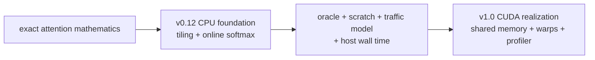
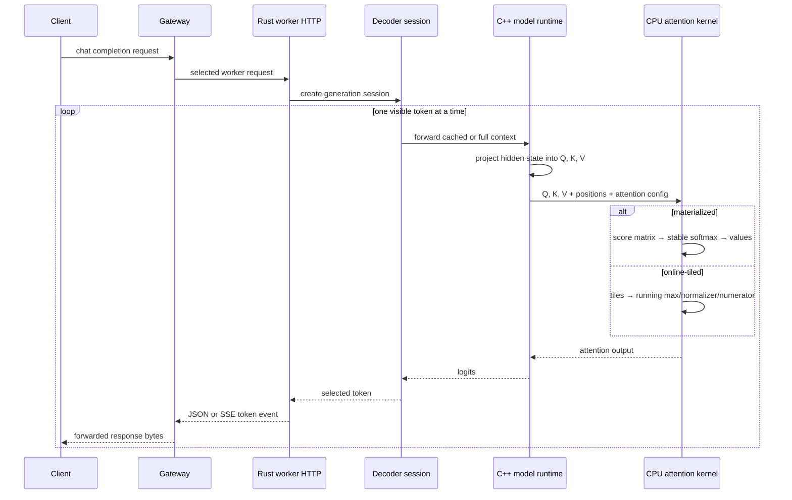
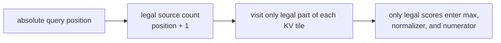
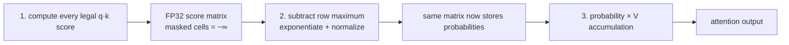
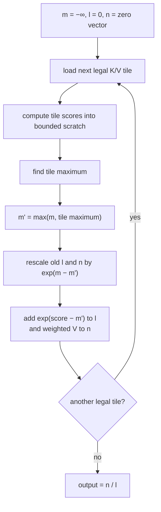
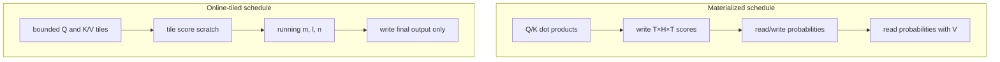
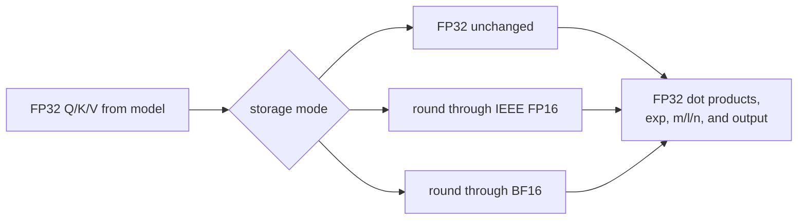

# RFC 0017: Tiled online-softmax causal attention

**Status:** Implemented | **Milestone:** v0.12

## What “RFC” means

RFC is short for **Request for Comments**. In InferLab, an RFC is a reviewable
engineering decision record: it names a problem, selects one approach, records
why other approaches were not selected, declares invariants, and states what
the evidence can and cannot prove.

The companion learning guide has a different job. It builds the mental picture,
expands the technical terms, walks through one request, and offers experiments
that do not require reading the whole implementation.

## Decision

v0.12 adds an exact CPU attention-algorithm foundation behind the existing model
and worker interfaces:

1. retain the old **materialized** implementation as a correctness baseline;
2. add an **online-tiled** implementation that visits query and key/value tiles
   without allocating the complete score matrix;
3. enforce the causal mask before a future score can enter softmax;
4. maintain a running maximum, normalizer, and value numerator so softmax stays
   stable when a later tile contains a larger score;
5. allow `fp32`, simulated `fp16`, or simulated `bf16` input storage while all
   dot products, exponentials, normalization, and output accumulation stay FP32;
6. make the algorithm, storage precision, and tile size selectable in the real
   model, CLI, worker process, health response, and C ABI;
7. report score counts, score scratch, working set, key-tile visits, and an
   explicitly modeled external-traffic estimate separately from measured wall
   time; and
8. preserve CUDA implementation, shared-memory tuning, and GPU profiling as the
   v1.0 boundary.

The compatibility default remains `materialized` + `fp32` + 16-token tiles.
The v0.12 proof runs the real online worker with 32-token tiles.

## Why this is v0.12 rather than v1.0 CUDA

The available host is an Apple M4 Pro. It has Metal support, but it has neither
an NVIDIA device nor the CUDA compiler. Implementing an unexecutable CUDA file
would create source code without local correctness or performance evidence.

The attention recurrence itself is hardware-independent. v0.12 therefore
implements and proves that foundation on CPU. It does **not** call the result a
CUDA kernel or FlashAttention. v1.0 still owns CUDA thread blocks, shared memory,
warps, coalesced HBM access, occupancy, tensor-core/mixed-precision execution,
and profiler-counter validation.



## Goals

- Preserve exact causal-attention semantics within declared floating-point
  tolerances.
- Make the score-matrix memory problem visible and measurable.
- Show how online softmax combines tiles without numerical overflow.
- Exercise the implementation through the actual decoder and gateway, not only
  through a standalone arithmetic probe.
- Compare all six algorithm/storage combinations with an independent PyTorch
  implementation.
- Separate nominal storage, algorithmic traffic, actual scratch allocation, and
  measured wall time.
- Leave an inspectable bridge from scalar code to a later GPU kernel.

## Non-goals

- A CUDA, Metal, Triton, or production SIMD kernel.
- Permission to call this scalar CPU implementation “FlashAttention.”
- Tensor cores, warp-level primitives, shared memory, asynchronous copies, or
  accelerator occupancy tuning.
- Hardware-counter measurements of DRAM, cache, SRAM, or HBM traffic.
- Actual packed FP16/BF16 input buffers or FP16/BF16 arithmetic throughput.
- Backward propagation, dropout, cross-attention, multi-query attention,
  grouped-query attention, or rotary-position changes.
- Sliding-window, sparse, approximate, or lossy attention.
- Performance portability from the tiny synthetic workload to production LLMs.

## Where the implementation sits in a request



The gateway does not know how attention was calculated. Selection belongs to
the worker/model boundary, and `/health` exposes the chosen configuration. This
keeps transport behavior stable while the numerical kernel changes.

## Terms and tensor shapes

| Term | Meaning in this RFC |
|---|---|
| **Q / query** | What the current token position is looking for. |
| **K / key** | What each source position offers for matching. |
| **V / value** | Information copied into the output in proportion to attention probability. |
| **Head** | One independent attention channel. The probe uses four heads in its scaling sweep. |
| **Head dimension `d`** | Number of scalar features in one head; 32 in the scaling sweep. |
| **Score** | Scaled query-key dot product `q·k / sqrt(d)`. |
| **Softmax** | Converts scores into nonnegative weights that sum to one. |
| **Causal mask** | Prevents query position `i` from reading key/value positions after `i`. |
| **Tile** | A bounded block of query or key/value positions processed together. |
| **Materialized** | The full score table exists as an intermediate FP32 buffer. |
| **Online** | The final softmax result is updated as score tiles arrive; the full table never exists. |
| **FP32 accumulation** | Products and running sums use 32-bit floating point even when inputs are rounded to a 16-bit storage format. |

For `T` query tokens, `T` key/value tokens, `H` heads, and head dimension `d`:

```text
Q, K, V shape       = [T, H, d]
full score shape    = [T, H, T]
causal legal scores = H × T × (T + 1) / 2
output shape        = [T, H, d]
```

## Causal ownership

For a four-token sequence, `✓` is legal and `×` is a future position:

| Query \ Key | 0 | 1 | 2 | 3 |
|---|:---:|:---:|:---:|:---:|
| 0 | ✓ | × | × | × |
| 1 | ✓ | ✓ | × | × |
| 2 | ✓ | ✓ | ✓ | × |
| 3 | ✓ | ✓ | ✓ | ✓ |



Masking is not a later cleanup step. A future score never enters the online
state. The retained isolation probe changes every future key and value for
query zero and observes exactly zero output change in both algorithms.

## Baseline: materialize the score matrix

For each query/head row, the baseline performs three phases:



The row maximum makes softmax numerically stable:

```text
m = max(scores)
p[i] = exp(score[i] - m) / sum(exp(score[j] - m))
output = sum(p[i] × value[i])
```

Subtracting `m` does not change the ratio between probabilities, but it prevents
large positive scores from overflowing `exp`. The cost is the complete
`[T,H,T]` buffer and repeated score-buffer reads/writes.

## Selected algorithm: tiled online softmax

The selected path tiles both query order and key/value order. For one query and
head it keeps only:

- `m`: the largest score seen so far;
- `l`: the softmax denominator on the scale defined by `m`; and
- `n`: a `d`-element value numerator on the same scale.



For a tile with scores `s` and values `v`:

```text
m' = max(m, max(s))
l' = exp(m - m') × l + sum(exp(s[i] - m'))
n' = exp(m - m') × n + sum(exp(s[i] - m') × v[i])
```

The rescaling term is essential. Suppose the old maximum is 10 and a later tile
contains 20. Old exponentials were expressed relative to 10; multiplying the
old state by `exp(10−20)` converts it to the new scale before addition. Without
that step, tile order would change the answer.

## Why tiling changes memory behavior



At 256 tokens, four heads, dimension 32, and a 32-score tile:

| Measure | Materialized | Online tiled | Ratio |
|---|---:|---:|---:|
| Score scratch | 1,048,576 B | 128 B | 8,192× smaller |
| Kernel working set counted by the probe | 1,048,576 B | 256 B | 4,096× smaller |
| Modeled external traffic | 4,718,592 B | 2,359,296 B | 2.0× smaller |

The traffic values are a declared algorithmic model: the online schedule assumes
that K/V data loaded for a query tile can be reused from the host cache. They are
not measurements from cache, DRAM, Metal, CUDA, or HBM performance counters.
The score scratch and numerator allocations are real C++ buffers; allocator
metadata and capacity rounding are excluded.

## Precision boundary



The FP16/BF16 modes are storage simulations. The implementation rounds values
to the selected 16-bit representation, then keeps the rounded values in host
`float` vectors for portable scalar arithmetic. Therefore:

- numerical drift is real and checked against PyTorch's corresponding storage
  rounding;
- the nominal two-byte input traffic model is useful for design comparison;
- actual process allocation is **not** reduced to two bytes per input value; and
- no FP16/BF16 throughput claim is allowed.

The retained maximum output drift from FP32 is `0.000199139` for FP16 and
`0.001946092` for BF16. All six C++ variants stay within `1.16e-7` of the
precision-matched PyTorch oracle.

## Configuration and code ownership

| Boundary | Configuration or code |
|---|---|
| C++ algorithm | `kernels/attention_cpu.h` and `kernels/attention_cpu.cpp` |
| C ABI | `worker/cpp/inferlab_runtime.h` and `inferlab_runtime.cpp` |
| Safe Rust API | `AttentionConfig`, `run_attention`, and `Model::load_with_options` |
| CLI | `--attention-kernel`, `--attention-precision`, `--attention-tile-tokens` |
| Worker environment | `INFERLAB_CPU_ATTENTION_KERNEL`, `INFERLAB_CPU_ATTENTION_PRECISION`, `INFERLAB_CPU_ATTENTION_TILE_TOKENS` |
| Worker observability | `model.attention` in `/health` |
| Arithmetic proof | `inferlab-attention-probe` + `oracle/attention_reference.py` |
| System proof | two workers + gateway JSON/SSE probe |

## Invariants

1. A causal query never reads a future key or value.
2. Every legal query/key score is evaluated exactly once per algorithm call.
3. Materialized and online paths implement the same scaled-dot-product
   attention function within declared FP32 tolerance.
4. Every exponential is evaluated after subtracting a maximum at least as large
   as its score.
5. When the running maximum changes, the old normalizer and numerator are
   rescaled before new contributions are added.
6. FP16/BF16 selection changes only input storage rounding; accumulation stays
   FP32.
7. Tile size is positive and no larger than 4,096.
8. Model load records one immutable attention configuration used by full and
   cached forward paths and by any speculative draft clone.
9. The compatibility default remains materialized FP32.
10. Modeled bytes and measured wall time remain separately named and reported.
11. Gateway JSON and SSE contracts do not change with the selected algorithm.

## Alternatives considered

### Implement CUDA immediately

Deferred to v1.0. This host cannot compile or execute CUDA, so local tests could
not validate memory safety, device correctness, profiler traffic, occupancy, or
speed. The hardware-independent recurrence is a useful, testable prerequisite.

### Call the CPU path FlashAttention

Rejected. FlashAttention is an exact, IO-aware GPU algorithm built around the
GPU memory hierarchy. v0.12 shares online-softmax and tiling ideas, but has no
CUDA thread blocks, SRAM/shared-memory kernel, warp scheduling, tensor cores, or
HBM measurement. Naming the difference is part of the learning goal.

### Keep only the materialized implementation

Rejected as the final approach because it hides the quadratic intermediate.
Retained as the differential baseline because an obviously structured
three-phase implementation is valuable for correctness comparison.

### Tile score computation but still store the full score matrix

Rejected because compute tiling alone does not remove the `T×H×T` intermediate.
The online recurrence is what permits each tile's scores to be discarded.

### Use one-pass exponentials without a running maximum

Rejected because `exp(large_score)` can overflow. Large-score tests deliberately
exercise this boundary and require finite output.

### Use a fixed maximum from the first tile

Rejected because a later tile may contain a larger score. Failing to rescale old
state makes the result depend on tile order and can overflow.

### Use sliding-window or sparse attention

Rejected for this milestone because those methods change which keys are legal.
The selected algorithm is exact: it changes execution order and intermediates,
not model semantics.

### Use an optimized attention library

Deferred. A library would be appropriate for a production backend, but would
hide the recurrence, scratch ownership, and failure modes this phase exists to
teach. The tiny model also needs a stable cross-platform CPU reference.

### Perform real FP16/BF16 arithmetic

Deferred to hardware-specific work. Portable C++ scalar support and throughput
vary by host. Storage rounding plus FP32 accumulation isolates numerical storage
effects without pretending to benchmark accelerator precision modes.

## Evidence

The retained proof passes 21/21 assertions:

- two algorithms × three storage precisions match an independent PyTorch oracle;
- maximum oracle error is `1.1553e-7`;
- maximum online/materialized fixture difference is `1.0e-7`;
- a large-score fixture remains finite in every variant;
- changing all future keys and values causes exactly zero change to query zero;
- the full model produces the same token IDs and text, with maximum logit
  difference `1.0e-7`;
- both worker health responses expose their selected algorithms;
- the gateway routes to the online worker and SSE reconstructs the same text;
- materialized/PyTorch full-model error remains `4.1975708e-6`; and
- the environment records that CUDA compiler and runtime availability are both
  false.


The 256-token scalar CPU observation is also positive: median time is about
`2.2×` lower for online tiled than materialized on this host. It remains an
observation, not a production or cross-machine guarantee.

## Limitations and the next boundary

- The model is one layer with 16-dimensional hidden state; it is not a useful
  language model.
- Scaling timings use synthetic tensors, 31 warm repetitions, one process, and
  one Apple M4 Pro host.
- The traffic counter is a schedule model, not a hardware counter.
- The nominal FP16/BF16 byte model does not equal actual `std::vector<float>`
  allocation.
- The scalar loop relies on ordinary compiler and CPU-cache behavior; it has no
  explicit SIMD, vector intrinsics, cache pinning, prefetch, or parallelism.
- Tile size 32 was demonstrated, not exhaustively tuned.
- Only causal self-attention forward inference is implemented.
- There is no GPU backward pass, dropout, kernel fusion, or production batch
  scheduler integration inside the kernel.
- Timing improvement at these sizes does not establish production throughput.

v1.0 must map the proved recurrence onto CUDA, explicitly define global-memory
and shared-memory ownership, handle causal edge tiles, validate FP16/BF16 device
arithmetic, compare with an independent GPU reference, collect profiler traffic,
and report occupancy and wall time without confusing any one metric for the
others.

Before that hardware-dependent step, [RFC 0018](0018-real-worker-full-stack-integration.md)
connects this real online-attention worker to the Raft-configured resilient
gateway and proves the complete request path through controlled worker and
leader faults. It does not change this RFC's CUDA boundary.

## References

- [FlashAttention: Fast and Memory-Efficient Exact Attention with IO-Awareness](https://arxiv.org/abs/2205.14135)
- [Online normalizer calculation for softmax](https://arxiv.org/abs/1805.02867)
- [NVIDIA CUDA Programming Guide: memory hierarchy and execution model](https://docs.nvidia.com/cuda/cuda-programming-guide/index.html)
