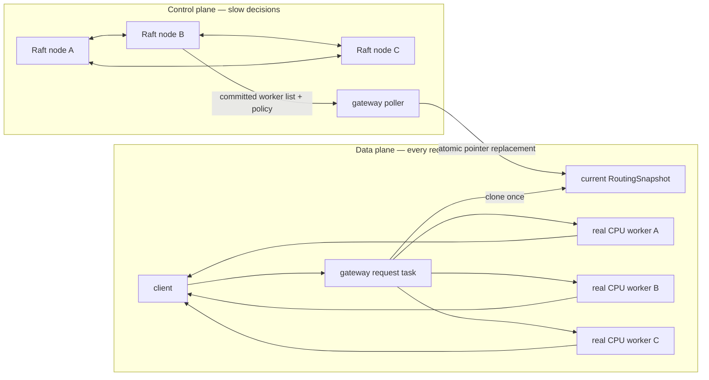
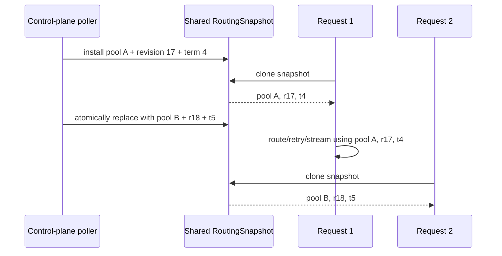
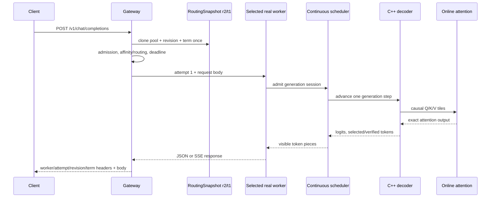
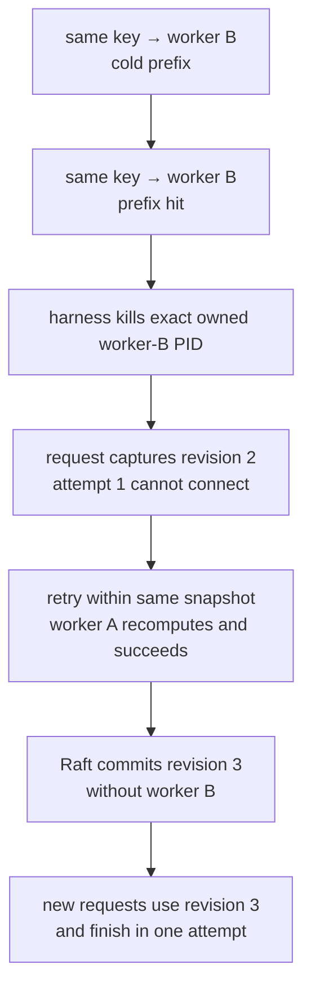
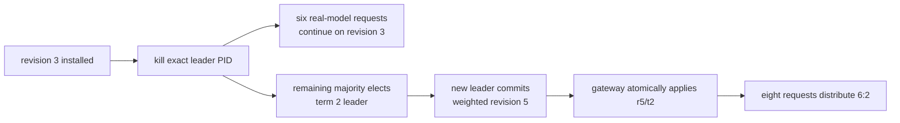
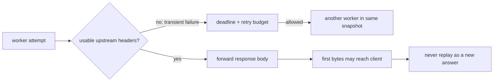

# RFC 0018: Real-worker full-stack integration

**Status:** Implemented | **Milestone:** v0.13

## What “RFC” means

RFC is short for **Request for Comments**. In InferLab, an RFC is a reviewable
engineering decision record. It says what problem exists, which design was
selected, why nearby alternatives were rejected, which properties must remain
true, and where the evidence stops.

The phase learning document has a different job: it supplies the mental model,
expands the vocabulary, follows one request, and suggests experiments that can
be run before reading the implementation.

## Decision

v0.13 makes the previously separate distributed-system and inference-runtime
proofs operate as one system:

1. a three-node Raft control plane owns committed routing configuration;
2. the gateway polls that slow-changing configuration outside the request hot
   path;
3. each applied configuration becomes one immutable `RoutingSnapshot`
   containing a worker pool, control-plane revision, and Raft term;
4. one request clones exactly one snapshot before selecting its first worker;
5. every retry belonging to that request uses the same worker pool and the same
   revision/term, even if the poller installs a newer snapshot concurrently;
6. successful routed responses expose that identity in
   `x-inferlab-config-revision` and `x-inferlab-config-term`;
7. `/internal/workers` exposes the currently installed routing snapshot;
8. the system proof uses three real CPU decoder workers configured with paged
   KV cache, online-tiled FP32 attention, continuous scheduling, prefix cache,
   and an INT8 speculative draft; and
9. one proof crosses affinity, cache reuse, an exact worker kill, pre-header
   retry, committed worker removal, an exact Raft-leader kill, request service
   during re-election, a newer weighted configuration, and final speculative
   SSE streaming.

This phase adds the atomic request/configuration boundary and full-stack proof.
It does not re-implement the earlier routing, resilience, consensus, cache,
attention, quantization, or speculative-decoding mechanisms.

## Why integration is a separate engineering problem

Every component can pass alone while their composition is wrong. Examples:

- the gateway can publish a new revision but accidentally route with the old
  worker pool;
- a retry can start under one worker membership and silently finish under
  another;
- gateway traffic can stop whenever Raft temporarily has no leader, turning a
  slow control-plane transition into a data-plane outage;
- prefix affinity can be demonstrated only with fake workers, leaving no proof
  that it produces an actual KV-prefix hit; or
- a real model can stream in isolation without ever crossing dynamic routing or
  a controlled fault.

The integration boundary therefore needs its own invariant and experiment.



The dashed conceptual boundary matters more than the process count: Raft is
consulted by a background poller, not by every token or request.

## The atomic routing snapshot

Before v0.13, the dynamic worker pool and control-plane telemetry were separate
values. A reader could observe a new revision beside an old pool, or vice
versa, while the poller was between writes. v0.13 groups the values that define
a routing decision:

```text
RoutingSnapshot
├── workers: immutable WorkerPool behind Arc
├── control_revision: committed log revision, when dynamic
└── control_term: Raft term that committed the revision, when dynamic
```

The shared value is protected by one read/write lock. The poller constructs a
complete new pool first and then replaces the three-field snapshot in one write.
A request briefly takes the read lock, clones the snapshot, releases the lock,
and owns the clone until its response body ends.



This is **request-level consistency**, not linearizable routing. A request that
began just before an update may legally use the older committed snapshot. A new
request sees the replacement after it is installed. That choice avoids changing
membership in the middle of a retry or stream.

## What revision and term mean

| Term | Meaning here |
|---|---|
| **Raft term** | A numbered leadership era. A new election increases the term. |
| **Revision** | The committed log position that identifies the applied configuration. Revisions are monotonic but need not be consecutive configuration numbers; a leader-establishing entry may occupy a log position. |
| **Snapshot** | One immutable in-memory routing view, not a Raft log-compaction snapshot. |
| **Fence** | Metadata that lets an observer prove which committed routing view a response used. It does not cancel old requests. |
| **Control plane** | The slow path that agrees on configuration. |
| **Data plane** | The hot path that accepts, routes, executes, and streams requests. |
| **Prefix affinity** | Stable routing of the same prompt/cache key toward the worker likely to own its cached KV prefix. |
| **Pre-header retry** | A second attempt made only before any upstream response headers have been accepted downstream. |
| **SSE** | Server-Sent Events, the text event stream used for incremental tokens and the final `[DONE]`. |

## One request from client to token



The control plane is absent from the token loop. If its leader disappears, the
gateway keeps serving from its last installed committed snapshot.

## Failure and reconfiguration contract

### Worker failure



A failover loses the dead worker's local prefix advantage. Correctness and
availability take priority; the surviving worker recomputes the prefix. The
later committed membership update prevents new requests from spending an
attempt on the dead endpoint.

### Leader failure



Revision 4 is not missing state: the new leader's current-term entry occupies a
log position. Configuration revisions are log identities, not a counter of only
user-visible configuration edits.

## Retry and streaming boundary

The gateway retries only failures detected before it has accepted usable
upstream response headers. Once a response has been selected, its body is
forwarded as a stream and the worker lease, execution slot, admission permit,
deadline, and routing snapshot remain owned by that stream.



The v0.13 fault experiment exercises the pre-header branch. Existing gateway
stream-lifetime and retry tests retain the post-header invariant.

## Response observability

Successful routed responses now carry four useful headers:

| Header | Answers |
|---|---|
| `x-inferlab-worker` | Which worker produced the accepted response? |
| `x-inferlab-attempts` | How many attempts were started before success? |
| `x-inferlab-config-revision` | Which committed routing revision did this request capture? |
| `x-inferlab-config-term` | In which Raft leadership term was that revision committed? |

Static environment-configured gateways omit the last two because there is no
control-plane revision to report. Gateway-local errors may also lack them; this
RFC scopes the fence to successful routed responses.

`/internal/workers` exposes both `routing_snapshot` and `control_plane`. The
first is authoritative for what a newly starting request will route with. The
second is poller/source telemetry and may temporarily report a refresh error
without invalidating the last installed routing snapshot.

## Invariants

1. Worker pool, control revision, and control term change as one atomic snapshot.
2. A request uses one snapshot for selection, every retry, response headers,
   and its complete body lifetime.
3. Applied control revisions never move backward.
4. An unavailable control plane does not invalidate the last committed data-
   plane snapshot.
5. A retry cannot select a worker already attempted by the same request when an
   unattempted eligible worker exists.
6. No retry begins after an upstream response has been selected for streaming.
7. Consistent-hash affinity is stable only while the worker set and routing
   policy are stable.
8. A membership update is applied only after it is committed and converted to a
   valid worker pool.
9. Dynamic response headers identify the request-start snapshot, not whatever
   revision happens to be current when the body ends.
10. Chaos actions kill only exact child processes started by the proof harness.

## Alternatives considered

### Query Raft for every request

Rejected. It would make leader election and consensus latency part of request
availability and would add a network dependency before every generation. The
gateway needs an asynchronously refreshed committed snapshot.

### Query Raft for every token

Rejected more strongly. Routing configuration does not change token semantics,
and consensus inside the token loop would destroy the control/data-plane
boundary.

### Store pool, revision, and term in separate locks

Rejected because a request could combine fields from different configurations.
The values together identify one routing decision and must therefore share one
replacement boundary.

### Let an in-flight request adopt a newer snapshot

Rejected. A retry could see an unrelated policy or membership change, and the
reported revision would no longer identify the complete routing decision. Old
requests are allowed to finish on an old committed snapshot.

### Cancel every old-revision request

Rejected. A membership or weight change is not proof that an already selected
healthy worker is unsafe. Cancellation would turn ordinary reconfiguration into
user-visible failures. Emergency revocation is a different, unimplemented
security/lifecycle problem.

### Wait for a new Raft leader before serving

Rejected. Reads from the installed snapshot do not require a fresh leader. The
proof deliberately serves real-model traffic during the election interval.

### Use fake workers for the integration proof

Rejected as the release proof. Fake workers remain valuable for deterministic
unit/failure tests, but cannot demonstrate paged-prefix reuse, online attention,
decoder tokens, speculation, or real SSE token pieces.

### Build CUDA next despite unavailable hardware

Deferred to v1.0. The retained host has no NVIDIA toolchain or device. The next
honest local milestone was to integrate all validated CPU and distributed
mechanisms; it does not rename that result CUDA or FlashAttention.

## Evidence

The retained proof passes 23/23 assertions and observes:

- exactly one leader in the initial three-node Raft cluster;
- revision 2/term 1 with three real online-attention CPU workers;
- two affinity requests on one worker, with the second reporting a prefix hit;
- exact child-process failure of that affinity owner;
- success on attempt 2 through a surviving real worker while retaining
  revision 2/term 1;
- revision 3 removing only the failed worker;
- four post-update requests succeeding in one attempt;
- six of six real-model requests succeeding on revision 3 while the Raft leader
  is absent;
- a replacement leader in term 2 after 374.214 ms in the retained run;
- weighted revision 5 producing an exact 6:2 split for 3:1 weights;
- 21/21 non-stream requests succeeding; and
- a final SSE response ending in `[DONE]`, using online attention, a real paged
  prefix hit, and an INT8 draft that proposes and accepts six tokens with two
  target forward calls.


The latency is one local observation; the bounded assertion is under 1,500 ms.
The 6:2 result proves this deterministic eight-request schedule, not long-run
statistical fairness.

## Code and evidence map

| Responsibility | Location |
|---|---|
| Atomic snapshot and response headers | `gateway/src/lib.rs` |
| Polling and monotonic snapshot replacement | `gateway/src/main.rs` |
| Snapshot replacement integration test | `gateway/tests/streaming.rs` |
| Real-worker/control-plane probe | `benchmarks/full_stack_probe.py` |
| Machine-readable release assertions | `benchmarks/check_full_stack.py` |
| Evidence chart | `benchmarks/render_full_stack_svg.py` |
| Safe orchestration | `scripts/proof-v0.13.sh` |
| Retained raw evidence | `docs/results/v0.13/raw/` |

## Limitations and next boundary

- The control-plane poller uses HTTP polling, not push/watch delivery.
- This RFC's original gateway-restart limitation is addressed by
  [RFC 0019](0019-restart-safe-routing-snapshots.md), which persists one
  validated committed route map without changing the request snapshot contract.
- This is request-level snapshot consistency, not a linearizable read contract.
- There is no joint-consensus membership change, Raft snapshotting, or log
  compaction.
- Worker health is not automatically written into Raft; the harness performs
  the membership update explicitly after the controlled failure.
- Prefix state is local and disappears with its worker.
- The proof uses one tiny, one-layer teaching model and loopback networking.
- The experiment is a correctness/fault-continuity proof, not a load,
  throughput, tail-latency, or multi-host benchmark.
- SSE reconstruction proves framing and completion, not slow-client behavior in
  this particular experiment.
- CUDA, GPU memory ownership, HBM counters, occupancy, tensor cores, and
  production-model quality remain unimplemented.

The next hardware-dependent boundary remains v1.0: map the already-proved exact
online-softmax recurrence onto CUDA, then validate correctness and memory/
performance claims on actual NVIDIA hardware.
