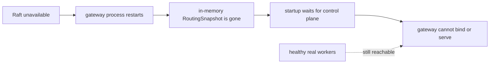
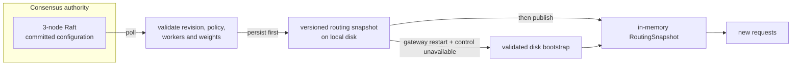
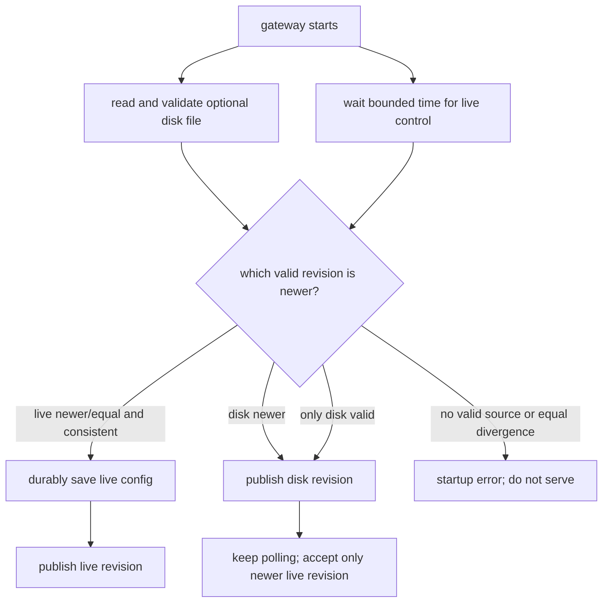
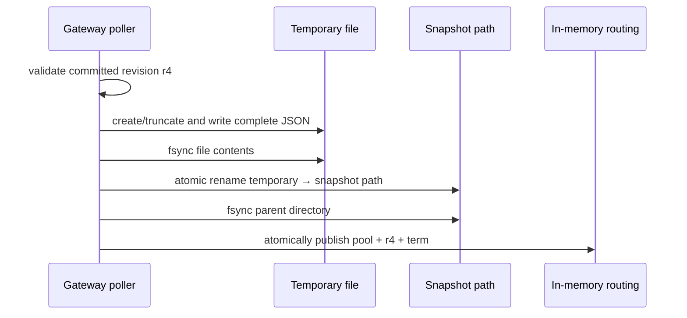
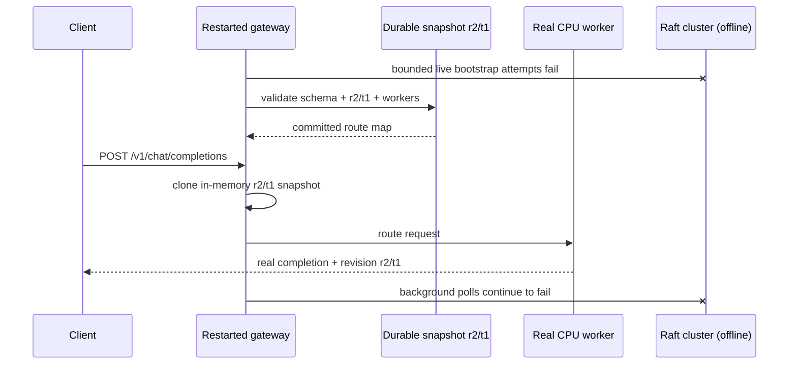

# RFC 0019: Restart-safe gateway routing snapshots

**Status:** Implemented | **Milestone:** v0.14

## What “RFC” means

RFC is short for **Request for Comments**. In InferLab, an RFC is a reviewable
engineering decision record: it names the failure, selects one design, records
why alternatives were rejected, declares invariants, and limits the claims that
the evidence may support.

The companion learning guide has a different job. It provides the mental movie,
expands the terms, follows each crash/recovery phase, and offers experiments that
do not require reading the complete implementation.

## Decision

v0.14 adds an optional durable restart cache for the gateway's last committed
routing configuration:

1. `INFERLAB_ROUTING_SNAPSHOT_PATH` enables one versioned JSON snapshot file;
2. live control-plane configuration remains the preferred bootstrap source;
3. `INFERLAB_CONTROL_BOOTSTRAP_WAIT_MS` bounds how long startup waits for a live
   control node before considering disk;
4. a live configuration is validated and durably saved before the gateway
   begins serving it;
5. a newer polled configuration is validated, written to a temporary file,
   synchronized, atomically renamed, and only then published to requests;
6. when no control node is reachable, a valid disk snapshot can bootstrap the
   gateway;
7. when both sources exist, the gateway never selects a lower revision;
8. equal revisions with unequal content fail closed rather than guessing;
9. corrupt or semantically invalid disk state is ignored when a valid live
   source exists, but startup fails when neither source is valid;
10. diagnostics expose bootstrap source, file path, persisted revision/time,
    live source URL, refresh error, and the applied routing revision; and
11. the proof uses real online-attention CPU workers through live bootstrap,
    total control outage, gateway restart, control recovery, newer
    reconciliation, stale-control rollback pressure, and speculative SSE.

This file is a cache of already committed routing state. It is not a second
consensus system and cannot accept configuration writes.

## The failure left by v0.13

v0.13 proved that a running gateway keeps serving from its in-memory committed
snapshot while Raft elects a leader. But process memory disappears when the
gateway itself restarts:



The workers may be healthy and the last route map may be committed, yet the
gateway cannot reconstruct it. That turns a simultaneous control-plane outage
and gateway restart into a data-plane outage.

## Architecture



Raft still decides what is committed. Disk only remembers one decision so that
a new gateway process can resume reads.

## Snapshot contents

The durable document stores cluster-owned routing identity, not every gateway
setting:

```text
inferlab.gateway-routing-snapshot.v1
├── saved_at_ms
├── revision
├── term
└── configuration
    ├── routing_policy
    └── workers[]
        ├── id
        ├── base_url
        └── weight
```

Admission capacity, timeouts, retry budgets, circuit thresholds, EWMA tuning,
hash virtual-node count, and worker concurrency stay in gateway environment
configuration. They are process policy, not Raft-owned cluster state.

## Bootstrap selection

Startup reads disk when configured and independently tries the live control
plane. Selection is monotonic:

| Live source | Disk source | Decision |
|---|---|---|
| valid, no disk | use live; persist before serving |
| valid, corrupt/missing disk | use live; replace disk before serving |
| unavailable, valid disk | use disk; keep polling live |
| unavailable, invalid/missing disk | fail closed |
| revision higher than disk | use live; persist higher revision |
| revision equal and content equal | use live |
| revision equal and content differs | fail closed: divergent identity |
| revision lower than disk | use disk; refuse rollback |



The bounded wait prevents an old disk snapshot from winning merely because a
healthy control node needed a few milliseconds to answer.

## Crash-safe file replacement

The gateway never edits the live snapshot file in place:



Expected crash outcomes:

| Crash point | Restart-visible result |
|---|---|
| before temporary write | old valid snapshot |
| during temporary write | old valid snapshot; incomplete temporary file is ignored |
| after temporary sync, before rename | old valid snapshot |
| after rename | new committed snapshot |
| after publish | new committed snapshot and matching in-memory state |

The ordering guarantees that no newly applied in-memory revision depends only
on volatile memory. A crash after rename but before publish may make restart see
the newer revision earlier than the old process did; that is safe because the
revision was already committed by Raft.

## Running reconciliation

Booting from disk is not the end state. The ordinary poller continues:

```mermaid
stateDiagram-v2
    [*] --> DiskR2: control unavailable; load r2
    DiskR2 --> ServingR2: serve real requests
    ServingR2 --> ObserveR4: control returns with committed r4
    ObserveR4 --> PersistR4: validate and persist r4
    PersistR4 --> ServingR4: atomically publish r4
    ServingR4 --> ObserveOldR2: later control source reports stale r2
    ObserveOldR2 --> ServingR4: ignore rollback and report freshness error
```



`bootstrap_source` remains `disk-snapshot` after reconciliation because it
describes how this process started. `source_url`, `last_refresh_ms`,
`persisted_revision`, and `last_error` describe subsequent contact and state.

## One request during complete control outage



The proof keeps workers alive while all three Raft processes are stopped. Four
of four real-model requests succeed after the gateway restarts from disk.

## Terms

| Term | Meaning in this RFC |
|---|---|
| **Durable** | Intended to survive process restart through file and directory synchronization. |
| **Atomic rename** | The destination name refers to the complete old file or complete new file, not a half-written mixture, on the tested local filesystem. |
| **Apply-before-publish rule** | Persist and synchronize a new committed configuration before making it available to requests. |
| **Bootstrap** | Reconstruct enough validated state to start the gateway process. |
| **Reconciliation** | Compare later live control state with the running snapshot and apply only a newer valid revision. |
| **Monotonic** | Applied routing revision never decreases. |
| **Fail closed** | Refuse to start when routing identity cannot be established safely. |
| **Stale-while-revalidate** | Temporarily serve from known committed state while trying to refresh it. |
| **Snapshot** | One complete routing document here; not Raft log compaction and not a model/KV snapshot. |
| **Authority** | The component allowed to decide new cluster state; still Raft, never the disk cache. |

## Observability

`/internal/workers.control_plane` adds:

| Field | Meaning |
|---|---|
| `bootstrap_source` | `live-control-plane` or `disk-snapshot` for this gateway process |
| `snapshot_path` | configured durable file path |
| `persisted_revision` | last revision successfully synchronized to that path |
| `persisted_at_ms` | local save timestamp for that revision |
| `source_url` | most recent live control node supplying/confirming state |
| `revision` / `term` | applied control identity reported by status |
| `last_refresh_ms` | most recent accepted live observation |
| `last_error` | outage, invalid update, persistence failure, or stale-revision rejection |

The existing `routing_snapshot` object remains authoritative for the pool a new
request will clone. Existing response revision/term headers continue to fence
each successful routed response.

## Invariants

1. Only a valid Raft-committed configuration or a validated durable copy of one
   may create a dynamic routing snapshot.
2. A revision is persisted before it is newly published to requests when the
   snapshot store is enabled.
3. The destination file is replaced by rename, never edited in place.
4. Schema, revision, term, policy, nonempty worker list, unique IDs, nonempty
   endpoints, and positive weights are validated before disk state is used.
5. Applied and persisted revisions never move backward.
6. Equal revision with different configuration content is an error.
7. A stale live control observation cannot replace a newer disk/in-memory
   revision.
8. Disk bootstrap does not disable background control-plane polling.
9. A persistence failure prevents the corresponding newer revision from being
   applied by the running gateway.
10. A corrupt disk file cannot cause static environment workers to be used
    silently when control-plane mode was explicitly configured.
11. Request snapshot and streaming invariants from RFC 0018 remain unchanged.
12. Fault injection targets only exact child processes created by the proof.

## Alternatives considered

### Keep retrying Raft forever during startup

Rejected as the only behavior. It preserves freshness but makes data-plane
availability depend on control recovery even when a committed route map and
healthy workers already exist.

### Fall back to `INFERLAB_WORKERS`

Rejected in explicit control-plane mode. Static environment state has no
committed revision/term and may describe a different cluster. Silent fallback
would erase the identity RFC 0018 introduced.

### Apply in memory, persist asynchronously later

Rejected because a gateway crash in the gap loses its newest applied revision
and can restart on older state. Persist-before-publish makes the restart
contract inspectable.

### Rewrite the destination file directly

Rejected because a crash or short write can destroy the only valid restart
copy. A temporary file plus atomic rename retains the old destination until the
new document is complete.

### Let live control always win, even at a lower revision

Rejected because a restored node set, wrong endpoint, or operator error could
roll routing backward. Higher committed log identity wins; equal divergence is
not resolved by guessing.

### Add a TTL and refuse old snapshots

Deferred. A time limit bounds staleness but introduces a wall-clock policy and
can force an avoidable outage even when routes remain correct. v0.14 exposes
`saved_at_ms` so a later operational policy can make that trade-off explicitly.

### Store the complete `WorkerPool`

Rejected. It contains process-local counters, circuits, leases, and policy
runtime state. Only the Raft-owned declarative configuration is durable; runtime
objects are rebuilt cleanly.

### Make the disk file writable as a configuration API

Rejected. That would create a second leaderless authority and bypass majority
commit. The file is read-only from the perspective of operators and requests.

### Use a database

Deferred. One small single-writer document does not justify a database. Atomic
local replacement exposes the crash contract with less machinery. Multiple
gateway writers sharing a path would require locking or a different store.

## Evidence

The retained proof passes 19/19 assertions:

- one initial leader commits round-robin revision 2/term 1 for two real CPU
  workers;
- live gateway startup synchronizes revision 2 before serving;
- the retained document has the expected schema and exact committed content;
- two live-start requests carry revision 2;
- the harness stops the exact gateway child and all three exact Raft children;
- the gateway restarts from disk in 221.203 ms in the retained run while every
  control node remains offline;
- four of four real-model requests succeed during the total control outage;
- the persisted Raft nodes restart, elect term 2, and commit weighted revision 4;
- the running gateway persists and applies revision 4;
- 3:1 weights produce an exact 6:2 eight-request schedule;
- an intentionally stale live cluster reports revision 2, while the restarted
  gateway retains revision 4 and records the rollback rejection;
- live and disk content that disagrees at the same revision fails closed;
- final speculative SSE uses revision 4, reconstructs the real completion, and
  ends in `[DONE]`;
- corrupt disk plus unavailable control exits nonzero;
- no routing temporary file remains after successful replacement; and
- all 14 non-stream requests plus the final stream succeed.


The 786.002 ms live, 221.203 ms offline, and 46.320 ms stale-guard startup times
are observations from one loopback run, not service-level objectives. Offline
startup intentionally includes the configured 150 ms live-control wait.

## Code and evidence map

| Responsibility | Location |
|---|---|
| Durable format, validation, sync, rename, and unit tests | `gateway/src/routing_snapshot_store.rs` |
| Bootstrap choice, persist-before-publish, and reconciliation | `gateway/src/main.rs` |
| Diagnostic fields | `gateway/src/lib.rs` |
| Restart/status probe | `benchmarks/gateway_restart_probe.py` |
| Machine-readable assertions | `benchmarks/check_gateway_restart.py` |
| Data-driven result chart | `benchmarks/render_gateway_restart_svg.py` |
| Exact-process orchestration | `scripts/proof-v0.14.sh` |
| Retained evidence | `docs/results/v0.14/raw/` |

## Limitations

- The proof uses one macOS local filesystem; network filesystems may have
  different rename and synchronization semantics.
- There is no checksum, signature, encryption, cluster ID, or authenticated
  provenance beyond schema and semantic validation.
- One gateway process is assumed to own one snapshot path. There is no
  cross-process file lock.
- RFC 0020 now adds a configurable cold-start maximum age and future-clock-skew
  rule. Runtime emergency revocation remains absent.
- A committed route can still name a worker that died after the snapshot was
  saved; ordinary retry/circuit behavior handles requests, but disk does not
  perform health discovery.
- The file is not a backup of the Raft log and cannot recover lost consensus
  history or accept writes.
- Snapshot persistence is local to each gateway; no shared gateway-state
  replication is implemented.
- The proof is loopback integration with two tiny CPU workers, not a multi-host
  partition, power-loss, filesystem-fault, sustained-load, or production-model
  test.
- CUDA remains unavailable on the retained host and is not advanced by this
  milestone.

The next reliability questions are runtime route expiry, cluster
identity/authenticated provenance, and filesystem fault injection. The
hardware-dependent inference boundary remains CUDA attention on an actual
NVIDIA environment.
