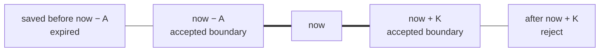
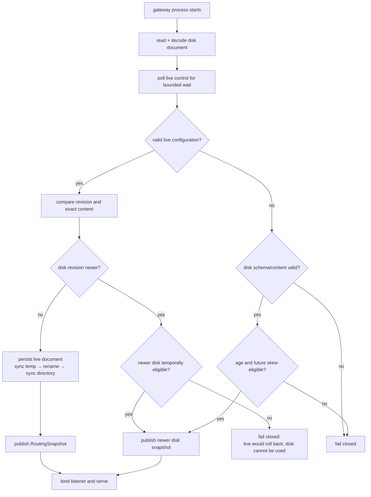
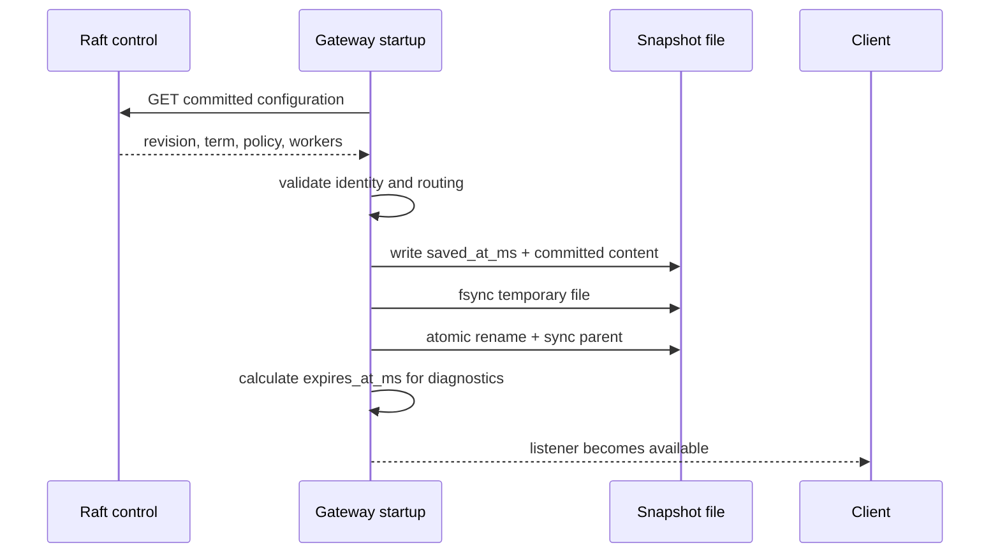
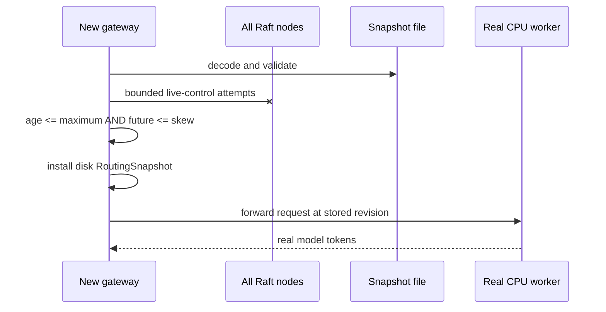
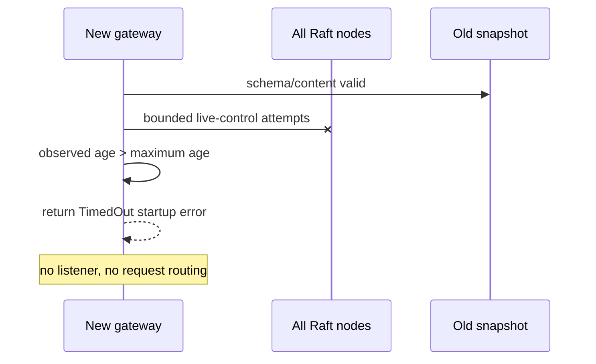

# RFC 0020: Bounded-age routing fallback

- **Status:** Accepted and implemented in v0.15
- **Date:** 2026-08-06
- **Authors:** InferLab learning project
- **Depends on:** RFC 0019 restart-safe routing snapshots

## What “RFC” means

**RFC** means **Request for Comments**. The name comes from the practice of
publishing a proposed technical decision so other engineers can challenge its
assumptions before the decision becomes expensive to change.

In InferLab, an RFC is the decision record:

- what problem owns this phase;
- what contract the code must preserve;
- why this approach was selected;
- which alternatives were rejected; and
- what the evidence does and does not prove.

The matching learning document explains the same system as a lesson. This RFC
is the engineering agreement.

## Decision summary

InferLab optionally limits how old a local routing snapshot may be when a new
gateway process cannot contact the control plane.

1. `INFERLAB_ROUTING_SNAPSHOT_MAX_AGE_MS` is optional. When absent, v0.14's
   unlimited-age fallback remains available. When present, it must be positive.
2. `INFERLAB_ROUTING_SNAPSHOT_MAX_FUTURE_SKEW_MS` defaults to 1,000 ms and
   limits how far a snapshot timestamp may appear ahead of the gateway clock.
3. Disk fallback is eligible only when:
   - the file passes schema and routing validation;
   - its observed age is less than or equal to the configured maximum; and
   - its timestamp is not farther into the future than the allowed skew.
4. A valid live control-plane response remains the preferred startup source.
   Live control can replace an expired or future-dated document with a new
   synchronized document.
5. Revision monotonicity remains independent of freshness. An old live revision
   cannot roll back a newer durable revision merely because the durable file
   has expired. If neither source is simultaneously safe, startup fails closed.
6. The policy is a **cold-start fallback gate**. It does not terminate an
   already-running gateway when time passes.

This deliberately trades some emergency availability for a bound on how long a
new process will trust disconnected local state.

## Context: what v0.14 still allowed

RFC 0019 made a committed route map survive a gateway restart. It answered:

> Can a new gateway recover the last committed routing identity while every
> Raft node is unavailable?

Yes—but the answer had no time limit. A file saved a week ago and a file saved
one second ago were equally eligible if their schema and contents were valid.
That is sometimes the correct availability policy, but it must be an explicit
choice. Worker endpoints may have been retired, access boundaries may have
changed, or operators may prefer an outage over resurrecting very old routes.

The missing distinction is:


A document can pass the first three checks and still fail the fourth.

## Scope

### In scope

- optional maximum age for cold-start disk fallback;
- bounded future-clock skew;
- fail-closed startup for expired or excessively future-dated disk state when
  live control is unavailable;
- live repair of an ineligible disk timestamp;
- diagnostics for the configured window and the observed disk-bootstrap age;
- unit tests, exact-process failure proof, real CPU requests, and SSE evidence.

### Out of scope

- stopping an already-running gateway when its last live refresh becomes old;
- signed time, trusted time service, NTP control, or monotonic time persisted
  across process restarts;
- emergency revocation broadcasts;
- cluster identity, signatures, encryption, or multi-writer file locking;
- changing Raft or placing a clock check in the request/token hot path;
- CUDA work.

## Terms and exact meanings

| Term | Meaning in v0.15 |
|---|---|
| `saved_at_ms` | Unix wall-clock time written after the live configuration is validated and before the synchronized file is returned from `save` |
| observation time | Gateway wall-clock time at the moment disk fallback is considered |
| observed age | `max(observation_time - saved_at_ms, 0)` |
| future delta | `max(saved_at_ms - observation_time, 0)` |
| maximum age | Oldest configured age still eligible; the boundary itself is accepted |
| maximum future skew | Largest configured future delta accepted as ordinary clock disagreement |
| freshness | A statement about time, not about route correctness or worker health |
| fail closed | Start no listener rather than guess which ineligible identity should serve |
| cold start | Creation of a new gateway process, before it accepts requests |
| live repair | Valid live control wins and atomically replaces an ineligible local timestamp |

## Freshness rule

For persisted timestamp `S`, observation time `N`, maximum age `A`, and maximum
future skew `K`:

```text
age         = max(N - S, 0)
future      = max(S - N, 0)
eligible    = age <= A  AND  future <= K
```

If no maximum age is configured, the `age <= A` condition is omitted. The
future-skew guard still applies.



The implementation uses saturating arithmetic for age and expiration to avoid
integer underflow or overflow. A timestamp within allowed future skew has age
zero.

## Complete startup decision



The live and disk checks answer different questions:

- revision/content comparison protects **identity monotonicity**;
- age/skew comparison protects **temporal eligibility**.

Neither check substitutes for the other.

## Decision matrix

| Live source | Disk source | Startup result | Reason |
|---|---|---|---|
| valid, same/newer revision | missing, corrupt, expired, or future-dated | use live and replace disk | authoritative source is reachable |
| valid, same revision and same content | fresh disk | use live | live is preferred |
| valid, same revision but different content | any age | fail closed | revision identity is ambiguous |
| valid but lower revision | newer and fresh disk | use disk | never roll back |
| valid but lower revision | newer but temporally ineligible disk | fail closed | live rolls back; disk cannot bootstrap |
| unavailable/invalid | fresh valid disk | use disk | bounded emergency availability |
| unavailable/invalid | expired disk | fail closed | age promise would be violated |
| unavailable/invalid | too-far-future disk | fail closed | age cannot be trusted |
| unavailable/invalid | missing/corrupt disk | fail closed | no valid identity source |

## Why the boundary is inclusive

`age == maximum_age` and `future_delta == maximum_future_skew` are accepted.
Configuration limits normally describe the final allowed value. Rejecting at
equality makes a 5,000 ms limit mean “strictly less than 5,000 ms,” which is
harder to reason about and test.

Unit tests therefore pin four edges:

- age exactly at the maximum: accept;
- age one millisecond beyond: reject;
- future delta exactly at the skew allowance: accept;
- future delta one millisecond beyond: reject.

## Write and request sequences

### Live configuration creates the time boundary



### Fresh disk preserves bounded availability



### Expired disk starts no data plane



## Configuration

```bash
INFERLAB_ROUTING_SNAPSHOT_PATH=./data/gateway-routing.json \
INFERLAB_ROUTING_SNAPSHOT_MAX_AGE_MS=300000 \
INFERLAB_ROUTING_SNAPSHOT_MAX_FUTURE_SKEW_MS=1000 \
INFERLAB_CONTROL_PLANE_URLS='http://127.0.0.1:7001,http://127.0.0.1:7002,http://127.0.0.1:7003' \
  cargo run -p gateway
```

This example allows disk bootstrap for five minutes after persistence and
allows one second of future clock skew.

An unset maximum age preserves v0.14's availability behavior. A configured
zero maximum age is rejected at startup because it is almost always a
misconfiguration, not a useful policy.

## Diagnostics

`GET /internal/workers` keeps routing and control state separate and adds:

```json
{
  "control_plane": {
    "bootstrap_source": "disk-snapshot",
    "snapshot_max_age_ms": 5000,
    "snapshot_max_future_skew_ms": 100,
    "bootstrap_snapshot_age_ms": 433,
    "persisted_at_ms": 1785994262482,
    "persisted_expires_at_ms": 1785994267482,
    "persisted_revision": 2
  },
  "routing_snapshot": {
    "control_revision": 2,
    "control_term": 1
  }
}
```

`bootstrap_snapshot_age_ms` is populated only when disk actually bootstrapped
the process. `persisted_expires_at_ms` describes cold-start eligibility; it is
not a promise that a running process will stop at that time.

## Invariants

1. A disk bootstrap with configured maximum age never accepts age greater than
   that maximum.
2. A disk bootstrap never accepts future delta greater than configured skew.
3. Boundary equality is accepted.
4. Freshness never permits revision rollback or equal-revision divergence.
5. Live control may repair expired/future disk state only after the live
   configuration passes ordinary validation and monotonic comparison.
6. Ineligible disk plus unavailable/invalid live control starts no listener.
7. Persist-before-publish and atomic replacement from RFC 0019 remain intact.
8. One immutable routing snapshot remains attached to each request and stream.
9. Static-worker mode remains independent of control-plane snapshot policy.
10. No clock check enters the per-request or per-token path.

## Alternatives considered

### Trust every valid snapshot forever

Retained as the explicit behavior when no maximum age is configured. It
maximizes restart availability but offers no operator-controlled stale-state
bound.

### Make maximum age mandatory

Rejected. The right availability/safety trade-off depends on deployment. A
local teaching cluster and a route map containing sensitive production
destinations should not be forced to use the same policy.

### Delete expired files

Rejected. Expiry means “not eligible for disconnected bootstrap,” not “forget
the committed revision.” The file still prevents a lower live revision from
silently rolling the gateway backward and remains useful evidence for diagnosis.

### Use filesystem modification time

Rejected. Copying, restoring, or metadata operations can change modification
time without validating committed content. `saved_at_ms` belongs to the
versioned document and is written by the same persist-before-publish operation.

### Use only a monotonic clock

Impossible across process restart without additional persisted clock state.
Monotonic clocks are excellent for request deadlines inside one process, but
their origin is not stable across a new process.

### Refresh `saved_at_ms` on every control poll

Rejected for this phase. It would write the file every poll, couple liveness
traffic to disk wear, and blur “configuration persisted” with “source recently
observed.” A rate-limited verification lease belongs in a later runtime-lease
design.

### Stop a running gateway when the timestamp expires

Deferred. That changes the live data-plane availability contract and requires
readiness state, last-successful-control verification, and request behavior at
lease expiry. v0.15 only decides whether a new process may cold-start from disk.

### Ignore future timestamps using saturating age alone

Rejected. Saturation would call a timestamp years in the future “age zero” and
could make it eligible indefinitely. Future delta is a separate check.

## Evidence

The retained v0.15 proof passes 15/15 assertions:

- one leader commits revision 2 for two real CPU workers;
- live startup exposes a 5,000 ms maximum age and 100 ms skew allowance;
- the durable document exactly matches committed routing identity;
- exact gateway and three-node control children are stopped;
- a 433 ms-old snapshot bootstraps during total control outage;
- three of three real-model requests succeed from fresh disk;
- a synthetic 6,000 ms age fails closed;
- a synthetic 5,100 ms future delta fails closed;
- persisted Raft nodes recover in a newer term;
- valid live control replaces the ineligible future-dated document;
- two live-repair requests and final speculative SSE succeed;
- no temporary routing file remains; and
- all seven non-stream requests plus final SSE succeed.


The 230.748 ms fresh-disk boot and 100.618 ms live-repair boot are one loopback
observation, not service-level objectives.

## Code and evidence map

| Responsibility | Location |
|---|---|
| Timestamp policy, exact boundary math, and unit tests | `gateway/src/routing_snapshot_store.rs` |
| Environment parsing, startup decision, and diagnostics | `gateway/src/main.rs` |
| Public diagnostic fields | `gateway/src/lib.rs` |
| Gateway status observation | `benchmarks/gateway_restart_probe.py` |
| Machine-readable proof checks | `benchmarks/check_snapshot_freshness.py` |
| Data-driven evidence chart | `benchmarks/render_snapshot_freshness_svg.py` |
| Exact-process orchestration and time mutation | `scripts/proof-v0.15.sh` |
| Retained evidence | `docs/results/v0.15/raw/` |

## Limitations and next boundary

- The experiment mutates JSON timestamps deliberately; it does not change the
  host clock or test NTP behavior.
- Unix wall time is not trusted or authenticated. A privileged actor can edit
  the file and the clock.
- The policy applies only at gateway startup. An already-running gateway does
  not revoke its route map at `persisted_expires_at_ms`.
- `saved_at_ms` records persistence, not the last successful equal-revision
  control poll.
- Expiry does not prove workers are dead; freshness and health are different.
- The proof is macOS loopback, not a multi-host partition, filesystem fault,
  sustained load, production model, or power-loss experiment.
- Cluster identity, signatures, file locking, and shared gateway state remain
  absent.
- CUDA attention still requires actual NVIDIA hardware.

The next reliability boundary is a **runtime routing lease**: rate-limited live
verification, readiness behavior when the lease expires, and an explicit
operator choice between serving stale routes and stopping new requests. That
boundary is now implemented by [RFC 0021](0021-runtime-routing-lease.md).
