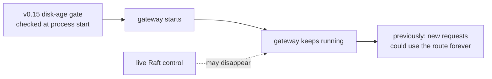
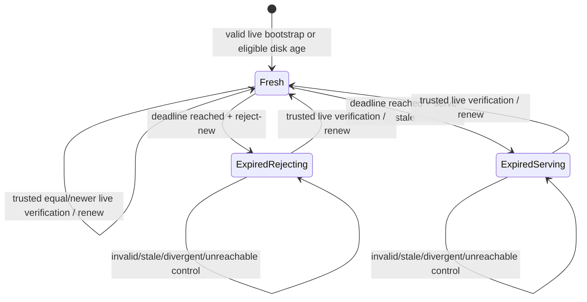
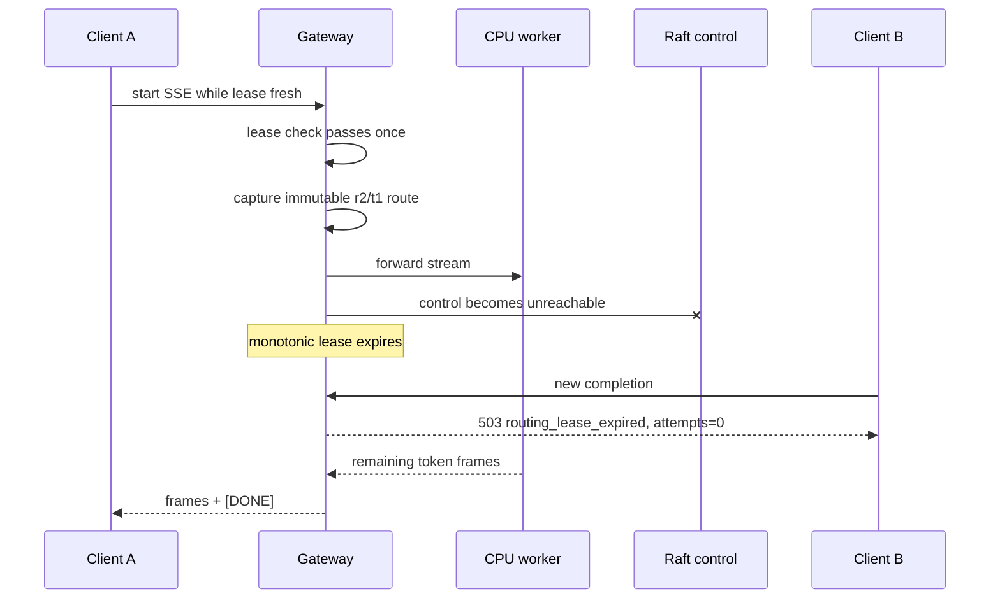
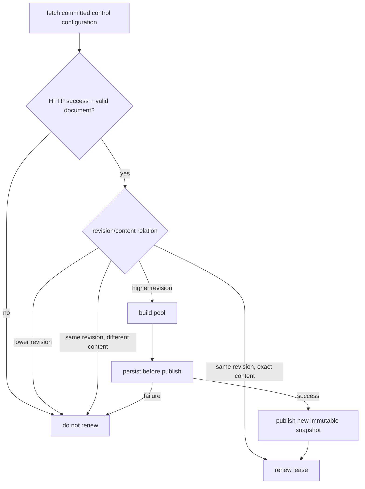

# RFC 0021: Runtime routing lease

- **Status:** Accepted and implemented in v0.16
- **Date:** 2026-08-06
- **Authors:** InferLab learning project
- **Depends on:** RFC 0019 restart-safe routing snapshots and RFC 0020 bounded-age routing fallback

## What “RFC” means

**RFC** means **Request for Comments**. An RFC is a technical decision record:
it states the problem, proposed contract, rejected alternatives, proof, and
known limits so engineers can challenge the design before depending on it.

In InferLab, the RFC is the engineering agreement. The matching learning
document teaches the mental model and gives experiments to build intuition.

## Decision summary

InferLab can now place an optional time lease on a running gateway's last
trusted live control-plane verification.

1. `INFERLAB_ROUTING_LEASE_MS` enables a positive runtime lease. When absent,
   runtime behavior remains unchanged.
2. `INFERLAB_ROUTING_LEASE_EXPIRY_ACTION` is explicit:
   - `reject-new` makes `/readyz` return 503 and rejects newly admitted
     completions with a structured 503 after expiry;
   - `serve-stale` keeps readiness and new traffic open while exposing the
     expired state.
3. A request checks the lease once, before selecting a worker. A request or SSE
   stream admitted while fresh retains its immutable routing snapshot and may
   finish after expiry.
4. A valid live observation renews the lease when it is either:
   - exactly the already-applied revision and content; or
   - a valid higher revision that was persisted and published successfully.
5. Network reachability alone does not renew. Invalid, lower-revision,
   equal-revision divergent, unpersistable, or unbuildable configurations do
   not renew.
6. Lease enforcement uses a monotonic process clock. Unix wall time is exposed
   only for diagnostics and for carrying already-spent age across disk
   bootstrap.
7. `/health` remains process liveness. `/readyz` answers whether the process is
   currently willing to accept new requests under its chosen lease policy.

This makes stale-serving risk visible and operator-controlled without tearing
down work already admitted under a valid routing identity.

## Context: the limitation after v0.15

RFC 0020 bounded whether a **new process** could trust an old route file. It did
not govern a gateway that had already been running for hours while every control
node was unreachable.



A cold-start age limit and a runtime lease answer different questions:

- **cold-start age:** may this new process adopt disconnected disk identity?
- **runtime lease:** may this running process admit another request without
  recent trusted live verification?

## Scope

### In scope

- optional runtime lease duration;
- trusted renewal on equal or higher valid live control state;
- once-only request admission check;
- explicit `reject-new` and `serve-stale` expiry actions;
- `/readyz`, structured 503 response, zero worker attempts, and diagnostics;
- disk bootstrap that spends the snapshot's already-observed age;
- deterministic unit/integration tests and a real-worker, three-Raft-node proof.

### Out of scope

- aborting requests or streams already admitted;
- emergency revocation of a route before the lease naturally expires;
- cryptographic control identity, signed time, or trusted NTP;
- changing the route because a worker is unhealthy;
- synchronizing lease state across multiple gateway processes;
- load-balancer draining semantics beyond the `/readyz` response;
- persisting every equal-revision verification to disk;
- multi-host partitions, suspend/resume, production-model load, or CUDA.

## Terms and exact meanings

| Term | Meaning in v0.16 |
|---|---|
| Routing identity | Immutable worker pool, routing policy, committed revision, and Raft term captured by a request |
| Runtime routing lease | Time-limited permission for this process to admit new requests using its current routing identity |
| Trusted live verification | A validated live control observation consistent with monotonic revision/content rules |
| Renewal | Moving the monotonic deadline forward by the configured lease duration after trusted verification |
| Expiry | Current monotonic time is at or beyond the deadline |
| Admission | The one-time decision that a new request may enter routing |
| Existing request | A request that passed the lease check before expiry, including a streaming response still emitting tokens |
| `reject-new` | Expired policy that makes readiness false and stops a new request before worker selection |
| `serve-stale` | Expired policy that leaves readiness/admission open and explicitly accepts stale-route risk |
| Liveness | Whether the gateway process is running; represented by `/health` |
| Readiness | Whether the gateway currently accepts new traffic under policy; represented by `/readyz` |
| Monotonic clock | In-process elapsed-time clock that does not move backward when wall time changes |
| Wall clock | Unix time used for human-readable diagnostics and cross-process disk age |
| Stale route | A route whose lease expired; this does not by itself mean its workers are unhealthy or its revision is wrong |
| Zero worker attempt | Rejection happened before selection/forwarding; `x-inferlab-attempts: 0` |

## State machine



The action is configured for the process; it is not chosen per request.

## Admission and stream ownership



The lease grants **admission**, not ongoing ownership. Once a request owns a
routing snapshot and worker attempt, rechecking the clock during every token
would create partial responses and couple control liveness to generation.

## Decision table

| Lease state | Expiry action | `/health` | `/readyz` | New request | Existing stream |
|---|---|---:|---:|---|---|
| fresh | either | 200 | 200 | route normally | continue |
| expired | `reject-new` | 200 | 503 | structured 503, attempts 0 | continue |
| expired | `serve-stale` | 200 | 200 | route using stale snapshot | continue |

Keeping `/health` separate prevents a supervisor from confusing “process is
dead” with “process is deliberately refusing new traffic.”

## What renews the lease



An equal revision is important: consensus configuration does not need to change
for the gateway to learn that the authority is still reachable and agrees with
the identity already in use.

## Clock model

Inside one process:

```text
deadline = monotonic_now + lease_duration
fresh    = monotonic_now < deadline
```

On trusted renewal:

```text
deadline            = monotonic_now + lease_duration
last_verified_ms    = wall_now_ms
expires_at_ms       = wall_now_ms + lease_duration_ms   # diagnostic
```

For disk bootstrap, the route file's observed wall-clock age is already spent:

```text
remaining_runtime_lease = max(lease_duration - bootstrap_snapshot_age, 0)
```

This prevents a six-second-old disk snapshot from receiving a brand-new
700 ms lease simply because a new process started. Enforcement then switches to
the monotonic clock so later wall-clock jumps cannot extend or shorten the
running process's deadline.

## Configuration

```bash
INFERLAB_ROUTING_SNAPSHOT_PATH=./data/gateway-routing.json \
INFERLAB_ROUTING_SNAPSHOT_MAX_AGE_MS=300000 \
INFERLAB_ROUTING_LEASE_MS=30000 \
INFERLAB_ROUTING_LEASE_EXPIRY_ACTION=reject-new \
INFERLAB_CONTROL_PLANE_URLS='http://127.0.0.1:7001,http://127.0.0.1:7002,http://127.0.0.1:7003' \
  cargo run -p gateway
```

Rules:

- the lease duration must be positive;
- a lease requires control-plane URLs because otherwise no trusted renewal
  source exists;
- the expiry action defaults to `reject-new` when a lease is enabled;
- an absent lease duration preserves the prior runtime behavior;
- disk maximum age and runtime lease are independent knobs.

## API behavior

### Readiness while fresh

```json
{
  "status": "ready",
  "reason": null,
  "routing_lease": {
    "enabled": true,
    "duration_ms": 700,
    "expiry_action": "reject-new",
    "state": "fresh",
    "accepting_new_requests": true,
    "remaining_ms": 694,
    "renewals": 3,
    "rejections": 0
  }
}
```

### New request after `reject-new` expiry

```http
HTTP/1.1 503 Service Unavailable
retry-after: 1
x-inferlab-attempts: 0
```

```json
{
  "error": {
    "type": "routing_lease_expired",
    "reason": "runtime_routing_lease_expired",
    "message": "gateway cannot verify its routing configuration; retry after control-plane recovery",
    "retryable": true
  }
}
```

`GET /internal/workers` exposes the same dynamic lease snapshot next to—but not
inside—the control-plane and routing-snapshot objects.

## Invariants

1. Lease expiry is evaluated with monotonic elapsed time inside a process.
2. Disk bootstrap never resets already-spent snapshot age to a full lease.
3. Invalid, lower, divergent, unpersistable, and unbuildable live observations
   never renew the lease.
4. Valid equal-revision exact content renews without rewriting disk.
5. Valid higher revision renews only after persist-before-publish succeeds.
6. A request evaluates the runtime lease exactly once before worker selection.
7. `reject-new` expiry causes zero worker attempts for a new request.
8. Expiry never changes the immutable routing snapshot of an existing request.
9. `serve-stale` is explicit and observable; it is never silently selected.
10. `/health` reports process liveness independently of routing readiness.
11. Static-worker mode remains unchanged when no runtime lease is configured.

## Alternatives considered

### Abort all in-flight requests at expiry

Rejected. It produces partial SSE, discards paid computation, and changes a
valid request's contract after admission. Emergency revocation needs a separate,
stronger mechanism with explicit cancellation semantics.

### Recheck on every retry or token

Rejected. A request would mix admission policy across one logical operation and
could fail after emitting bytes. One immutable request snapshot remains the
ownership boundary.

### Always serve stale

Rejected as an implicit default. Some deployments prefer availability; others
must drain when authority cannot be verified. The risk choice belongs in
configuration and diagnostics.

### Always reject after expiry

Not universal. It is the conservative default, but an isolated teaching or edge
deployment may intentionally prefer stale availability.

### Let `/health` return 503

Rejected. Liveness and readiness have different consumers and meanings. A live
but unready process should remain inspectable and recover in place.

### Renew on any successful HTTP response

Rejected. Reachability does not prove agreement. A stale or divergent control
node must not extend trust in the current route.

### Give disk bootstrap a full new lease

Rejected. Repeated restarts could make old state effectively immortal. The
bootstrap snapshot age is subtracted from the runtime duration.

### Persist every equal-revision renewal

Rejected. Runtime verification can occur every poll without causing continuous
disk writes. `saved_at_ms` remains “committed content durably saved,” while
`last_verified_ms` is in-memory liveness evidence.

### Use wall clock for the whole runtime lease

Rejected. NTP or manual clock movement can extend or prematurely expire a
running lease. Wall time is necessary across restart; monotonic time is safer
for elapsed duration inside one process.

## Evidence

The retained v0.16 proof passes 17/17 assertions with three persistent Raft
processes and one real online-attention CPU worker:

- live equal-revision observations keep a 700 ms lease fresh;
- a 1,627.223 ms SSE starts before total control outage and finishes after
  expiry with `[DONE]`;
- `reject-new` changes readiness to 503;
- the rejected completion returns structured 503 with zero worker attempts;
- persistent Raft nodes recover in term 2;
- the unchanged revision 2 renews the running gateway from 70 to 83 observed
  renewals and readiness returns to 200;
- a real request succeeds after renewal;
- a disk-bootstrapped `serve-stale` gateway begins expired, stays ready, and
  serves a new real request plus speculative SSE; and
- exact child-process fault scope and atomic snapshot cleanup remain intact.


The timings are one macOS loopback observation, not service-level objectives.

## Code and evidence map

| Responsibility | Location |
|---|---|
| Monotonic guard, state, counters, and boundary tests | `gateway/src/routing_lease.rs` |
| Request gate, `/readyz`, structured 503, diagnostics | `gateway/src/lib.rs` |
| Environment parsing, disk-age carry-over, trusted renewal | `gateway/src/main.rs` |
| Request/readiness/state observation | `benchmarks/runtime_lease_probe.py` |
| Machine-readable proof checks | `benchmarks/check_runtime_lease.py` |
| Data-driven evidence chart | `benchmarks/render_runtime_lease_svg.py` |
| Exact-process orchestration | `scripts/proof-v0.16.sh` |
| Retained evidence | `docs/results/v0.16/raw/` |

## Limitations and next boundary

- The lease says “control recently confirmed this identity,” not “every worker
  is healthy.” Circuit breakers and request attempts still own worker health.
- The wall-clock diagnostic timestamp is not authenticated.
- The lease exists independently in each gateway process; there is no shared
  drain decision.
- A request admitted one instant before expiry may run until its ordinary
  deadline.
- `serve-stale` can continue indefinitely by design until live control returns
  or an operator stops the process.
- Equal-revision renewal does not refresh the disk timestamp, so a later cold
  start can still fail the separate maximum-age policy.
- The proof does not cover network partitions where different gateways see
  different control subsets, load-balancer readiness propagation, power loss,
  suspend/resume, or hostile time/file mutation.

The next reliability boundary is authenticated and coordinated control:
cluster identity, signed configuration/time evidence, emergency revocation, and
multi-gateway drain behavior under real network partitions.
