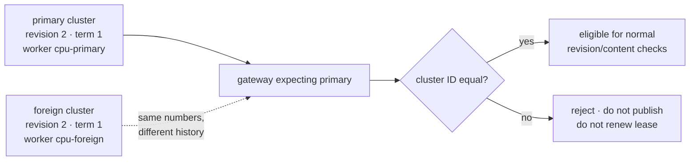
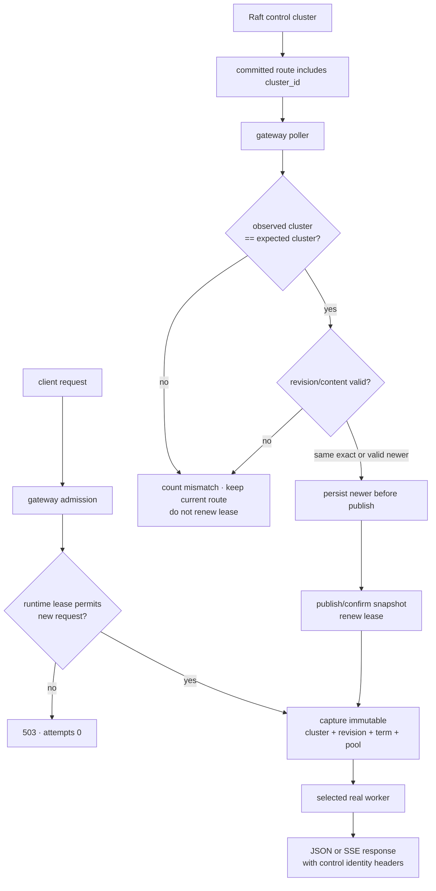
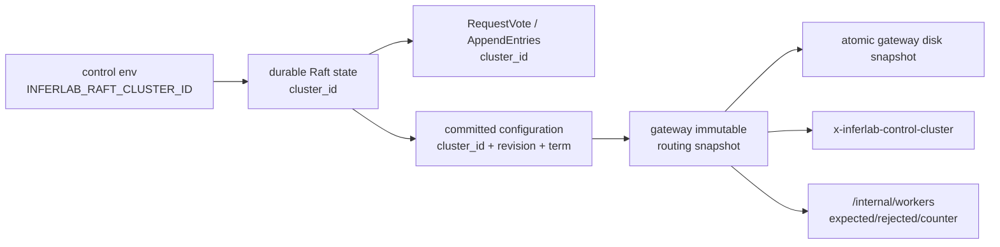
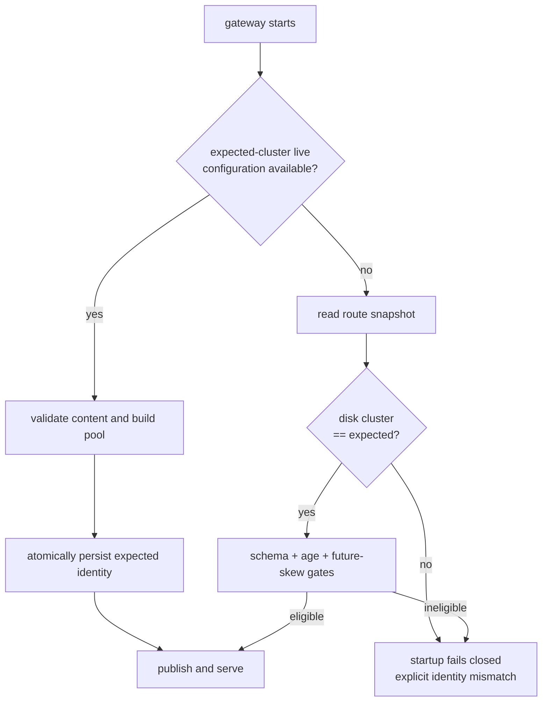

# RFC 0022: Control-plane cluster identity fencing

- **Status:** Accepted and implemented in v0.17
- **Date:** 2026-08-06
- **Authors:** InferLab learning project
- **Depends on:** RFC 0019 restart-safe routing snapshots, RFC 0020 bounded-age
  routing fallback, and RFC 0021 runtime routing lease

## What “RFC” means

**RFC** means **Request for Comments**. In InferLab it is a technical decision
record: the problem, chosen contract, alternatives, proof, and known limits are
written down so the design can be challenged without reverse-engineering code.
The matching learning document teaches the same boundary with analogies and
experiments.

## Decision summary

Every Raft control plane and every route it commits now carries a stable,
operator-configured `cluster_id`.

1. A control node reads `INFERLAB_RAFT_CLUSTER_ID`, persists it in its data
   directory, includes it in Raft RPCs and committed configurations, and refuses
   to reopen that directory under another identity.
2. A gateway with live control URLs expects `INFERLAB_CONTROL_CLUSTER_ID`. It
   skips foreign-cluster responses and continues trying the other configured
   URLs.
3. A foreign response cannot publish a route or renew the runtime routing lease,
   even when its revision, term, and JSON content are otherwise valid.
4. Disk fallback is allowed only when the stored `cluster_id` equals the
   expected cluster. A valid expected live response may replace a foreign disk
   file because live authority wins bootstrap selection.
5. The request-visible control identity is the tuple
   `(cluster_id, revision, term)`. Response headers and diagnostics expose it.
6. Cluster IDs must be 1–128 ASCII letters, digits, `.`, `_`, or `-`. The default
   `inferlab-default` exists for compatibility and teaching; deployments should
   set a unique explicit value.

The boundary prevents accidental cross-cluster adoption. It is a namespace
fence, not cryptographic authentication.

## Context: the limitation after v0.16

Revision and term are meaningful only inside one Raft history. Two independent
clusters can both truthfully say “revision 2, term 1” while naming different
workers.



Without a cluster namespace, a port reassignment, stale DNS record, restored
environment, or copied route file could make the gateway compare unrelated
numbers as though they came from the same consensus log.

## Scope

### In scope

- persisted Raft cluster identity and data-directory relabel protection;
- cluster identity on vote and append RPCs;
- identity in committed routing configuration and gateway disk snapshots;
- live-response and disk-bootstrap fencing at the gateway;
- mismatch diagnostics, response headers, counters, and lease behavior;
- compatibility migration for pre-v0.17 control state;
- deterministic tests plus an exact-process, two-cluster, real-worker proof.

### Out of scope

- TLS, mTLS, signatures, certificates, or key rotation;
- protection against an attacker who deliberately claims the expected string;
- cryptographically authenticated timestamps or disk files;
- automatic cluster-ID generation or a global registry;
- Raft membership changes or cross-cluster state migration;
- emergency cancellation of already-admitted requests;
- worker identity authentication, worker health, multi-host partitions, or CUDA.

## Terms and exact meanings

| Term | Meaning in v0.17 |
|---|---|
| Cluster ID | Stable namespace string identifying one intended Raft history |
| Expected cluster | Cluster ID configured on a gateway |
| Observed cluster | Cluster ID carried by a live response or disk snapshot |
| Foreign cluster | Any observed ID unequal to the expected ID |
| Identity fence | Equality check performed before revision, term, route publication, or lease renewal |
| Routing identity | `(cluster_id, revision, term)` plus the immutable routing content captured by a request |
| Relabel | Starting a control data directory with a configured ID different from its persisted ID |
| Live repair | Valid expected-cluster live state atomically replacing a foreign disk snapshot |
| Namespace fence | Accidental-mixing protection based on an asserted name, without cryptographic proof |
| Authentication | Verifiable proof that the sender is authorized to claim an identity; not provided here |

## End-to-end request and control flow



The cluster fence comes before the ordinary monotonic revision check. This
ordering is essential: comparing revisions first gives unrelated histories a
meaning they do not have.

## Identity propagation



### Control-node startup

On first v0.17 open:

- new or legacy state with an empty ID adopts the configured ID and persists it;
- state with the same ID opens normally;
- state with a different ID fails before participating in Raft.

This makes copying a data directory into a differently named cluster an
explicit operator action rather than a silent relabel. The legacy adoption is a
one-time compatibility concession and cannot establish historical provenance.

### Raft peer RPCs

`RequestVote` and `AppendEntries` carry the sender's asserted cluster ID. A
receiver checks it before acquiring or mutating consensus state. A foreign RPC,
even with a much higher term, cannot advance the receiver's term, vote, log, or
counters.

### Gateway live polling

The poller can have several control URLs. A foreign response is recorded and
skipped; later URLs are still tried. If every usable response is foreign, the
existing route remains installed, `last_error` identifies the mismatch, and no
runtime lease renewal occurs. Under `reject-new`, the gateway becomes unready
after the ordinary lease deadline.

### Gateway disk bootstrap



Live expected authority is checked before disk fallback. Therefore a foreign
file does not permanently brick a gateway: once valid expected live control is
available, persist-before-publish repairs the file.

## Configuration

Control node:

```bash
INFERLAB_RAFT_CLUSTER_ID=prod-inference-eu1 \
INFERLAB_RAFT_NODE_ID=control-a \
INFERLAB_RAFT_DATA_PATH=./data/control-a.json \
  cargo run -p control-plane
```

Gateway:

```bash
INFERLAB_CONTROL_CLUSTER_ID=prod-inference-eu1 \
INFERLAB_CONTROL_PLANE_URLS='http://127.0.0.1:7001,http://127.0.0.1:7002,http://127.0.0.1:7003' \
INFERLAB_ROUTING_SNAPSHOT_PATH=./data/gateway-routing.json \
INFERLAB_ROUTING_LEASE_MS=30000 \
INFERLAB_ROUTING_LEASE_EXPIRY_ACTION=reject-new \
  cargo run -p gateway
```

The gateway setting matters only for control-plane mode. Static-worker mode has
no control-cluster identity. Every member of one Raft cluster must use the same
ID, and gateways consuming it must expect that exact ID.

## Observable behavior

A successful response carries:

```http
x-inferlab-control-cluster: prod-inference-eu1
x-inferlab-config-revision: 2
x-inferlab-config-term: 1
```

`GET /internal/workers` distinguishes the configured expectation from the last
foreign observation:

```json
{
  "control_plane": {
    "expected_cluster_id": "prod-inference-eu1",
    "last_rejected_cluster_id": "staging-inference",
    "cluster_mismatch_rejections": 28,
    "last_error": "control cluster identity mismatch: expected 'prod-inference-eu1', observed 'staging-inference'"
  },
  "routing_snapshot": {
    "control_cluster_id": "prod-inference-eu1",
    "control_revision": 2,
    "control_term": 1
  }
}
```

The mismatch counter counts observations, not unique clusters and not client
requests. Its exact value depends on poll timing.

## Invariants

1. A control data directory cannot be reopened under a different nonempty ID.
2. A foreign Raft RPC is rejected before any term, vote, log, or counter change.
3. A committed control configuration carries the persisted cluster ID.
4. A gateway compares cluster ID before revision or content.
5. A foreign live response cannot publish a route or renew a runtime lease.
6. A foreign disk snapshot cannot bootstrap the expected cluster.
7. Valid expected live state can atomically repair a foreign disk file.
8. Equal revision and term numbers from different clusters never imply equal
   identity.
9. Each request keeps one immutable cluster/revision/term/pool snapshot.
10. Existing admitted work is not cancelled merely because later polls observe
    a foreign cluster.
11. Static-worker mode remains unchanged.

## Alternatives considered

### Treat `(revision, term)` as globally unique

Rejected. Both counters start small and are allocated independently by each
Raft history. Equality across histories is coincidence, not identity.

### Infer identity from the list of node URLs

Rejected. Addresses change, DNS can be repointed, and a new cluster can bind the
same ports. Transport location is not consensus-history identity.

### Infer identity from worker URLs or route content

Rejected. Two clusters may intentionally share workers, and a foreign route can
temporarily have identical content before diverging. Content equality does not
prove authority.

### Accept any valid live control over disk

Rejected. Liveness is not authorization. A reachable staging or restored
cluster must not overwrite the route for the expected production namespace.

### Permanently reject startup if the disk ID is foreign

Rejected. Disk is a fallback cache, not the authority. Valid expected live
control can safely replace it; only foreign-disk-only startup fails.

### Stop trying URLs after the first foreign response

Rejected. A stale or misrouted endpoint should not hide a later healthy member
of the expected cluster.

### Generate a random cluster ID on every node

Rejected. Peers need one shared stable identity across restart. Provisioning it
explicitly makes environment ownership visible and reproducible.

### Use the default ID everywhere

Supported only for compatibility, not recommended. If unrelated deployments all
use `inferlab-default`, the namespace fence cannot distinguish them.

### Add signatures or mTLS now

Deferred. Authentication requires key distribution, rotation, revocation,
certificate/name binding, and failure policy. The string fence is the smallest
step that fixes accidental history mixing while exposing exactly why it is not
a security boundary.

## Evidence

The retained v0.17 proof runs two independent persistent three-node Raft
clusters and two real CPU workers. Both clusters commit revision 2 in term 1,
but use `inferlab-primary` and `inferlab-foreign` identities and route to
different workers.

- the gateway accepts the primary route and starts a real SSE;
- the exact primary control processes stop and the foreign cluster takes their
  addresses;
- at least 28 foreign observations by the expiry capture cannot replace the
  primary route or renew its 700 ms runtime lease;
- the admitted 2,029.448 ms stream finishes, while a new request is rejected
  unready with zero attempts and reaches neither worker;
- the persistent primary cluster returns in term 2 and renews the unchanged
  primary revision without restarting the gateway;
- foreign-disk-only bootstrap fails with an explicit expected/observed mismatch;
- valid primary live control repairs that foreign identity on disk; and
- all 18 assertions pass, including a final real speculative SSE.


Loopback timings and mismatch counts are observations, not service-level
objectives. Unit tests separately prove that foreign peer RPCs cannot mutate a
node term and that a persisted data directory cannot be relabelled.

## Code and evidence map

| Responsibility | Location |
|---|---|
| Cluster ID schema, validation, RPC/config/status fields | `control-plane/src/model.rs` |
| Durable identity, relabel fence, peer-RPC fence | `control-plane/src/raft.rs` |
| Raft cluster environment wiring | `control-plane/src/main.rs` |
| Gateway disk schema and expected-cluster validation | `gateway/src/routing_snapshot_store.rs` |
| Immutable request snapshot, headers, diagnostics | `gateway/src/lib.rs` |
| Live polling, bootstrap selection, mismatch accounting | `gateway/src/main.rs` |
| Machine-readable proof checks | `benchmarks/check_cluster_identity.py` |
| Data-driven evidence chart | `benchmarks/render_cluster_identity_svg.py` |
| Exact-process two-cluster orchestration | `scripts/proof-v0.17.sh` |
| Retained evidence | `docs/results/v0.17/raw/` |

## Limitations and next boundary

- A malicious or misconfigured sender can claim the expected string. There is
  no cryptographic proof of origin.
- The compatibility default separates nothing when all environments keep it.
- Legacy empty-ID Raft state adopts the first configured v0.17 ID; this protects
  future relabels but cannot reconstruct past provenance.
- Snapshot files and wall-clock timestamps are not signed.
- A request admitted before lease expiry can finish under its captured route.
- Cluster identity says which authority supplied the route, not whether a worker
  is healthy or the model output is correct.
- The proof does not cover hostile traffic, certificate rotation, multi-host
  network partitions, fleet-wide drain coordination, or power-loss filesystems.

The next security/reliability boundary is authenticated control evidence:
signed configurations or mutually authenticated transport, key rotation and
revocation, followed by explicit emergency route cancellation and coordinated
multi-gateway drain semantics.

Detached Ed25519 route authentication, overlap rotation, and local revocation
are now implemented in [RFC 0023](0023-signed-control-configurations.md). Writer
authorization and authenticated peer transport remain later boundaries.
