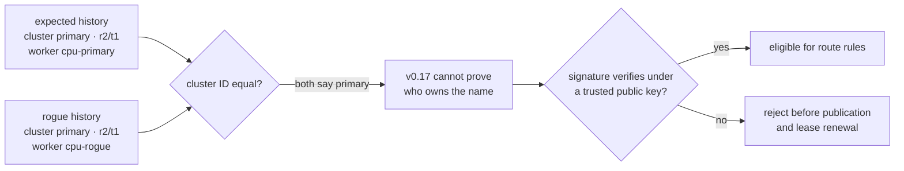
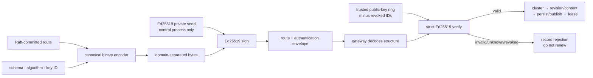
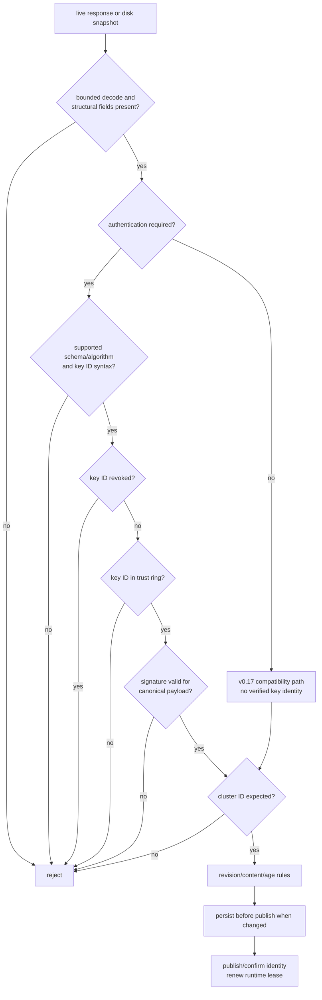
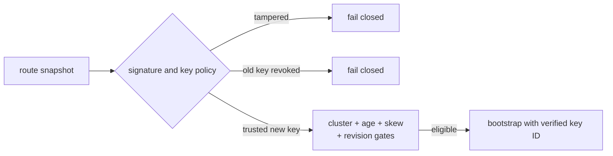

# RFC 0023: Signed control configurations and key rotation

- **Status:** Accepted and implemented in v0.18
- **Date:** 2026-08-06
- **Authors:** InferLab learning project
- **Depends on:** RFC 0019 restart-safe routing snapshots, RFC 0021 runtime
  routing lease, and RFC 0022 control-cluster identity fencing

## What “RFC” means

**RFC** means **Request for Comments**. It is a technical decision record: the
problem, threat model, chosen contract, rejected alternatives, executable proof,
and remaining limits are written before the behavior becomes a hidden assumption.
The Phase 23 learning guide teaches the same boundary with analogies and labs.

## Decision summary

InferLab can now authenticate the bytes of a committed routing configuration
with an Ed25519 signature and rotate that signing identity without changing the
Raft route revision.

1. A control process may load an Ed25519 private seed and key ID. Its control
   configuration endpoint returns the committed route plus a signed envelope.
2. The signature covers a deterministic binary payload containing the envelope
   schema, algorithm, key ID, cluster ID, revision, term, routing policy, and
   every ordered worker ID, URL, and weight.
3. A gateway may configure a public-key trust ring. When it does, unsigned,
   malformed, unknown-key, revoked-key, or invalid-signature configurations are
   rejected before cluster, revision, publication, disk, or lease logic.
4. The verified key ID joins the immutable request routing identity and appears
   in diagnostics and `x-inferlab-control-key-id`.
5. Overlapping old/new trusted keys permit rotation. When the same consensus
   payload arrives under a different trusted key, the gateway persists the new
   envelope before publishing the new key identity and renewing its runtime
   lease. No route revision bump is required.
6. Trust-ring order is monotonic, oldest to newest. After observing a
   higher-preference key, the gateway refuses a later lower-key response—even if
   that old key remains trusted—so mixed control rollout cannot roll disk or
   request identity backward.
7. Explicit local revocation takes precedence over the trust ring. A valid
   old-key disk snapshot fails after that key ID is revoked, while a new-key
   snapshot remains eligible.
8. Authentication remains opt-in for backward compatibility. Without
   `INFERLAB_CONTROL_TRUSTED_KEYS`, v0.17 unsigned behavior is preserved and no
   key ID is presented as verified.

This boundary authenticates routing bytes to provisioned public keys. It does
not provide transport secrecy, writer authorization, or replay-proof freshness.

## Context: the limitation after v0.17

The cluster ID is an asserted namespace string. A second control plane can copy
the expected string and independently produce the same revision and term.



A namespace answers “which name?” A signature answers “which holder of a
provisioned private key produced these exact bytes?”

## Scope

### In scope

- standard Ed25519 signing and strict verification;
- a deterministic, versioned, length-prefixed payload format;
- key ID binding, public-key trust rings, and explicit key-ID revocation;
- mandatory verification for live and disk state when authentication is enabled;
- signature-only key rotation at an unchanged route revision;
- persist-before-publish for a rotated signed envelope;
- immutable request key identity, response headers, counters, and diagnostics;
- deterministic cryptographic/unit tests and an exact-process real-worker proof.

### Out of scope

- encrypting HTTP traffic or hiding route contents;
- TLS/mTLS certificates, certificate authorities, or hostname binding;
- authenticating Raft peer RPC transport;
- authorizing the `PUT /v1/control/config` administrative writer;
- hardware security modules, secret managers, protected memory, or seed rotation
  automation;
- online revocation distribution, expiry inside the signature, transparency
  logs, or globally monotonic counters;
- cancelling already-admitted requests, multi-gateway coordination, or CUDA.

## Threat model

### Protected in v0.18

- a rogue live control cluster that knows the expected `cluster_id` but lacks a
  trusted private key;
- accidental or deliberate modification of any signed route field on disk or
  in transit;
- use of an unknown or explicitly revoked key ID;
- accidental acceptance of an old-key disk cache after local revocation.

### Not protected in v0.18

- theft of a trusted private seed;
- compromise of a control process that can use that seed;
- an unauthenticated client asking the official control API to commit a route;
- replay of a still-eligible, correctly signed configuration;
- denial of service by dropping, delaying, or corrupting traffic;
- mutation of unsigned `saved_at_ms`, readiness, or other diagnostics;
- attacks on unsigned Raft peer messages.

The proof demonstrates the first list and deliberately documents the second.

## Terms and exact meanings

| Term | Meaning in v0.18 |
|---|---|
| Private seed | 32 secret bytes used to construct an Ed25519 signing key |
| Public key | 32 non-secret bytes provisioned into the gateway trust ring |
| Digital signature | 64-byte Ed25519 value proving a private key signed one exact canonical message |
| Key ID | Operator-readable namespace for selecting a public key; itself included in the signed payload |
| Trust ring | Gateway map from allowed key IDs to Ed25519 public keys |
| Key preference | Position in the configured trust ring; later means newer |
| Revocation set | Key IDs denied even if their public keys remain in the trust ring |
| Canonical payload | One deterministic byte representation shared by signer and verifier |
| Envelope | Schema, algorithm, key ID, and Base64 signature attached to the route response |
| Authentication | Verification that exact bytes were signed by a trusted, non-revoked key |
| Integrity | Any covered byte change makes signature verification fail |
| Authenticity | The signer possessed the private key matching a provisioned public key |
| Confidentiality | Keeping bytes secret; signatures do not provide it |
| Replay | Reusing an older valid signed message without changing it |
| Signature-only rotation | Same cluster/revision/term/route re-signed with a different trusted key |
| Overlap window | Period when gateways trust old and new public keys during rollout |
| Writer authorization | Permission to create a new committed route; not solved by this RFC |

## Signing and verification chain



Verification precedes cluster identity. Otherwise a field supplied by an
unauthenticated sender would influence the trust decision before its bytes were
authenticated.

## Canonical payload

JSON text is not signed directly because whitespace, object-key order, and
number formatting can produce different bytes for the same data. InferLab uses
a small deterministic binary encoding:

```text
domain = "inferlab.control-routing.v1\0"

domain
+ len32(schema)       + UTF-8(schema)
+ len32(algorithm)    + UTF-8(algorithm)
+ len32(key_id)       + UTF-8(key_id)
+ len32(cluster_id)   + UTF-8(cluster_id)
+ u64be(revision)
+ u64be(term)
+ len32(policy)       + UTF-8(policy)
+ u32be(worker_count)
+ for each worker in committed order:
     len32(id)         + UTF-8(id)
   + len32(base_url)   + UTF-8(base_url)
   + u32be(weight)
```

All lengths and integers are unsigned big-endian. Worker order is covered
because it can affect routing behavior. Domain separation prevents the same
signature from being interpreted as a signature for another InferLab message
type. The schema and algorithm are covered so they cannot be relabelled.

This is a project protocol, not a claim that it is a general canonicalization
standard.

## HTTP envelope

An authenticated response retains the original route shape and adds:

```json
{
  "cluster_id": "inferlab-primary",
  "revision": 2,
  "term": 1,
  "configuration": {
    "routing_policy": "round-robin",
    "workers": [
      {
        "id": "cpu-primary",
        "base_url": "http://127.0.0.1:9904",
        "weight": 1
      }
    ]
  },
  "authentication": {
    "schema": "inferlab.control-authentication.v1",
    "algorithm": "ed25519",
    "key_id": "primary-2026-a",
    "signature": "base64-ed25519-signature"
  }
}
```

The committed route remains consensus state. The envelope is deterministically
created at the control HTTP boundary from that committed state. It is not a new
Raft log entry.

## Gateway decision order



An HTTP 200 is transport success. It is not authentication success.

## Runtime and request ownership

```mermaid
sequenceDiagram
    participant C as Client A
    participant G as Gateway
    participant P as Primary control · old key
    participant X as Rogue control · unknown key
    participant W as Primary worker
    participant B as Client B

    P->>G: signed primary/r2/t1 · key A
    G->>G: verify A; publish and renew
    C->>G: start SSE
    G->>G: capture cluster/r2/t1/key A/pool
    G->>W: forward stream
    X->>G: primary/r2/t1 · rogue key · rogue worker
    G->>G: unknown key; reject; no renewal
    Note over G: runtime lease expires
    B->>G: new request
    G-->>B: 503 · attempts 0
    W-->>G: remaining frames
    G-->>C: frames and [DONE]
```

The key ID becomes part of the immutable request observation. A later rotation
does not rewrite a stream that already owns key A's verified route.

## Key rotation protocol

```mermaid
sequenceDiagram
    participant O as Operator
    participant G as Gateway
    participant C as Control cluster
    participant D as Durable route file

    O->>G: trust key A + key B
    C->>G: route r2 signed by A
    G->>D: persist r2/A
    O->>C: switch signer A → B
    C->>G: identical route r2 signed by B
    G->>G: verify B; payload equals current r2
    G->>D: persist r2/B before publish
    G->>G: publish key B identity; renew lease
    C->>G: lagging node serves valid r2/A
    G->>G: reject key downgrade; do not renew from A
    O->>G: revoke key A after rollout
    Note over G,D: r2/B remains eligible; r2/A fails
```

Rotation separates two identities:

- **consensus payload identity:** cluster, revision, term, policy, workers;
- **authentication envelope identity:** schema, algorithm, key ID, signature.

Changing only the second must not be called an equal-revision content conflict.
The gateway compares the unsigned consensus payload for divergence, then treats
a verified key change as a persist-before-publish rotation.

### Safe rollout order

1. Provision key B's public key to every gateway while key A still signs.
2. Put B after A and confirm `[A, B]` appears in
   `trusted_signing_key_ids`. The order is the rotation preference.
3. Switch all control processes to key B.
4. Confirm `active_signing_key_id` and durable snapshots report B.
5. Add A to `INFERLAB_CONTROL_REVOKED_KEY_IDS` or remove it from trust.
6. Verify an old A-signed disk fixture is refused.

Revoking A before gateways trust/observe B creates an intentional outage.

## Disk behavior

The authentication envelope is stored with the route. On disconnected startup:



`saved_at_ms` is deliberately outside the signed route payload because it is
created by each gateway's local atomic write. The existing maximum-age,
future-skew, and runtime-lease rules still own time eligibility. An attacker who
can rewrite both file time and a previously valid signed route can still attempt
replay; signature validity alone is not freshness.

Authenticated expected live state may repair an invalid-signature or revoked-key
disk file. The valid live response is the stronger available source.

## Configuration

### Control processes

Every member serving one cluster during a rollout uses the same active signing
identity:

```bash
INFERLAB_RAFT_CLUSTER_ID=prod-inference-eu1 \
INFERLAB_CONTROL_SIGNING_KEY_ID=route-2026-a \
INFERLAB_CONTROL_SIGNING_PRIVATE_KEY_B64='<base64-32-byte-seed>' \
  cargo run -p control-plane
```

Both signing variables must be present together. Without them, the endpoint
remains unsigned for compatibility. The private seed is never logged, but an
environment variable is not a production secret-management recommendation.

### Gateway

```bash
INFERLAB_CONTROL_CLUSTER_ID=prod-inference-eu1 \
INFERLAB_CONTROL_TRUSTED_KEYS='route-2026-a=<base64-public-key>,route-2026-b=<base64-public-key>' \
INFERLAB_CONTROL_REVOKED_KEY_IDS='' \
INFERLAB_CONTROL_PLANE_URLS='http://127.0.0.1:7001,http://127.0.0.1:7002,http://127.0.0.1:7003' \
INFERLAB_ROUTING_SNAPSHOT_PATH=./data/gateway-routing.json \
INFERLAB_ROUTING_LEASE_MS=30000 \
INFERLAB_ROUTING_LEASE_EXPIRY_ACTION=reject-new \
  cargo run -p gateway
```

Trust entries use `key-id=base64-public-key`, comma-separated. Key IDs allow
letters, digits, `.`, `_`, and `-`, up to 128 bytes. Public keys decode to
exactly 32 bytes; private seeds decode to exactly 32 bytes; signatures decode to
exactly 64 bytes. List keys from oldest to newest. Reordering an existing trust
ring changes the gateway's monotonic rotation policy and must be treated as an
operator change, not cosmetic formatting.

## Observable behavior

Successful authenticated responses include:

```http
x-inferlab-control-cluster: prod-inference-eu1
x-inferlab-control-key-id: route-2026-b
x-inferlab-config-revision: 2
x-inferlab-config-term: 1
```

`GET /internal/workers` exposes policy and history separately:

```json
{
  "control_plane": {
    "authentication_required": true,
    "trusted_signing_key_ids": ["route-2026-a", "route-2026-b"],
    "revoked_signing_key_ids": [],
    "active_signing_key_id": "route-2026-a",
    "last_rejected_signing_key_id": "rogue-2026-x",
    "signature_verifications": 79,
    "signature_rejections": 28,
    "signing_key_downgrade_rejections": 0,
    "last_authentication_error": "control signing key 'rogue-2026-x' is not trusted"
  },
  "routing_snapshot": {
    "control_cluster_id": "prod-inference-eu1",
    "control_signing_key_id": "route-2026-a",
    "control_revision": 2,
    "control_term": 1
  }
}
```

Counters count observations and vary with poll timing. Historical
`last_authentication_error` remains available after recovery while operational
`last_error` clears on a later valid observation.

## Invariants

1. Authentication-required mode never accepts an unsigned configuration.
2. Schema, algorithm, key ID, cluster, revision, term, policy, ordered workers,
   URLs, and weights are all signature-covered.
3. Verification and key policy run before cluster or revision comparison.
4. Unknown and revoked key IDs cannot publish or renew the runtime lease.
5. Any signed payload mutation fails strict Ed25519 verification.
6. A verified equal payload under a new trusted key is rotation, not divergence.
7. Rotation persists the new envelope before publishing its key identity.
8. Once a higher-preference key is active or durable, a lower-preference key
   cannot roll it backward or renew trust.
9. A request captures one cluster/key/revision/term/pool identity.
10. Existing admitted work is not cancelled by later authentication failure.
11. A valid old-key disk snapshot fails when its key ID is revoked.
12. A valid new-key disk snapshot remains eligible under the existing
    cluster/time/revision policies after old-key revocation.
13. Disabled authentication preserves the v0.17 compatibility path and never
    claims a key was verified.

## Alternatives considered

### Sign raw JSON bytes

Rejected. Equivalent objects can serialize with different whitespace or key
ordering. A deterministic binary payload makes the exact contract inspectable.

### Build custom cryptography

Rejected. InferLab defines only message framing and key policy. Ed25519 signing
and strict verification come from the maintained `ed25519-dalek` implementation.

### HMAC with one shared secret

Rejected for this boundary. Every gateway would need the forging secret. With
Ed25519, gateways receive public verification keys and cannot sign routes.

### TLS alone

Not sufficient for durable route files. TLS authenticates a connection while it
exists; a detached signature remains verifiable after the response is persisted.
TLS/mTLS is still valuable for peer and client transport.

### Signature alone, without cluster ID

Rejected. One signing key might intentionally serve several environments.
Cluster namespace and cryptographic key answer different questions and are both
covered by the signed payload.

### Treat a changed signature as route divergence

Rejected. Ed25519 is deterministic for one key/payload, but legitimate key
rotation changes key ID and signature while consensus content remains equal.

### Require a new Raft route revision for key rotation

Rejected for the response-signing model. Key lifecycle is operational metadata,
not a routing-policy change. Persisting the replacement envelope still makes the
transition crash-safe.

### Immediately delete the old key from trust

Rejected as a rollout default. An overlap window lets controls and gateways
change in either order. Explicit revocation is the final deny step.

### Put signature expiry in the payload

Deferred. It introduces signed time, clock policy, renewal availability, and
offline behavior. Existing disk age and runtime lease remain explicit, separate
freshness controls.

### Dynamically fetch the trust ring from the same control plane

Rejected. Trusting a key list supplied by the party being authenticated is
circular without an already trusted root and signed rotation protocol.

## Evidence

The retained v0.18 proof runs two independent three-node Raft histories that
both claim `inferlab-primary`, revision 2, term 1. The expected history signs
with `primary-2026-a`; the rogue history routes to another real worker and signs
with untrusted `rogue-2026-x`.

- the gateway verifies and persists the old-key route;
- at least 25 rogue-key responses are rejected by the lease-expiry capture,
  without a cluster mismatch because the rogue copied the expected namespace;
- an already-admitted 2,026.254 ms real SSE completes under its old-key identity;
- the expired gateway rejects a new request with zero attempts at either worker;
- persistent primary control returns in Raft term 2 using trusted
  `primary-2026-b`;
- the unchanged revision-2 route rotates to key B, is persisted, renews the
  lease, and serves a real request without restarting the gateway;
- 24 later cryptographically valid key-A observations are rejected as a
  monotonic key downgrade and cannot renew; restored key B renews again;
- changing one signed worker ID causes offline signature verification failure;
- the valid old-key disk snapshot fails under explicit revocation;
- the new-key disk snapshot bootstraps and serves real request/SSE traffic while
  the old key is revoked; and
- all 23 assertions pass.


The rejection count and loopback durations are observations, not service-level
objectives.

## Code and evidence map

| Responsibility | Location |
|---|---|
| Canonical payload, Ed25519 sign/verify, trust/revocation policy | `control-auth/src/lib.rs` |
| Signed HTTP envelope generation | `control-plane/src/lib.rs` |
| Control signing-key environment wiring | `control-plane/src/main.rs` |
| Gateway authentication adapter and payload equality | `gateway/src/control_authentication.rs` |
| Live/disk verification, rotation, counters, lease renewal | `gateway/src/main.rs` |
| Immutable request key identity, header, diagnostics | `gateway/src/lib.rs` |
| Signed durable envelope | `gateway/src/routing_snapshot_store.rs` |
| Machine-readable proof checks | `benchmarks/check_signed_control.py` |
| Data-driven evidence chart | `benchmarks/render_signed_control_svg.py` |
| Exact-process orchestration | `scripts/proof-v0.18.sh` |
| Retained evidence | `docs/results/v0.18/raw/` |

## Limitations and next boundary

- The official `PUT /v1/control/config` endpoint still lacks writer
  authentication/authorization. A caller can ask the legitimate cluster to
  commit and sign a route. This RFC authenticates delivery, not administrative
  intent.
- Raft peer RPCs still use the v0.17 string fence rather than mTLS or signatures.
- All control processes share one raw private seed through an environment
  variable. There is no HSM, secret manager, file-permission protocol, or
  zeroization guarantee.
- A compromised trusted signer can forge any route in its namespace.
- Revocation is local static gateway configuration, not an online fleet-wide
  event, signed revocation list, or emergency cancellation signal.
- A valid signed route can be replayed while ordinary revision, age, and lease
  rules still consider it eligible. `saved_at_ms` is not signed.
- Signatures do not encrypt HTTP, bind hostnames, authenticate clients, or stop
  traffic analysis and denial of service.
- Requests admitted before trust expiry retain their captured route.
- The proof is single-host loopback and does not cover hostile multi-host
  partitions, production secret storage, throughput, or CUDA.

RFC 0024 now authorizes administrative control mutations with signed writer
intent, freshness, revision fencing, and replicated provenance. Continue with
[RFC 0024](0024-authorized-control-writers.md) and the
[Phase 24 learning guide](../learning/phase-24-authorized-control-writers.md).
Raft peer and gateway/control service identity, online revocation, emergency
cancellation, and coordinated fleet drain behavior remain later boundaries.
