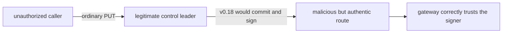
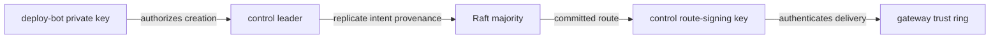
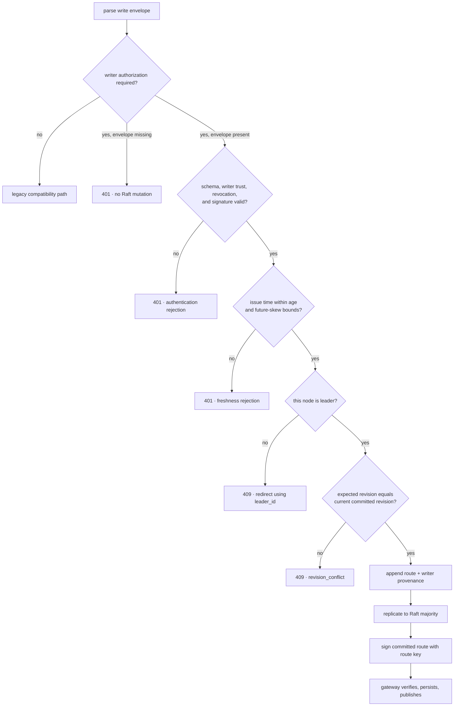
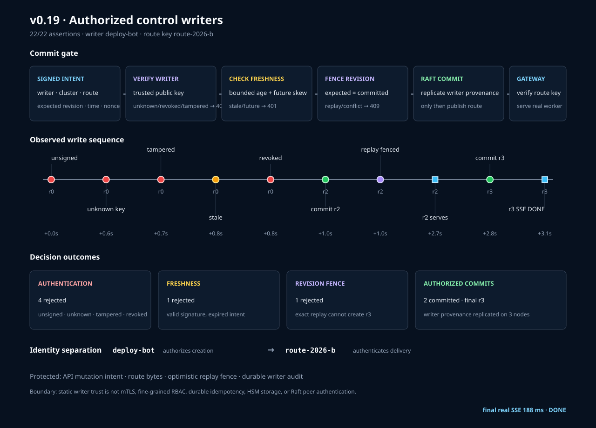

# RFC 0024: Authorized administrative control writers

- Status: Implemented
- Milestone: v0.19
- Date: 2026-08-06
- Depends on: RFC 0023 signed control configurations

## What “RFC” means

RFC means **Request for Comments**. In InferLab, an RFC is the engineering
decision record: it states the problem, the chosen contract, rejected
alternatives, evidence, and remaining limitations. The learning document turns
that decision into a guided mental model; it does not replace the contract.

## Decision summary

Protect `PUT /v1/control/config` with a separately provisioned Ed25519 writer
identity. The signed administrative intent binds:

- authorization schema and algorithm;
- writer ID;
- HTTP method and path;
- target control-cluster ID;
- expected committed revision;
- issue time and nonce;
- routing policy; and
- every ordered worker ID, URL, and weight.

The leader verifies writer trust, revocation, signature, bounded freshness, and
expected revision before appending anything to Raft. Successful entries durably
replicate writer ID, issue time, and nonce as audit provenance. The control
cluster then uses its separate route-delivery key from RFC 0023 to sign the
committed route returned to gateways.

Writer authorization is optional only for backward compatibility. Configuring
`INFERLAB_CONTROL_WRITER_KEYS` switches the endpoint into required mode; legacy
unsigned request bodies then receive HTTP 401. When authorization is disabled,
legacy bodies remain accepted but authorization-shaped bodies are rejected so a
client can never mistake an ignored signature for an enforced one.

## Context: the limitation after v0.18

RFC 0023 proved that a gateway received route bytes signed by a trusted control
authority. It did not prove that the authority was asked to create those bytes
by an authorized administrator.



The signature on delivery could therefore be perfectly valid while the
administrative intent was illegitimate. v0.19 closes that specific gap.

## Scope

### In scope

- Public-key authentication for administrative route writers.
- Static allow-list authorization by writer ID.
- Explicit writer revocation overriding trust.
- A canonical signed write-intent representation.
- Bounded intent age and future-clock skew.
- Optimistic concurrency through a signed expected revision.
- Durable writer provenance replicated in the Raft log.
- Diagnostics that distinguish authentication, freshness, and revision
  rejection.
- Compatibility mode when no writer trust ring is configured.
- Exact-process evidence through the real Raft, gateway, worker, JSON, and SSE
  path.

### Out of scope

- mTLS, HTTP confidentiality, or hostname authentication.
- Cryptographic authentication of Raft peer RPCs.
- Fine-grained roles such as read-only, emergency-only, or worker-prefix scope.
- A durable idempotency-result ledger for ambiguous client timeouts.
- Online or fleet-wide writer revocation distribution.
- HSM-backed keys, secret managers, certificate authorities, or key attestation.
- Multi-person approval, change tickets, policy-as-code, or human identity
  federation.
- Retroactive cancellation of already admitted inference requests.

## Threat model

### Protected in v0.19

- An unsigned caller cannot create a route when authorization is required.
- Possession of an unknown writer key does not grant write access.
- Changing a signed policy, worker, expected revision, target cluster, issue
  time, or nonce invalidates the signature.
- A statically revoked writer cannot write even if its signature is valid.
- A captured intent outside the freshness window is rejected.
- Replaying an already committed intent fails its signed expected-revision
  fence.
- Rejected requests do not append a Raft log entry or change the route.
- A committed entry records which configured writer authorized it.

### Not protected in v0.19

- A stolen authorized writer private key can authorize writes until revoked.
- A compromised leader can bypass its own HTTP gate or forge audit fields.
- A replay racing before the first copy commits is not covered by a durable
  nonce/idempotency ledger.
- Static trust files do not propagate revocation atomically across a fleet.
- Plain HTTP can be observed, redirected, or denied on a hostile network.
- Raft peers still rely on cluster string fencing rather than cryptographic
  service identity.

## Terms and exact meanings

| Term | Meaning in v0.19 |
|---|---|
| Authentication | Proving that the request signature matches a provisioned writer public key |
| Authorization | The policy decision that this writer ID is in the allowed, non-revoked set |
| Administrative intent | The exact proposed route plus its target, revision precondition, time, and nonce |
| Writer ID | Stable public identifier selecting a writer verification key |
| Route signing key | Separate control-server key authenticating committed route delivery to gateways |
| Canonical payload | One deterministic binary representation of the signed intent |
| Freshness window | Maximum accepted age plus bounded future-clock skew |
| Expected revision | The committed revision the writer believes it is replacing |
| Optimistic concurrency | Commit only if current state still equals the signed precondition |
| Replay | Resubmitting previously signed bytes |
| Nonce | Caller-chosen unique correlation value included in the signature and audit record |
| Provenance | Writer ID, issue time, and nonce replicated with a successful Raft command |
| Revision conflict | HTTP 409 because signed expected revision differs from current committed revision |
| Trust ring | Static mapping from authorized writer IDs to Ed25519 public keys |
| Revocation | Explicit deny-list decision that overrides a matching trusted key |

## Identity separation

The writer key and route-delivery key deliberately have different jobs.



Sharing one key would widen compromise impact and make it impossible to reason
about whether a signature meant “an administrator requested this” or “the
control service delivered this.”

## HTTP request envelope

Required mode accepts this shape:

```json
{
  "expected_revision": 2,
  "configuration": {
    "routing_policy": "least-in-flight",
    "workers": [
      {
        "id": "cpu-authorized",
        "base_url": "http://127.0.0.1:9914",
        "weight": 2
      }
    ]
  },
  "authorization": {
    "schema": "inferlab.control-write-authorization.v1",
    "algorithm": "ed25519",
    "writer_id": "deploy-bot",
    "issued_at_ms": 1786017473752,
    "nonce": "deploy-update-0001",
    "signature": "base64-ed25519-signature"
  }
}
```

The signature does not cover ordinary JSON formatting. It covers the canonical
binary representation described next.

## Canonical write payload

The byte sequence uses a fixed domain followed by length-prefixed UTF-8 strings
and big-endian integers:

```text
domain = "inferlab.control-write.v1\0"
schema
algorithm
writer_id
"PUT"
"/v1/control/config"
cluster_id
expected_revision: u64
issued_at_ms: u64
nonce
routing_policy
worker_count: u32
for each ordered worker:
    id
    base_url
    weight: u32
```

Binding method, path, and cluster prevents a valid signature from being moved
to a different API operation or control namespace. Binding expected revision
makes the precondition part of the writer's intent rather than a mutable
transport header.

## Decision order



Signature verification precedes freshness and revision decisions so no
untrusted caller can smuggle mutable values into the trusted decision path.
The revision check occurs under the same serialized proposal lock used for the
append, avoiding a local check-then-append race.

## Freshness policy

For server time `now`:

```text
issued_at_ms <= now + max_future_skew_ms
now - issued_at_ms <= max_age_ms
```

Both thresholds are server configuration. The timestamp is signed, so a relay
cannot refresh an old intent by editing it. Clock checks reduce the useful life
of captured requests but require operational clock discipline.

## Expected revision and replay

```mermaid
sequenceDiagram
    participant W as "deploy-bot"
    participant L as "leader"
    participant R as "Raft majority"

    W->>L: signed intent(expected=0, nonce=A)
    L->>L: verify writer + freshness + current=0
    L->>R: append and commit revision 2
    L-->>W: 200 revision 2
    W->>L: replay identical signed bytes(expected=0, nonce=A)
    L->>L: verify signature; observe current=2
    L-->>W: 409 revision_conflict
```

This is an optimistic replay fence, not a complete idempotency protocol. If two
copies race before one commits, the serialized revision check allows at most
one append on a leader. An ambiguous timeout across leadership change still
requires the client to read current state and reconcile; the service does not
retain a durable nonce-to-result table.

## Durable provenance

The Raft command stores optional writer provenance:

```json
{
  "writer_id": "deploy-bot",
  "issued_at_ms": 1786017473752,
  "nonce": "deploy-update-0001"
}
```

It is applied with the committed configuration and appears in control status
on every node. Legacy entries remain readable because provenance is optional.
The gateway intentionally persists only the signed routing envelope; it does
not need administrative provenance to route requests.

## Configuration

### Control nodes

```bash
INFERLAB_CONTROL_WRITER_KEYS='deploy-bot=<base64-public-key>,break-glass=<base64-public-key>'
INFERLAB_CONTROL_REVOKED_WRITER_IDS='break-glass'
INFERLAB_CONTROL_WRITE_MAX_AGE_MS=30000
INFERLAB_CONTROL_WRITE_MAX_FUTURE_SKEW_MS=5000
```

Every control node should receive the same trust and revocation policy. An
empty writer-key setting preserves the pre-v0.19 unsigned compatibility path.
Revocations without a trust ring are rejected at startup. A signed-envelope
shape is refused in compatibility mode rather than silently treated as legacy.

### Signing a request

The educational helper reads these client-side variables:

```bash
INFERLAB_CONTROL_WRITER_ID=deploy-bot
INFERLAB_CONTROL_WRITER_PRIVATE_KEY_B64='<base64-private-seed>'
```

Production systems should use protected key agents or workload identity rather
than raw environment variables.

## Observable behavior

`GET /v1/control/status` adds:

```json
{
  "write_authorization": {
    "required": true,
    "trusted_writer_ids": ["deploy-bot", "revoked-bot"],
    "revoked_writer_ids": ["revoked-bot"],
    "max_age_ms": 1000,
    "max_future_skew_ms": 100,
    "verified_intents": 4,
    "committed_writes": 2,
    "authentication_rejections": 4,
    "freshness_rejections": 1,
    "revision_conflicts": 1,
    "last_authorized_writer_id": "deploy-bot"
  }
}
```

Counters are process-local diagnostics; replicated provenance is the durable
record. HTTP outcomes are:

| Outcome | Status | Raft mutation |
|---|---:|---|
| Missing, unknown, revoked, or invalid signature | 401 | None |
| Stale or too-far-future signed intent | 401 | None |
| Follower receives otherwise valid intent | 409 `not_leader` | None on that node |
| Expected revision differs | 409 `revision_conflict` | None |
| Valid, fresh, current intent reaches majority | 200 | One committed entry |

## Invariants

1. Required mode never accepts a legacy unsigned body.
2. Every field capable of changing route meaning is signed.
3. Revocation wins over a valid public-key signature.
4. Authentication succeeds before freshness or revision state is trusted.
5. Rejected authorization/freshness/revision requests append nothing.
6. Expected revision is checked while proposals are serialized.
7. A successful authorized command replicates its writer provenance.
8. Writer identity and route-delivery signing identity remain separate.
9. Gateway publication still requires the RFC 0023 route signature.
10. Compatibility mode never labels an unverified legacy caller as an
    authenticated writer.

## Alternatives considered

### Static bearer token

Rejected for this milestone. It is easy to copy, gives the server the same
forging secret as the client, and does not naturally bind an auditable writer
identity to exact request bytes.

### Reuse the route signing private key

Rejected. It collapses creation and delivery authority, forces administrative
clients to hold the control server's most sensitive key, and widens compromise.

### Put authorization only in an HTTP header

Rejected as the security contract. Detached headers can work, but a structured
body makes the signed precondition, time, nonce, and evidence easy to retain.
The method and path are still bound canonically.

### Trust TLS client certificates alone

Deferred. mTLS is the preferred transport identity direction, but certificate
issuance, rotation, hostname policy, and local proof infrastructure are a larger
boundary. Signed intent also remains useful for durable request-level audit.

### Timestamp without expected revision

Rejected. A fresh captured request could still be replayed repeatedly. The
revision precondition turns state advancement into a natural replay fence.

### Nonce cache only

Rejected as incomplete. A process-local cache disappears on restart and differs
across leaders. A durable deduplication ledger is future work; the committed
revision is already replicated state and solves the common post-commit replay.

### Persist the private key or signature in Raft

Rejected. Only public writer identity metadata is necessary for audit. Private
material must never enter the log.

### Encode writer ID in the route revision

Rejected. Revision orders state; it is not an identity namespace. Provenance is
an explicit field.

## Evidence

The retained v0.19 proof starts a persistent three-node cluster with required
writer authorization, a separate route signing key, the real gateway, and a
real online-attention CPU worker.

- unsigned, unknown-writer, tampered, stale, and revoked writes receive 401;
- the four authentication failures and one freshness failure leave log index,
  commit index, and absent route unchanged;
- a fresh `deploy-bot` intent commits revision 2 with durable provenance;
- replaying those exact bytes receives 409 while revision stays 2;
- a second intent signed with expected revision 2 commits revision 3;
- all three Raft nodes expose the same revision-3 writer provenance;
- the gateway verifies the separate route key, persists revision 3, and routes
  to the real worker;
- a 188.238 ms speculative SSE reaches `[DONE]`; and
- all 22 assertions pass.



Timing is a loopback observation, not a service-level objective.

## Code and evidence map

| Responsibility | Location |
|---|---|
| Canonical writer intent, signing, trust, revocation | `control-auth/src/lib.rs` |
| Educational request signer | `control-auth/src/bin/sign_control_write.rs` |
| Request envelope and durable provenance models | `control-plane/src/model.rs` |
| Trust, freshness, counters, diagnostics | `control-plane/src/write_authorization.rs` |
| HTTP decision order and status mapping | `control-plane/src/lib.rs` |
| Environment configuration | `control-plane/src/main.rs` |
| Serialized revision fence and replicated provenance | `control-plane/src/raft.rs` |
| HTTP evidence probe | `benchmarks/control_write_probe.py` |
| Machine-readable assertions | `benchmarks/check_control_write_auth.py` |
| Data-driven evidence chart | `benchmarks/render_control_write_auth_svg.py` |
| Exact-process proof | `scripts/proof-v0.19.sh` |

## Limitations and next boundary

- Authorization is a static allow list, not fine-grained RBAC or policy-as-code.
- Writer keys and route keys still use educational environment-variable seeds.
- There is no durable nonce-to-result/idempotency ledger for ambiguous timeouts.
- A compromised leader or authorized writer remains powerful.
- Counters are local and reset on process restart; only provenance is replicated.
- Remote provenance reads are not independently signed; without authenticated
  transport, the durable in-cluster record is not a cryptographic audit export.
- Revocation is static and not atomically distributed.
- HTTP and Raft peer traffic are not cryptographically authenticated or
  encrypted.
- The proof is single-host loopback and does not model hostile partitions.

RFC 0025 implements the next request-level boundary: Raft peers and the gateway
now use scoped Ed25519 service identities with integrity, audience, freshness,
and local replay checks. It deliberately does not claim transport
confidentiality or hostname authentication; TLS/mTLS and credential lifecycle
remain later work.
