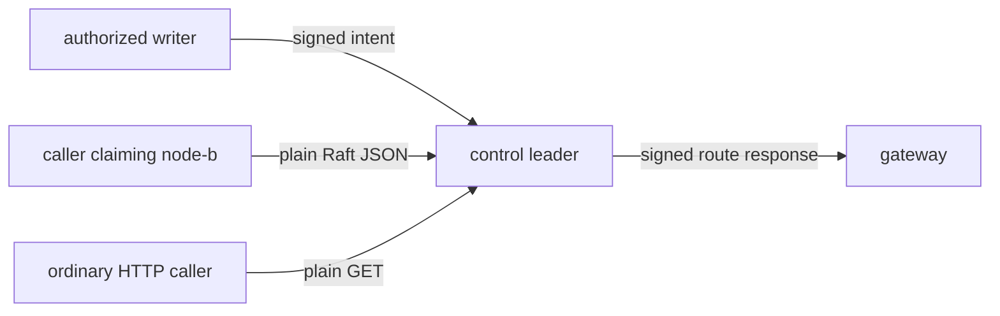
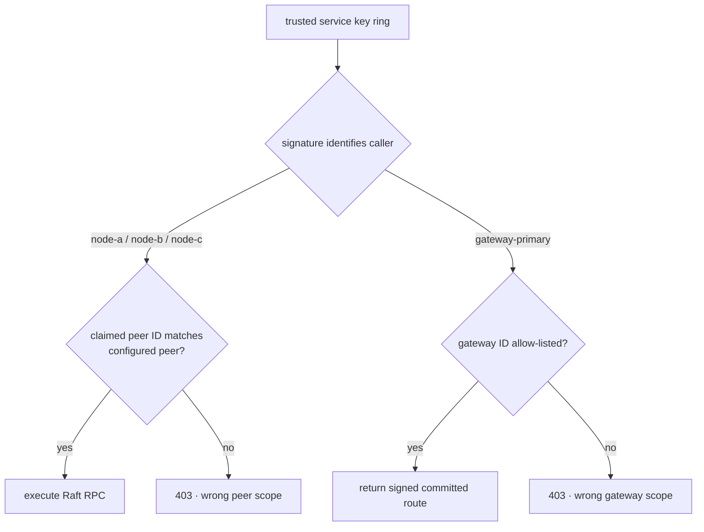
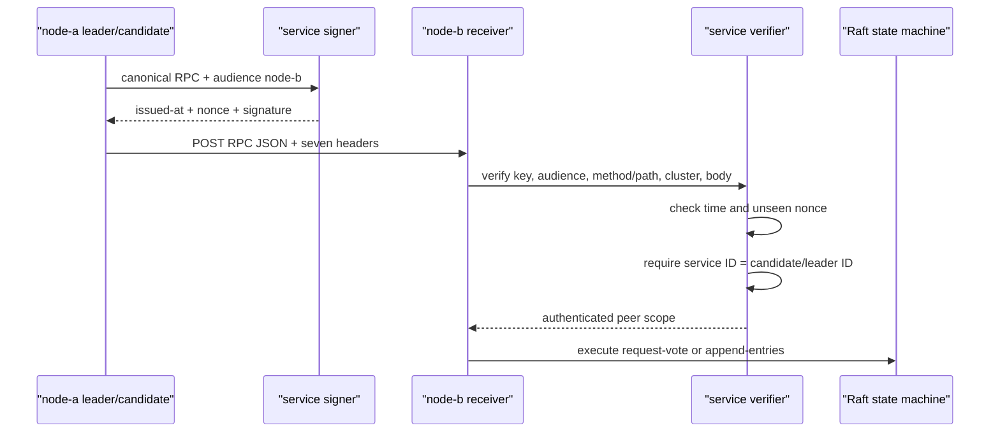
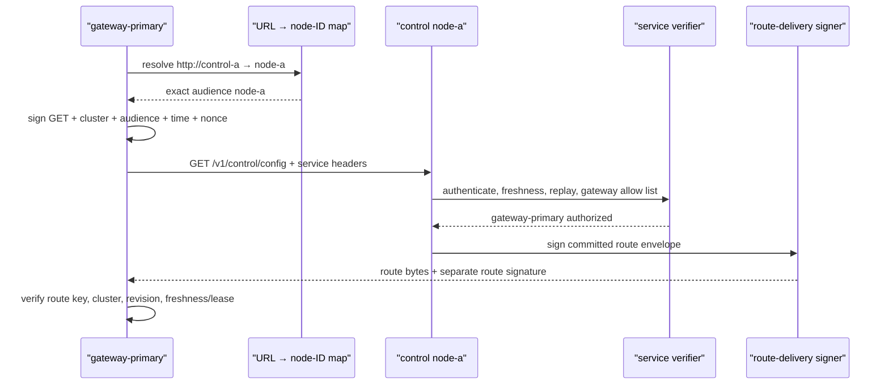
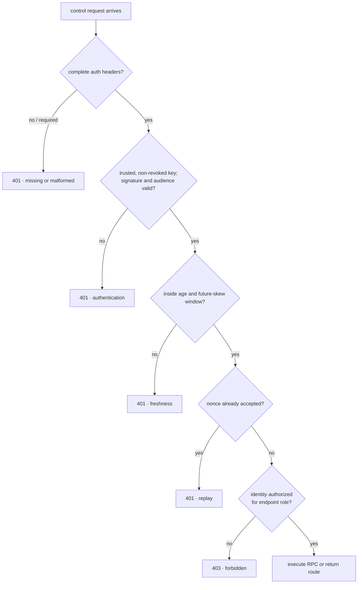
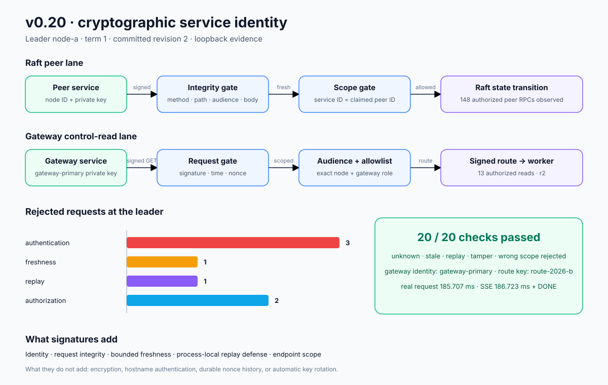

# RFC 0025: Cryptographic service identities for control requests

- Status: Implemented
- Milestone: v0.20
- Date: 2026-08-06
- Depends on: RFC 0022 cluster identity, RFC 0023 signed route delivery, and
  RFC 0024 authorized writers

## What “RFC” means

RFC means **Request for Comments**. In InferLab, an RFC is the durable
engineering decision record: it names the problem, chosen contract, ordering,
rejected alternatives, evidence, and limitations. The phase learning guide
turns this contract into a mental model and experiments.

## Decision summary

Authenticate control-service HTTP requests with an Ed25519 service identity.
Each request signature binds:

- the service-authentication schema and algorithm;
- caller service ID and exact audience service ID;
- HTTP method and path;
- control-cluster ID;
- issue time and unique nonce; and
- canonical JSON body bytes, or the empty body for a `GET`.

Every control node has its own signing identity and a static public-key trust
ring. Raft `request-vote` and `append-entries` calls are signed for the exact
destination node. The receiver verifies the signature, time window, replay
cache, and then requires the authenticated service ID to equal the claimed
candidate or leader ID and to name a configured peer.

The gateway has a separate service identity. Its map from control URL to node
ID is exact; every `GET /v1/control/config` is signed for that node. The
control receiver additionally requires the service ID to be in the gateway
allow list. The returned route retains the separate route-delivery signature
from RFC 0023.

This is request-level authentication over HTTP. It provides identity,
integrity, bounded freshness, local replay defense, and endpoint scope. It does
**not** encrypt traffic, authenticate DNS/hostnames, or constitute mTLS.

## Context: the limitation after v0.19

v0.19 authenticated an administrative caller before a route mutation and
authenticated the committed route when the gateway consumed it. The machines
carrying Raft RPCs and route reads still had no cryptographic request identity.



The cluster string fenced accidental namespace mixing but was not a secret or
proof of who sent a request. This RFC closes the two request-identity gaps.

## Scope

### In scope

- Separate Ed25519 identity for every control node and gateway deployment.
- Static mapping of trusted service IDs to public keys.
- Static service-ID revocation.
- Exact destination/audience binding.
- Method, path, cluster, timestamp, nonce, and body integrity.
- Bounded maximum request age and future-clock skew.
- Bounded process-local replay cache.
- Raft-peer scope and gateway-read scope.
- Required-mode startup validation and disabled compatibility mode.
- Diagnostics for verification and rejection classes.
- Exact-process proof through three Raft nodes, a real gateway, a real CPU
  worker, JSON request, and SSE.

### Out of scope

- TLS encryption, mTLS, certificate authorities, or hostname verification.
- Network availability, denial-of-service prevention, or traffic-analysis
  resistance.
- Durable or fleet-shared nonce history.
- Online trust distribution, automatic key rotation, or short-lived workload
  certificates.
- HSM, secret manager, or process-attested private-key storage.
- Fine-grained policy beyond peer RPC and gateway route-read roles.
- Authentication of health/status diagnostics or the public inference API.
- Prevention after a trusted service process or private key is compromised.

## Threat model

### Protected in v0.20

- An unsigned caller cannot read control configuration in required mode.
- An unsigned or unknown caller cannot make a receiver execute a Raft RPC.
- Changing method, path, cluster, audience, time, nonce, or body invalidates
  the signature.
- A valid request signed for node A cannot be replayed at node B.
- A captured accepted nonce is rejected while it remains in the receiver's
  replay window.
- A stale or implausibly future request is rejected.
- A trusted Raft identity cannot use the gateway-read scope.
- A trusted gateway identity cannot claim a candidate or leader peer ID.
- Rejected high-term Raft requests reach no Raft state transition.

### Not protected in v0.20

- HTTP bodies, signatures, identities, and responses remain visible in transit.
- A network attacker can drop, delay, or redirect requests; audience binding
  makes redirection fail only when the destination identity differs.
- A stolen service private key can act within that identity's scope until
  static revocation reaches the receiver.
- A compromised control process can bypass its own HTTP verifier.
- Restarting a receiver clears its accepted-nonce history.
- A trusted identity can fill the bounded replay cache with unique valid
  requests until entries expire; rate limiting is not part of this phase.
- Different nodes can temporarily have different static trust configuration.
- Status and health endpoints remain intentionally unauthenticated diagnostics.

## Identity and authorization model



Trust answers “which public key belongs to this service ID?” Authorization
answers “may this authenticated ID perform this endpoint role?” They are
separate decisions.

## Wire headers

| Header | Required value or meaning |
|---|---|
| `x-inferlab-service-auth-schema` | `inferlab.service-authentication.v1` |
| `x-inferlab-service-auth-algorithm` | `ed25519` |
| `x-inferlab-service-id` | Caller identity selecting a trusted public key |
| `x-inferlab-service-audience` | Exact destination control-node ID |
| `x-inferlab-service-issued-at-ms` | Signed Unix epoch milliseconds |
| `x-inferlab-service-nonce` | Caller-unique signed value |
| `x-inferlab-service-signature` | Base64 Ed25519 signature |

All seven headers are present or none are present. In required mode, none
receives 401. An incomplete set receives 401. In disabled compatibility mode,
none follows the legacy path, but signature-shaped headers receive 401 so they
cannot be silently ignored.

## Canonical signed payload

The signature message is a domain-separated, length-prefixed binary sequence:

```text
domain = "inferlab.service-request.v1\0"
schema
algorithm
service_id
audience_id
HTTP method
HTTP path
cluster_id
issued_at_ms: big-endian u64
nonce
body_length: big-endian u32
canonical JSON body bytes, or zero bytes for GET
```

JSON is parsed into a value and serialized deterministically before signing or
verification. Formatting and field order on the wire do not affect the signed
meaning. Typed receiver defaults do affect meaning: a signed Raft request must
include the effective cluster ID that the receiver authenticates.

Domain separation prevents a signature from this protocol from being treated
as a route signature or writer authorization signature.

## Raft request path



The security gate runs before `handle_request_vote` or
`handle_append_entries`. A request with a term far above the receiver's term
cannot change term unless both authentication and peer scope succeed.

## Gateway route-read path



There are two signatures because they answer opposite questions:

| Signature | Question answered |
|---|---|
| Gateway service request | Which service requested this route from this exact control node? |
| Control route response | Which route authority produced these exact committed route bytes? |

## Receiver decision order



Authentication failures use 401; an authenticated identity in the wrong role
uses 403. This makes “unknown caller” distinguishable from “known caller, wrong
capability.”

## Freshness and replay cache

For receiver time `now`:

```text
issued_at_ms <= now + max_future_skew_ms
now - issued_at_ms <= max_age_ms
```

After cryptographic and time verification, the receiver stores
`(service_id, nonce) → expiry`. Expired entries are removed opportunistically.
The cache is capped at 10,000 entries; exhaustion rejects new signed requests
instead of evicting an unexpired replay fence.

This ordering means an authenticated but wrong-scope request consumes its nonce.
That is intentional: replay safety is not granted only to authorized callers.

## Startup configuration

Each control node:

```bash
INFERLAB_SERVICE_ID='node-a'
INFERLAB_SERVICE_PRIVATE_KEY_B64='<node-a private seed>'
INFERLAB_SERVICE_TRUSTED_KEYS='node-a=<public>,node-b=<public>,node-c=<public>,gateway-primary=<public>'
INFERLAB_SERVICE_REVOKED_IDS=''
INFERLAB_GATEWAY_SERVICE_IDS='gateway-primary'
INFERLAB_SERVICE_AUTH_MAX_AGE_MS=5000
INFERLAB_SERVICE_AUTH_MAX_FUTURE_SKEW_MS=1000
```

`INFERLAB_SERVICE_ID` must equal `INFERLAB_RAFT_NODE_ID`. Required verification
without a local signing identity fails startup because the node could receive
authenticated traffic but could not participate in authenticated consensus.

The gateway:

```bash
INFERLAB_GATEWAY_SERVICE_ID='gateway-primary'
INFERLAB_GATEWAY_SERVICE_PRIVATE_KEY_B64='<gateway private seed>'
INFERLAB_CONTROL_SERVICE_TARGETS='node-a=http://control-a:7001,node-b=http://control-b:7002,node-c=http://control-c:7003'
```

The target URL set must exactly equal `INFERLAB_CONTROL_PLANE_URLS`. Missing or
extra mappings fail startup rather than guessing an audience.

## Diagnostics

Control status exposes:

- required mode, trusted/revoked IDs, gateway IDs, and time bounds;
- total signature verifications;
- authentication, freshness, replay, and authorization rejections;
- accepted Raft RPCs and gateway reads;
- current replay-cache size; and
- last verified/rejected ID and last error.

Gateway status exposes whether request authentication is enabled, its service
ID, and every exact `service-id=URL` target, independently of the route-response
key diagnostics.

Counters are local observations and reset on restart. The committed route and
writer provenance remain the replicated facts.

## Alternatives considered

### mTLS now

Deferred, not rejected forever. mTLS would add channel encryption and
certificate/hostname authentication, but also requires certificate issuance,
rotation, trust bundles, failure behavior, and an HTTPS stack. Request
signatures isolate identity/integrity/replay concepts in this learning step and
can remain useful across proxies. They must not be described as confidential
transport.

### Shared HMAC secret

Rejected. Every holder could forge every identity, verification requires secret
distribution to every receiver, and attribution collapses under compromise.

### Bearer token

Rejected. Possession authenticates a token but does not bind method, path,
audience, cluster, time, nonce, or body. Captured tokens are directly replayable
unless a second proof protocol is added.

### Reuse the writer or route-delivery key

Rejected. Writer intent, service request identity, and route delivery have
different compromise scopes and semantic meanings.

### Sign only the JSON body

Rejected. A body signature could be moved to another endpoint, cluster, or
destination. Method/path/cluster/audience are part of the request meaning.

### Let any trusted identity call any protected endpoint

Rejected. Authentication without authorization would let a gateway claim a
Raft term or a peer read routes under the gateway role.

### Infer audience from the URL at the receiver

Rejected. The signature needs the intended recipient before sending. The
gateway therefore has an explicit URL-to-service-ID map.

### Durable replicated nonce ledger

Deferred. It would survive receiver restarts but would add consensus/state to
every heartbeat and route poll. The bounded local cache is honest and adequate
for this request-level milestone; durable replay semantics need a separate
availability and storage decision.

## Evidence

The retained v0.20 run requires service authentication on three persistent
control nodes, commits an authorized route, and then proves:

- the cluster elects only through signed peer RPCs;
- missing, unknown, stale, replayed, and tampered requests receive 401;
- trusted peer-as-gateway and gateway-as-peer requests receive 403;
- rejected term-51/52 vote attempts leave leader term 1 and route revision 2;
- a fresh gateway request reads the separately signed route;
- the real gateway advertises its exact service identity/targets and publishes
  revision 2;
- a real request completes in 185.707 ms and a 186.723 ms SSE reaches `[DONE]`;
  and
- all 20 machine-readable assertions pass.



Timings and request counts are loopback observations, not service-level
objectives.

## Code and evidence map

| Responsibility | Location |
|---|---|
| Canonical service payload, signer, verifier, trust/revocation | `service-auth/src/lib.rs` |
| Educational public-key and request-signing helpers | `service-auth/src/bin/` |
| Header parsing, time/replay/scope diagnostics | `control-plane/src/service_authentication.rs` |
| HTTP decision order and 401/403 mapping | `control-plane/src/lib.rs` |
| Per-peer outbound signing and destination audience | `control-plane/src/raft.rs` |
| Control environment/startup validation | `control-plane/src/main.rs` |
| Gateway exact target map and signed GET client | `gateway/src/service_client.rs` |
| Gateway startup/status integration | `gateway/src/main.rs`, `gateway/src/lib.rs` |
| HTTP evidence probe | `benchmarks/service_request_probe.py` |
| Machine-readable checks | `benchmarks/check_service_auth.py` |
| Data-driven evidence chart | `benchmarks/render_service_auth_svg.py` |
| Exact-process proof | `scripts/proof-v0.20.sh` |

## Limitations and next boundary

- Plain HTTP provides no secrecy, hostname proof, or protection from traffic
  observation and denial.
- Long-lived environment-variable seeds are educational, not production secret
  custody.
- Trust and revocation are static and can drift between processes.
- Replay history is process-local, bounded, and lost on restart.
- The fail-closed replay-cache cap can itself become an availability limit
  under high signed request volume; there is no per-identity rate limit.
- Receiver clocks must stay within the configured bounds.
- A compromised service process or trusted private key remains powerful.
- A compromised control node can bypass its local request verifier.
- Health and diagnostics are not authenticated.
- The proof is single-host loopback, not a hostile-network or partition proof.

The next security boundary should add credential lifecycle and channel
security: short-lived identities or certificates, rotation without quorum or
route-read loss, protected private-key custody, and TLS/mTLS where confidentiality
and hostname authentication are required.
