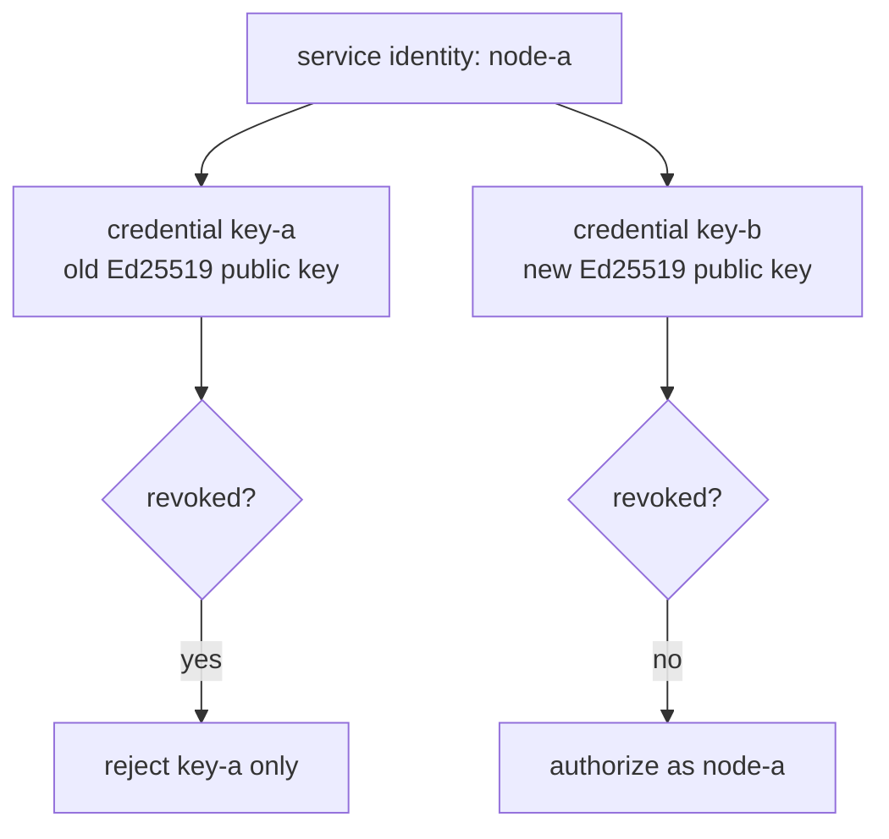
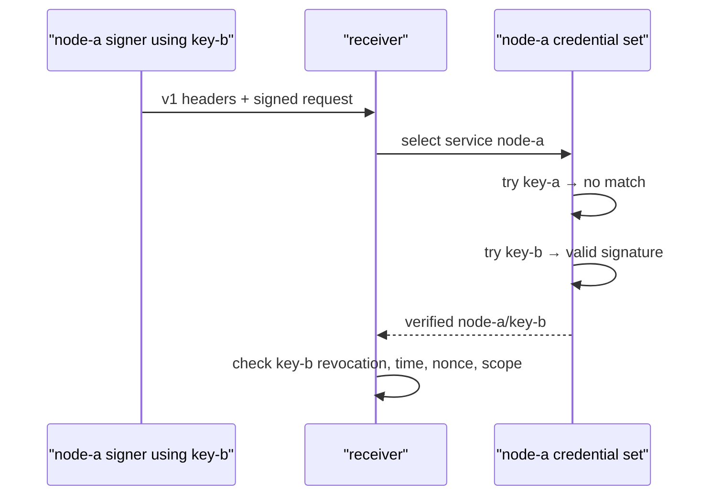
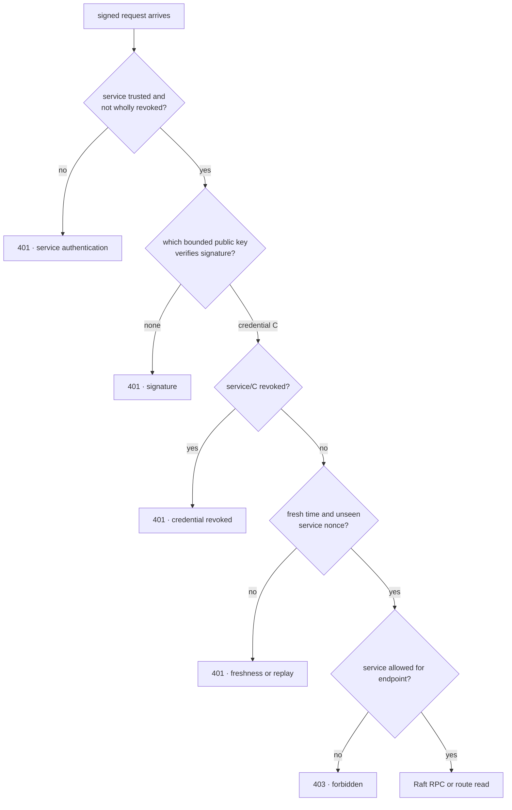
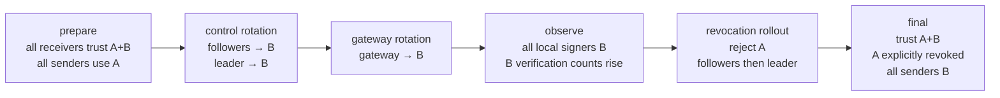

# RFC 0026: Overlap-safe service credential rotation and revocation

- Status: Implemented
- Milestone: v0.21
- Date: 2026-08-06
- Depends on: RFC 0025 cryptographic service identities

## What “RFC” means

RFC means **Request for Comments**. In InferLab, an RFC is the durable record
of an engineering decision: the problem, selected contract, rejected
alternatives, operational order, evidence, and honest limitations. The matching
phase guide explains the same decision with mental models and experiments.

## Decision summary

Allow a service ID to have a bounded set of concurrently trusted Ed25519
credentials. A receiver accepts legacy trust entries such as
`node-a=<public-key>` as `node-a/legacy`, and accepts explicit entries such as:

```text
node-a/key-a=<public-key-a>,node-a/key-b=<public-key-b>
```

The v1 request wire format does not add a credential header. The receiver uses
the signed service ID to select at most 16 configured public keys, verifies the
signature against that bounded set, and reports the credential ID belonging to
the key that matched. The same public key cannot have two credential IDs under
one service because that would make the result ambiguous.

Credential-specific revocation uses `service-id/credential-id`. Revoking
`node-a/key-a` blocks only that old credential; `node-a/key-b` remains eligible.
Existing whole-service revocation still overrides every credential for that
service.

Rotation is an ordered deployment protocol:

1. distribute trust for A and B to every receiver;
2. roll control-node signers from A to B, followers first and leader last;
3. roll the gateway signer from A to B;
4. confirm B traffic at receivers; and
5. roll credential-specific A revocation, followers first and leader last.

Trust and revocation remain static process configuration, so each change needs
a rolling restart. This phase makes that restart sequence safe; it does not add
online trust distribution.

## Context: the one-key rotation cliff in v0.20

RFC 0025 mapped one service ID to one public key. Replacing that key created a
coordination cliff:


Changing receivers first rejected old senders. Changing senders first made
them unknown to old receivers. A three-node cluster could survive one mismatch,
but an uncoordinated second mismatch could remove its majority. The gateway had
the same discontinuity while polling control nodes.

## Goals

- Overlap old and new credentials under one stable service identity.
- Rotate three Raft signers while preserving one leader, quorum, and committed
  route revision.
- Rotate the gateway signer without losing authenticated route reads.
- Revoke an old credential without revoking the service or its new credential.
- Attribute accepted traffic and revocation failures to exact credentials.
- Keep RFC 0025 request schema v1 and legacy trust syntax compatible.
- Bound verification work and key-ring size.

## Non-goals

- Online configuration reload or a fleet trust-distribution controller.
- Automatically choosing rollout order or proving every receiver was updated.
- Short-lived certificates, certificate authorities, TLS, or mTLS.
- Secret-manager, HSM, or process-attested private-key custody.
- Durable replay history or durable diagnostic counters.
- Emergency recovery after both active and fallback credentials are lost.
- Removing availability risks from operator error or network partitions.

## Identity, credential, and service



A **service ID** is the stable authorization principal. A **credential ID** is
an operator-visible label for one public key belonging to that service. Endpoint
scope remains attached to the service: either credential can prove `node-a`,
but neither changes what `node-a` may do.

## Trust-ring contract

### Accepted syntax

| Form | Meaning |
|---|---|
| `node-a=<public>` | `node-a/legacy=<public>` |
| `node-a/key-a=<public-a>` | Explicit old credential |
| `node-a/key-b=<public-b>` | Explicit new credential |
| `INFERLAB_SERVICE_REVOKED_IDS=node-a` | Revoke the entire service |
| `INFERLAB_SERVICE_REVOKED_CREDENTIALS=node-a/key-a` | Revoke only key A |

### Bounds and validation

- at most 16 credentials per service;
- at most 256 credentials in one receiver key ring;
- credential and service IDs use the existing bounded ASCII ID grammar;
- a `(service ID, credential ID)` pair cannot repeat;
- one public key cannot have two credential IDs under the same service;
- a revoked credential must exist in the trusted ring; and
- duplicate whole-service or credential revocations fail startup.

These are startup errors, not warnings. A process must not guess which
credential an ambiguous configuration means.

## Why the wire request still has no credential ID

The seven RFC 0025 headers remain unchanged. The request carries a signed
service ID and signature, but no `key-a` or `key-b` selector.



This preserves v1 senders and receivers at the wire boundary. The cost is
worst-case `O(credentials for one service)` Ed25519 checks. The 16-key bound
makes that cost explicit. A future signed credential selector could reduce the
work to one verification, but it would be a wire-version migration.

The credential label is therefore local trust metadata, not a claim supplied by
the caller. The public key that verifies the signature determines the label.

## Receiver decision order



Credential revocation is evaluated after a key mathematically verifies. This
is necessary because the wire request does not name a credential. A revoked
request therefore consumes verification CPU but reaches no freshness, replay,
authorization, or Raft state transition.

The replay key remains `(service_id, nonce)`, not
`(service_id, credential_id, nonce)`. Rotating keys must not create a second
replay namespace for the same service.

## Safe rollout protocol



### Why trust expansion is a separate wave

Starting a B signer before every needed receiver trusts B can cut communication.
The proof preloads A+B everywhere before changing any signer. A production
rollout should likewise verify the trust expansion before proceeding.

### Why followers rotate before the leader

With one follower restarting, the leader and other follower can keep a majority.
After both followers return on B, the leader can restart last and a B-capable
majority remains. The same ordering is used for revocation.

### Why revocation comes last

Revoking A while any required sender still uses A converts a planned rotation
into an outage. Diagnostics must show each local signer on B and successful B
verification before the deny rule is deployed.

### Later cleanup

The implemented parser requires a revoked credential to remain in the trust
ring. After the incident/rollback window closes, a later rollout may remove
both `service/key-a=<public-a>` and its revocation entry together. Until then,
the explicit deny remains visible and testable.

## Configuration

One control node during overlap:

```bash
INFERLAB_SERVICE_ID=node-a
INFERLAB_SERVICE_CREDENTIAL_ID=key-b
INFERLAB_SERVICE_PRIVATE_KEY_B64='<node-a key-b seed>'
INFERLAB_SERVICE_TRUSTED_KEYS='node-a/key-a=<pub-a>,node-a/key-b=<pub-b>,node-b/key-a=<pub-a>,node-b/key-b=<pub-b>,node-c/key-a=<pub-a>,node-c/key-b=<pub-b>,gateway-primary/key-a=<pub-a>,gateway-primary/key-b=<pub-b>'
INFERLAB_SERVICE_REVOKED_CREDENTIALS=''
```

The final revocation wave keeps the same trust ring and sets:

```bash
INFERLAB_SERVICE_REVOKED_CREDENTIALS='node-a/key-a,node-b/key-a,node-c/key-a,gateway-primary/key-a'
```

The gateway selects its signing credential independently:

```bash
INFERLAB_GATEWAY_SERVICE_ID=gateway-primary
INFERLAB_GATEWAY_SERVICE_CREDENTIAL_ID=key-b
INFERLAB_GATEWAY_SERVICE_PRIVATE_KEY_B64='<gateway key-b seed>'
```

Omitting either credential-ID environment variable retains the `legacy`
behavior from v0.20.

## Diagnostics

Control status adds:

- `local_service_credential_id`;
- `trusted_service_credentials` and `revoked_service_credentials`;
- `verifications_by_credential`;
- `credential_revocation_rejections`;
- `last_verified_service_credential`; and
- `last_rejected_service_credential`.

Gateway control status adds `service_credential_id`. These are process-local
deployment observations. They reset on restart and are not consensus facts.
The committed route revision and writer provenance remain replicated facts.

## Failure matrix

| State | A request | B request | Operational meaning |
|---|---:|---:|---|
| Trust only A | accept | reject | v0.20 starting point |
| Trust A+B | accept | accept | safe overlap / rollback window |
| Trust A+B, revoke A | reject | accept | rotation closed |
| Trust only B | reject | accept | later cleanup, no explicit old-key deny record |
| Revoke whole service | reject | reject | service is disabled, not rotated |

## Alternatives considered

### Replace the only key atomically

Rejected. There is no atomic configuration transaction across three control
processes and a gateway. The unavoidable mixed window would reject one side.

### Put an unsigned credential ID header on the request

Rejected. It would let untrusted input choose verifier work and revocation
labels without cryptographically binding that selector. A signed selector
would require a schema migration.

### Add a signed credential header and v2 schema now

Deferred. It gives constant-time key selection, but requires dual-version
canonicalization and rollout. The bounded v1-compatible verifier isolates the
credential-lifecycle lesson first.

### Revoke the entire service ID

Rejected for rotation. It disables both A and B and therefore cannot preserve
the stable authorization principal.

### Share one replacement key across every control node

Rejected. One stolen key could impersonate every peer, attribution would
collapse, and peer IDs would no longer have independent compromise boundaries.

### Hot-reload environment configuration

Deferred. Safe online reload needs an authenticated configuration source,
version/order rules, last-known-good behavior, rollback, and fleet convergence
observability. Restart semantics are explicit in this phase.

### Remove key A immediately after rotating signers

Deferred to a cleanup wave. An explicit revocation window preserves rollback
visibility and proves stale A traffic fails for the intended reason.

## Evidence

The retained v0.21 run starts three persistent key-A control nodes and a key-A
gateway with A+B trust already distributed. It commits route revision 2, then:

- performs three control signer restarts to B while every checkpoint retains
  all three statuses and exactly one leader;
- observes accepted A and B traffic during the overlap window;
- proves an old gateway A request still works before revocation;
- restarts the gateway on B;
- performs three more control restarts with A specifically revoked;
- rejects an old gateway A route read and an old peer A high-term vote with
  explicit 401 credential-revoked errors;
- leaves the leader term and committed revision unchanged after the attack;
- accepts a current gateway B route read;
- serves a real request in 182.663 ms and SSE through `[DONE]` in 182.597 ms;
  and
- passes all 18 machine-readable assertions.


Timings are single-host loopback observations, not service-level objectives.

## Code and evidence map

| Responsibility | Location |
|---|---|
| Multi-credential parser, bounded verifier, exact credential result | `service-auth/src/lib.rs` |
| Credential-aware signing helpers | `service-auth/src/bin/` |
| Credential diagnostics and revocation classification | `control-plane/src/service_authentication.rs` |
| Gate before Raft/route handlers and local signer status | `control-plane/src/lib.rs`, `control-plane/src/raft.rs` |
| Control startup configuration | `control-plane/src/main.rs` |
| Gateway credential selection/status | `gateway/src/service_client.rs`, `gateway/src/main.rs`, `gateway/src/lib.rs` |
| Rolling exact-process proof | `scripts/proof-v0.21.sh` |
| Falsifiable checks | `benchmarks/check_service_credential_rotation.py` |
| Data-driven evidence chart | `benchmarks/render_service_credential_rotation_svg.py` |
| Retained raw evidence | `docs/results/v0.21/raw/` |

## Limitations and next boundary

- Verification is linear in credentials for one service, bounded at 16.
- Trust and revocation require rolling restarts and can drift between processes.
- Credential labels are local configuration metadata; inconsistent labels
  across receivers produce inconsistent diagnostics and policy.
- Diagnostic counts reset during the very rollout they observe.
- A key remains usable until every relevant receiver has the revocation.
- A compromised current B key or service process retains the service's scope.
- Long-lived environment seeds still lack production custody.
- Request signing still provides no encryption or hostname authentication.
- Replay memory remains bounded, process-local, and lost on restart.
- The proof is single-host loopback, not a partitioned multi-host deployment.

RFC 0027 implements the next receiver-policy boundary with root-signed,
versioned local snapshots, online per-process convergence, last-known-good
retention, and restart-safe rollback floors. Built-in fleet distribution,
short-lived identity, protected custody, TLS/mTLS, and partial-fleet failure
semantics remain later boundaries.
