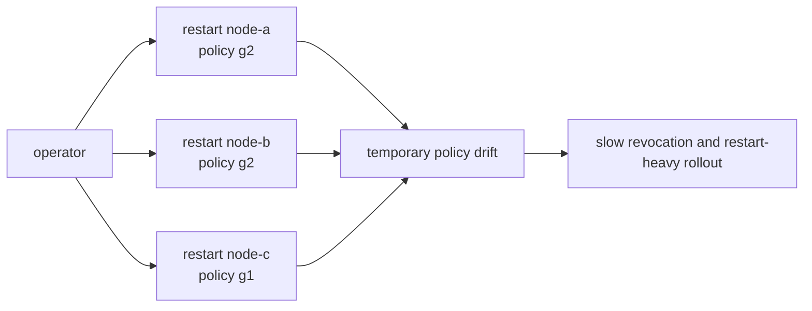
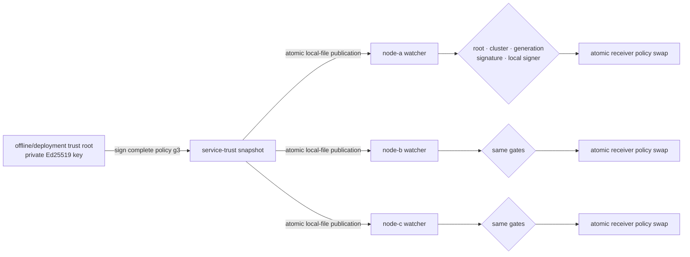
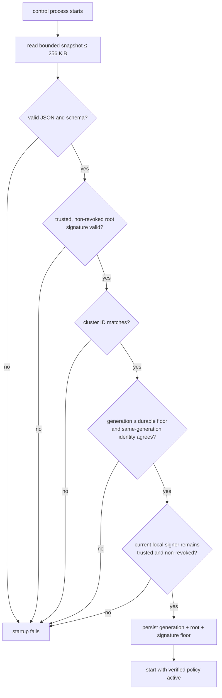
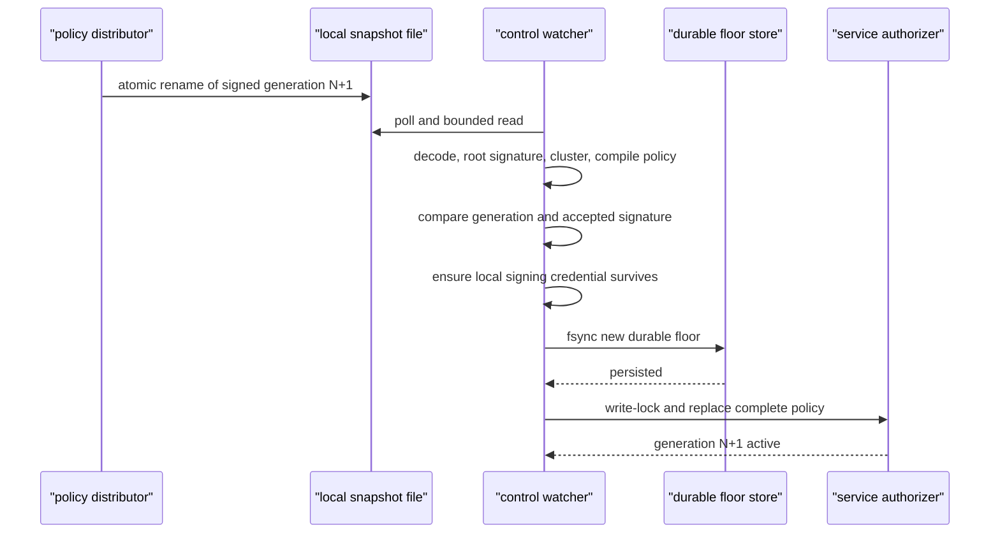
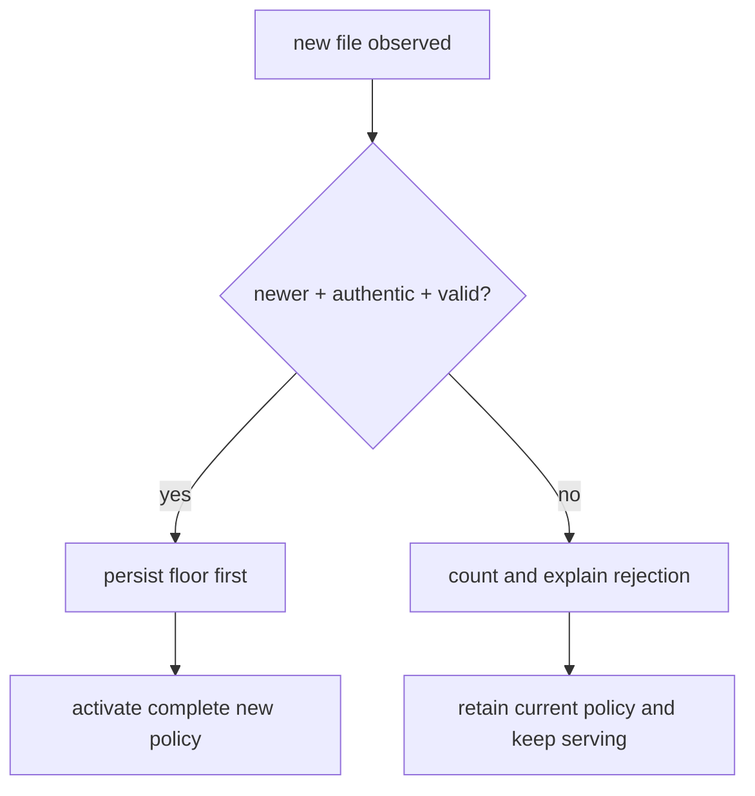
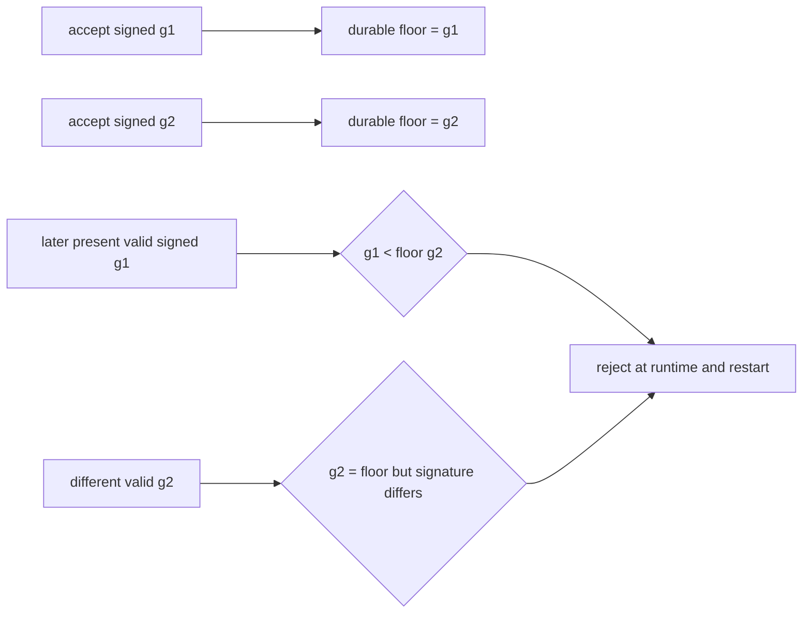

# RFC 0027: Signed, versioned online service-trust snapshots

- Status: Implemented
- Milestone: v0.22
- Date: 2026-08-06
- Depends on: RFC 0025 service request identities and RFC 0026 overlap-safe
  credential rotation

## What “RFC” means

RFC means **Request for Comments**. In InferLab, an RFC is the durable decision
record: it states the problem, invariant, protocol, ordering, rejected choices,
evidence, and limitations. The matching phase guide turns this contract into
pictures and experiments.

## Decision summary

Replace restart-only receiver trust configuration with an optional signed,
versioned local snapshot mode. A service-trust root signs the complete receiver
policy:

- control-cluster ID;
- monotonically increasing generation;
- issue time;
- ordered service credentials and public keys;
- whole-service revocations;
- credential-specific revocations; and
- gateway service-role IDs.

Every control process bootstraps from its local snapshot only after verifying a
statically configured root key. It polls the file and atomically replaces its
in-memory verification policy only when a newer, valid snapshot appears.
Malformed, unknown-root, revoked-root, wrong-cluster, same-generation fork,
rollback, or signature-tampered input leaves the last known good policy active.

Before activation, the accepted generation, root key ID, and signature are
durably written to a per-node floor file. That floor rejects rollback after a
process restart. A snapshot may not remove, revoke, or whole-service revoke the
node's current local signing credential.

Static environment trust remains compatible when snapshot mode is absent. The
two modes cannot be combined.

## Context: the restart-only boundary in v0.21

RFC 0026 made credential rotation safe by overlapping A+B and ordering process
restarts. The policy itself still lived independently in each process's startup
environment:



The overlap protocol prevented a planned outage, but it did not authenticate a
policy file, order updates, detect rollback, or let a healthy control process
adopt receiver trust without restart.

## Goals

- Authenticate complete service-trust policy bytes with a distinct Ed25519
  root.
- Bind policy to one control-cluster namespace.
- Order updates with a positive monotonic generation.
- Reload valid newer policy without restarting control or Raft processes.
- Retain last known good policy when live input is invalid.
- Reject a validly signed older generation at runtime and after restart.
- Reject two different valid snapshots claiming the same accepted generation.
- Persist the rollback fence before making new policy active.
- Protect a node from adopting policy that disables its current outbound
  signing credential.
- Expose convergence, root identity, reload, and rejection diagnostics.
- Keep v0.21 static configuration and request wire schema compatible.

## Non-goals

- A built-in network policy-distribution service or atomic fleet transaction.
- Automatic generation allocation or approval workflow.
- Online rotation of service private keys or trust-root environment variables.
- Certificate authorities, TLS, mTLS, hostname authentication, or encryption.
- Hardware-backed keys, secret managers, or process attestation.
- Durable storage of the complete last known good snapshot.
- Byzantine filesystem protection or recovery after rollback-floor deletion.
- Policy expiry, emergency cancellation, or guaranteed revocation latency.
- Authentication of health/status endpoints.

## Trust architecture



The root authenticates **who may define receiver trust**. Service credentials
authenticate **who sent a particular control request**. Route and writer keys
retain their separate meanings.

## Policy and authentication schemas

The JSON snapshot uses:

```json
{
  "schema": "inferlab.service-trust-policy.v1",
  "cluster_id": "inferlab-primary",
  "generation": 3,
  "issued_at_ms": 1700000000000,
  "trusted_credentials": [
    {
      "service_id": "gateway-primary",
      "credential_id": "key-b",
      "public_key_base64": "..."
    }
  ],
  "revoked_service_ids": [],
  "revoked_credentials": [
    {"service_id": "gateway-primary", "credential_id": "key-a"}
  ],
  "gateway_service_ids": ["gateway-primary"],
  "authentication": {
    "schema": "inferlab.service-trust-authentication.v1",
    "algorithm": "ed25519",
    "key_id": "service-trust-root-a",
    "signature": "..."
  }
}
```

The signature uses domain-separated, length-prefixed binary framing. It binds
the policy schema, cluster, generation, issue time, each ordered list entry,
authentication schema/algorithm, and root key ID. JSON whitespace is not part
of the meaning.

The issue time is authenticated diagnostic metadata. Generation, not wall-clock
age, orders policy. This RFC does not expire service trust automatically.

## Startup path



There is no unsigned bootstrap fallback in snapshot mode. A missing, corrupt,
or rollback snapshot fails before the listener starts.

## Runtime reload path



Policy replacement uses one write lock. A request already verified under the
old read-locked policy may finish; later requests observe the new complete
policy. No request sees half of a credential/revocation list.

## Last-known-good behavior



Retaining old trust favors availability while rejecting an unauthenticated
change. It also means a failed revocation update does **not** revoke the old key;
operators must observe convergence rather than treating file publication as
success.

Identical file bytes are ignored. A repeated unreadable source error or repeated
invalid bytes are recorded once until the observed input changes, avoiding
counter and log amplification from one bad file.

## Generation and durable rollback floor

The floor file contains:

```text
schema
cluster_id
highest accepted generation
signing root key ID
accepted snapshot signature
```



The signature in the floor distinguishes an idempotent reread from a different
policy claiming the same generation. Root rotation therefore needs a higher
generation even if policy contents are otherwise unchanged.

The floor is written and fsynced before in-memory activation. A crash between
those steps can make startup require the new snapshot, but cannot silently
reactivate an older generation.

## Local signer survival rule

A control node refuses any snapshot that:

- omits its current `service-id/credential-id` from trust;
- explicitly revokes that credential; or
- revokes the whole local service ID.

This turns premature key removal into an observable policy rejection. It is not
a global rollout barrier: another node with a different current credential may
accept the same snapshot. Fleet convergence and safe sender ordering remain an
operator/distributor responsibility.

## Configuration modes

### Signed snapshot mode

```bash
INFERLAB_SERVICE_ID=node-a
INFERLAB_SERVICE_CREDENTIAL_ID=key-a
INFERLAB_SERVICE_PRIVATE_KEY_B64='<node-a key-a seed>'

INFERLAB_SERVICE_TRUST_SNAPSHOT_PATH='/run/inferlab/node-a-service-trust.json'
INFERLAB_SERVICE_TRUST_STATE_PATH='/var/lib/inferlab/node-a-service-trust-floor.json'
INFERLAB_SERVICE_TRUST_ROOT_KEYS='service-trust-root-a=<root-public-key>'
INFERLAB_SERVICE_TRUST_REVOKED_ROOT_KEY_IDS=''
INFERLAB_SERVICE_TRUST_POLL_MS=100
```

The floor path defaults under the Raft data directory. Poll interval must be
positive. Root key rings are bounded at 16 keys. Snapshot credential and list
bounds reuse the v0.21 service-key limits and cap the local file at 256 KiB.

### Static compatibility mode

If `INFERLAB_SERVICE_TRUST_SNAPSHOT_PATH` is absent, the v0.21 environment
variables continue to build a fixed policy. Snapshot/root/floor variables and
static policy variables cannot be mixed because precedence would be ambiguous.

## Diagnostics

Control `service_authentication` status adds:

- `trust_policy_source`: `disabled`, `static-environment`, or `signed-snapshot`;
- active `trust_policy_generation` and authenticated `issued_at_ms`;
- active `trust_policy_signing_key_id`;
- trusted/revoked trust-root key IDs;
- `trust_policy_loaded_at_ms`;
- successful online `trust_policy_reloads`;
- rejected update count; and
- `last_trust_policy_error`.

Existing trusted/revoked service credentials display the active compiled policy.
These counters are process-local; the durable floor and Raft route are the
persistent facts.

## Failure matrix

| Candidate | Runtime result | Restart result | Active policy |
|---|---|---|---|
| Same accepted bytes | Ignore | Accept idempotently | Unchanged |
| Valid higher generation | Persist then activate | Accept | New generation |
| Valid lower generation | Reject and count | Fail startup | Last known good / none |
| Different valid same generation | Reject conflict | Fail startup | Last known good / none |
| Unknown or revoked root | Reject | Fail startup | Last known good / none |
| Wrong cluster | Reject | Fail startup | Last known good / none |
| Tampered signature | Reject | Fail startup | Last known good / none |
| Removes local active signer | Reject | Fail startup | Last known good / none |
| Missing file at runtime | Keep current and report once | Fail startup | Last known good / none |

## Alternatives considered

### Continue rolling static environment updates

Compatible but insufficient as the only mode. It authenticates no policy
artifact, orders nothing, and requires process restarts for receiver changes.

### Put service trust into the existing Raft log

Deferred. It would give cluster replication and one committed order, but creates
a bootstrap cycle: Raft request authentication needs trust before Raft can
safely replicate the trust command. A carefully separated bootstrap/root design
is a larger membership and recovery decision.

### Fetch trust from an HTTP endpoint

Deferred. It requires authenticating the endpoint, availability/backoff,
bootstrap trust, cache persistence, and split-source ordering. Signed local
snapshots isolate artifact authenticity and rollback first.

### Use file modification time instead of generation

Rejected. Filesystem timestamps can move backward, have coarse resolution, and
do not express operator intent or same-version conflict.

### Sign each credential entry independently

Rejected. Receivers could observe combinations never authorized as one policy,
and atomic gateway-role/revocation changes would be lost.

### Activate then persist the floor

Rejected. A crash after activation but before persistence could restart into an
older accepted snapshot.

### Fail the process on every invalid runtime update

Rejected. A corrupt publication would turn a policy mistake into control-plane
process loss. Runtime keeps last known good; startup has no prior in-memory
policy and therefore fails closed.

### Accept the highest generation from multiple roots without a floor signature

Rejected. Two different valid policies could claim one generation. Storing the
accepted signature makes that fork explicit.

## Evidence

The retained v0.22 exact-process run:

- boots three controls from root-signed generation 1 and elects one leader;
- commits route revision 2 and starts a key-A gateway;
- publishes generation 2, adding key B, and all three unchanged control PIDs
  converge in 5.001 ms maximum observed proof duration;
- proves B works during the A+B overlap and restarts only the gateway on B;
- publishes generation 3, revoking A, with all controls converging in 4.856 ms;
- rejects old gateway A while B continues reading revision 2;
- presents a valid signed generation-2 rollback and a tampered higher-generation
  file; every receiver retains generation 3 and records both classes;
- stops one follower, presents rollback generation 2, and proves durable floor 3
  blocks process restart;
- restores generation 3 and the follower rejoins the three-node r2 cluster;
- serves a real request in 189.236 ms and SSE through `[DONE]` in 187.796 ms;
  and
- passes all 20 machine-readable assertions.


Convergence and inference timings are single-host loopback observations, not
service-level objectives.

## Code and evidence map

| Responsibility | Location |
|---|---|
| Snapshot schema, canonical signing, root ring, compiled policy | `service-auth/src/trust_snapshot.rs` |
| Root public-key and snapshot-signing helpers | `service-auth/src/bin/` |
| Atomic active policy and diagnostics | `control-plane/src/service_authentication.rs` |
| Bounded file watcher and durable rollback floor | `control-plane/src/service_trust.rs` |
| Startup mode validation and watcher lifecycle | `control-plane/src/main.rs` |
| Convergence observer | `benchmarks/service_trust_probe.py` |
| Machine-readable assertions | `benchmarks/check_online_service_trust.py` |
| Data-driven evidence chart | `benchmarks/render_online_service_trust_svg.py` |
| Exact-process proof | `scripts/proof-v0.22.sh` |
| Retained evidence | `docs/results/v0.22/raw/` |

## Limitations and next boundary

- Publication is an external local-file operation, not a built-in distributor.
- Nodes converge independently; the update is atomic per process, not fleet-wide.
- A failed revocation retains the old policy and therefore the old credential.
- Root keys, root revocation, and service private keys remain static environment
  configuration.
- The floor assumes local filesystem integrity; deleting or rewriting it can
  re-enable rollback.
- Only the floor is persisted. A missing/invalid current snapshot fails restart
  even when the process previously served a last known good generation.
- Authenticated issue time does not expire policy.
- Local-signer survival is not proof that a fleet-wide rollout is safe.
- Request replay memory remains process-local and reset on restart.
- HTTP remains visible and unauthenticated at the hostname/channel level.
- The proof is one-host polling, not a partitioned or Byzantine distributor.

The next boundary should make distribution and transport explicit: replicate or
serve signed policy with convergence acknowledgements and rollback/expiry
semantics, protect root/private keys, and add TLS/mTLS where channel secrecy and
hostname identity are required.
