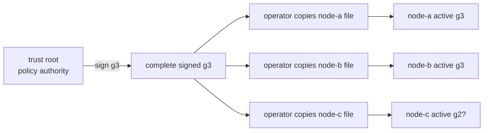
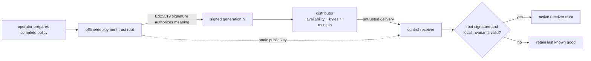
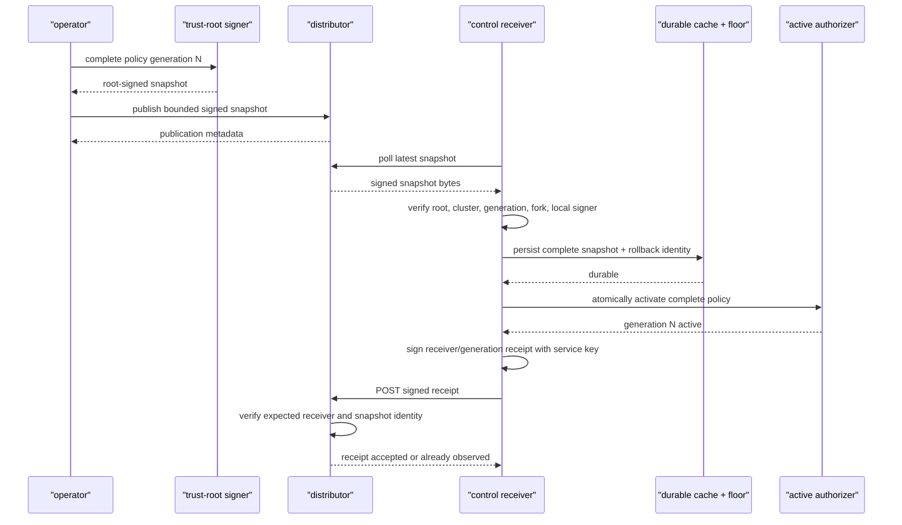
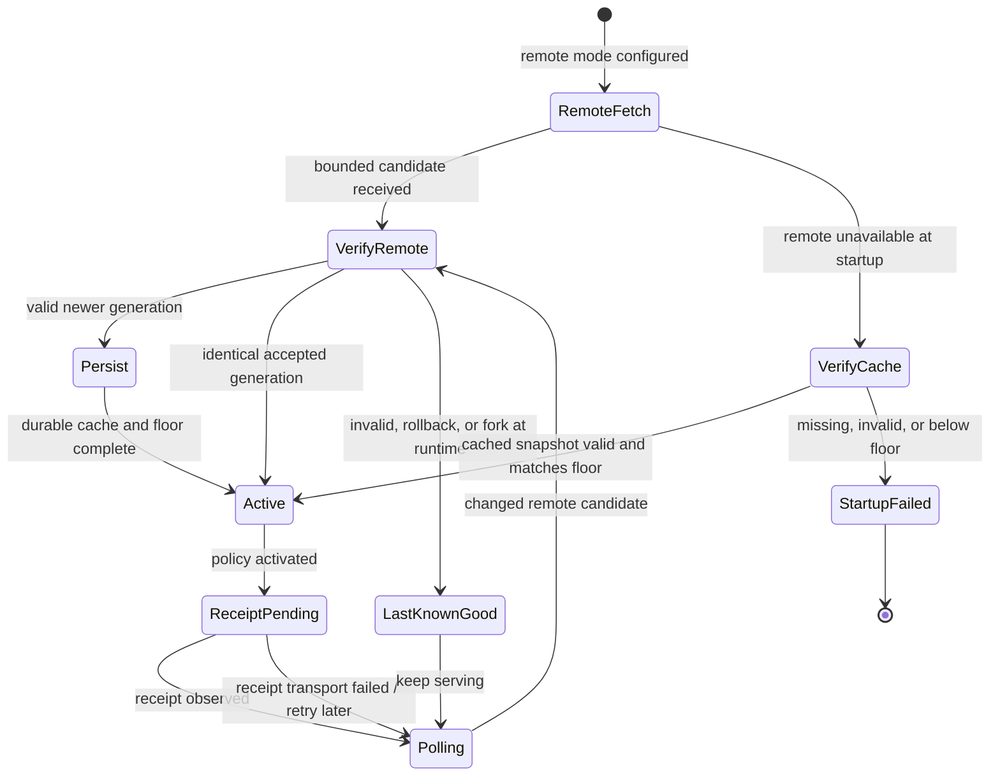

# RFC 0028: Distributed signed service trust with activation receipts

- Status: Implemented
- Milestone: v0.23
- Date: 2026-08-07
- Depends on: RFC 0027 signed, versioned online service-trust snapshots

## What “RFC” means

RFC means **Request for Comments**. In InferLab, an RFC is the durable design
contract: it records the problem, authority boundary, invariants, protocol,
failure behavior, rejected alternatives, evidence, and limits. The matching
phase guide explains the same decision as pictures and experiments.

## Decision summary

Add a network distributor for complete root-signed service-trust snapshots and
make each control receiver report an activation receipt only after it has:

1. downloaded a bounded snapshot;
2. verified its schema, trust root, signature, cluster, generation, fork
   identity, and local-signer survival;
3. durably persisted the complete accepted snapshot and rollback floor;
4. atomically activated the compiled receiver policy; and
5. service-signed a receipt identifying the receiver and accepted snapshot.

The distributor verifies the bounded artifact against its configured public
root ring before storing and serving it. It is still **transport, not policy
authority**: it has no trust-root private key, and only a root signature can
authorize receiver-policy meaning. A compromised distributor can delay,
withhold, replay, or present conflicting bytes; it cannot create a valid higher
policy that an uncompromised receiver accepts.

Receivers poll independently with bounded timeouts and backoff. A valid remote
snapshot uses the v0.22 verify → persist → activate ordering. A rejected remote
candidate leaves last known good active. The durable store now retains the full
accepted snapshot as well as the rollback identity, so a restarted node may
bootstrap from its cached accepted generation while the distributor is
unreachable. It continues polling after cache bootstrap.

The distributor verifies each receipt against the accepted snapshot's service
credentials and exposes per-generation receiver receipts. Their absence means
“activation is not yet observed,” not “activation failed,” and never authorizes
the next rollout step automatically. Operational fleet convergence is reported
only when the intended receiver set has matching receipt attestations and live
diagnostics agree. That combination corroborates the exact non-compromised
process run; it is not remote process attestation under receiver compromise.

Local-file snapshot mode from v0.22 and static environment mode from v0.21
remain compatible. Exactly one receiver-trust source may be configured.

## Context: the remaining boundary in v0.22

v0.22 authenticated and ordered each local policy artifact, but distribution
was an external copy operation:



The operator could inspect three node status endpoints, but the system did not
offer one publication point, per-generation activation receipts, or a complete
last-known-good cache for disconnected restart. Copying a file was also easy to
confuse with successful activation.

## Goals

- Preserve the root-signed complete snapshot as the only policy authority.
- Fetch signed snapshots from one explicitly configured remote distributor.
- Bound response size, request time, polling, and retry behavior.
- Reuse the v0.22 cluster, signature, generation, fork, revocation, and
  local-signer gates without weakening them.
- Persist the complete accepted snapshot and rollback floor before activation.
- Bootstrap a restarted receiver from its cached accepted snapshot when remote
  transport is unavailable.
- Continue remote reconciliation after cache bootstrap.
- Emit a receiver/generation receipt only after activation succeeds.
- Expose publication, fetch, cache-bootstrap, rejection, receipt, and
  convergence facts without exposing private keys.
- Make partial receipt sets and later convergence directly observable.
- Preserve route availability and real JSON/SSE inference during a safe
  credential rotation.
- Keep static and local-file compatibility modes mutually exclusive with
  remote-distributor mode.

## Non-goals

- Making the distributor a certificate authority or policy signer.
- Atomic activation across the whole fleet.
- Consensus among multiple distributors or globally linearizable publication.
- Automatic promotion from overlap to revocation based only on receipts.
- Guaranteeing receipt delivery exactly once.
- Treating a missing receipt as proof of rejection or node failure.
- TLS, mTLS, DNS/hostname authentication, or channel confidentiality.
- Protected root/service private-key custody or hardware attestation.
- Policy expiry, emergency cancellation, or a revocation-latency SLA.
- Dynamic control membership, durable request-replay memory, or Byzantine
  local-storage defense.
- Multi-region or hostile-network evidence.

## Authority versus transport



| Component | May do | Must not be trusted to do |
|---|---|---|
| Trust-root signer | Authorize one complete cluster-bound generation | Deliver it or prove fleet convergence |
| Distributor | Verify/store/serve bounded root-signed bytes and verify service-signed receipts | Create, edit, reorder, or bless policy meaning |
| Receiver | Verify, order, persist, activate, and sign its own receipt | Infer another receiver's state |
| Operator | Define required receiver set and rollout gates | Treat publication alone as convergence |

Transport authenticity and policy authenticity are separate questions. TLS is
still required for confidentiality and hostname/channel authentication in a
public deployment, even though changing signed policy meaning remains
detectable without it.

## Publication and activation protocol



The critical order is:

```text
publish → verify → persist → activate → receipt
```

A receipt before persistence or activation would be a false activation
attestation.
A receipt failure after activation does not roll policy back; the receiver
retries or diagnostics remain incomplete while the active generation stays
safe.

## Receiver state machine



Remote failure has context-sensitive behavior:

- **first-ever startup:** fail closed when neither remote nor a valid accepted
  cache exists;
- **restart with valid cache:** activate cache, then continue reconciliation;
- **runtime after activation:** retain last known good and record the remote
  error without killing the process.

## Distributed cache and rollback identity

The durable receiver state binds at least:

```text
schema
cluster ID
accepted generation
trust-root key ID
accepted snapshot signature
complete accepted signed snapshot
```

The complete cache solves the v0.22 restart gap; the generation/root/signature
identity still distinguishes an idempotent reread from a same-generation fork.
The store is replaced crash-safely before in-memory activation. If persistence
fails, the candidate is not activated and no receipt is emitted.

Deleting or maliciously rewriting both cache and floor remains outside the
threat model. Remote distribution does not make hostile local storage safe.
Cache and floor paths must resolve to different targets, including after
lexical normalization and symlink resolution; aliasing them would let one
atomic replacement destroy the other invariant.

If cache/floor persistence becomes ambiguous at runtime, the receiver retains
its current active policy and fail-stops further remote policy mutations until
process restart. Continuing after an uncertain partial durable write could let
memory, cache, and rollback identity disagree.

## Receipt meaning

A receipt is signed by the receiver's active service credential and identifies
the exact accepted generation/snapshot identity. Its JSON shape is:

```json
{
  "schema": "inferlab.service-trust-receipt.v1",
  "cluster_id": "inferlab-primary",
  "generation": 3,
  "root_key_id": "service-trust-root-a",
  "snapshot_signature": "...",
  "receiver_service_id": "node-a",
  "receiver_credential_id": "key-a",
  "applied_at_ms": 1700000000000,
  "authentication": {
    "schema": "inferlab.service-trust-receipt-authentication.v1",
    "algorithm": "ed25519",
    "signature": "..."
  }
}
```

The canonical signature uses the domain
`inferlab.service-trust-receipt.v1\0`. The distributor verifies it using the
credential in the current accepted snapshot and rejects unexpected receiver
identities. A valid receipt means:

> This receiver reports that it completed verification, durable persistence,
> and activation for this snapshot.

It does **not** mean:

- every receiver converged;
- a compromised receiver or stolen service key actually performed the reported
  persistence and activation side effects;
- the receiver is currently healthy;
- every previously admitted request used the new policy;
- the receipt arrived exactly once;
- the next generation is automatically safe to publish; or
- the distributor authored or approved the policy.

Receipts are idempotent by receiver plus snapshot identity. A retry may repeat
an existing receipt but must not create a conflicting statement for the same
receiver/generation.

## Partition and convergence behavior

```mermaid
sequenceDiagram
    participant D as "distributor"
    participant A as "node-a"
    participant B as "node-b"
    participant C as "node-c"
    participant O as "operator"

    O->>D: publish signed g2
    D-->>A: g2
    D-->>B: g2
    Note over D,C: C delivery withheld / partitioned
    A->>D: receipt A/g2
    B->>D: receipt B/g2
    O->>D: inspect receipts
    D-->>O: A,B present; C missing → incomplete
    Note over D,C: partition heals
    D-->>C: g2
    C->>D: receipt C/g2
    O->>D: inspect receipts
    D-->>O: A,B,C g2 attestations present
```

During the gap A and B may enforce g2 while C retains g1. That is expected
eventual convergence, not a fleet-atomic transaction. For credential rotation,
g2 must be an overlap policy safe under mixed generations. The operator rotates
senders only after the required receipt set and live status are observed, then
publishes the g3 revocation.

## Safe A-to-B credential rotation

| Generation | Receiver policy | Sender action | Safety reason |
|---|---|---|---|
| g1 | trust A | all send A | baseline |
| g2 | trust A+B | wait for required receipts | old/new senders both work |
| g2 converged | trust A+B | rotate gateway to B | overlap absorbs skew |
| g3 | trust B, revoke A | wait for required receipts | old A becomes invalid only after overlap |

A non-overlap g1→“B only” update would make partitions dangerous. The
distributor and receipts improve visibility; they do not remove the need for
an overlap-safe policy sequence.

## Candidate failure matrix

| Remote candidate/event | Running receiver | Restart with cache | Receipt |
|---|---|---|---|
| Identical accepted snapshot | Keep active | Accept cache/remote idempotently | May retry same identity |
| Valid higher generation | Persist then activate | Accept after validation | Emit after activation |
| Valid lower generation | Reject; keep LKG | Use valid newer cache | None for old input |
| Different valid same generation | Reject fork; keep LKG | Use matching cache | None for fork |
| Signature-tampered bytes | Reject; keep LKG | Use valid cache | None |
| Wrong cluster/root/local signer | Reject; keep LKG | Use valid cache | None |
| Distributor timeout/outage | Keep LKG | Use valid cache or fail closed | Retry pending receipt later |
| Receipt endpoint failure after activation | Keep new active policy | Cache remains authoritative locally | Record/retry; never roll back |
| Cache/floor persistence failure | Keep current LKG; stop further remote mutation | Validate durable state or fail closed | None for candidate |

## Diagnostics and convergence

Receiver diagnostics must make these questions answerable without reading
logs:

- Which source mode is active?
- Which generation/root/signature identity is active?
- Was startup remote-backed or cache-backed?
- Is a durable full-snapshot cache configured?
- When did a remote fetch last succeed?
- What was the latest fetch/verification/receipt error?
- How many remote reloads, candidate rejections, and receipt attempts succeeded?

Distributor diagnostics must distinguish:

- latest published generation and exact snapshot identity;
- bounded publication history or retained current artifact;
- expected/observed receivers when such an expectation is configured;
- receipts grouped by generation and receiver; and
- the full signed receipts for independent audit;
- conflicts or rejected receipt attempts; and
- whether durable mutation has been fail-stopped after post-rename persistence
  uncertainty, with a bounded non-secret error code.

Neither side should expose trust-root seeds or service private keys.

## Configuration modes

The distributor binary is `trust-distributor`. Its HTTP contract is:

| Method/path | Result |
|---|---|
| `GET /health` | Process liveness |
| `GET /readyz` | `503` before the first snapshot or after durability uncertainty, otherwise `200` |
| `GET /v1/service-trust/snapshot` | Raw snapshot with `ETag`; conditional `304`; `404` while empty |
| `POST /v1/service-trust/snapshot` | `201` new, `200` identical, `400` invalid/wrong-cluster, `409` rollback/fork |
| `POST /v1/service-trust/receipts` | `201` new, `200` duplicate, `400` invalid signature, `403` unexpected receiver, `409` wrong snapshot, `404` while empty |
| `GET /v1/service-trust/status` | Current snapshot, full signed receipts, expected/acknowledged/pending receivers, and storage fail-stop state |

Distributor configuration:

```bash
INFERLAB_TRUST_DISTRIBUTOR_BIND='127.0.0.1:8090'
INFERLAB_TRUST_DISTRIBUTOR_CLUSTER_ID='inferlab-primary'
INFERLAB_SERVICE_TRUST_ROOT_KEYS='service-trust-root-a=<root-public-key>'
INFERLAB_SERVICE_TRUST_REVOKED_ROOT_KEY_IDS=''
INFERLAB_TRUST_DISTRIBUTOR_STATE_PATH='/var/lib/inferlab/distributor.json'
INFERLAB_TRUST_DISTRIBUTOR_EXPECTED_RECEIVERS='node-a/key-a,node-b/key-a,node-c/key-a'
INFERLAB_TRUST_DISTRIBUTOR_MAX_BODY_BYTES=262144
```

The body limit defaults to 256 KiB and is capped at 1 MiB. The expected set is
bounded to 1–256 qualified `service/credential` identities. Every expected
credential must be trusted and non-revoked in a candidate snapshot; otherwise
publication returns `400 untrusted_expected_receiver` instead of accepting a
generation for which convergence is impossible.

Status also returns the full service-signed `receipts` and
`storage:{mutation_poisoned,error_code}`. If a durable mutation becomes
uncertain after rename, readiness returns `503 storage_mutation_poisoned` and
later snapshot/receipt mutations return the same bounded 503 until restart.
The acknowledged/pending sets are convenience projections made by the
distributor, not Byzantine-proof convergence claims. A client can fetch the
root-signed snapshot and full receipts and independently verify their
signatures and bindings, but a compromised distributor can still omit a valid
receipt.

A control in remote mode uses:

```bash
INFERLAB_SERVICE_TRUST_DISTRIBUTOR_URL='http://127.0.0.1:8090'
INFERLAB_SERVICE_TRUST_CACHE_PATH='/var/lib/inferlab/service-trust-cache.json'
INFERLAB_SERVICE_TRUST_STATE_PATH='/var/lib/inferlab/service-trust-floor.json'
INFERLAB_SERVICE_TRUST_ROOT_KEYS='service-trust-root-a=<root-public-key>'
INFERLAB_SERVICE_TRUST_REVOKED_ROOT_KEY_IDS=''
INFERLAB_SERVICE_TRUST_POLL_MS=100
INFERLAB_SERVICE_TRUST_REQUEST_TIMEOUT_MS=2000
INFERLAB_SERVICE_TRUST_MAX_BACKOFF_MS=10000
```

Remote request timeout defaults to 2,000 ms. Maximum deterministic exponential
backoff defaults to 10,000 ms and cannot be less than the poll interval.
Fetches use `If-None-Match`; `304 Not Modified` avoids reparsing unchanged
bytes.

The distributor URL must be a credential-free origin-form `http://` URL: no
userinfo, path, query, or fragment. This build intentionally has no reqwest TLS
backend, so `https://` fails configuration rather than implying channel
security that is not present. TLS/mTLS remains a later deployment boundary.

Cache and floor paths must identify different files; lexical aliases and
existing symlink aliases are rejected.

Remote, local-file, and static policy sources are mutually exclusive. Ambiguous
partial configuration fails startup rather than silently choosing precedence.

## Alternatives considered

### Continue external file copies

Rejected as the only distribution mechanism. Root signatures remain safe, but
there is no shared publication point, receipt view, or disconnected restart
cache contract.

### Give the distributor the trust-root private key

Rejected. It collapses transport and authority: compromise of an online
availability service would become authority to mint receiver trust. The
distributor accepts only already signed artifacts.

### Push directly into every control

Deferred. Push requires receiver addressing, authentication, retry ownership,
and inbound management endpoints. Pull allows each receiver to bound work,
retain last known good, and recover after outage using its cache.

### Put trust policy in the existing Raft log

Deferred. It creates a bootstrap cycle because Raft peer RPC authentication
needs receiver trust before a trust update can safely replicate. A separate
bootstrap membership/root protocol would be a larger design.

### Treat distributor publication as convergence

Rejected. Publication proves bytes reached the distributor, not that any
receiver verified, persisted, or activated them.

### Emit a receipt immediately after download

Rejected. Download says nothing about signature validity or crash-safe
activation. Receipt ordering must follow persistence and activation.

### Block all receivers until every receipt exists

Rejected. A partitioned node would stop healthy nodes from adopting an overlap-
safe expansion. The protocol exposes partial convergence; rollout policy decides
when later unsafe actions are allowed.

### Roll back activation when receipt upload fails

Rejected. A transport failure after safe activation must not reactivate older
trust. The receiver retains the new generation and retries/report the receipt.

### Trust only the cache during restart and stop polling

Rejected. Cache bootstrap is an availability bridge, not a new static mode.
The receiver must reconcile with remote publication after connectivity returns.

## Evidence contract

The v0.23 exact-process proof must:

- start one distributor, three persistent controls, one real CPU worker, and
  one gateway using explicit loopback ports and disposable state;
- remotely publish signed g1 and boot all three controls from it;
- commit and retain route revision 2;
- publish overlap g2 while delivery to node C is withheld, show receipts for A
  and B but not C, then heal and observe all three receipts;
- rotate the gateway sender from A to B;
- publish g3, observe all receivers, reject old gateway A, and retain B;
- present a valid signed rollback, a same-generation fork, and a signature-
  tampered higher generation without replacing active g3;
- stop the distributor, restart one follower from its durable g3 cache, and
  show it rejoins the cluster;
- serve a real non-streaming completion and SSE through `[DONE]` from gateway
  B; and
- clean up only the exact PIDs and disposable paths it created.

Raw JSON is deterministically sanitized of disposable host paths before claims
are machine-checked and before the evidence SVG is rendered. Sanitization keeps
the JSON structure and proof-relevant values intact while replacing only path
values. Timings are single-host observations, not service-level objectives.

## Retained evidence

The v0.23 run passes 25/25 assertions. It observes remote g1 boot with three
receipts, stops the exact node-C relay and records A/B acknowledged plus C
pending at g2, heals and observes all controls at g2 in a 12.547 ms control-
status probe, then subsequently observes all three g2 receipts. After the
gateway rotates to B, all controls reach A-revoking g3 in a 22.872 ms control-
status probe and all three receipts are subsequently observed. The distributor
returns 409 for a valid rollback and a same-generation fork and 400 for
tampered higher bytes.
Those three exact-process attacks are rejected at publication before receivers
see them; independent receiver rollback/fork/tamper rejection is covered by
Rust tests of the remote watcher.
With the distributor stopped, follower B boots its complete cached g3 and
rejoins revision-2 Raft. Old gateway A receives 401; gateway B serves a real
186.075 ms request and a 187.935 ms SSE through `[DONE]`.


## Limitations and next boundary

- The distributor is a single availability point in this milestone.
- Convergence is eventual and observed, not atomic or consensus-backed.
- Receipt absence is ambiguous; process failure, partition, rejection, and
  receipt-upload failure can look alike until receiver diagnostics are read.
- The distributor can withhold, replay, or equivocate; receiver signature and
  floor checks preserve safety but cannot force availability.
- Cache and floor integrity rely on the local filesystem.
- Root, distributor administration, and service private-key custody are still
  development-oriented.
- Signed application messages do not encrypt HTTP or authenticate hostnames.
- Authenticated issue time does not expire a policy.
- Request replay protection remains process-local.
- The proof uses controlled single-host partitions, not independent machines or
  hostile network infrastructure.

The next boundary should add authenticated/encrypted transport, protected key
custody, explicit expiry/emergency semantics, and—if required by the product—
replicated distributor availability or a carefully designed trust-membership
consensus protocol.
