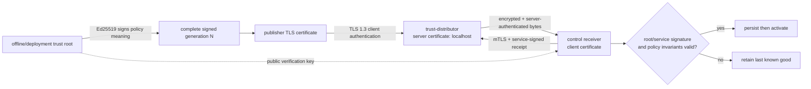
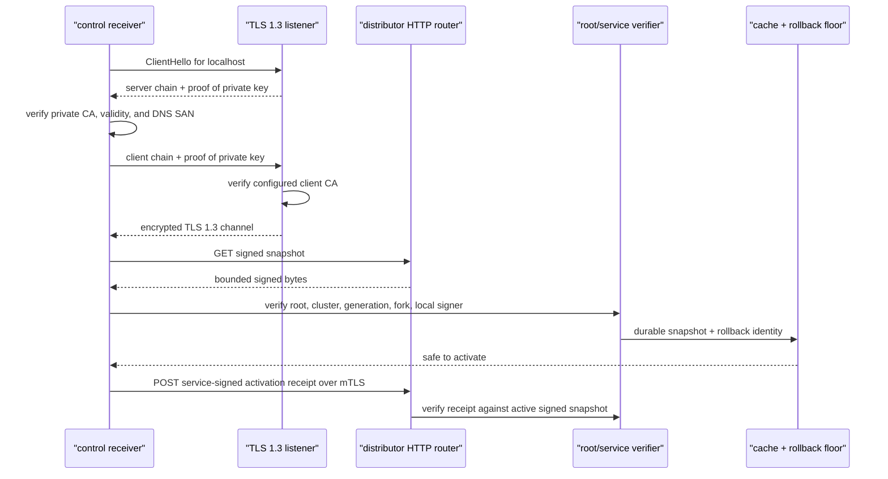
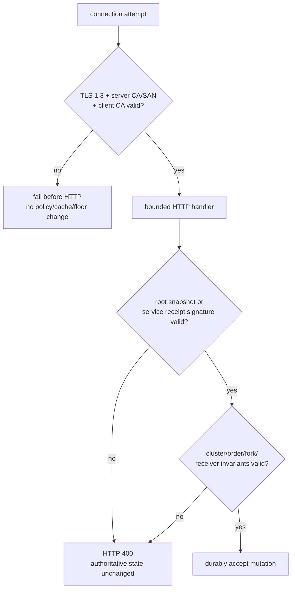

# RFC 0029: Mutual-TLS trust distribution

- **Status:** implemented in v0.24
- **Authors:** InferLab project
- **Depends on:** RFC 0028 distributed signed service trust
- **Scope:** the network hop between control receivers and `trust-distributor`

## Summary

v0.23 proves that a root-signed service-trust snapshot can be distributed and
that each control can report activation with a service-signed receipt. Its
HTTP transport does not encrypt bytes, authenticate the distributor hostname,
or require a client certificate.

v0.24 adds an optional TLS 1.3 mutual-authentication mode to that exact hop:



The channel and application layers remain deliberately independent:

- X.509 certificates and TLS authenticate channel peers and encrypt traffic;
- the service-trust root signature authorizes snapshot meaning; and
- the receiver service signature authenticates a receipt statement.

A CA-valid publisher can establish the channel, but it still cannot publish a
tampered snapshot or forge a receiver receipt.

## Motivation

Application signatures prevented a distributor or network attacker from
silently changing policy meaning, but v0.23 still exposed metadata and allowed
an unauthenticated network client to reach HTTP handlers. It also could not
prove that `https://localhost` was the intended distributor.

The required properties are deliberately split by verifier:

> Before routing a request, the distributor's TLS 1.3 listener requires a
> client certificate issued by its configured client CA. Before sending HTTP,
> a conforming control verifies the distributor chain against its configured
> server CA and verifies the URL hostname against the server certificate SAN.

The distributor cannot know whether an arbitrary malicious client performed
server verification; it can only enforce its side of the handshake. The proof
observes the conforming control/client verifier rejecting a wrong server CA and
wrong hostname before it sends HTTP.

Those properties close plaintext downgrade, missing-client-certificate, rogue
client-CA, wrong-server-CA, and wrong-hostname paths for this hop. It does not
turn certificate possession into authorization to change signed policy.

## Goals

- Support a TLS 1.3-only distributor listener that requires a client
  certificate chaining to a configured private CA.
- Support controls that authenticate the distributor CA/hostname and present
  their configured client certificate and private key.
- Require each server/client TLS path set to be complete; reject partial or
  scheme-mismatched configuration before listening.
- Keep the proof hostname meaningful: bind `127.0.0.1`, connect to
  `https://localhost`, and issue only a `DNS:localhost` server SAN.
- Reject plaintext, no-client-certificate, rogue-client-CA, wrong-server-CA,
  and wrong-hostname attempts before an HTTP response.
- Preserve every v0.23 root signature, cluster, ordering, fork, durable cache,
  activation, and receipt verification gate.
- Expose redacted transport diagnostics without paths, certificate bytes, or
  private-key material.
- Prove cache-backed restart and real CPU JSON/SSE service during distributor
  outage.
- Remain entirely loopback/local and incur no hosting or certificate cost.

## Non-goals

- TLS or mTLS for Raft peer RPC, gateway-to-control, gateway-to-worker, client-
  to-gateway, metrics, or any service hop other than trust distribution.
- Binding an X.509 subject or SAN to an InferLab service ID, credential ID, or
  endpoint-specific role.
- Per-certificate authorization such as “publisher may POST snapshots but a
  control may only GET snapshots and POST its own receipt.”
- Online certificate rotation, hot reload, overlap orchestration, revocation
  lists, OCSP, or an operational certificate-expiry SLA.
- ACME, public PKI, DNS automation, a secrets manager, KMS, HSM, TPM, or
  protected private-key custody.
- Replacing Ed25519 policy or receipt signatures with TLS identity.
- Policy expiry, emergency cancellation, or distributor high availability.
- Multi-host, hostile-network, remote-attestation, or Byzantine distributor
  evidence.

## Configuration contract

### Distributor server

The existing HTTP listener remains available only when all TLS variables are
absent. Mutual TLS requires all three:

| Environment variable | Meaning |
|---|---|
| `INFERLAB_TRUST_DISTRIBUTOR_TLS_CERT_PATH` | PEM server certificate chain |
| `INFERLAB_TRUST_DISTRIBUTOR_TLS_KEY_PATH` | Matching PEM server private key |
| `INFERLAB_TRUST_DISTRIBUTOR_TLS_CLIENT_CA_PATH` | PEM CA roots accepted for client certificates |

### Control receiver client

An `https://` distributor URL requires all three client variables:

| Environment variable | Meaning |
|---|---|
| `INFERLAB_SERVICE_TRUST_TLS_CA_CERT_PATH` | Private CA roots trusted for the distributor |
| `INFERLAB_SERVICE_TRUST_TLS_CLIENT_CERT_PATH` | Receiver PEM client certificate chain |
| `INFERLAB_SERVICE_TRUST_TLS_CLIENT_KEY_PATH` | Matching PEM receiver private key |

The accepted combinations are:

| Distributor URL | Client TLS paths | Outcome |
|---|---|---|
| `http://...` | absent | explicit compatibility mode: `insecure-http` |
| `https://...` | all present | `mutual-tls` |
| `https://...` | absent or partial | startup error |
| `http://...` | any TLS path | startup error |
| another scheme, credentials, fragment, or unsafe URL shape | any | startup error |

The server-side path group is also all-or-none. PEM reads are bounded, root
stores contain bounded certificate counts, certificate files may contain only
certificate blocks, and a key file must contain exactly one supported private
key. Error/status output names the role but does not reveal file content.

## Handshake and request protocol



TLS failure happens before the Axum HTTP router. An invalid peer receives no
HTTP status from a distributor handler and therefore cannot invoke snapshot or
receipt mutation logic.

The receiver still performs conditional GET with ETag/304, bounded streamed
body reads, request timeouts, deterministic capped backoff, durable cache/floor
replacement, atomic activation, and post-activation receipt delivery from RFC
0028. TLS is configured once at startup in v0.24; certificate files are not
hot-reloaded.

## Layered authority

| Question | TLS answer | Application-signature answer |
|---|---|---|
| Is this channel encrypted? | Yes in `mutual-tls` mode | Not applicable |
| Did the peer present a certificate under the configured CA? | Yes | Not applicable |
| Did the client authenticate the `localhost` hostname? | Yes in the proof | Not applicable |
| Is this exact trust generation authorized? | No | Trust-root signature + invariants |
| Did node A sign this exact receipt statement? | No | Node A service credential signature |
| Is a missing receipt proof of failure? | No | No; absence remains ambiguous |

This separation prevents a dangerous inference: “the request arrived over
mTLS, therefore its JSON is trusted.” A CA-valid but semantically unauthorized
client still faces all root/service signature checks.

## Failure matrix



| Scenario | Failure layer | Expected effect |
|---|---|---|
| Plain HTTP to TLS port | TLS record/protocol | No HTTP response; active/cache/floor unchanged |
| No client certificate | Server client verifier | No HTTP response |
| Client certificate from rogue CA | Server client verifier | No HTTP response |
| Wrong server CA | Client server verifier | No HTTP response |
| Connect by `127.0.0.1` to localhost-only SAN | Client hostname verifier | No HTTP response |
| Valid mTLS + tampered snapshot | Root signature verifier | HTTP 400; generation unchanged |
| Valid mTLS + modified signed receipt | Service signature verifier | HTTP 400; receipt set unchanged |
| Distributor outage + valid accepted cache | Remote transport then cache bootstrap | Receiver starts on cache and keeps reconciling |

## Status and diagnostics

Distributor status includes:

```json
{
  "transport_security": {
    "mode": "mutual-tls",
    "client_certificate_required": true,
    "minimum_protocol": "TLSv1.3"
  }
}
```

Each control's `service_authentication` status includes:

```json
{
  "trust_policy_distribution_mode": "remote-http",
  "trust_policy_transport_mode": "mutual-tls",
  "trust_policy_server_authentication": true,
  "trust_policy_client_authentication": true
}
```

`remote-http` is the existing distribution mechanism name; the new transport
field distinguishes its `insecure-http` and `mutual-tls` variants. Static/local
file modes report `not-applicable` transport and false authentication booleans.
No URL credentials, certificate subject, certificate bytes, path, or key data
is exposed.

## Alternatives considered

### Rely only on Ed25519 application signatures

That preserves integrity/authority but leaves metadata readable, the server
hostname unauthenticated, and handlers reachable by unauthenticated clients.

### Server-only TLS

It encrypts traffic and authenticates the distributor, but any network client
can still reach distributor handlers. Client certificates create a channel-
admission boundary before HTTP.

### Make client certificate identity the policy authority

This would conflate deploy-time PKI membership with service-trust policy
meaning and receipt identity. Keeping Ed25519 authorization preserves the
auditable complete-policy and exact-receipt contracts from v0.22/v0.23.

### Add mTLS to every InferLab service now

That would combine several distinct threat models, identities, rotation plans,
and deployment surfaces in one milestone. v0.24 proves the narrow highest-
value remote trust channel first; global service mTLS remains explicit work.

### Use a public CA or ACME

The proof is loopback-only and must cost nothing. An ephemeral private CA makes
the trust boundary deterministic without claiming production certificate
operations.

## Exact-process proof

`scripts/proof-v0.24.sh`:

1. creates an exact `inferlab-v024.*` temporary root with `umask 077`;
2. generates ephemeral private CA, server, publisher, three control, rogue CA,
   and rogue client credentials under that root;
3. negotiates TLS 1.3 to a localhost-SAN distributor;
4. remotely boots three controls on root-signed g1 and observes three receipts;
5. rejects five transport attacks before HTTP while live generation and all
   cache/floor hashes remain unchanged;
6. rejects a tampered snapshot and forged receipt over otherwise valid mTLS;
7. publishes valid g2, observes three controls and three receipts;
8. stops the exact distributor PID and restarts one follower from its complete
   g2 cache;
9. serves a real CPU JSON request and SSE through `[DONE]`; and
10. scans the complete retained bundle against every known Ed25519 proof seed
    and every normalized generated PKI private-key payload, then retains only
    sanitized JSON/SVG evidence.

Cleanup signals only proof-owned child PIDs, waits with a bound, escalates if
needed, reaps them, and deletes only the exact guarded temporary directory.

## Limitations and follow-up

v0.24 is local evidence for one protected hop. It still trusts local files and
private-key custody, uses one distributor, has eventual rather than atomic
fleet convergence, and cannot explain a missing receipt by itself.

Queued follow-up remains deliberately separated:

- **v0.25:** Raft partition and Figure-8 safety evidence;
- **v0.26:** Prometheus-format observability and operational dashboards;
- later: global service mTLS, certificate rotation/revocation, ACME/HSM-backed
  custody, policy expiry/cancellation, and distributor HA.
