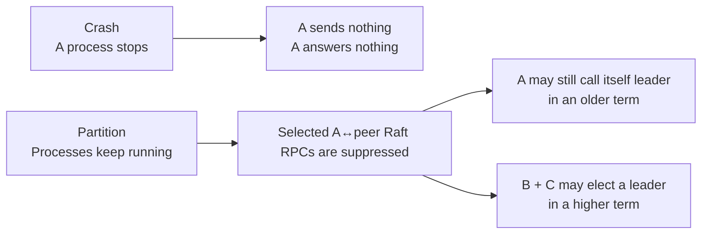
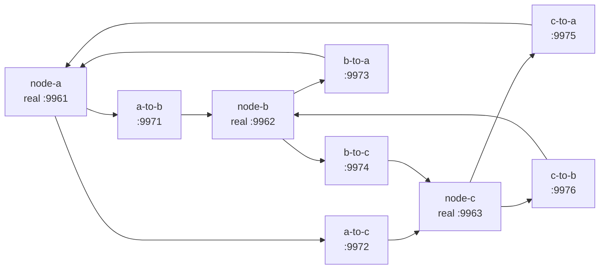
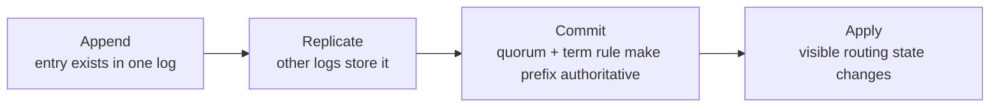
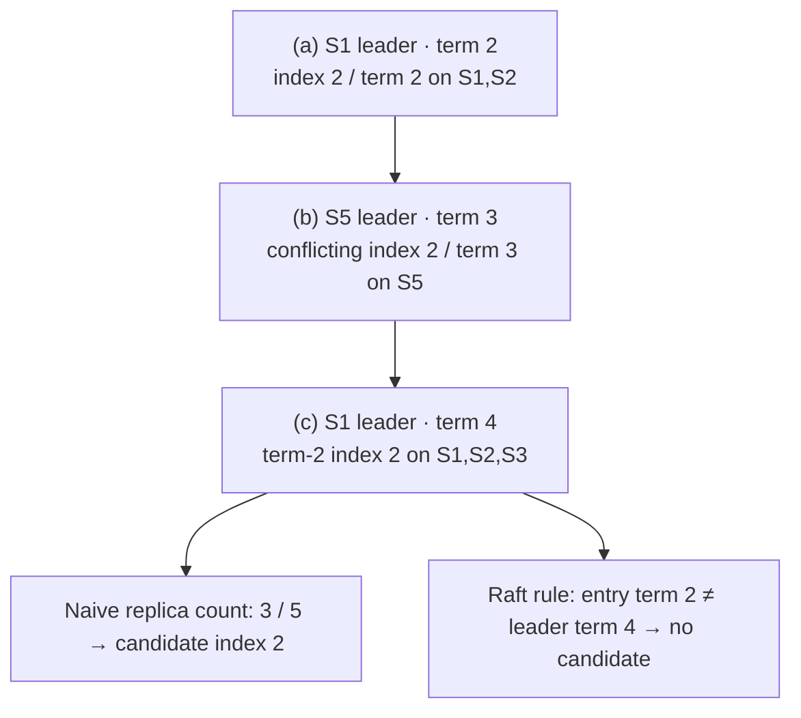
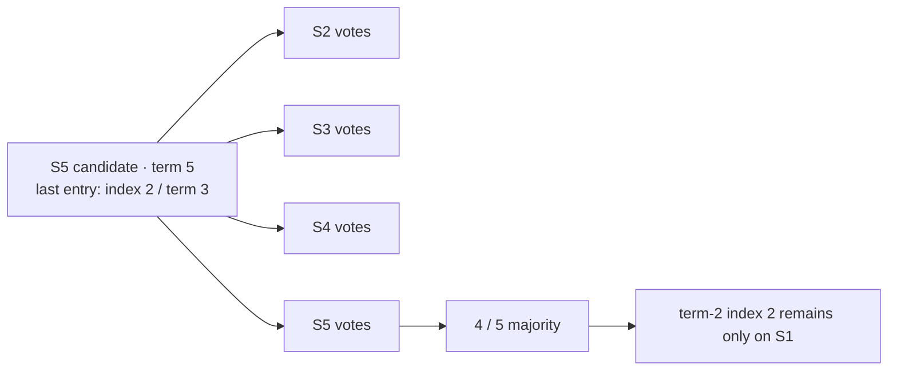
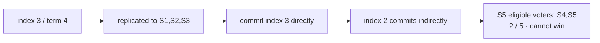
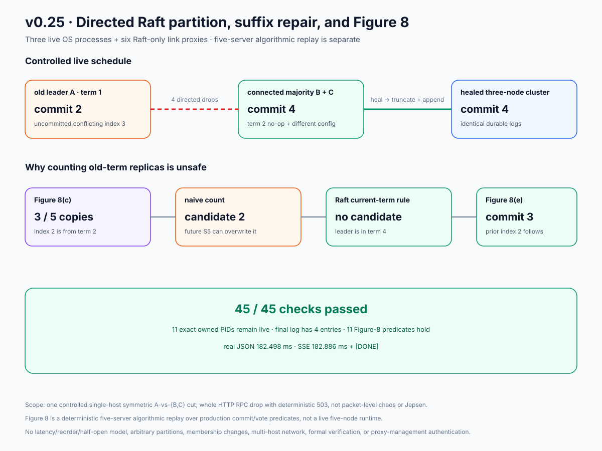

# RFC 0030: Directed Raft partitions and Figure-8 safety

**Status:** Implemented | **Milestone:** v0.25

## What this RFC decides

RFC means **Request for Comments**: a reviewable engineering decision record.
This RFC decides how InferLab will make two subtle Raft safety properties
visible and falsifiable:

1. a three-node majority can elect and commit while an isolated old leader can
   only append an uncommitted conflicting suffix; and
2. an entry from an older term is not committed merely by counting replicas,
   which is the safety lesson in the extended Raft paper's Figure 8.

The runtime cluster remains fixed at three nodes. The live experiment uses
three independent `control-plane` OS processes and six independent directed
link-proxy OS processes. A separate deterministic five-server replay matches
Figure 8(a–e) and calls the same production commit and vote-freshness
predicates; it is not a live five-node cluster or membership support.

The primary reference is Ongaro and Ousterhout's
[extended Raft paper](https://raft.github.io/raft.pdf), especially §5.4.2 and
Figure 8.

## Context

The v0.6 proof killed leaders. A killed process is easy to picture: it no longer
runs or answers anyone. A network partition is harder because every process may
still be healthy while different directed messages are deliverable.



Seeing two nodes report `leader` during a partition does not automatically
violate Raft. The invariant is **at most one leader per term**. An isolated A
can remain unaware of term 2 and report “leader, term 1” while B reports
“leader, term 2.” Only B can reach the two-of-three quorum in that newer term.

Without a controlled delivery boundary, a test cannot distinguish “A's RPC was
suppressed” from “A was killed,” “the target was unavailable,” or “an ambient
proxy changed the route.” The test also needs durable log observations; an HTTP
`503` alone is an ambiguous proposal result because the request may have failed
after replication.

## Required safety properties

The implementation and proof must preserve these properties:

1. **Election safety:** no two leaders exist in the same term.
2. **Quorum commit:** one node alone cannot commit a configuration in a
   three-node cluster; two connected nodes can.
3. **State-machine safety:** only committed entries are applied as visible
   routing configuration.
4. **Log matching:** agreeing on an index and term means the preceding log
   prefix agrees.
5. **Conflicting-suffix repair:** a current leader may replace an uncommitted
   conflicting follower suffix after the latest matching prefix.
6. **Committed-prefix preservation:** repair never removes the committed
   prefix.
7. **Leader completeness:** a future leader contains entries committed by
   earlier terms.
8. **Current-term commit rule:** replica counting directly commits only an
   entry from the leader's current term; committing that entry indirectly
   commits its prior prefix.

## Decision 1: six directed Raft-only link proxies

Place one rootless loopback HTTP proxy on every ordered node pair. A node sends
each outgoing Raft RPC to its own proxy; the proxy either forwards it to the
real target or returns a local structured `503` without contacting the target.



The `raft-link-proxy` contract is:

| Surface | Contract |
|---|---|
| Required identity | `INFERLAB_RAFT_LINK_ID`, source ID, and target ID |
| Network configuration | explicit loopback-IP bind and explicit loopback-IP upstream |
| Evidence path | fresh proof-owned JSONL path; startup rejects an existing path |
| Health | `GET /healthz` |
| Observation | `GET /v1/link/status` |
| Transition | `PUT /v1/link/mode` with `allow` or `drop` plus a bounded reason |
| Allow mode | forwards only exact query-free `POST /raft/request-vote` and `POST /raft/append-entries` |
| Drop mode | does not touch upstream; returns `503` with code `link_dropped` |

This is intentionally not a generic open proxy. It rejects all other routes,
requires a root upstream path without userinfo/query/fragment, disables ambient
proxies and redirect following, bounds connect/request time and both body
directions, and strips `Host`, standard hop-by-hop headers, and headers named by
`Connection`. End-to-end authentication headers and the body are forwarded but
never written to the proxy journal.

Separately, the production `RaftNode` peer client disables ambient proxies and
redirect following. The six configured proxy URLs are therefore the actual
path for signed peer RPCs; a `307` cannot redirect a custom authentication
header or signed body to another endpoint. The proxy's upstream client has the
same no-proxy/no-redirect policy, but it is a distinct HTTP client and boundary.

Each status reports identity, direction, upstream, current mode, transition
metadata, and forwarded/dropped/upstream-failure counters. JSONL records
startup, mode changes, drops, and upstream failures with a monotonic sequence.
Successful heartbeat-sized traffic is represented by a counter rather than one
journal row per request. A proxy opens its event file with create-new semantics:
restart against an existing path fails with `AlreadyExists` instead of
appending a second sequence starting at 1. A harness must allocate a fresh path
for every proxy start.

## Decision 2: one exact live partition schedule

The retained proof uses this controlled schedule:

```mermaid
sequenceDiagram
    participant Client
    participant A as A · old leader
    participant AB as four A↔majority links
    participant B as B · future leader
    participant C as C · follower

    Note over A,C: full mesh · term 1 · committed baseline index 2
    Client->>A: signed round-robin configuration
    A->>B: replicate index 2
    A->>C: replicate index 2
    Note over A,C: all apply revision 2

    Note over AB: drop B→A and C→A first
    Note over AB: then drop A→B and A→C
    Client->>A: signed least-in-flight proposal
    A->>A: append conflicting index 3
    A-->>Client: 503 unavailable · ambiguous result

    B->>C: RequestVote in higher term
    C-->>B: vote granted
    B->>C: replicate current-term no-op at index 3
    Note over B,C: commit index 3 with 2 of 3
    Client->>B: signed weighted configuration
    B->>C: replicate and commit index 4

    Note over AB: heal A→B and A→C first
    Note over AB: then heal B→A and C→A
    B->>A: higher-term AppendEntries
    A->>A: step down; replace old index 3
    B->>A: append committed index 4
    Note over A,C: identical logs and commit index 4
```

Inbound paths to A are dropped before A's outbound paths. That closes a small
setup window in which B or C could start a higher-term campaign and reach A
before the cut is complete. Healing opens A's outbound paths before its inbound
paths; either direction would eventually converge, but retaining an explicit
order makes the experiment reproducible.

The partition is a **symmetric A-vs-{B,C} cut built from four independently
directed controls**. The mechanism can control one direction, but this proof
does not claim an arbitrary asymmetric-partition experiment.

## Read the live logs as three different facts

During the cut, durable state has this form. Term numbers are observed, not
assumed; `U > T` is the majority's later term and permits skipped elections.

| Node | Index 1 | Index 2 | Index 3 | Index 4 | Commit index | Applied config |
|---|---|---|---|---|---:|---|
| A | no-op, T | baseline, T | minority proposal, T | — | 2 | baseline revision 2 |
| B | no-op, T | baseline, T | no-op, U | majority config, U | 4 | majority revision 4 |
| C | no-op, T | baseline, T | no-op, U | majority config, U | 4 | majority revision 4 |

This separates three verbs that are often blurred together:



A's minority command is appended, but not committed and not applied. The
structured `503 unavailable` is therefore described as an **ambiguous proposal
result**, not as proof of non-commit. The proof establishes non-commit by
observing A's unchanged `commit_index=2` and applied baseline during the cut,
then observing that the healed authoritative log has replaced index 3 and
contains no minority command.

## Decision 3: retain exact Figure 8(a–e) algorithmic evidence

The three-node schedule proves live quorum isolation and suffix repair. It does
not by itself reach the five-server state in the paper's Figure 8. A separate
deterministic report reconstructs that exact sequence while calling production
`highest_committable_index` and the production vote-freshness predicate.

### Stages a, b, and c



At stage (c), the old term-2 entry is physically present on a majority. That is
not yet enough to declare it committed.

### Unsafe branch d

S5's last log term is 3, so it outranks S2 and S3's term-2 endings and S4's
shorter term-1 log. S5 plus those voters can form a future majority and
overwrite index 2. The alleged term-2 commit would survive only on S1.



### Safe branch e

Instead, S1 appends index 3 in its current term 4 and replicates it to S1, S2,
and S3. The production commit rule returns index 3. Log Matching makes index 2
part of the committed prefix indirectly. S5 can then receive votes only from
S4 and itself, not a majority.



The exact rule from §5.4.2 is conservative and simple: an old-term entry on a
majority is not directly committable; a current-term entry on a majority is,
and its preceding prefix then commits indirectly through Log Matching.

## Why vote freshness compares term before index

The RequestVote freshness comparison is lexicographic:

1. compare the last entry's term;
2. only when last terms are equal, compare the last index.

| Candidate last entry | Voter last entry | Candidate at least as current? | Why |
|---|---|---|---|
| index 2, term 3 | index 2, term 2 | yes | later last term wins |
| index 2, term 3 | index 3, term 2 | yes | term is compared before length |
| index 2, term 3 | index 3, term 4 | no | voter has the later term |
| index 4, term 4 | index 3, term 4 | yes | same term, longer log wins |

This election restriction and the current-term commit rule work together. Vote
freshness prevents a future leader from missing a committed current-term
entry; Log Matching then preserves its entire prefix.

## Alternatives considered

### Kill and restart the old leader

This proves crash recovery, which v0.6 already covers. It cannot show a healthy
old leader appending locally while a connected majority progresses.

### Firewall rules, network namespaces, or containers

These can model packets or hosts more realistically, but typically need root,
platform-specific tooling, or privileged CI. They make a `$0` laptop proof
less portable. The HTTP link boundary is deliberately narrower and observable.

### Add a global “partition mode” inside Raft

An internal switch would mix the test mechanism with the consensus state
machine and might skip real serialization, authentication, HTTP, and client
error paths. Six external processes keep production node behavior unchanged.

### Use only a unit test for Figure 8

A unit test is essential for the rare five-server state but does not show the
live three-process control API, signed writes, durable disk state, healing, or
the real gateway/worker serving path. v0.25 retains both layers.

### Call any majority copy committed

Figure 8(d) is the counterexample. The approach appears simpler but can make a
command “committed” and later overwrite it.

## Evidence and acceptance

`scripts/proof-v0.25.sh` owns exact child PIDs, captures process start tokens,
and cleans up only a PID whose current parent is still the proof shell. It:

1. builds the workspace and runs the deterministic Figure-8 JSON report plus
   its exact unit regression;
2. starts six link proxies and three Raft control processes;
3. captures a full-mesh committed baseline;
4. applies the ordered four-link cut;
5. observes A's ambiguous `503`, durable uncommitted suffix, and unchanged
   applied state;
6. observes B+C elect, commit their no-op, and commit a different route;
7. heals the cut and observes A step down, suffix replacement, and identical
   logs/commit indexes;
8. starts a real CPU worker and gateway from healed revision 4;
9. completes one JSON request and one SSE stream ending in `[DONE]`; and
10. sanitizes evidence, scans known private seeds, checks 45 assertions twice,
    renders the SVG, performs a final discarded leak scan, and writes an exact
    28-file manifest before optional retention.

The retained run observed baseline term 1, majority term 2, healed revision 4,
a 182.498 ms real JSON request, and a 182.886 ms SSE stream. These are one
loopback-machine run's status-observation and request durations, not election
SLOs, network benchmarks, or throughput claims.



## Limitations

- This is one controlled single-host schedule, not Jepsen, formal verification,
  or arbitrary partition safety evidence.
- `drop` suppresses whole Raft HTTP RPC delivery and returns a local `503`; it
  does not model silent packet loss, latency, reorder, duplication, TCP
  half-open behavior, kernel queues, or independent hosts.
- A mode transition affects requests admitted afterward; it does not cancel a
  forward already in flight.
- Management status/mode endpoints are unauthenticated. That is acceptable only
  for this proof-owned binary because bind and upstream are explicit loopback
  IP literals.
- JSONL is flushed for evidence visibility, not `fsync`-durable across a proxy
  crash. Event paths must be fresh per start; existing paths fail closed.
  Operator-supplied transition reasons are intentionally journaled.
- The live runtime is fixed at three nodes. The five-server replay does not add
  dynamic membership, joint consensus, or a five-process deployment.
- The Figure-8 replay exercises production commit/vote predicates, not five
  HTTP processes, campaign timing, or the complete no-op transport path.
- The milestone does not add linearizable follower reads, Byzantine fault
  tolerance, global service mTLS, certificate lifecycle, multi-region HA, or
  automatic network remediation.

## Implementation ownership

| File | Responsibility |
|---|---|
| `control-plane/src/link_proxy.rs` | Rootless directed Raft-only allow/drop boundary and JSONL evidence |
| `control-plane/src/bin/raft-link-proxy.rs` | Loopback-only proxy process configuration and listener |
| `control-plane/src/figure_eight.rs` | Exact Figure-8 a–e report using production predicates |
| `control-plane/src/bin/raft-figure-eight-proof.rs` | Machine-readable deterministic report binary |
| `control-plane/src/raft.rs` | Production vote freshness, replication, current-term commit, and repair |
| `benchmarks/raft_partition_probe.py` | No-proxy link/cluster/state/process observations and sanitization |
| `benchmarks/check_raft_partition.py` | 45 semantic assertions over retained evidence |
| `benchmarks/render_raft_partition_svg.py` | Data-derived checked evidence chart |
| `scripts/proof-v0.25.sh` | Exact-process orchestration, cleanup, leak gates, manifest, and retention |
