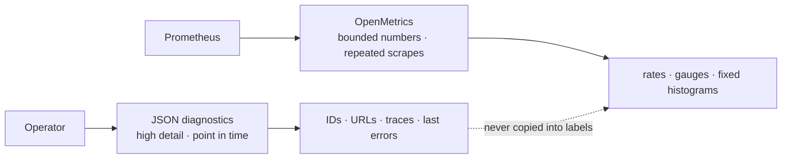
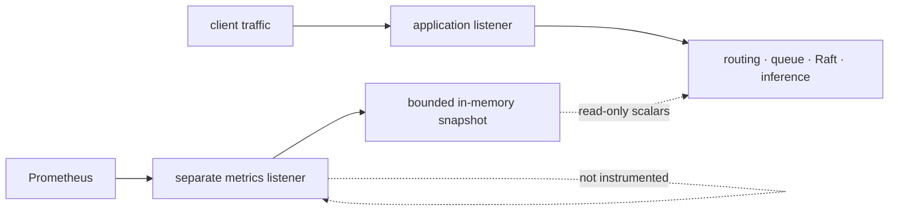
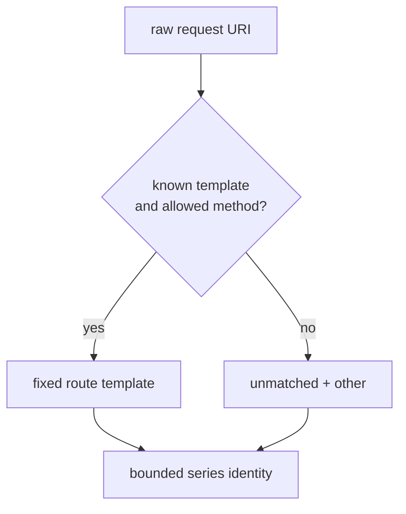
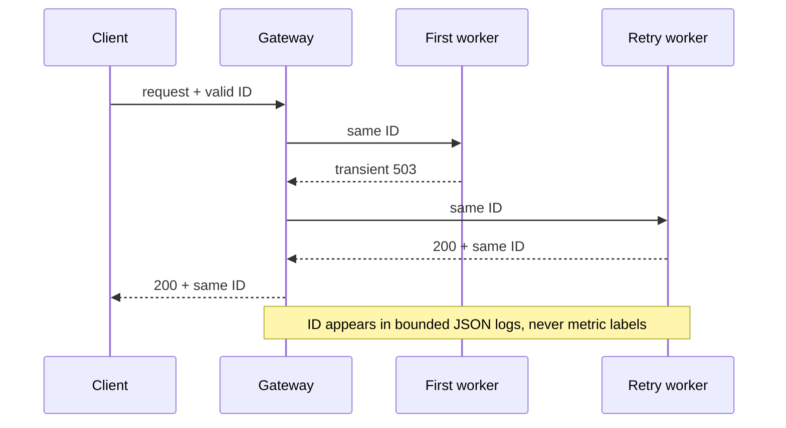
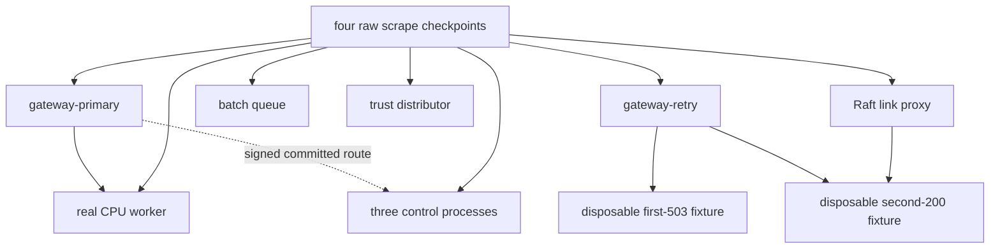

# RFC 0031: Bounded-cardinality Prometheus observability

**Status:** Implemented | **Milestone:** v0.26

## What RFC means and what this one decides

RFC means **Request for Comments**. In InferLab, an RFC is a reviewable
engineering decision record: it states the problem, the required invariants,
the selected design, rejected alternatives, proof plan, and honest limits.

RFC 0031 decides how every InferLab service exposes a small, stable
Prometheus/OpenMetrics projection without turning prompts, request IDs, worker
names, paths, or error text into an unbounded time-series database. It also
adds one bounded request-correlation field and a local, zero-cost Prometheus
Compose demo.

The decision has four parts:

1. metrics use a separate opt-in listener that is not itself instrumented;
2. metric names and labels come from a closed catalog of finite enums;
3. `x-inferlab-request-id` correlates client, gateway, retries, worker, and
   structured logs but is never a metric label; and
4. proof checks raw OpenMetrics text, status-to-metric equality, exact failure
   deltas, cardinality, process continuity, and real CPU inference.

## Context: diagnostics and metrics answer different questions

InferLab already has rich JSON status endpoints. They are useful when an
operator asks, “what exactly is this process doing now?” They contain worker
IDs, URLs, paths, traces, last errors, and other high-detail facts. Prometheus
answers a different question: “how did a small set of numeric signals change
over time across many scrapes?”



Converting every JSON field into a label would be convenient once and
expensive forever. A label set identifies a time series. If a request ID or
prompt becomes a label, every request creates another series that Prometheus
must index and retain.

## Required invariants

The implementation and proof must preserve these properties:

1. **Opt-in surface:** no metrics listener exists unless
   `INFERLAB_METRICS_BIND` is set.
2. **Loopback default:** a non-loopback bind is rejected unless
   `INFERLAB_METRICS_ALLOW_NON_LOOPBACK=1` is explicit.
3. **Separate listener:** only `GET /healthz` and `GET /metrics` exist on the
   metrics listener; it does not count its own scrapes.
4. **Exact format:** successful scrapes use OpenMetrics 1.0 content type, exact
   `HELP`/`TYPE` metadata, required `UNIT` metadata for seconds/bytes families
   and no `UNIT` for unitless families, plus one terminal `# EOF` marker.
5. **Closed labels:** service, route, method, status class, state, result,
   outcome, kind, and decision values come from documented finite sets.
6. **No request-derived labels:** request IDs, prompts, raw paths, job IDs,
   worker IDs, URLs, error text, credentials, and signatures never become
   metric labels.
7. **Hard budgets:** every target has a theoretical maximum of at most 256
   raw series; the nine-target proof topology has at most 2,500.
8. **Counter monotonicity:** counters and histogram components do not decrease
   while the same process remains alive.
9. **Gauge truth:** scrape-time gauges equal the corresponding bounded service
   snapshot without I/O, consensus, or token-loop work.
10. **Correlation stability:** one valid request ID remains stable through all
    gateway retries and the worker; invalid input is replaced once.
11. **Sensitive absence:** correlation belongs in headers and structured logs,
    not in metric text.

## Decision 1: an explicit side-channel listener

Every binary shares this startup contract:

| Configuration | Meaning |
|---|---|
| `INFERLAB_METRICS_BIND` unset | metrics disabled; no listener |
| `INFERLAB_METRICS_BIND=127.0.0.1:PORT` | local metrics listener enabled |
| non-loopback bind | rejected unless `INFERLAB_METRICS_ALLOW_NON_LOOPBACK=1` |
| `INFERLAB_LOG_FORMAT=compact` | human-oriented logs; default |
| `INFERLAB_LOG_FORMAT=json` | structured correlation logs |



The metrics listener returns:

- `GET /healthz` for its own listener liveness;
- `GET /metrics` with
  `application/openmetrics-text; version=1.0.0; charset=utf-8`; and
- `404`/method rejection for everything else.

This separation prevents a scrape from incrementing the application request
counter it is reading. Loopback is the safe local default, not a complete
production security design. The interview Compose network intentionally sets
the non-loopback override because Prometheus is a different container on one
private Docker network; only the Prometheus UI is host-published, on loopback.

## Decision 2: one common HTTP vocabulary

All six service classes expose three common families:

| Family | Type | Labels |
|---|---|---|
| `inferlab_http_requests_total` | counter | `service`, `route`, `method`, `status_class` |
| `inferlab_http_handler_duration_seconds` | histogram | `service`, `route`, `method` |
| `inferlab_http_requests_in_flight` | gauge | `service` |

Allowed method values are `GET`, `POST`, `PUT`, and `other`. Allowed status
classes are `2xx`, `3xx`, `4xx`, and `5xx`. `service` is exactly one of
`gateway`, `cpu-worker`, `batch-queue`, `control-plane`,
`trust-distributor`, or `raft-link-proxy`.

Routes are matched framework templates, never the raw URI. A request for
`/v1/batch/jobs/7` is labeled `/v1/batch/jobs/{job_id}`. Unknown paths and
known paths with unsupported methods collapse to `route="unmatched"` and
`method="other"`.

The allowlist is a set of exact **route/method pairs**, not two independently
valid sets. For example, gateway `/health` + `GET` is valid while `/health` +
`POST` collapses to `unmatched` + `other`. This pair relation is also the input
to the theoretical series calculation.



The fixed histogram boundaries, in seconds, are:

```text
0.001, 0.0025, 0.005, 0.01, 0.025, 0.05, 0.1, 0.25,
0.5, 1, 2.5, 5, 10, 30, +Inf
```

Each histogram label set therefore owns 17 samples: 15 cumulative buckets,
one sum, and one count. The checker requires exact bucket/sum/count label-set
parity (so a sum/count-only orphan cannot pass), ordered cumulative buckets,
`+Inf == count`, a finite non-negative sum, and the exact finite boundaries.

## Decision 3: service-specific bounded projections

The domain catalog is deliberately descriptive but finite.

### Gateway

| Family | Labels |
|---|---|
| `inferlab_gateway_admission_current` | `state=outstanding|executing|queued` |
| `inferlab_gateway_admission_rejections_total` | none |
| `inferlab_gateway_requests_total` | none |
| `inferlab_gateway_attempts_total` | none |
| `inferlab_gateway_transient_failures_total` | none |
| `inferlab_gateway_retries_total` | `decision=granted|budget_denied|limit_exhausted` |
| `inferlab_gateway_deadlines_exceeded_total` | none |
| `inferlab_gateway_workers` | none |
| `inferlab_gateway_worker_requests_in_flight` | none |
| `inferlab_gateway_worker_circuits` | `state=closed|open|half_open` |
| `inferlab_gateway_routing_lease_ready` | none |
| `inferlab_gateway_control_revision` | none |
| `inferlab_gateway_completion_duration_seconds` | `outcome=success|error|cancelled|deadline` |

Completion `mode=json|stream` remains in structured start/terminal logs, not a
metric label. Removing mode from the histogram is what keeps the hard gateway
ceiling at 255 rather than multiplying four outcome histograms again.

### CPU worker

| Family | Labels |
|---|---|
| `inferlab_worker_requests_total` | none |
| `inferlab_worker_scheduler_current` | `state=queued|active` |
| `inferlab_worker_scheduler_requests_total` | `outcome=admitted|completed|cancelled|failed` |
| `inferlab_worker_scheduler_batches_total` | none |
| `inferlab_worker_tokens_total` | none |
| `inferlab_worker_batch_slots_total` | `state=used|available` |
| `inferlab_worker_generation_duration_seconds` | `outcome=success|error|cancelled` |

Paged-cache page/byte/prefix families are intentionally deferred. The current
native `PagedKvPool::stats()` path locks the allocator and scans pages. Calling
it on every Prometheus scrape would put observability work on a per-token cache
structure. Cache detail stays available through on-demand JSON diagnostics
until a constant-time snapshot exists.

### Durable batch queue

| Family | Labels |
|---|---|
| `inferlab_queue_jobs` | `state=pending|claimed|completed|dead_letter` |
| `inferlab_queue_wal_bytes` | none |
| `inferlab_queue_wal_events_total` | none |
| `inferlab_queue_claims_total` | none |
| `inferlab_queue_acknowledgments_total` | none |
| `inferlab_queue_redeliveries_total` | none |
| `inferlab_queue_failures_total` | `kind=explicit|dead_lettered|torn_tail` |

Queue gauges reflect already durable lifecycle transitions. A scrape does not
advance visibility timeouts or trigger lease expiry; it reads the store's
bounded scalar snapshot. This prevents observation from mutating queue state.

### Control plane

The control catalog includes one-hot role, term, commit/applied/log indexes,
storage health, election/leadership/vote counters, bounded AppendEntries and
replication outcomes, write-authorization outcomes, service-authentication
outcomes, trust reload/fetch state, and receipt-post outcomes. No peer ID,
writer ID, credential ID, nonce, URL, term trace, or error string is a label.

### Trust distributor

The trust catalog includes bounded snapshot request/publish outcomes, receipt
outcomes, current generation, expected/acked/pending receiver counts, and
storage health. Receiver identity and signed receipt bytes remain in JSON, not
metrics.

### Raft link proxy

The link catalog includes a one-hot `allow|drop` mode, transition count,
`forwarded|dropped|upstream_failure` request outcomes, and the last-transition
Unix timestamp. Link/source/target IDs, upstream URL, reason, method/path, and
journal detail are excluded.

The machine-readable exact catalog lives in the retained `contract.json` and
is independently checked against every raw scrape.

## Cardinality budget

For a service with `P` allowed route/method pairs, the common maximum is:

```text
P × (4 request-status counters + 17 histogram samples) + 1 in-flight gauge
```

| Service | Route/method pairs | Common max | Domain max | Target max |
|---|---:|---:|---:|---:|
| gateway | 8 | 169 | 86 | **255** |
| cpu-worker | 5 | 106 | 62 | **168** |
| batch-queue | 9 | 190 | 12 | **202** |
| control-plane | 7 | 148 | 33 | **181** |
| trust-distributor | 7 | 148 | 16 | **164** |
| raft-link-proxy | 6 | 127 | 7 | **134** |

The proof topology has two gateways, one worker, one queue, three controls, one
trust distributor, and one link proxy:

```text
2×255 + 168 + 202 + 3×181 + 164 + 134 = 1,721 theoretical series
```

Both 255 ≤ 256 and 1,721 ≤ 2,500 are design-time bounds. The proof also counts
the actual series in four independent raw scrape sets and requires the same
caps there. Twenty-four unique prompts must change counters but create exactly
zero new gateway or worker series identities.

## Decision 4: request ID is correlation, not identity or authority

`x-inferlab-request-id` accepts 1–64 ASCII characters from
`[A-Za-z0-9._:-]`. The gateway assigns or replaces it before authentication
and admission, echoes it on every response, and forwards one immutable value
on every worker attempt. A direct worker preserves a valid value and generates
one when the value is absent or invalid.



In retained proof evidence, an invalid incoming value is absent from the
response, every raw metric document, and the canonical CPU worker `request_id`
fields; one valid replacement is forwarded as the worker correlation ID. The
proof does not retain or claim a whole-file scan of every raw process-log
field. Request ID is not a bearer credential, authorization decision,
idempotency key, globally unique identifier, or trusted trace context.

## Exact-process proof

`scripts/proof-v0.26.sh` uses one guarded temporary root and nine retained
service OS processes:



The disposable Python fixture is stopped deliberately so the link proxy
records exactly one upstream failure; it is not a metrics target or continuity
claim. The retained nine services keep the same PID, parent, start token,
command, non-zombie state, and expected executable through the run.

The checker requires:

- exact family/type/unit/label/route-method catalogs in all raw scrapes, with
  every retained scrape summary rebound to its parsed raw document;
- theoretical and observed cardinality caps;
- exact histogram bucket/sum/count label-set parity, histogram algebra, and
  monotonic counters;
- service gauges/counters equal bounded JSON snapshots where no background
  race makes such equality invalid;
- exact retry deltas: one request, two attempts, one transient failure, one
  granted retry, and one successful completion observation;
- exact queue, trust, and link success/failure transitions;
- valid/replaced request ID behavior in canonical CPU start/terminal/HTTP log
  events and retry fixtures, including invalid-value absence from the response,
  metrics, and retained worker `request_id` fields;
- request IDs, prompts, and worker identity absent from every `.prom` file;
- 24 distinct prompts with unchanged gateway/worker series identities;
- one real CPU JSON response and one SSE ending in `[DONE]`;
- sanitization, known-secret absence, and exact output manifest.

Retention is transactional at the harness boundary: output must start empty,
every non-manifest file is copied and hash-verified first, and
`manifest.json` is published last as the completion marker. EXIT cleanup sends
signals only to processes whose parent is still the proof shell and removes
only the exact proof-owned temporary root.

After the retained private-material report stabilizes, the checker is rerun to
five disposable JSON outputs and the renderer to a disposable SVG. All six are
required to compare byte-for-byte with the retained artifacts before the
manifest can be created.

## Local Prometheus interview demo

The interview Compose file pins `prom/prometheus:v3.13.1`, never `latest`.
Prometheus scrapes the gateway, three controls, and two CPU workers over the
private Docker network. `sample_limit: 256` enforces the target budget at the
collector as well. Its 24-hour TSDB is a 128 MiB `tmpfs`; stopping the topology
discards metrics history. Only `127.0.0.1:${INFERLAB_PROMETHEUS_PORT:-9090}` is
published for the UI. Application metrics ports stay private.

This is a dashboard-ready raw collector, not a checked-in Grafana dashboard.
Useful starting PromQL includes:

```promql
sum by (service) (rate(inferlab_http_requests_total[1m]))
sum by (service, status_class) (rate(inferlab_http_requests_total[1m]))
histogram_quantile(0.95,
  sum by (service, le) (rate(inferlab_http_handler_duration_seconds_bucket[5m])))
```

## Alternatives considered

### Export the entire JSON status object

Rejected. IDs, URLs, paths, and errors create unbounded or sensitive labels,
and nested status structure is not a stable time-series contract.

### Put `/metrics` on each public application listener

Rejected. It makes exposure easier to misconfigure and makes self-scrape
accounting ambiguous. A distinct listener can remain private and opt-in.

### Use request ID, worker ID, or job ID labels

Rejected. These values improve one-event correlation but create a series per
request or runtime identity. Structured logs and JSON diagnostics own that
detail.

### Export native page-cache state on every scrape

Deferred. The current stats path locks and scans allocator pages. A future
constant-time mirror could make a bounded cache projection safe, but v0.26
does not put scrape latency into the token/cache hot path.

### Add Grafana, OpenTelemetry, or a hosted backend now

Rejected for this milestone. They would add deployment, schema, cost, and
security decisions before the raw metric contract is proved. Prometheus alone
is sufficient to validate scrape semantics and PromQL compatibility locally.

## Limitations and deferred work

v0.26 does **not** claim:

- globally authenticated or TLS-protected metrics transport;
- Grafana dashboards, alert rules, recording rules, or proven SLOs;
- OpenTelemetry traces, baggage, exemplars, or cross-process trace sampling;
- cloud monitoring, remote write, durable long-term retention, or HA
  Prometheus;
- production capacity sizing, throughput, or latency percentiles from one
  loopback proof;
- native paged-cache metrics or a zero-cost cache snapshot;
- arbitrary user-defined labels or dynamic service discovery; or
- that request IDs are security identities or globally unique.

After v0.26, the next engineering boundary will be selected from the explicit
backlog: broader channel security/certificate operations, trust expiry/HA, or
checkpoint integration. No v0.27 is implied. CUDA remains the hardware-gated
v1.0 boundary.

## Glossary

| Term | Meaning here |
|---|---|
| RFC | Request for Comments; a reviewable design decision record |
| Metric family | One named counter, gauge, or histogram contract |
| Time series | One metric sample name plus one exact label set over time |
| Cardinality | Number of distinct time series |
| Counter | Monotonic total that resets only when its process restarts |
| Gauge | Current value that may rise or fall |
| Histogram | Cumulative bucket counters plus sum and count |
| Label | Bounded dimension that distinguishes time series |
| OpenMetrics | Text exposition format served by `/metrics` |
| Prometheus | Collector/query engine that repeatedly scrapes targets |
| Scrape | One collector read of a target's metric document |
| Route template | Stable framework path such as `/jobs/{job_id}` |
| Request ID | Bounded correlation value carried in header/log fields |
| High cardinality | A label space that can grow with traffic or user input |
| Hot path | Per-request or per-token work whose latency directly affects serving |
| PromQL | Prometheus query language |
| Manifest-last | Publishing evidence files first and manifest only after hash verification |

## References

- [Prometheus metric and label model](https://prometheus.io/docs/concepts/data_model/)
- [Prometheus metric types](https://prometheus.io/docs/concepts/metric_types/)
- [Prometheus exposition formats](https://prometheus.io/docs/instrumenting/exposition_formats/)
- [Prometheus installation](https://prometheus.io/docs/prometheus/latest/installation/)
- [Prometheus release cycle](https://prometheus.io/docs/introduction/release-cycle/)
