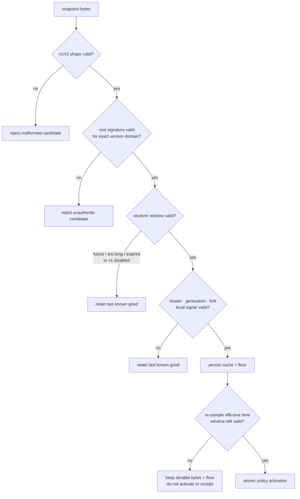
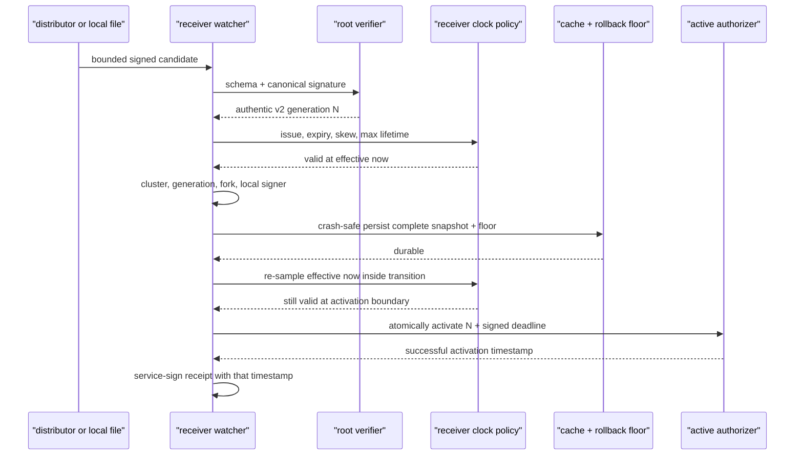
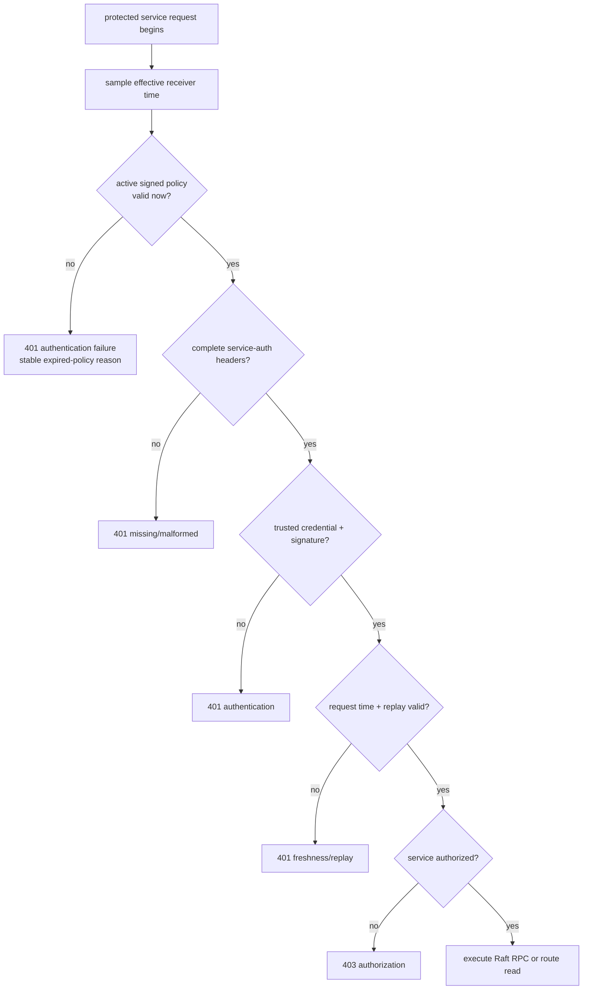
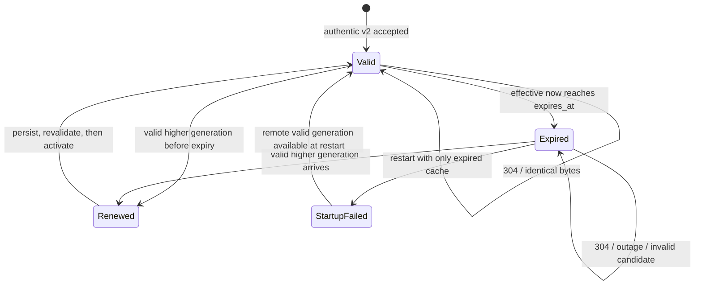
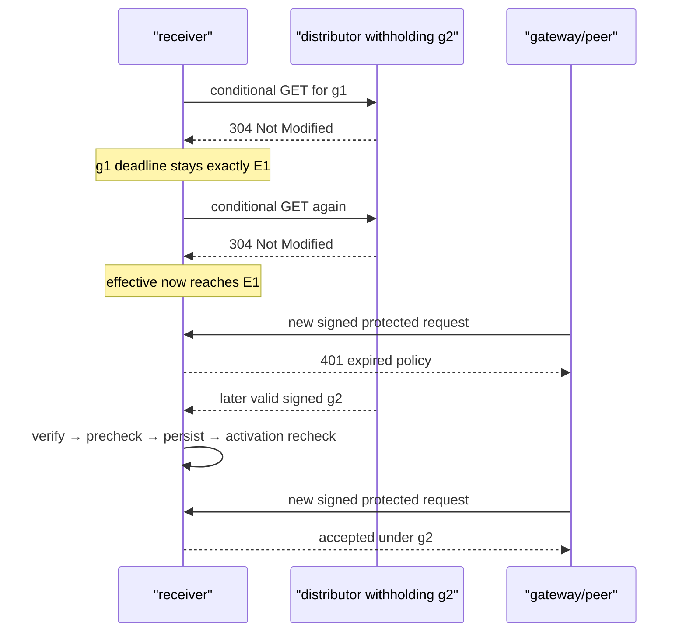
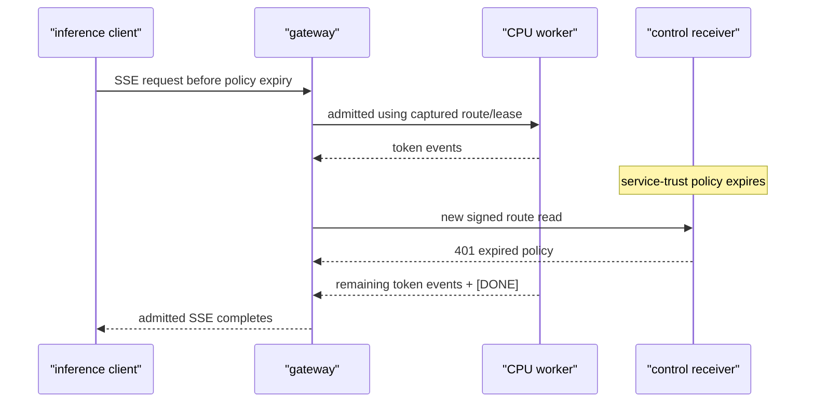

# RFC 0032: Signed service-trust validity and request-time expiry

**Status:** Implemented | **Milestone:** v0.27 | **Date:** 2026-08-08

**Depends on:** RFC 0027 signed online service trust, RFC 0028 distributed
service trust and activation receipts, and RFC 0029 mutual-TLS trust
distribution.

## What RFC means and what this one decides

RFC means **Request for Comments**. In InferLab, an RFC is a durable,
reviewable engineering decision record. It states the problem, required
invariants, selected contract, rejected alternatives, proof plan, and honest
limits.

RFC 0032 adds a root-signed validity deadline to service-trust policy v2. A
receiver may activate v2 only while:

```text
issued_at_ms <= receiver_now_ms + configured_future_skew_ms
expires_at_ms - issued_at_ms <= configured_max_lifetime_ms
receiver_now_ms < expires_at_ms
```

The end is exclusive. At `now == expires_at_ms`, the policy is expired.

Validity is checked both when a snapshot is bootstrapped/reloaded and at the
start of every protected service-authentication decision. Expiry therefore
bounds **new service-authenticated control requests**. It does not cancel a
request already admitted, abort an inference stream, revoke a certificate,
expire a gateway routing lease, or instantly stop the data plane.

Policy v1 remains decodable for historical compatibility, but signed
receivers reject it by default because it has no authenticated deadline. A
visible compatibility switch is required to accept legacy v1.

## Context: authenticated issue time was not a deadline

RFCs 0027–0029 authenticate `issued_at_ms`, order snapshots by generation,
persist a rollback floor, retain a complete cache, and distribute the bytes
over mTLS. Until this RFC, issue time was diagnostic metadata only.


An authentic, non-rollback snapshot could therefore outlive the operational
decision that produced it. If a distributor withheld newer bytes, an offline
or cache-backed receiver had no signed time at which it must stop accepting
new service-authenticated requests.

Generation and validity answer different questions:

| Mechanism | Question |
|---|---|
| Root signature | Did the policy authority authorize these exact bytes? |
| Generation and durable floor | Is this newer than, or identical to, what this receiver accepted? |
| `issued_at_ms` / `expires_at_ms` | Is the authorized policy usable at this receiver's current time? |
| Request signature | Did this service sign this exact method/path/audience/body now? |

An unexpired signature is not “more authentic” than an expired one. The
signature remains mathematically valid; the receiver refuses to use its policy
meaning after the signed validity window.

## Required invariants

1. **Distinct v2 meaning:** policy schema, authentication schema, and signature
   domain are all versioned independently from v1.
2. **Signed deadline:** changing or removing `expires_at_ms` invalidates v2.
3. **Exclusive end:** v2 is usable only while `now_ms < expires_at_ms`.
4. **Bounded issue skew:** `issued_at_ms` may not exceed receiver time plus the
   configured future-skew allowance.
5. **Bounded lifetime:** `expires_at_ms - issued_at_ms` may not exceed the
   receiver's configured maximum.
6. **Persist before activate, validate twice:** a valid newer snapshot follows
   verify → pre-persist window validation → persist cache/floor → re-sample
   effective time and revalidate inside the atomic authorizer transition →
   activate. The receipt uses that exact successful activation timestamp.
7. **Request-time enforcement:** the active window is checked before missing,
   malformed, cryptographic, freshness, replay, or authorization processing.
8. **No accidental renewal:** polling, `304 Not Modified`, cache reads, receipt
   retry, and process restart do not move the signed deadline.
9. **No rollback resurrection:** backward wall-clock observation must not make
   a policy usable again inside one running receiver after that receiver has
   observed a later time.
10. **Recovery remains possible:** expiry blocks protected requests; it does
    not block fetching and activating a valid higher-generation v2 snapshot.
11. **Legacy is explicit:** v1 is rejected by default and is visibly reported
    when a compatibility override enables its unbounded behavior.
12. **Admission boundary:** already-admitted work keeps its captured execution
    state and completes or fails under its existing deadline/cancellation
    rules.

## Policy v2 wire contract

Policy v2 uses:

```json
{
  "schema": "inferlab.service-trust-policy.v2",
  "cluster_id": "inferlab-primary",
  "generation": 2,
  "issued_at_ms": 1700000000000,
  "expires_at_ms": 1700000060000,
  "trusted_credentials": [
    {
      "service_id": "gateway-primary",
      "credential_id": "key-b",
      "public_key_base64": "..."
    }
  ],
  "revoked_service_ids": [],
  "revoked_credentials": [],
  "gateway_service_ids": ["gateway-primary"],
  "authentication": {
    "schema": "inferlab.service-trust-authentication.v2",
    "algorithm": "ed25519",
    "key_id": "service-trust-root-a",
    "signature": "..."
  }
}
```

The v2 signature domain is:

```text
inferlab.service-trust-policy.v2\0
```

The canonical v2 message includes `expires_at_ms` immediately after
`issued_at_ms`. A v1 policy must omit the expiry field and use the unchanged v1
authentication schema and signature domain. A v2 policy must include a
positive expiry later than its positive issue time. `null` is not omission and
is rejected.

There is deliberately no `not_before` field in v2. `issued_at_ms` supports the
future-skew and maximum-lifetime bounds; it is not a second exact admission
edge. The only exact wall-clock edge introduced here is the exclusive expiry.

This separation prevents three downgrade ambiguities:

- a v2 signature cannot be reinterpreted as v1;
- a v1 authentication object cannot bless a v2 payload; and
- deleting the deadline cannot preserve the signature.

## Authority and wall-clock validity are separate gates



The distributor performs structural and signature verification because it is
transport, not the receiver's clock authority. It exposes the policy schema
and signed expiry, but does not claim `valid=true`. Receivers independently
apply their configured clock-skew and maximum-lifetime rules.

Reusable receiver code calls
`VerifiedServiceTrustSnapshot::validate_receiver_validity(now_ms, &config)`.
The API deliberately starts from a verified snapshot; raw unsigned policy
payloads cannot be presented as receiver-valid through a public helper.

## Receiver validity configuration

Receiver defaults and accepted configuration bounds are:

| Setting | Default | Accepted range |
|---|---:|---:|
| maximum policy lifetime | 86,400,000 ms (24 h) | 250–604,800,000 ms |
| maximum future issue skew | 5,000 ms | 0–300,000 ms |
| allow legacy v1 | false | explicit boolean override only |

The environment contract uses:

```text
INFERLAB_SERVICE_TRUST_MAX_POLICY_LIFETIME_MS
INFERLAB_SERVICE_TRUST_POLICY_MAX_FUTURE_SKEW_MS
INFERLAB_SERVICE_TRUST_ALLOW_LEGACY_V1
```

Partial or out-of-range values fail startup. Static-environment service trust
does not contain a signed snapshot and therefore reports validity as not
applicable. Local-file and remote-distributor signed modes use the same
receiver validity rules.

The legacy override exists only for deliberate replay of historical v0.22–
v0.24 fixtures and migrations. It must not silently become the production
default.

## Startup and reload ordering



At first startup there is no in-memory last known good. A missing, invalid,
expired, excessive-lifetime, future-issued, or default-disallowed v1 snapshot
fails closed before the application listener starts.

At runtime an invalid candidate is counted and rejected while the current
policy remains active. If the current policy later expires, retaining it means
retaining its identity and diagnostics—not extending its authority for new
protected requests.

Persistence can take long enough for a candidate to cross its deadline after
the first validity check. In that race, the verified candidate bytes and
rollback floor remain durable, and the in-memory accepted floor advances, but
the active generation, policy, and `loaded_at` stay unchanged. The watcher
reports a trust-policy rejection and emits no activation receipt. This is a
deliberate safety tradeoff: durable ordering knowledge is retained without
claiming that an expired candidate ever became authoritative.

## Request-time decision order



Validity is deliberately first. After expiry, both a correctly signed request
and a request with no authentication headers receive the same bounded expired-
policy authentication surface. This avoids using an expired policy even to
classify which service credential a caller presented.

The response uses the existing 401 service-authentication failure shape. It
does not include policy bytes, paths, signatures, keys, or unbounded error
text.

## Monotonic effective time inside a process

Wall-clock timestamps are necessary because the root signs an absolute
deadline that survives restart and moves between machines. Wall clocks can
move backward, however. A backward correction must not reopen a policy after a
receiver already observed it expired.

Each running receiver therefore computes:

```text
effective_now_ms = max(previous_effective_now_ms, observed_wall_now_ms)
```

This clamp is process-local. Across restart, the receiver evaluates the signed
deadline against the current wall clock again; it does not persist every clock
observation. Correct host time remains an operational requirement, and a
malicious clock or deleted local state remains outside the threat model.

## Expiry, withholding, and renewal state machine



A `304 Not Modified` only says the distributor has no different bytes for the
request's ETag. It cannot renew a root-signed deadline. Repeated successful
polls likewise cannot extend validity.



## Admission boundary: control trust is not data-plane cancellation



This RFC does not add a callback from control policy expiry into gateway or
worker cancellation. A new public inference request may still be admitted
under a separately valid gateway routing lease. Routing-lease expiry, request
deadline, client cancellation, and service-trust expiry remain different
mechanisms.

## Status and diagnostics

Control service-authentication status adds:

- `trust_policy_expires_at_ms`;
- `trust_policy_validity`: `not-applicable`, `legacy-unbounded`, `valid`, or
  `expired`;
- `trust_policy_remaining_ms`, saturated at zero;
- `trust_policy_max_lifetime_ms`;
- `trust_policy_max_future_skew_ms`;
- `trust_policy_allow_legacy_v1`; and
- `trust_policy_expiration_rejections`.

The distributor status snapshot exposes `policy_schema` and signed
`expires_at_ms` (`null` for v1), but not a receiver-validity boolean. Receiver
remaining time is an observation, not a consensus fact. Counters remain
process-local and reset on restart; signed snapshot bytes plus cache/floor
remain the durable facts.

## Failure matrix

| Candidate/event | Distributor | Running receiver | Restart |
|---|---|---|---|
| Valid unexpired v2 | Verify/store | Precheck, persist, activation-time recheck, then activate | Start |
| Expiry field changed after signing | `400 invalid_snapshot` | Never authoritative | Fail if sole input |
| v2 expiry missing/null/≤ issue | `400 invalid_snapshot` | Reject shape | Fail |
| Lifetime above receiver maximum | May store authentic bytes | Reject; keep LKG | Fail without valid cache/remote |
| Issue time beyond receiver skew | May store authentic bytes | Reject; keep LKG | Fail without valid cache/remote |
| Different valid same-generation deadline | `409 snapshot_fork` | Reject fork | Fail if conflicts with floor |
| Valid v1, default configuration | Structurally valid | Reject `legacy_v1_disallowed` | Fail |
| Valid v1, explicit legacy override | Structurally valid | Activate as `legacy-unbounded` | Start, visibly unbounded |
| Repeated 304 before/after expiry | Return 304 | Deadline unchanged | Cache evaluated at current time |
| Distributor outage after activation | Unavailable | Valid until signed expiry, then reject new protected requests | Expired cache fails |
| Backward wall-clock observation | Not applicable | Effective time does not decrease | Re-evaluate current wall clock |
| Valid higher g2 after expiry | Store | Persist, revalidate, activate; new protected requests recover | Start from g2 |

## Alternatives considered

### Treat every successful poll as renewal

Rejected. A distributor can return bytes or 304 but cannot extend a deadline
chosen by the root signer. Poll success is transport freshness, not policy
authority.

### Derive expiry as `download_time + TTL`

Rejected. Withholding and replay would give the same signed bytes a fresh
lease at each receiver. The absolute deadline must be signed.

### Use generation as a clock

Rejected. Generation orders policies but says nothing about how long one
generation remains safe.

### Keep accepting the last known good policy after expiry

Rejected as the default. That would make the deadline diagnostic and recreate
the original unbounded-cache problem.

### Kill the control process at expiry

Rejected. A live process can expose diagnostics, fetch recovery g2, and
continue durable state recovery while refusing new protected requests.

### Abort all in-flight inference and Raft work

Rejected. Request admission is the precise enforceable boundary. Global
cancellation would require propagation, fencing, drain semantics, and separate
data-plane policy.

### Add a grace period after the signed deadline

Rejected for v0.27. Hidden grace changes the signed meaning. Operators choose
an adequate signed lifetime and publish renewal early.

### Persist the maximum observed wall clock on every request

Deferred. It would turn every authenticated request into durable I/O. The
process-local monotonic clamp prevents in-process reopening; durable hostile-
clock semantics need a separate design.

### Continue accepting v1 silently

Rejected. A downgrade to an unbounded schema must be explicit and visible.

## Exact-process evidence contract

The zero-cost loopback proof must retain machine-checkable evidence that:

1. a root-signed v2 g1 boots three controls and produces three receipts;
2. the deadline and v2 schemas are signature-bound;
3. tampered expiry, malformed window, excessive lifetime, future issue, a
   same-generation deadline fork, and default-disallowed v1 do not become an
   active receiver policy;
4. repeated 304 responses leave the exact g1 deadline unchanged;
5. while g2 is withheld, a request just before expiry is accepted and requests
   at/after the exclusive deadline receive the expired-policy 401 surface;
6. seven exact production regressions cover the exclusive/backward-clock
   authorizer boundary, post-persist expiry without activation or receipt,
   unchanged future-issued local-file retry, same-ETag 304 clock observation
   plus higher-generation recovery, and unchanged local-file polling that
   latches expiry against a later backward-clock step. The remote-path cases
   also prove post-persist expiry suppresses activation/receipt and that a
   same-generation 200 preserves a real pending receipt without fabricating a
   new one after delivery;
7. a request or SSE admitted before expiry can complete under its normal data-
   plane rules;
8. restarting a receiver with only expired cached g1 while the distributor is
   unavailable fails before listening;
9. valid higher-generation g2 restores all controls and receipts without
   deleting the rollback floor;
10. committed routing survives and real CPU JSON plus SSE reach completion;
11. expected and intentionally restarted processes have exact PID/start/command
    evidence; and
12. sanitized retained output contains no host path or private-key material and
    reproduces checker JSON and SVG byte-for-byte before manifest-last
    publication.

The live cutoff is a controlled wall-clock observation. Seven hard-coded exact
production tests cover scheduler edges the shell cannot hit reliably. The
proof retains every exact package/test command, exit status, pass marker, and
sanitized output; a caller cannot substitute an easier test filter.

## Code and evidence ownership

| Responsibility | Location |
|---|---|
| v1/v2 schemas, canonical domains, structural validation, receiver window validation | `service-auth/src/trust_snapshot.rs` |
| Distributor structural/signature verification and schema/expiry diagnostics | `trust-distributor/src/` |
| Startup configuration, effective clock, runtime validity gate, status/counters | `control-plane/src/main.rs`, `control-plane/src/service_authentication.rs` |
| Local/remote bootstrap, cache/floor checks, reload and 304 behavior | `control-plane/src/service_trust.rs` |
| Proof orchestration | `scripts/proof-v0.27.sh` |
| HTTP/time probes and evidence capture | `benchmarks/trust_expiry_probe.py` |
| Deterministic assertions | `benchmarks/check_trust_expiry.py` |
| Data-driven evidence chart | `benchmarks/render_trust_expiry_svg.py` |
| Retained bundle | `docs/results/v0.27/raw/` |

## Limitations and next boundary

- Absolute validity depends on sufficiently correct receiver clocks.
- The in-process clock clamp is not a hardware secure clock or durable trusted
  timestamp service.
- Expiry is per receiver, so skew can create a bounded mixed-validity window.
- Distributor status cannot declare receiver validity or fleet convergence.
- Expiry refuses new protected requests; it does not revoke TLS certificates,
  terminate existing TLS sessions, or erase private keys.
- It does not cancel already-admitted inference, expire gateway routing leases,
  or guarantee zero new public inference after control-policy expiry.
- A compromised receiver can bypass its own validity check.
- Cache/floor integrity and host time remain local trust assumptions.
- v1 compatibility is deliberately unbounded and weakens this property.
- There is no emergency cancellation token, transparency log, distributor HA,
  HSM/KMS custody, global service mTLS, or multi-host hostile-clock proof.

After this boundary, runtime certificate/service-key handoff can build on a
bounded receiver-policy lifetime. Certificate revocation and certificate-to-
role binding remain separate from merely loading a new CA-valid leaf.
