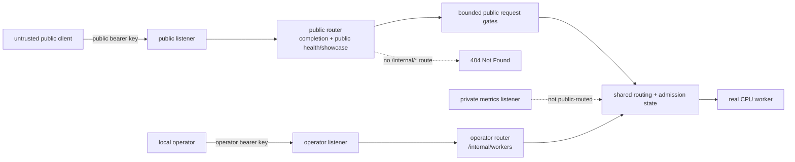
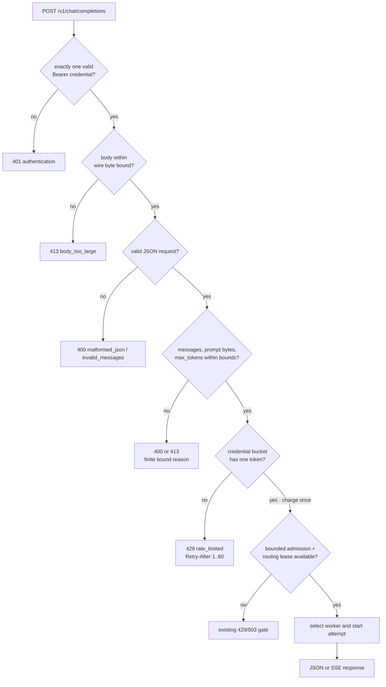
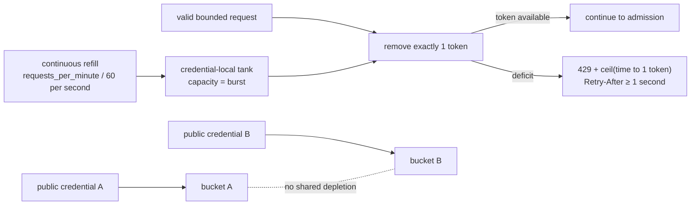
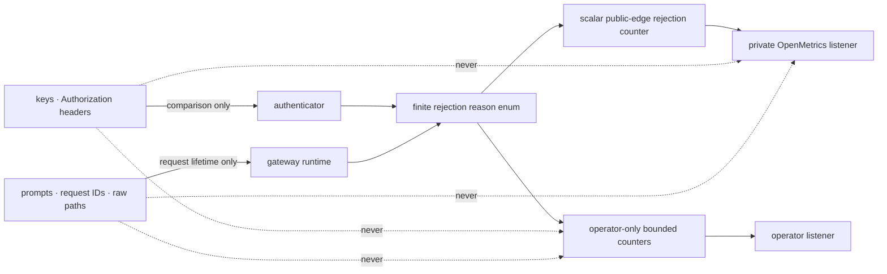

# RFC 0033: Public edge isolation and bounded abuse budgets

**Status:** Implemented | **Milestone:** v0.28 | **Date:** 2026-08-09

**Depends on:** RFC 0006 bounded admission, RFC 0007 request deadlines,
RFC 0025 cryptographic service identities, and RFC 0031 bounded-cardinality
observability.

## What RFC means and what this one decides

RFC means **Request for Comments**. In InferLab, an RFC is a durable,
reviewable engineering decision record. It states the problem, required
invariants, selected contract, rejected alternatives, proof plan, and honest
limits.

RFC 0033 decides which routes may exist on a hosted public listener and how
much edge-owned work one authenticated public credential may consume before a
worker attempt begins. It keeps the operator route on a separate listener,
adds a bounded request gate, and preserves local mode as explicit historical
compatibility.

## Summary

Before v0.28, InferLab authenticated one public completion route, but the
interview gateway served public and operational routes from one listener and
admitted a syntactically valid request before it knew whether the caller had
exhausted an abuse budget. v0.28 separates those responsibilities.

Hosted mode creates two loopback-capable HTTP listeners in one unchanged
gateway process:

- the **public listener** serves the intended public surface and never registers
  `/internal/*`; and
- the **operator listener** serves `/internal/workers` and accepts only the
  separately configured operator credential.

For public completions, one strict gate pipeline authenticates the caller,
bounds the wire body, parses and validates the input, charges a per-credential
token bucket, enters the existing bounded admission system, and only then starts
a worker attempt. Every finite rejection in this hosted completion gate is
observable with bounded counters and must leave worker-attempt counters
unchanged.

This is an application-edge boundary. It is not HTTPS, a WAF, a billing system,
an identity provider, or protection against distributed abuse.

## Why this follows v0.27

v0.27 bounds how long a signed service-trust policy can authorize new protected
control requests. That protects an internal authority plane; it does not make
the public inference edge safe to expose. An interview deployment still needs a
clear answer to four simpler questions:

1. Which routes are reachable from the public socket?
2. Which credential class can reach operator diagnostics?
3. How much request material and output work can one public credential request?
4. Can an early rejection reach the CPU worker or create unbounded telemetry?

These questions can be answered locally without combining certificate renewal,
service-signing key handoff, replicated distributors, or emergency trust
cancellation. Those remain later milestones.

## Goals

- Keep public and operator routes on distinct bound listeners while retaining a
  single gateway process and shared routing/admission state.
- Make `/internal/*` structurally absent from the hosted public router, so
  missing, public, and operator credentials all receive the same `404` there.
- Require exactly one valid public bearer credential for a completion.
- Require exactly one separately configured operator bearer credential for
  `/internal/workers` on the operator listener.
- Reject overlap between public and operator credentials and reject a public /
  operator bind collision at startup.
- Bound body bytes, message count, aggregate prompt UTF-8 bytes, and requested
  output tokens before rate charging or admission.
- Apply one continuously refilled token bucket per configured public credential.
- Return a positive, deterministic `Retry-After` on public rate exhaustion.
- Preserve the existing bounded admission, retry, circuit, lease, and streaming
  ownership semantics after the new public gates.
- Prove every enumerated hosted completion-gate authentication, body, input,
  rate, and admission rejection remains before a worker attempt.
- Keep status and OpenMetrics cardinality finite without exporting secrets,
  credential identities, prompts, or request identifiers.
- Run the complete proof with local processes and no paid service.

## Non-goals

- TLS termination, public DNS, internet hosting, CDN, reverse proxy, WAF, or
  provider-level denial-of-service protection.
- OAuth, JWT, user accounts, organizations, projects, roles, scopes, or billing.
- Durable or distributed rate-limit state across gateway processes or restarts.
- Hiding source IP addresses from an upstream proxy or trusting forwarded IP
  headers.
- Per-token billing, model-dependent weights, adaptive limits, or global fairness.
- Cancelling already-admitted/in-flight work or refunding a rate token after
  admission.
- Adding a separate SSE concurrency configuration. Streams use the existing
  bounded outstanding, queue, and worker execution permits.
- Exposing the raw/full operator status on the public listener or retaining it
  as evidence. The proof retains only explicit bounded projections; those omit
  credentials and their hashes/positions, worker IDs/URLs, prompts, and request
  IDs. The existing bounded request-ID middleware may still echo a valid
  request ID in the response that owns it.
- Automating service-key, mTLS leaf, or CA rotation.

## Topology: public versus operator



The listener boundary is stronger than putting another authentication
middleware around `/internal/workers`. The hosted public router has no matching
internal route, so possession of the operator credential cannot turn the public
socket into an operator socket.

## Configuration contract

`INFERLAB_PUBLIC_EDGE_MODE` accepts `local` or `hosted` and defaults to
`local`. Local mode preserves the development-compatible single-listener
behavior. Hosted mode requires both credential classes and the operator bind
explicitly; the public bind and bounded numeric policy have safe defaults.

| Environment variable | Meaning in hosted mode |
|---|---|
| `INFERLAB_PUBLIC_EDGE_MODE` | Must be `hosted` to enable the split edge |
| `INFERLAB_BIND` | Public listener address; defaults to `127.0.0.1:8080` |
| `INFERLAB_PUBLIC_API_KEYS` | Bounded comma-separated public bearer credentials |
| `INFERLAB_OPERATOR_BIND` | Distinct operator listener address |
| `INFERLAB_OPERATOR_API_KEY` | Single operator-only bearer credential |
| `INFERLAB_PUBLIC_MAX_MESSAGES` | Optional maximum message objects in one completion |
| `INFERLAB_PUBLIC_MAX_PROMPT_BYTES` | Optional maximum aggregate UTF-8 bytes across message content |
| `INFERLAB_PUBLIC_MAX_OUTPUT_TOKENS` | Optional maximum accepted `max_tokens` |
| `INFERLAB_PUBLIC_RATE_REQUESTS_PER_MINUTE` | Optional continuous refill rate per public credential |
| `INFERLAB_PUBLIC_RATE_BURST` | Optional maximum whole-request tokens held by each bucket |

The numeric contract is deliberately small and bounded:

| Setting | Default | Maximum |
|---|---:|---:|
| Maximum request body bytes | `65536` | `65536` |
| `INFERLAB_PUBLIC_MAX_MESSAGES` | `32` | `256` |
| `INFERLAB_PUBLIC_MAX_PROMPT_BYTES` | `16384` | `65536` |
| `INFERLAB_PUBLIC_MAX_OUTPUT_TOKENS` | `256` | `4096` |
| `INFERLAB_PUBLIC_RATE_REQUESTS_PER_MINUTE` | `60` | `60000` |
| `INFERLAB_PUBLIC_RATE_BURST` | `4` | `1000` |

Every configured numeric value must be positive. `Retry-After` is clamped to
the finite range `1..=60` seconds.

The implementation must fail startup when:

- hosted mode omits public keys, the operator key, or the operator bind;
- either listener address is invalid or the normalized bind addresses collide;
- the operator key equals any public key;
- a key list, key, integer, or aggregate configuration exceeds its explicit
  parser bound; or
- a numeric bound is zero or outside its implementation maximum.

No configured credential, credential hash, matched credential position, or
secret path may appear in startup logs, status, errors, metrics, or retained
proof output. A parser may name a bounded configuration entry ordinal when it
explains malformed startup input; that ordinal is not the identity of a
credential that matched a request.

## Route capability matrix

| Listener and route | Missing key | Public key | Operator key |
|---|---:|---:|---:|
| Public `/`, `/assets/og-inferlab.png`, `/health`, `/readyz` | `200` | `200` | `200` |
| Public `/showcase/status` | `401` | `200` redacted status | `401` |
| Public `/v1/chat/completions` | `401` | Continue through request gates | `401` unless also public, which startup forbids |
| Public `/internal/workers` | `404` | `404` | `404` |
| Public other `/internal/*` | `404` | `404` | `404` |
| Operator `/internal/workers` | `401` | `401` | `200` |

An unregistered public route stays `404`; authentication must not convert route
absence into a credential oracle.

## Exact public request gate order



Important consequences:

- authentication precedes body buffering, so an unauthenticated oversized body
  cannot consume the authenticated request budget;
- semantic input validation precedes rate charging, so malformed and out-of-
  bound input does not drain a valid credential's bucket;
- rate charging precedes admission, so a valid request consumes one token even
  if the gateway is subsequently overloaded; and
- every branch above `W` must leave both gateway worker-attempt and CPU-worker
  accepted-request counters unchanged.

The same byte ceiling applies when a client supplies `Content-Length` and when
it uses chunked transfer encoding. The server must count decoded body bytes and
must not trust a declared length as the enforcement mechanism.

## Token bucket: the water-tank model



Each configured public credential owns one in-memory bucket. Let `C` be burst
capacity and `r` be requests per millisecond. At monotonic observation `t`:

```text
available(t) = min(C, previous_available + elapsed_ms × r)
```

One accepted charge subtracts exactly `1`. When fewer than one token is
available, `Retry-After` is the ceiling of the positive time needed to reach
one token, expressed in whole seconds and never less than `1`.

Wall-clock changes must not create or destroy tokens. Restart resets the
in-memory bucket to its configured burst capacity; this limitation is explicit.

## Streaming permit lifecycle

```mermaid
sequenceDiagram
    participant C as Public client
    participant G as Gateway gates
    participant A as Admission controller
    participant W as CPU worker
    C->>G: valid bounded SSE request
    G->>G: charge one rate token
    G->>A: acquire outstanding/queue/execution ownership
    A->>W: start exactly one worker attempt
    W-->>C: first SSE data event
    Note over A,C: request, worker lease, and execution guard remain owned by response body
    alt normal completion
        W-->>C: data: [DONE]
        C-->>A: body reaches EOF; permits release
    else client disconnect
        C-xG: downstream body dropped
        G-xW: upstream body dropped/cancelled
        G-->>A: permits release without waiting for process restart
    end
```

The token-bucket charge is not a streaming concurrency permit. One token is
charged once, while existing RAII guards keep scarce execution and routing
ownership alive until the downstream body reaches EOF, errors, times out, or is
dropped by a disconnected client. The proof must observe incremental SSE data,
the terminal `[DONE]`, and a separate disconnect returning all live admission
gauges to zero.

## Errors

All public gate errors use a bounded JSON envelope and omit input, key material,
bucket identity, worker identity, and request identity.

| Status | Wire error | Finite status reason | Meaning | Worker attempt |
|---:|---|---|---|---:|
| `401` | `type=authentication_error`, `code=invalid_api_key` | `authentication` | missing, malformed, wrong, duplicate, or wrong-class bearer authentication | 0 |
| `413` | `type=invalid_request_error`, `code=body_too_large` | `body_too_large` | decoded request body exceeds the public byte ceiling | 0 |
| `400` | `type=invalid_request_error`, `code=malformed_json` | `malformed_json` | body is not syntactically valid JSON | 0 |
| `400` | `type=invalid_request_error`, `code=invalid_messages` | `invalid_messages` | the edge-owned message list/role/string-content shape is invalid | 0 |
| `400` | `type=invalid_request_error`, `code=too_many_messages` | `too_many_messages` | message count exceeds its configured bound | 0 |
| `413` | `type=invalid_request_error`, `code=prompt_too_large` | `prompt_too_large` | aggregate prompt UTF-8 bytes exceed its configured bound | 0 |
| `400` | `type=invalid_request_error`, `code=invalid_max_tokens` | `invalid_max_tokens` | `max_tokens` is absent from the accepted integer domain | 0 |
| `400` | `type=invalid_request_error`, `code=max_output_tokens_exceeded` | `max_output_tokens_exceeded` | `max_tokens` exceeds the configured public bound | 0 |
| `429` | `type=invalid_request_error`, `code=rate_limited` | `rate_limited` | the authenticated credential has less than one token | 0 |
| `429` | `type=gateway_overloaded`, `reason=admission_queue_full` | `admission_full` | existing bounded admission has no outstanding capacity | 0 |

The `401` additionally returns
`WWW-Authenticate: Bearer realm="inferlab"`. Rate and admission responses
return `Retry-After`; every hosted completion-gate rejection returns
`x-inferlab-attempts: 0`. Wire fields and finite status-counter reasons are
deliberately distinguished: `authentication` and `admission_full` are not wire
error codes. Routing-lease and downstream worker errors occur later and retain
their established envelopes.

## Observability and leak boundary



The OpenMetrics contract adds one scalar counter family:

```text
inferlab_gateway_public_edge_rejections_total
```

It is registered only for hosted public-edge state. A hosted gateway therefore
uses the final available per-target series slot from v0.26's closed budget:
`255 + 1 = 256`. Local compatibility mode does not register the family, so the
historical v0.26 exact family catalog and proof remain reproducible.

The counter has no labels. It counts only hosted completion-pipeline
authentication/body/input/rate/admission rejections. Public route absence,
`/showcase/status` authentication, and operator-listener authentication are not
part of this completion-work counter. Detailed completion-gate rejection counts
live in the operator-only redacted `public_edge` status object with a finite
compile-time reason set. That object also contains `mode`, `enforced`, five
configured bounds, and only the aggregate `credential_count`. In local mode,
`enforced=false` and hosted-only limits and credential count are `null`; local
status does not imply the hosted gates run. The `public_edge` projection in
public `/showcase/status` exposes only the mode, not operational bounds,
rejection counters, or worker URLs; the response retains its other existing
bounded release/routing/authentication summaries.
Neither surface exports a credential identity, per-credential counter, key hash,
prompt, request ID, Authorization value, client-supplied route, or worker URL.
Shared HTTP metrics continue to use their fixed route/method/status allowlists.

## State and concurrency

Public keys and their buckets are created once from startup configuration.
Authentication returns an opaque in-process credential handle; it does not
return a string ID suitable for logging or metrics. A bucket update is atomic
with respect to one request: refill, decision, and optional decrement occur
under one synchronization boundary.

The public and operator routers share routing, admission, resilience, and
metrics state, but they do not share route registration or credential classes.
The operator listener does not create a second gateway service process.

## Failure matrix

| Event | Public response / startup result | Rate token charged? | Worker attempt? | State retained |
|---|---|---:|---:|---|
| Hosted config missing public keys | startup fails | N/A | N/A | no listener |
| Public/operator bind collision | startup fails | N/A | N/A | no listener |
| Public/operator key overlap | startup fails | N/A | N/A | no listener |
| Public `/internal/workers`, any key | `404` | no | no | unchanged |
| Operator route with missing/public key | `401` / `invalid_api_key` | no | no | unchanged |
| Missing, wrong-scheme, wrong, or duplicate public auth | `401` / `invalid_api_key` | no | no | rejection counter only |
| Fixed-length or chunked oversized body | `413 body_too_large` | no | no | rejection counter only |
| Malformed JSON | `400` / `malformed_json` | no | no | rejection counter only |
| Too many messages / output tokens | `400` / finite reason above | no | no | rejection counter only |
| Prompt bytes exceed the bound | `413` / `prompt_too_large` | no | no | rejection counter only |
| Empty bucket | `429` / `rate_limited` | no | no | `rate_limited` detailed/scalar rejection count increments; refill is observed |
| Valid request but admission full | existing admission `429` | yes | no | `admission_full` detailed/scalar rejection count increments; token is not refunded |
| Valid JSON response | `200` | yes | one or bounded retries | permits release at EOF |
| Valid SSE through `[DONE]` | `200` stream | yes | one or bounded retries | permits release at EOF |
| SSE client disconnect | connection closes | yes | attempt already started | body drop releases permits |
| Gateway restart | buckets reset to burst | N/A | N/A | no durable rate history |

## Rejected alternatives

### Protect `/internal/*` with the public key

Rejected because one leaked public credential would also expose worker and
admission diagnostics. Route absence on the public router is simpler and
stronger than another conditional inside the same router.

### Accept the operator key on both listeners

Rejected because it turns the public socket into a credential oracle and makes
network placement depend on secrecy alone. The operator key is valid only on
the operator listener.

### Key by IP address

Rejected because proxies, NAT, IPv6 privacy addresses, and spoofable forwarded
headers make the identity ambiguous. v0.28 proves isolation between configured
credentials, not between end users behind one credential.

### Fixed-window counters

Rejected because a caller can burst at both sides of a window boundary and
because `Retry-After` becomes discontinuous. A token bucket represents burst
capacity and steady refill independently.

### Charge before parsing

Rejected because malformed traffic could drain a valid credential's budget and
make diagnostics conflate input rejection with compute demand. Authentication
and bounded parsing happen before the charge.

### Charge only after the worker succeeds

Rejected because overload, timeouts, and cancellations still consume gateway
resources. A valid request is charged before admission, with no refund.

### Put credential ID, prompt hash, or request ID in metrics

Rejected because credentials and requests are unbounded series dimensions and
because hashes remain correlation identifiers. v0.26's finite metric contract
is preserved with one scalar counter and fixed status fields.

### Add a second gateway process for operators

Rejected for this slice because it duplicates routing watchers, queues, and
process evidence. Two listeners in one process isolate routes while preserving
one source of routing and admission truth.

### Call this internet DDoS protection

Rejected because a single local token bucket cannot absorb distributed traffic,
TLS handshakes, kernel socket exhaustion, or bandwidth floods. Production
hosting still needs provider-level controls.

## Exact local proof contract

The zero-cost proof starts one real CPU worker and one gateway process on loopback.
The gateway has distinct public, operator, and metrics addresses, two public
credentials, and one non-overlapping operator credential. No control process is
required because static worker routing is sufficient to test this edge.

The proof must retain machine-readable evidence that:

1. hosted-mode startup rejects missing configuration, bind collision, and key
   overlap before a listener is usable;
2. public `/internal/workers` is exactly `404` with missing, public, and operator
   credentials;
3. operator `/internal/workers` rejects missing/public credentials and accepts
   only the operator credential;
4. missing, wrong, wrong-scheme, and duplicate public authentication receive the
   stable `401` envelope;
5. malformed JSON, fixed-length oversized bodies, chunked oversized bodies, the
   edge-owned message list/role/string-content shape, message count, aggregate
   prompt bytes, and `max_tokens` fail with their exact finite reasons;
6. gateway-attempt and CPU-worker-request counters have zero delta across all
   enumerated hosted-edge authentication, body, input, rate, and admission
   rejections;
7. public credential A exhausts exactly the configured burst, receives `429`
   with the expected positive `Retry-After`, credential B remains independent,
   and A succeeds after the observed refill interval;
8. real CPU JSON succeeds without retaining a completion ID or prompt;
9. real CPU SSE is observed in at least two temporally distinct reads, reaches
   exactly one terminal `[DONE]`, and is drained through EOF;
10. a separate SSE disconnect releases outstanding, executing, queued, worker-
    in-flight, and completion-body ownership back to their finite idle values;
    its leak attestation covers every observed prefix byte and explicitly does
    not claim that the deliberately abandoned response remainder was observed;
11. the operator projection validates its exact raw top-level schema and scans
    all nested fields/values for forbidden identities; the showcase projection
    validates its exact nested raw schema. Both projections and the private
    OpenMetrics counters contain no key/hash/credential position, prompt,
    retained request ID, or raw public input; full response headers are
    leak-scanned before allowlisting;
12. the exact gateway and worker PIDs retain parent, start-token, command, live,
    and non-zombie identity for the complete capture;
13. the retained JSON/SVG set contains no credential, private material marker,
    proof temporary path, project path, prompt, or request identifier; and
14. checker JSON and the data-driven SVG replay byte-for-byte before an exact
    manifest is written last.

Cleanup signals only the two proof-owned child PIDs, waits with a bound,
escalates only those PIDs if needed, reaps them, and removes only the guarded
proof temporary directory. The manifest hashes every retained file except
itself and rejects missing or extra evidence.

### Retained implementation result

The canonical run passes **29/29 assertions** in exactly **27 files / 26
non-manifest hashes**. Credential A refills after an observed 1,317.514 ms;
real CPU JSON completes in 824.449 ms, and normal SSE completes in 825.350 ms
with seven nonempty content pieces spanning 616.046 ms through `[DONE]` and
EOF. One deliberate disconnect returns local ownership to idle. Eighteen
finite detailed rejections equal the hosted scalar, nine gateway attempts equal
nine CPU-worker accepts, completion outcomes are eight success plus one
intentional cancellation, and five exact production tests execute once each.
These are one retained single-host observations, not capacity or latency SLOs.

## Code and evidence ownership

| Responsibility | Location |
|---|---|
| Public/operator listener configuration and routing | `gateway/src/main.rs`, `gateway/src/lib.rs` |
| Public/operator bearer credential parsing | `gateway/src/public_authentication.rs` |
| Body/input/rate gates and status | `gateway/src/public_edge.rs` and gateway request path |
| Scalar metric and existing completion/admission metrics | `gateway/src/metrics.rs`, `observability/src/http.rs` |
| HTTP/raw-chunked/SSE/disconnect probe | `benchmarks/public_edge_probe.py` |
| Deterministic assertion checker | `benchmarks/check_public_edge.py` |
| Data-driven chart | `benchmarks/render_public_edge_svg.py` |
| Exact process orchestration | `scripts/proof-v0.28.sh` |
| Retained evidence | `docs/results/v0.28/raw/` |

## Glossary

| Term | Meaning in this RFC |
|---|---|
| Public edge | The listener and gates intentionally reachable by an untrusted completion caller |
| Operator plane | The separately bound listener for local operational diagnostics |
| Route absence | A route is not registered, producing framework `404` before credential-specific behavior |
| Bearer credential | An opaque configured secret supplied once in the `Authorization` header |
| Credential class | Public or operator; the classes cannot overlap in hosted mode |
| Abuse budget | A bounded allowance for otherwise valid public requests, not a billing balance |
| Token bucket | A burst-sized reservoir that continuously refills at a fixed monotonic rate |
| Burst | Maximum whole-request tokens one credential can accumulate |
| Refill | Monotonic restoration of fractional bucket capacity over elapsed time |
| `Retry-After` | Positive whole seconds until one request token is expected to be available |
| Pre-compute rejection | Any rejection before a gateway worker attempt begins |
| Admission permit | Existing bounded gateway ownership for outstanding/queued/executing work |
| SSE | Server-Sent Events response whose body stays live across multiple chunks |
| Cardinality | Number of distinct metric series created by family/label combinations |
| Leak boundary | The rule that secrets and unbounded request content stay inside request memory, not status/evidence/metrics |

## Limitations and next boundary

- Rate state is in-memory, per process, and resets to burst after restart.
- One public credential can represent many users; fairness stops at that key.
- A distributed attacker with many valid keys can multiply the aggregate budget.
- Body limits do not bound TCP connection count, TLS work, bandwidth, or kernel
  resources before the application receives bytes.
- The application reads and validates an authenticated body of at most 64 KiB
  before rate charging, admission, or request-deadline ownership. This bounds
  one body, but not slow authenticated uploads, aggregate concurrent pre-gate
  buffering/JSON parsing, or the rate of malformed traffic.
- The edge deliberately validates only JSON syntax, the message
  list/role/string-content shape, aggregate prompt bytes, and `max_tokens`.
  Other worker-owned fields (for example sampling or response-format details)
  remain downstream and can start an attempt before the worker rejects them.
- The operator listener still relies on network placement and a bearer secret;
  v0.28 does not add TLS or certificate-bound operator identity.
- A client disconnect releases gateway ownership but cannot prove an arbitrary
  remote model stopped every side effect instantly.
- The proof is loopback and single-host, not an internet load or hostile proxy
  experiment.

The next security boundary can return to runtime service-signing or same-CA
mTLS leaf handoff. CA migration, emergency cancellation, and distributor HA
remain dependent, separate designs. A non-security milestone may instead
integrate a public checkpoint and production tokenizer. CUDA remains gated on
real NVIDIA hardware and is not implied by v0.28.
