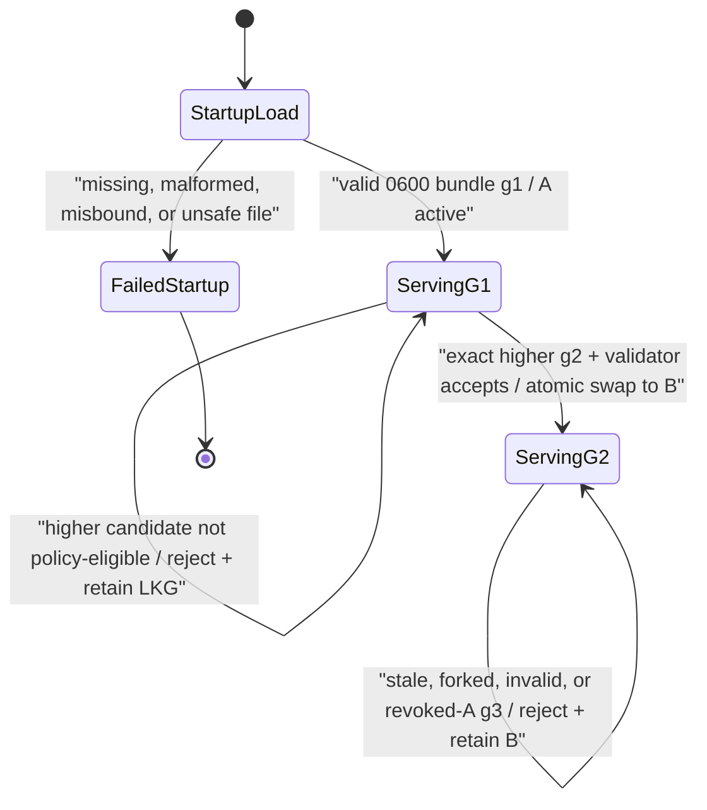

# RFC 0034: Restart-free service-signing handoff

**Status:** Implemented | **Milestone:** v0.29 | **Date:** 2026-08-11

**Depends on:** RFC 0025 cryptographic service identities, RFC 0026 overlap-safe
service credential rotation, RFC 0027 signed online service trust, RFC 0028
distributed trust delivery, RFC 0029 mutual-TLS trust distribution, and RFC
0032 signed service-trust validity.

## What RFC means and what this one decides

RFC means **Request for Comments**. In InferLab, an RFC is a durable engineering
decision record: it names the problem, selects one contract, records the
invariants and rejected alternatives, and states what the evidence can and
cannot prove.

RFC 0034 decides how one running gateway or control process changes the private
Ed25519 credential used for outbound service-authenticated requests. The process
watches one complete, mode-`0600` signer bundle, validates a strictly higher
generation, and atomically changes which credential future operations snapshot.
The process keeps one stable `ServiceSigner` and one nonce domain for its whole
lifetime.

This is a **handoff**, not a second trust protocol. Existing service IDs,
request signatures, trust-policy snapshots, and receipt schema v1 remain the
wire contracts.

## Summary

Before v0.29, InferLab could authorize overlapping service credentials and
rotate them safely by restarting senders. That proved the receiver policy but
left the private signing identity static inside each running process. v0.29
closes that narrower lifecycle gap for the gateway and three Raft controls.

Each watched sender starts from bundle generation 1 with `key-a` active and
both A and B private credentials present. An operator first publishes a trust
policy that makes the exact A and B public keys eligible. The operator then
atomically replaces each sender's bundle with generation 2 selecting `key-b`.
One in-process `ServiceSigner` validates and swaps the entire bundle; new
operations snapshot B while any operation that already captured A finishes
with A. Invalid, forked, stale, or policy-ineligible candidates retain the
last-known-good signer.

In the required-service-auth proof topology, after all four senders use B,
trust policy g2 revokes every A credential. The three controls apply g2 and
submit normal credential-bound v1 receipts signed by B. The distributor counts
convergence by stable service ID, so a credential handoff does not change the
expected receiver set. The gateway is not a receipt participant; its remote
trust readiness is an explicit operator precondition.

## Why this follows v0.28

v0.28 makes the public application edge easier to demonstrate safely, but its
internal gateway and controls still depended on process replacement to change
service-signing keys. Earlier trust releases already provide the prerequisites:

1. a stable service identity distinct from a credential;
2. a policy that can trust A and B simultaneously and later revoke A;
3. signed application receipts and a distributor convergence view; and
4. request freshness and replay rejection at receivers.

The remaining uncertainty is therefore small and testable: can a running
sender switch its private signer without reusing a nonce, mixing credentials
inside one operation, accepting rollback, or claiming convergence that did not
happen?

## Goals

- Load one whole, strictly bounded signer bundle before a listener starts.
- Require a regular mode-`0600` file on Unix and reject malformed, oversized,
  misbound, empty, duplicated, or ambiguous bundle contents.
- Keep one `ServiceSigner` object and one atomic nonce counter for the process
  lifetime, including across credential activation.
- Make each outbound operation capture exactly one immutable signer snapshot.
- Activate only an exact higher generation; treat an identical current
  generation as unchanged, a changed current generation as a fork, and a lower
  generation as rollback.
- Replace credential set, active credential, and generation as one atomic
  state transition after validation.
- Retain the last-known-good signer after every live reload failure.
- On controls with required service authentication—including the proof
  topology—require the candidate's exact public key to be eligible under the
  current trust policy while preserving signer-before-authorizer lock order.
  Explicitly disabled compatibility mode has no authorizer-policy gate.
- On the gateway, make remote receiver trust readiness an operator precondition
  rather than pretending the gateway can atomically inspect the fleet.
- Preserve legacy static environment configuration when no bundle path is set,
  while rejecting mixed static/watched configuration.
- Let trust-distributor convergence follow stable receiver service IDs while
  keeping every signed receipt v1 bound to its actual credential.
- Prove the four-sender A→B rollout, last-known-good behavior, process/quorum
  continuity, nonce continuity, revocation, and real JSON/SSE serving locally
  with no paid service.

## Non-goals

- Remote secret storage, a KMS, HSM, TPM, enclave, or managed key service.
- Encrypting private keys at rest or hiding them from the running process.
- Removing inactive private credentials from memory immediately. A and B remain
  in current signer state while the accepted bundle contains them; if a later
  bundle omits A, outstanding `Arc`-backed snapshots can retain it until they
  drop. Immediate erasure and memory zeroization are not provided.
- Durable nonce persistence or durable signer-generation anti-rollback across
  process restart.
- A fleet-atomic cutover. The four senders change sequentially and may
  temporarily sign with different eligible credentials.
- Automatically proving that every remote control trusts a gateway candidate.
- A new handoff receipt, receipt schema v2, or a receipt merely because the
  private signer changed.
- TLS expansion, same-CA leaf renewal, CA migration, HSM integration,
  trust-distributor HA, or automated certificate/key renewal.
- Emergency cancellation of already-authenticated or in-flight requests.

## Terms

| Term | Meaning in this RFC |
|---|---|
| Service ID | Stable sender identity, such as `control-a` or `gateway-primary` |
| Credential ID | One signing key version within a service, such as `key-a` |
| Signer bundle | Complete local set of private credentials plus active selector and generation |
| Bundle generation | Monotonic in-process configuration version used to reject forks and rollback |
| `ServiceSigner` | One stable process object that owns current signer state and the nonce domain |
| Signer snapshot | Immutable service/credential/generation view captured for one operation |
| Nonce domain | One process-lifetime atomic sequence shared by every snapshot |
| Last known good (LKG) | Most recent accepted signer state retained after a reload failure |
| Eligibility | Exact candidate public key is currently trusted, unrevoked, and policy-valid |
| Trust receipt | Existing v1 proof that one credential applied one signed policy generation |
| Service-scoped convergence | Distributor expects stable service IDs, while verifying each receipt's credential |

## Configuration contract

Controls use `INFERLAB_SERVICE_SIGNING_BUNDLE_PATH` and optional
`INFERLAB_SERVICE_SIGNING_BUNDLE_POLL_MS`. The gateway uses
`INFERLAB_GATEWAY_SERVICE_SIGNING_BUNDLE_PATH` and optional
`INFERLAB_GATEWAY_SERVICE_SIGNING_BUNDLE_POLL_MS`. Polling defaults to `100`
milliseconds and accepts `25..=60000`.

The stable service ID and existing control targets remain separate required
configuration. Watched mode is mutually exclusive with the corresponding
legacy credential ID/private-key variables. Missing, empty, non-Unicode, or
mixed identity/security configuration fails closed rather than silently
selecting another mode.

The JSON bundle is one complete object:

```json
{
  "schema": "inferlab.service-signing-bundle.v1",
  "cluster_id": "inferlab-primary",
  "generation": 2,
  "service_id": "control-a",
  "active_credential_id": "key-b",
  "credentials": [
    {"credential_id": "key-a", "private_key_base64": "<unique-a-seed-base64>"},
    {"credential_id": "key-b", "private_key_base64": "<unique-b-seed-base64>"}
  ]
}
```

The loader binds the whole file to the expected cluster and service, caps it at
16 KiB and 16 credentials, rejects unknown/duplicate/invalid fields, and checks
that the active credential exists. On Unix it accepts only a regular file with
exact mode `0600`. Startup validates the initial bundle before binding a
listener. Live replacement must be an atomic file replacement so a watcher
does not interpret a partially written file as the intended candidate.

The file path and private seeds are secret-bearing data. Status is bounded but
has two deliberately different JSON shapes:

| Process status | Parent compatibility fields | Nested `service_signing` fields |
|---|---|---|
| Control `/v1/control/status` | `local_service_credential_id` aliases the active credential | `mode`, `service_id`, `active_credential_id`, `bundle_generation`, `configured_credential_count`, `successful_activations`, `rejected_reloads`, `last_error_kind` |
| Gateway operator status under `control_plane` | `service_id` and `service_credential_id` alias the current signer identity | `mode`, `active_credential_id`, `bundle_generation`, `configured_credential_count`, `successful_activations`, `rejected_reloads`, `last_error_kind` |

The gateway parent owns `service_id`, so its nested object does not duplicate
it; the control nested object owns `service_id`. Neither shape exposes the
bundle path, private seed, public key, or raw parser error.

## State machine



Only `ServingG1 → ServingG2` changes signer state. A filesystem observation is
not an activation. Transient open/identity races are retried; deterministic
invalid candidates are deduplicated until the file observation or relevant
control trust-policy generation changes. Same-generation equality is computed
from decoded signer semantics, not file bytes: JSON formatting and credential
ordering alone may produce `Unchanged`; different decoded semantics are a fork.

## Per-operation snapshot and nonce concurrency

```mermaid
sequenceDiagram
    participant R1 as "operation R1"
    participant S as "stable ServiceSigner"
    participant W as "bundle watcher"
    participant R2 as "operation R2"
    participant N as "one atomic nonce counter"

    R1->>S: snapshot()
    S-->>R1: immutable g1 / key-a
    W->>S: activate exact higher g2 / key-b
    S-->>W: atomic Activated
    R2->>S: snapshot()
    S-->>R2: immutable g2 / key-b
    R1->>N: next sequence suffix
    N-->>R1: n
    R2->>N: next sequence suffix
    N-->>R2: m, where m > n
    Note over R1,R2: "R1 stays entirely on A; R2 stays entirely on B"
```

The snapshot owns the chosen signing credential through reference-counted
state, so activation cannot mutate an in-flight operation halfway through.
Both snapshots still reach the same process-lifetime atomic sequence. The
sequence suffix is unique and increasing: after suffix `n`, a later allocation
gets some `m > n`. It need not be `n + 1` because candidate eligibility checks
can consume intervening values. The nonce also contains a wall-clock prefix
that can regress, so the complete nonce string is not claimed to be monotonic.

A process restart creates a new nonce counter. Existing timestamp freshness,
future-skew checks, and replay caches still bound acceptance, but v0.29 does
not claim a durable nonce sequence across restarts.

## Atomic activation and lock order

`ServiceSigner::activate_bundle` acquires the signer write lock, checks binding
and generation, builds an immutable candidate snapshot, invokes one validator,
and replaces the complete state only if the validator returns true. This makes
the control lock order part of the design:

```text
signer write lock → candidate snapshot → authorizer read lock → exact-key check
```

No path may hold the authorizer lock and then try to acquire the signer lock.
When service authentication is required, the control validator verifies the
candidate's exact service, credential, and public key against the current
unexpired policy, including revocations. An ID match with different key bytes
is not eligible. Explicitly disabled compatibility mode has no authorizer-policy
gate; bundle binding and generation checks still apply. Keeping
signer-before-authorizer order avoids a deadlock and prevents a required-mode
policy reload and signer handoff from each approving a mutually inconsistent
view.

The gateway uses the same strict bundle binding and state machine but accepts a
higher candidate locally after that validation. It cannot inspect every remote
control receiver inside the same lock or transaction. The operator must make B
eligible on all intended gateway receivers before selecting B. A failed remote
request is not silently treated as proof that the candidate was ready.

## Four-sender rollout

The proof topology has four service-authenticated senders, but only three trust
receivers:

```mermaid
sequenceDiagram
    participant D as "trust distributor"
    participant F1 as "discovered follower"
    participant F2 as "other follower"
    participant L as "current leader"
    participant G as "gateway"

    D-->>F1: "g1 trusts A+B"
    D-->>F2: "g1 trusts A+B"
    D-->>L: "g1 trusts A+B"
    Note over F1,L: "three normal g1 receipts name key-a"
    Note over G: "gateway readiness is an operator precondition"
    F1->>F1: "bundle 1→2, select B; same process"
    F2->>F2: "bundle 1→2, select B; same process"
    L->>L: "bundle 1→2, select B; same process"
    G->>G: "bundle 1→2, select B; same process"
    Note over F1,G: "signer-only handoff emits no policy receipt"
    D-->>F1: "trust policy g2 revokes */key-a"
    D-->>F2: "trust policy g2 revokes */key-a"
    D-->>L: "trust policy g2 revokes */key-a"
    F1->>D: "normal g2 receipt, credential key-b"
    F2->>D: "normal g2 receipt, credential key-b"
    L->>D: "normal g2 receipt, credential key-b"
    Note over D,L: "service-ID convergence: 3/3 control services"
    G->>L: "service-authenticated config read with B"
```

The sequence is follower, follower, leader, then gateway to preserve quorum
and route availability while demonstrating a mixed A/B overlap. It is not a
simultaneous fleet transaction. Exact process identity, Raft quorum, and route
revision remain continuous across the sequence.

## Receipt truth and service-scoped convergence

Receipt schema v1 still includes both `receiver_service_id` and
`receiver_credential_id`, and the signature must verify against that exact
credential in the applied policy. v0.29 does not weaken that statement.

The distributor gains an explicit homogeneous **service-ID receiver mode**.
For each expected service, the published policy must contain at least one
trusted, unrevoked credential. On receipt upload, the distributor verifies the
credential-bound signature and then maps the valid receipt to the stable
service slot. The first valid receipt fills that service's slot for one policy
generation. Another valid credential receipt for the same service and
generation is a duplicate and preserves the stored receipt. Publishing a
higher policy generation clears all receipt slots; fresh B receipts then fill
the new g2 slots. B never creates a second receiver slot for that service.

A signer-only A→B change does not mean a new trust policy was applied, so it
creates no receipt. When g2 is actually applied, each control signs one normal
g2 receipt with its current B snapshot. The gateway remains outside the
three-control expected receiver set.

## Failure contract

| Failure | Required result |
|---|---|
| Initial file absent, unsafe mode, malformed, oversized, or misbound | Fail startup before listener |
| Static and watched variables both configured | Fail startup as ambiguous |
| Poll interval outside `25..=60000` or non-Unicode security value | Fail startup |
| Live file temporarily unavailable during atomic replacement | Retry; keep LKG; dedupe bounded status/logging |
| Same generation, same decoded signer semantics, even with formatting/order changes | `Unchanged`; retain state and clear prior reload error |
| Same generation, different decoded signer semantics | Reject generation fork; retain LKG |
| Lower generation | Reject rollback; retain LKG |
| Higher control candidate exact key not eligible while service auth is required | Reject candidate; retain LKG; retry if policy generation changes |
| Higher control candidate in explicitly disabled compatibility mode | No authorizer-policy gate; strict bundle/generation validation still applies |
| Higher gateway candidate before remote trust readiness | Local activation can succeed; remote failure is an operator error, not fleet proof |
| Watcher exits, is cancelled, or panics | Supervised service process fails rather than silently freezing signer state |
| g2 revokes A, then bundle g3 selects A | Reject exact-key eligibility; retain B LKG |
| Operation started before B activation | Complete with immutable A snapshot and one nonce from shared domain |
| Operation started after B activation | Use immutable B snapshot and the same nonce domain |
| Process restart | Revalidate startup bundle; nonce and in-memory generation floor reset |

## Implementation ownership

| Responsibility | Code owner |
|---|---|
| Whole-bundle schema/load, immutable snapshots, shared nonce, activation, bounded status | `service-auth/src/signing_bundle.rs` |
| Credential-bound receipt-v1 signing and verification | `service-auth/src/trust_receipt.rs` |
| Control bootstrap, polling loop, LKG handling, and watcher supervision | `control-plane/src/main.rs` |
| Control exact-key eligibility and signer→authorizer lock contract | `control-plane/src/service_authentication.rs` |
| Raft outbound operation snapshots | `control-plane/src/raft.rs` |
| Dynamic trust application and receipt snapshots | `control-plane/src/service_trust.rs` |
| Gateway bootstrap, watcher, supervision, and bounded operator status | `gateway/src/main.rs` and `gateway/src/lib.rs` |
| Gateway per-control-request snapshot | `gateway/src/service_client.rs` |
| Service-ID receiver mode, duplicate preservation, and generation-scoped receipt slots | `trust-distributor/src/lib.rs` |

## Compatibility

Compatibility here means **environment, wire, and runtime behavior**, not Rust
source-API compatibility. Legacy static service credential/private-key
environment variables still construct a static `ServiceSigner`; static mode
has no watcher and rejects bundle activation. Existing service IDs, audience
checks, request payloads, signatures, freshness windows, replay caches, Raft
messages, gateway control reads, and receipt-v1 wire bytes remain compatible.
Watched mode is explicit, never inferred from file existence, and refuses to
combine a bundle with legacy private-key configuration.

Rust callers do require source changes. The non-exhaustive inventory includes:
`ControlServiceClient::authenticated` now receives an `Arc<ServiceSigner>`;
its dynamic `service_id()` and `credential_id()` getters return owned
`Option<String>` snapshots rather than borrowing identifiers from a static
identity; and `RaftNode::service_credential_id()` now returns `Option<String>`
instead of `Option<&str>`.

## Retained proof

The [zero-cost exact-process proof](../results/v0.29/README.md) establishes:

- startup bundles fail closed before listeners;
- invalid, stale, forked, and policy-ineligible live candidates retain exact
  last-known-good state;
- follower→follower→leader→gateway A→B handoff preserves exact process
  identities, Raft quorum, and route revision;
- a signer-only handoff creates no policy receipt;
- g2 convergence is service-scoped while all three new receipts remain
  credential-bound to B;
- old A cannot authenticate a gateway read or high-term peer vote and cannot be
  reactivated after revocation;
- route revision 3 plus real CPU JSON and SSE `[DONE]`+EOF succeed on B;
- shared sequence suffixes stay unique and increasing across a
  same-millisecond handoff, allowing intervening validator allocations; and
- retained evidence is redacted, deterministic, checker-replayable, and
  manifest-bound.

The result passes **28/28 deterministic assertions** in **28 total files / 27
hashed non-manifest files**. It retains nine startup rejections and eleven live
rejections with `rejected_reloads` moving exactly `0 → 11`; four sequential
signing senders; three A receipts followed by three B receipts; eleven exact
single-test production regressions; and unchanged PID, parent, start token,
command, liveness, and non-zombie identity for all six proof processes. After B
and route revision 3, real CPU JSON completes in **831.582 ms**. SSE completes
in **833.124 ms**, with seven nonempty content pieces spanning **721.919 ms**,
one `[DONE]`, and EOF. Checker JSON and the SVG replay byte-for-byte. The
manifest SHA-256 is
`a21b3a8ddf5bd0f1f7e8a64fcfeb8485cd78c7d66d6247b6bbfa828bd94cc5a2`.

The public entry points are `scripts/proof-v0.29.sh`,
`benchmarks/signer_handoff_probe.py`, `benchmarks/check_signer_handoff.py`, and
`benchmarks/render_signer_handoff_svg.py`; retained bytes live in
`docs/results/v0.29/`.

## Alternatives considered

### Restart every sender

This was the v0.21-compatible operational path. It is simple but conflates
credential lifecycle with process availability and cannot prove in-flight
snapshot or nonce continuity.

### Watch only an active-key selector

Rejected. A selector and separately configured keys can be observed at
different moments, leaving ambiguous generation and content. One whole bundle
makes the generation, active selector, and credential set one validated unit.

### Mutate one global signing identity in place

Rejected. An operation could read the service ID from one version and the key
from another. Immutable per-operation snapshots make that mixed state
unrepresentable.

### Reset the nonce when the credential changes

Rejected. A same-millisecond handoff could reuse a nonce within one stable
service process. One process-lifetime sequence is simpler and stronger.

### Accept any higher bundle, then wait for trust to catch up

Rejected for controls in required service-auth mode because it can strand
authenticated Raft traffic on an ineligible key. Those controls validate the
exact key against current policy; explicitly disabled compatibility mode has no
policy gate. The gateway cannot make that check fleet-atomic, so readiness is
documented as an external operator precondition instead of a false guarantee.

### Emit a handoff receipt

Rejected. A receipt means “this signed trust policy generation was applied,”
not “my private signer changed.” Inventing one would overstate convergence and
change the receipt contract.

### Count expected credential IDs forever

Rejected for this lifecycle. During overlap, A and B are two keys for one
receiver service, not two receiver processes. Service-ID mode preserves stable
receiver membership while the receipt itself proves the exact credential.

## Explicit limits

- Private-key custody is a local file and process-memory responsibility.
- The initial A+B bundle keeps both private credentials in current signer state
  while it remains accepted. A later accepted bundle can omit A, but any
  outstanding immutable snapshot retains its `Arc`-backed key until that
  snapshot drops; immediate erasure and zeroization are not claimed.
- Process restart resets the nonce counter; timestamp freshness and replay
  windows still bound acceptance, but there is no durable nonce continuity.
- The highest accepted signer-bundle generation is in memory only. Restarting
  from a valid older bundle is not durably prevented by v0.29.
- Each sender swaps atomically inside itself; the fleet is not atomic.
- Gateway remote trust readiness is an operator precondition, not a protocol
  guarantee.
- Receipt v1 remains credential-bound even when convergence is counted by
  stable service ID; no handoff receipt exists.
- This release does not add global TLS, HSM/KMS custody, high availability,
  automated renewal, same-CA leaf renewal, CA migration, or an emergency
  fleet-wide kill switch.
