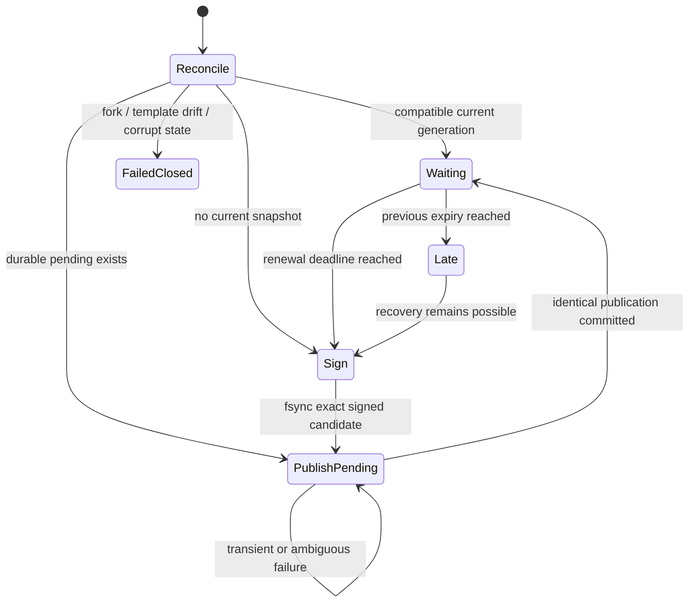

# RFC 0036: Deadline-safe automated signed service-trust renewal

**Status:** Accepted | **Milestone:** v0.31 | **Date:** 2026-08-13

**Depends on:** RFC 0028 distributed signed trust and activation receipts,
RFC 0029 mutual-TLS trust distribution, RFC 0032 signed policy validity, and
RFC 0035 restart-free same-CA TLS leaf renewal.

## Decision

InferLab will add one persistent, separately supervised **policy renewer**. It
owns the configured service-trust root signing identity and periodically
publishes higher-generation policy-v2 snapshots before the current exclusive
expiry. The trust distributor remains a public-root verifier and durable
distribution service; it never receives the root private key.

Automatic renewal preserves policy meaning. A renewal may change only:

- `generation`;
- `issued_at_ms`;
- `expires_at_ms`; and
- the derived authentication signature.

The cluster, policy schema, trusted credentials, revocations, gateway service
IDs, and root key ID are fixed by one canonical template. Changing any of
those fields is an operator-authorized policy rollout, not renewal.

## Why a separate process

Giving the distributor the root private key would collapse two independent
roles: transport/storage and policy authority. A distributor compromise could
then silently change trust meaning. A separate renewer narrows online signing
authority to one immutable template and makes its restarts, failures, and
durable state observable independently.


## Required invariants

1. **Signer separation:** only the renewer receives the root private seed. The
   distributor retains public roots only.
2. **Renewal-only authority:** every generated policy has one canonical
   semantic template fingerprint; automatic code cannot alter membership,
   credentials, revocations, roles, cluster, schema, or signing key ID.
3. **Strict source custody:** the template and renewer state are bounded,
   mode-`0600`, regular, non-symlink files opened without following a swapped
   symlink or blocking on a substituted FIFO.
4. **Higher generations only:** generation is positive and advances exactly
   by one from reconciled durable authority. Rollback and same-generation fork
   candidates fail closed.
5. **Signed exclusive deadline:** each v2 lifetime is bounded; renewal is due
   at `expires_at_ms - renew_before_ms`, and publication must target a policy
   that is valid at the sampled effective time.
6. **Monotonic process time:** scheduling uses
   `max(previous_effective_now_ms, observed_wall_now_ms)` so a backward wall
   step cannot postpone a due renewal in one process.
7. **Persist before publish:** the complete signed candidate and its template
   fingerprint are durably replaced before any POST begins.
8. **Exact ambiguous retry:** a timeout, disconnect, or restart retries the
   exact pending bytes. It never signs different bytes for the same generation.
9. **Reconcile before advance:** the renewer GETs distributor state. Identical
   pending/current bytes commit the pending cycle; a higher compatible current
   snapshot advances the local floor; a conflicting generation or semantic
   template fails closed.
10. **No hidden renewal:** GET, `304`, receipts, retries, or process restart do
    not move signed validity. Only a newly signed higher generation does.
11. **Receiver independence:** controls keep RFC 0032 verification, persistence,
    activation-time recheck, request-time expiry, and receipt rules unchanged.
12. **Bounded failure behavior:** transient transport failures retry with
    bounded delay. Deterministic source/state/template/fork failures latch a
    redacted error and do not spin or fabricate progress.
13. **Supervision:** an unexpected renewer loop exit or panic terminates the
    renewer process. It does not silently leave a nominally healthy listener.
14. **Manual compatibility:** the existing signed-snapshot POST API remains
    available for explicit policy rollouts and recovery.

## Template contract

The renewer consumes one JSON template:

```json
{
  "schema": "inferlab.service-trust-renewal-template.v1",
  "cluster_id": "inferlab-primary",
  "policy_schema": "inferlab.service-trust-policy.v2",
  "trusted_credentials": [],
  "revoked_service_ids": [],
  "revoked_credentials": [],
  "gateway_service_ids": []
}
```

Its canonical fingerprint is SHA-256 over a domain-separated, length-prefixed
encoding of every semantic field in declared order. JSON whitespace and object
key order do not change the fingerprint. Array order remains meaningful because
the existing signed policy encoding is ordered.

The root key ID is configured separately with the signing identity and is
included in the renewer's authority fingerprint. The seed, signature, policy
bytes, credentials, and source paths never appear in status or logs.

## Scheduling contract

Configuration is bounded and complete:

| Setting | Meaning |
|---|---|
| policy lifetime | signed `expires_at_ms - issued_at_ms` |
| renew-before margin | how far before expiry a new generation becomes due |
| poll interval | maximum normal scheduler observation interval |
| request timeout | bound for each distributor GET/POST |
| retry interval | delay after a transient publication/reconciliation failure |

The lifetime must be at least 250 ms and no more than seven days. The margin
must be positive, strictly below the lifetime, and leave enough room for one
request timeout plus one retry. Poll, retry, and request bounds must be finite.

At cold start with an empty distributor, the renewer signs generation 1 using
the sampled effective time. With current generation `g`, it schedules `g + 1`
at the current signed renewal deadline. It may recover after a missed deadline
by publishing a valid higher generation, but status records a late renewal;
there is no grace that keeps the expired policy authoritative.



## Durable state and crash recovery

The state file contains a versioned object with:

- authority/template fingerprint;
- last committed generation, issue time, expiry, and snapshot fingerprint;
- optional exact pending `ServiceTrustSnapshot`; and
- finite counters required to resume truthful status.

State replacement follows create-new temporary file, write, file `fsync`,
rename, and parent-directory `fsync`. A failure before rename leaves the old
state authoritative. A failure after rename but before directory durability is
reported as uncertain and stops mutation until restart reconciliation.

If POST succeeds but the response is lost, restart loads the pending bytes,
GETs the distributor, and compares exact snapshot equality. Equality commits
the pending cycle without creating another generation. If the distributor is
behind, the same pending bytes are retried only while that candidate remains
within its own signed validity window. An expired pending candidate is never
published: the renewer fails closed because it cannot safely reuse or skip the
ambiguous generation without a separate burned-generation ledger. If the
distributor is ahead with the same template/root, the renewer adopts that
durable floor. A same-generation different snapshot is a fork and fails
closed.

A manual semantic rollout changes the authority fingerprint and therefore
cannot reuse the old automatic state file. After independently verifying that
the distributor holds the intended strictly higher snapshot, the operator must
stop the renewer, archive the old state and lock files, install the matching
mode-`0600` template, and restart with a new empty state path. Merely replacing
the template and restarting is intentionally rejected.

## Transport and status

The renewer publishes through the existing TLS 1.3 mTLS distributor endpoint.
This milestone uses one fixed publisher certificate source; automated
certificate issuance or leaf rotation is not part of the scheduler.

The renewer exposes health, readiness, and status on its mandatory loopback
listener. Bounded OpenMetrics uses the shared loopback-by-default observability
listener; exposing it on a non-loopback address requires the existing explicit
observability opt-in. Status includes mode, authority/template fingerprint,
distributor generation, committed/pending generation, signed expiry, renewal
deadline, remaining margin, attempts, successful renewals, transient failures,
rejected states, late recoveries, and one finite `last_error_kind`. It excludes
private material, policy bytes, signatures, credentials, paths, and raw
HTTP/TLS errors.

Distributor status remains truthful transport/convergence evidence. Receipt
absence is ambiguous and is not an authorization signal for generating a new
policy. A renewal can be published before all receipts arrive; operators see
the pending receiver set separately.

## Failure matrix

| Event | Renewer behavior | Receiver/distributor truth |
|---|---|---|
| Empty distributor | persist and publish g1 | controls activate g1 and receipt |
| Renewal deadline | persist exact gN+1, then POST | normal higher-generation flow |
| POST response lost after commit | retain pending; GET and compare exact bytes | no duplicate/fork generation |
| Distributor outage before deadline | bounded retries, pending exact bytes retained | old policy remains valid only to signed expiry |
| Outage crosses expiry | record late state; no grace | protected requests fail RFC 0032 gate |
| Distributor recovers while pending remains valid | publish exact valid higher generation | controls recover after activation |
| Pending candidate itself expires | fail closed; require operator reconciliation | never install an expired generation |
| Backward clock step | effective time does not decrease | due work is not postponed |
| Forward clock step | renewal becomes due/late immediately | no extension of old expiry |
| Template semantic drift | fail closed | no automatic policy meaning change |
| Wrong cluster/root/schema | fail closed | no publication |
| Corrupt/oversize/0644/symlink state | fail startup | no listener or mutation |
| Same-generation different snapshot | fail closed as fork | distributor current remains authoritative |
| Manual compatible higher generation | reconcile and adopt floor | automation resumes at next generation |
| Manual semantic rollout | independently verify higher current, archive old state/lock, install matching template, restart with empty state path | not silently adopted as renewal |

## Exact-process proof contract

The retained v0.31 proof must demonstrate:

1. cold automated generation 1 and at least two later automatic cycles;
2. exact semantic-template equality across generations and valid Ed25519
   signatures with strictly increasing generations and bounded signed windows;
3. all three controls activate each generation and produce three verified
   receipts before the previous deadline in the normal path;
4. protected peer/gateway requests continue without an expiry authorization
   gap during normal renewal;
5. response-loss ambiguity and renewer restart recover the exact pending bytes
   without a duplicate generation or fork;
6. distributor outage, exclusive expiry, and later higher-generation recovery
   show no hidden grace;
7. rollback, fork, wrong cluster/root/schema, semantic drift, unsafe/corrupt
   state, persistence uncertainty, and clock edges fail as specified;
8. distributor, three controls, gateway, and CPU worker keep exact process
   identity across renewal; renewer restart is reported separately;
9. real CPU JSON and incremental SSE complete after recovery; and
10. checker, SVG, sanitizer, and manifest-last evidence replay byte-identically.

## Non-goals and honest limits

- no automatic credential, revocation, gateway-role, or trust-root rollout;
- no emergency or in-flight cancellation;
- no HSM/KMS, secret manager, key rotation, or immediate zeroization;
- no automated certificate issuance, ACME, CRL/OCSP, CA migration, or global
  service mTLS;
- no distributor or renewer HA, leader election, quorum signing, or fleet-atomic
  activation;
- no hostile-clock, secure-time, transparency-log, or multi-host proof; and
- no burned-generation ledger or automatic recovery after a pending candidate's
  own signed expiry; and
- no claim that receipt completion proves every receiver remains healthy.

The root key is deliberately online in one bounded process for this teaching
milestone. Production custody and high availability require a separate design.
