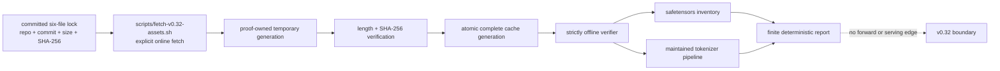

# RFC 0037: Pinned public checkpoint and production tokenizer

**Status:** Proposed | **Milestone:** v0.32 | **Date:** 2026-08-14

**Depends on:** RFC 0012 tiny C++ CPU decoder and its deterministic checkpoint,
tokenizer, and oracle discipline.

## Decision

InferLab will add one standalone `model-artifacts` workspace crate with a
library and an `inferlab-model-inspect` binary. The Rust crate will strictly
offline-verify, inspect, and tokenize against exactly one public model revision:

- repository: `EleutherAI/pythia-14m`;
- revision: `cf967c0a9a04383db6f7b1108d86b2962634b4ac`;
- model family: GPT-NeoX;
- declared model-card license: Apache-2.0; and
- intended milestone use: reproducible research artifact inspection and
  tokenizer integration, not human-facing model deployment.

The revision is a complete Git commit, never `main`, a tag that can move, or a
branch name. The committed InferLab lock will name six files, their exact byte
lengths, and SHA-256 digests. Downloading is an explicit online operation.
Every inspection and tokenizer operation after acquisition is strictly
offline and accepts only a complete verified cache generation.

v0.32 is deliberately the original plan's **Day 14 boundary**: load and prove
the checkpoint inventory plus production tokenizer behavior. It does not add a
Pythia forward pass, logits, token selection, generation, a worker model, or an
HTTP serving claim. The existing `worker` crate and `inferlab-tiny` serving path
remain unchanged.

## Why this is a separate crate

The current worker owns one deliberately tiny generated format, one word
tokenizer, and one-layer inference. Teaching-checkpoint behavior must not gain a
network dependency or become conditional on a public cache. Conversely, an
artifact fetcher must not inherit authority to start a worker or treat a hash-
verified checkpoint as executable code.

`model-artifacts` therefore owns a narrower offline pipeline. Acquisition stays
in an explicit proof/support script outside the Rust verifier:



The library's inspection entry point is exactly
`model_artifacts::load_pinned_pythia(lock_path, asset_directory) ->
Result<VerifiedBundle, ArtifactError>`. `VerifiedBundle::report()` returns its
deterministic inventory report, and verified byte accessors let the later
tokenizer layer consume the same already authenticated artifacts. The binary's
inspection interface is exactly
`inferlab-model-inspect inspect --lock <path> --assets <dir>` and emits
deterministic JSON. Commit 3 adds offline tokenizer functionality on top of
that verified bundle through `VerifiedBundle::production_tokenizer()` and
`inferlab-model-inspect tokenize --lock <path> --assets <dir>`. The tokenizer
command accepts one bounded, strict-UTF-8, deny-unknown JSON request on stdin.

The Rust crate has no HTTP dependency, transport client, fetch mode, or network
fallback. The shell entry point `scripts/fetch-v0.32-assets.sh` delegates
explicit acquisition to `benchmarks/fetch_public_model_assets.py`; only that
external acquisition path has network capability.

## Authoritative artifact lock

The later implementation commit will add one machine-readable lock for the
following exact upstream bytes. The six locked files total **30,274,495
bytes**.

| File | Exact bytes | SHA-256 | Contract role |
|---|---:|---|---|
| `README.md` | 10,560 | `d1f2cf1d5181daedeaa70208ddd5cc5251867bde9acf6db7bb45a2265e25e163` | pinned model-card and Apache-2.0 declaration provenance |
| `config.json` | 698 | `f97f966a66c444890ed461fff2a51eefb15d74303df05b948124719f199b0b17` | GPT-NeoX dimensions and behavior metadata |
| `model.safetensors` | 28,143,920 | `116a02532db461f91386a5b20f942ff2c8d4de7341e21b55caafc3d7b25f49a1` | public F16 checkpoint tensors |
| `special_tokens_map.json` | 441 | `10b8c8852c1e1f70b54d9aff61728408c28971c0e97a6c5a7b2debbd1d3e9c0c` | named special-token mapping |
| `tokenizer.json` | 2,114,042 | `870f4e2baa6b683221fa52004d5d6f40ab8c9d31961617304b78c910c2c3caf2` | complete maintained tokenizer pipeline |
| `tokenizer_config.json` | 4,834 | `eee017c5bd133137f45907bd0a6e781e2ccd1a533734b7ed2a2f2f4446659809` | tokenizer configuration and special-token policy |

Every fetch URL is constructed as
`https://huggingface.co/EleutherAI/pythia-14m/resolve/<full-commit>/<locked-file>`.
Redirect targets are transport details and never replace the repository,
revision, filename, length, or digest as identity.

The lock records the canonical SPDX identifier. The commit-pinned model-card
URL is derived from the locked repository, revision, and `README.md` filename.
Hashing the model card makes the reviewed license statement reproducible; it is
not a legal opinion about every source in the Pile training corpus or every
possible downstream use.

## Fetch and cache contract

Online acquisition and offline consumption have different authority.

### Explicit online fetch

`scripts/fetch-v0.32-assets.sh` requires the lock and an explicit cache root. It
will:

1. construct only the six commit-pinned HTTPS URLs;
2. enforce bounded redirects, response size, timeout, and total bytes;
3. create a proof-owned temporary directory beside the destination;
4. stream each response while enforcing its exact length and SHA-256;
5. synchronize complete files and the temporary directory;
6. publish the complete revision directory atomically; and
7. synchronize the cache parent before reporting success.

The atomic directory rename is the publication commit point. Any failure before
that rename removes the temporary generation and leaves no new final path. A
deadline, parent-directory `fsync`, or final-verification failure after the
rename has an explicitly indeterminate confirmation outcome: the command
returns a finite error, leaves the already complete exact generation untouched,
and requires a subsequent explicit warm-cache or offline verification. It does
not delete or silently repair a post-rename generation. Success is reported
only after parent synchronization and final verification complete.

An existing valid final generation is verified and reused. An existing invalid
generation is not silently repaired in place; the operator or proof must choose
an explicit empty destination. A pre-rename failed fetch leaves the previously
complete generation unchanged and never creates a partial valid-looking final
generation.

### Strictly offline verification

The Rust library and `inferlab-model-inspect` accept only local paths from the
selected complete cache generation. They will not construct a URL, initialize
an HTTP client, consult a Hub cache outside the named root, or search a user's
home directory. They open
the six expected regular files, reject symlinks and special files, bound every
read, and verify length plus digest before parsing those same opened bytes.

The verifier rejects missing or additional artifact names. This makes “the
verified revision” one exact finite set rather than whichever files happen to
be present in a mutable directory. Reports use the repository, revision,
relative filenames, sizes, and hashes; absolute host/cache paths are excluded
from retained evidence.

Public artifacts are not secrets, but integrity still has a time-of-check/time-
of-use boundary. Parsing must consume the descriptor-verified bytes or one
immutable in-memory copy, not reopen a path after hashing.

## Exact checkpoint configuration

The verified `config.json` must agree with the following selected fields:

| Field | Required value |
|---|---|
| `model_type` | `gpt_neox` |
| architecture | `GPTNeoXForCausalLM` |
| hidden size | 128 |
| hidden layers | 6 |
| attention heads | 4 |
| intermediate size | 512 |
| maximum positions | 2,048 |
| model vocabulary rows | 50,304 |
| rotary fraction | 0.25 |
| parallel residual | true |
| tied word embeddings | false |
| declared tensor dtype | F16 |

The file hash remains the complete identity; this table makes the shape
contract reviewable and ensures that a later implementation cannot claim that
an unrelated hash-locked JSON object is compatible.

## Exact safetensors inventory

`model.safetensors` has an 8,488-byte JSON header followed by 28,135,424 bytes
of tensor data. The verifier requires exactly **76 tensors**, all `F16`, with
exact non-overlapping in-range offsets and exactly **14,067,712 parameters**.
There may be no missing, extra, duplicate, overlapping, gapped, or trailing
tensor data.

Four tensors exist outside the repeated layers:

| Tensor | Exact shape | Parameters |
|---|---:|---:|
| `gpt_neox.embed_in.weight` | `50304 × 128` | 6,438,912 |
| `embed_out.weight` | `50304 × 128` | 6,438,912 |
| `gpt_neox.final_layer_norm.weight` | `128` | 128 |
| `gpt_neox.final_layer_norm.bias` | `128` | 128 |

For every layer index `i` in the exact closed range `0..5`, these twelve
tensors must exist:

| Tensor suffix below `gpt_neox.layers.i` | Exact shape | Parameters per layer |
|---|---:|---:|
| `attention.dense.weight` | `128 × 128` | 16,384 |
| `attention.dense.bias` | `128` | 128 |
| `attention.query_key_value.weight` | `384 × 128` | 49,152 |
| `attention.query_key_value.bias` | `384` | 384 |
| `input_layernorm.weight` | `128` | 128 |
| `input_layernorm.bias` | `128` | 128 |
| `post_attention_layernorm.weight` | `128` | 128 |
| `post_attention_layernorm.bias` | `128` | 128 |
| `mlp.dense_h_to_4h.weight` | `512 × 128` | 65,536 |
| `mlp.dense_h_to_4h.bias` | `512` | 512 |
| `mlp.dense_4h_to_h.weight` | `128 × 512` | 65,536 |
| `mlp.dense_4h_to_h.bias` | `128` | 128 |

Each layer therefore contributes 198,272 parameters. Six layers contribute
1,189,632; final normalization contributes 256; the two untied embedding/head
matrices contribute 12,877,824. Their exact sum is 14,067,712.

The parser treats safetensors as data. It does not execute Python, deserialize
pickle, import a Transformers model class, or enable remote code.

## Production tokenizer contract

The implementation uses Rust `tokenizers` exactly at `0.23.1`, with default
features disabled and only `fancy-regex` enabled. It consumes
the verified upstream configuration rather than inventing a new tokenizer
format or hand-writing Unicode normalization. The artifact contract requires:

- tokenizer serialization version `1.0`;
- model type `BPE`;
- 50,254 base vocabulary entries;
- 50,009 ordered merge rules;
- an NFC normalizer;
- a ByteLevel pre-tokenizer and decoder;
- `add_prefix_space=false`, `trim_offsets=true`, and `use_regex=true`;
- the exact configured special and added tokens; and
- no unconfigured preprocessing or cleanup layer.

Encoding makes two independent choices explicit. `literal_specials` is either
`recognize_configured`, where literal `<|endoftext|>` is ID 0, or
`encode_as_text`, which enables the maintained library's
`encode_special_tokens` behavior and must not turn that literal into EOS.
`add_special_tokens` separately controls post-processor insertion; this pinned
TemplateProcessing configuration inserts no tokens in either mode. Decoding
requires `preserve_configured` or `skip_configured` explicitly. Although
`tokenizer_config.json` records `clean_up_tokenization_spaces=true`, that is a
Transformers-facing setting: this raw `tokenizers` runtime performs no such
cleanup.

All APIs are length-aware. They accept valid UTF-8 including embedded U+0000,
never use a C string as text identity, never silently truncate, and never use
lossy UTF-8 replacement. Invalid UTF-8 passed to a byte-oriented boundary is a
finite error rather than guessed text.

### Tokenizer IDs versus model rows

The tokenizer defines and can decode exactly **50,277 contiguous IDs**,
`0..=50276`. This includes its base vocabulary plus the configured special and
added multi-space tokens; it does not claim that every defined ID is reachable
from ordinary encoder input. `tokenizer_config.json` has `pad_token=null`.
The model exposes **50,304** input and output rows, `0..=50303`.

```text
tokenizer-defined:   0 ...................................... 50276
alignment-only rows:                                            50277 ... 50303
model rows:          0 ................................................. 50303
```

The remaining **27 rows**, `50277..=50303`, are alignment-only model rows, not
pad tokens and not tokenizer outputs. `encode` must never emit them. `decode`
rejects them rather than fabricating text. The inventory report names both
domains separately so a 50,304-row model is never misreported as a
50,304-token tokenizer.

### NFC and round-trip truth

NFC normalization is observable semantics. Precomposed and canonically
decomposed input may encode identically, and decoding the decomposed spelling
may return its NFC form rather than the original byte sequence. Therefore
v0.32 does **not** claim `decode(encode(x)) == x` byte-for-byte for every Unicode
string.

The correct claims are:

1. InferLab IDs exactly equal the pinned upstream tokenizer's IDs;
2. InferLab decoded UTF-8 exactly equals the pinned upstream decoder's output;
3. NFC-stable ordinary inputs round-trip exactly when the upstream tokenizer
   does; and
4. normalization, special-token matching, and added-token behavior are explicit
   test cases rather than hidden cleanup.

Per-token decoded fragments are not yet a streaming contract. A future
generation milestone must define how incomplete UTF-8 byte sequences are
buffered before emitting JSON/SSE content.

The maintained ByteLevel decoder internally uses lossy UTF-8 construction.
InferLab therefore reconstructs the official byte mapping first, requires the
complete token sequence to be strict UTF-8, and only then requires equality
with the maintained decoder. Thus `[127]` is rejected,
`[127,104]` decodes to `é`, and a literal U+FFFD remains valid data.

## Required invariants

1. Repository and revision identity are exact and immutable.
2. Exactly six named files form one cache generation.
3. Size and SHA-256 verification precede parsing.
4. Pre-rename fetch failure cannot publish a partial generation or mutate a
   valid one; post-rename confirmation failure leaves only the complete staged
   generation and requires explicit reconciliation.
5. Offline commands have no network fallback or ambient-cache discovery.
6. Verification and parsing use the same opened bytes.
7. JSON duplicate keys, unknown required schema, invalid Unicode, overflow, and
   unbounded collections fail closed.
8. Safetensors contains exactly the 76 named F16 tensors and offsets described
   above.
9. Tensor shapes sum exactly to 14,067,712 parameters and data bytes sum exactly
   to 28,135,424.
10. Model configuration and safetensors inventory agree on layers, dimensions,
    vocabulary rows, and dtype.
11. Tokenizer configuration is the exact NFC + ByteLevel + BPE pipeline from the
    locked artifacts.
12. Tokenizer output is restricted to IDs `0..=50276`; alignment-only model
    rows are never text.
13. Encode/decode behavior matches the pinned maintained reference exactly for
    the proof corpus.
14. No text crosses a lossy, NUL-terminated, or fixed-capacity boundary.
15. Deterministic offline reports contain no timestamps, absolute paths, HTTP
    cache internals, or machine-specific ordering. Operational fetch output is
    not retained without path normalization.
16. The existing tiny checkpoints, worker, Docker model, and HTTP/SSE behavior
    remain untouched by this milestone.

## Failure matrix

| Event | Required behavior | State after failure |
|---|---|---|
| mutable or abbreviated revision in lock | reject configuration | no request, no cache mutation |
| unexpected filename or duplicate lock entry | reject configuration | no request, no cache mutation |
| timeout, redirect overflow, or HTTP failure before atomic rename | fail bounded fetch | temporary generation removed; no new final generation |
| timeout, parent `fsync`, or final-verification failure after atomic rename | return finite publication-indeterminate error | complete exact generation may remain untouched; explicit warm/offline verification required |
| response exceeds exact locked size | stop download and reject | temporary generation never published |
| response is short | reject digest/length | temporary generation never published |
| SHA-256 mismatch | reject artifact | temporary generation never published |
| process exits during fetch | ignore incomplete temporary generation | no valid completion marker |
| offline file missing or extra | reject exact set | no inspection/tokenization |
| symlink, directory, FIFO, or changed opened identity | reject source | no parsing |
| JSON malformed, duplicate-keyed, or schema-drifted | reject artifact | no derived report |
| config dimension or model-family mismatch | reject artifact | no inventory accepted |
| safetensors header truncated or out of bounds | reject artifact | no tensor data trusted |
| tensor missing, extra, wrong dtype, or wrong shape | reject inventory | no checkpoint accepted |
| tensor offsets overlap, gap, escape data, or leave a suffix | reject inventory | no checkpoint accepted |
| tokenizer pipeline, vocabulary, merge, or added-token drift | reject tokenizer | no encode/decode |
| tokenizer emits `50277..=50303` | internal contract failure | command fails; no text fabricated |
| decode receives an alignment-only model row | reject token ID | no lossy replacement |
| invalid UTF-8 input | finite input error | no normalization guess |
| decomposed Unicode normalizes to NFC | report exact upstream result | not classified as data loss |

## Exact proof plan

The v0.32 proof is planned but has not run. Counts, timings, bundle size, and
manifest SHA-256 remain **TBD until measured**. Planned evidence will:

1. start from an empty proof-owned cache and fetch only the six commit-pinned
   artifacts;
2. retain exact response sizes and computed hashes, without retaining the model
   payload itself;
3. verify the completed cache through the strictly offline command path;
4. repeat offline verification and require a byte-identical deterministic
   report;
5. compare the 76-tensor inventory, shapes, dtypes, offsets, and parameter totals
   with an independently generated pinned Python reference report;
6. compare tokenizer IDs and decoded strings with pinned upstream reference
   vectors over ASCII, punctuation, leading/trailing/repeated whitespace, tabs,
   newlines, multi-space added tokens, composed/decomposed Unicode, combining
   marks, emoji, non-Latin scripts, U+0000, literal special-token text, and long
   inputs;
7. exercise every failure class in the matrix using proof-owned corrupted
   copies, never the shared cache;
8. prove no tokenizer output enters the 27 alignment-only model rows;
9. run existing workspace and historical tiny-worker regressions unchanged;
10. scan retained evidence for absolute paths and accidental public weight
    payloads; and
11. write the manifest last, then replay a dependency-minimal checker and SVG
    renderer byte-identically.

Retained evidence will contain the lock, artifact report, inventory, tokenizer
fixtures/results, failure results, environment metadata, checker output, and
chart. It will not contain `model.safetensors`, a transformed weight file, an
ambient Hub cache, or a claim that the model generated text.

## Alternatives considered

### OpenAI GPT-2 124M

Deferred. It matches the original recognizable-model aspiration and has an MIT
model card, but its selected safetensors/tokenizer set is roughly 549 MB. That
cost is unnecessary for a no-forward artifact/tokenizer milestone and makes
clean-cache proof portability materially worse.

### `sshleifer/tiny-gpt2`

Rejected as the release artifact. It is small, but the repository exposes only
a PyTorch pickle weight file, has no explicit model-card license, and uses a
two-dimensional toy hidden state. It may be useful as an upstream library test
fixture, but it is not the provenance boundary v0.32 intends to teach.

### Extend the existing worker directly

Rejected. The worker would acquire public-artifact, tokenizer, multi-layer, and
serving implications at once. A standalone crate lets v0.32 prove artifact and
text identity while leaving the known serving path byte-for-byte stable.

### Add the Pythia forward pass in the same release

Rejected. GPT-NeoX execution adds six layers, rotary positions, parallel
residuals, per-layer KV state, 50K-logit selection, and output streaming. Those
are Day 15 and later questions and require their own oracle and performance
evidence.

### Commit or bake the public weights into Git/Docker

Rejected. The lock and retained proof make provenance reproducible without
silently growing the repository or turning every historical Docker build into
a public-model download.

### Hand-write Unicode NFC or a new BPE format

Rejected. The milestone is integration and identity, not novelty in Unicode or
tokenizer formats. A maintained pinned tokenizer implementation consumes the
verified upstream pipeline.

## Explicit non-goals

- no forward pass, logits, sampling, generation, or model-quality claim;
- no worker, gateway, JSON, SSE, or OpenAI model-name integration;
- no KV cache, batching, quantization, speculation, structured decoding, or
  attention optimization for Pythia;
- no runtime network download, hot model swap, registry, multi-model routing,
  or fleet artifact distribution;
- no arbitrary Hugging Face repository, remote code, pickle, ONNX, or generic
  Transformers compatibility;
- no public weights committed to Git, Docker, or retained results;
- no tokenizer training, hand-written normalization, or byte-exact round-trip
  claim across NFC changes;
- no human-facing deployment, safety, accuracy, bias, or legal-clearance claim;
  and
- no CUDA, fine-tuning, trust-lifecycle, cancellation, HA, certificate, or CA
  work.

## Planned implementation map

| Planned path | Responsibility |
|---|---|
| `model-artifacts/Cargo.toml` | standalone crate and pinned maintained dependencies |
| `model-artifacts/src/lock.rs` | exact repository/revision/file lock validation |
| `model-artifacts/src/lib.rs` | exact `load_pinned_pythia` API, `VerifiedBundle::report()`, and verified byte accessors |
| `model-artifacts/src/verify.rs` | offline safe opens, hash verification, exact safetensors inventory, and deterministic report |
| `model-artifacts/src/tokenizer.rs` | verified tokenizer loading plus encode/decode domain checks |
| `model-artifacts/src/bin/inferlab-model-inspect.rs` | exact offline `inspect` plus one-request bounded JSON-stdin `tokenize` interface |
| `benchmarks/fetch_public_model_assets.py` | bounded commit-pinned HTTPS acquisition and atomic cache publication |
| `scripts/fetch-v0.32-assets.sh` | stable explicit acquisition entry point |
| `models/public/pythia-14m-v0.32.lock.json` | six-file immutable upstream identity |
| `scripts/proof-v0.32.sh` | clean fetch, offline replay, failure injection, manifest-last proof |
| `docs/results/v0.32/` | retained reports and conclusion, populated only after measurement |

## Evidence status

This RFC records the intended contract before implementation. As of this
proposal there is no v0.32 retained result, assertion count, benchmark timing,
bundle byte count, manifest digest, CI result, release commit, or tag. Those
values must be populated from the canonical run; planned cases must never be
reported as passing measurements.
